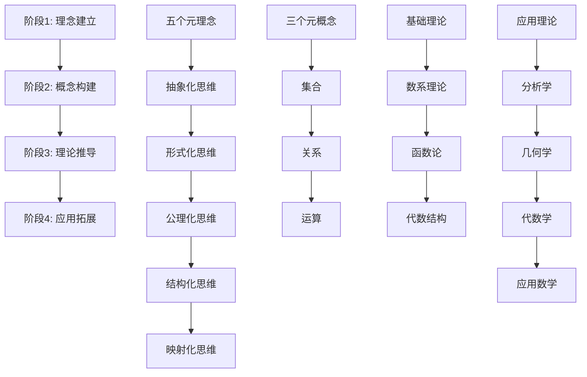

# 理念驱动的数学学习路径

## 🎯 核心理念：从理念出发，构建完整数学体系

### 学习哲学

本学习路径基于**理念驱动**的方法，不是简单地学习数学知识点，而是从数学的本质理念出发，通过严格的逻辑推理，构建完整的数学理论体系。我们的目标是：

1. **理解数学本质**：掌握数学的核心理念
2. **建立逻辑体系**：从理念推导出所有数学内容
3. **培养创造思维**：学会从理念创造新的数学理论
4. **形成统一认识**：建立数学的整体观

---

## 📚 学习路径总览

### 四个学习阶段



---

## 🎯 阶段1：理念建立 (基础阶段)

### 学习目标

建立对五个元理念的深刻理解，培养理念驱动的思维方式。

### 学习内容

#### 1.1 抽象化理念 (2-3周)

**核心理念**：从具体到一般，从特殊到普遍

**学习内容**：

- 具体现象的分析
- 共同特征的识别
- 一般概念的提取
- 抽象化的方法

**实践练习**：

```text
练习1：从具体运算抽象出一般运算
- 观察：数的加法、乘法、集合的交集、并集
- 识别：共同特征（二元操作、结合律等）
- 抽象：二元运算的一般概念

练习2：从具体关系抽象出一般关系
- 观察：温度与时间、价格与需求、距离与时间
- 识别：共同特征（两个量之间的对应）
- 抽象：关系的一般概念
```

**学习成果**：

- 掌握抽象化的基本方法
- 能够从具体现象中提取一般概念
- 培养抽象思维能力

#### 1.2 形式化理念 (2-3周)

**核心理念**：用精确的符号和规则表达思想

**学习内容**：

- 数学符号系统
- 形式语言构建
- 推理规则建立
- 形式化表达

**实践练习**：

```
练习1：构建简单的形式语言
- 定义符号集：变量、常量、函数符号
- 建立形成规则：项和公式的构造
- 制定推理规则：从前提推导结论

练习2：形式化表达数学概念
- 将自然语言转化为形式符号
- 建立精确的定义
- 验证形式化的正确性
```

**学习成果**：

- 掌握形式化的基本方法
- 能够构建简单的形式语言
- 培养精确表达的能力

#### 1.3 公理化理念 (2-3周)

**核心理念**：从基本假设出发构建理论

**学习内容**：

- 公理的选择原则
- 公理系统的构建
- 逻辑推理方法
- 理论体系的建立

**实践练习**：

```
练习1：分析简单公理系统
- 研究群论的四条公理
- 理解每条公理的必要性
- 分析公理间的独立性

练习2：构建简单公理系统
- 为简单代数结构选择公理
- 验证公理的一致性
- 从公理推导基本性质
```

**学习成果**：

- 理解公理化的本质
- 掌握公理选择的方法
- 培养逻辑推理能力

#### 1.4 结构化理念 (2-3周)

**核心理念**：在对象间建立关系网络

**学习内容**：

- 结构的概念
- 关系的建立
- 结构的分析
- 结构的分类

**实践练习**：

```
练习1：分析数学结构
- 研究向量空间的结构
- 分析群的结构
- 理解环的结构

练习2：建立简单结构
- 在集合上定义运算
- 验证结构的性质
- 分析结构的特征
```

**学习成果**：

- 理解结构化的本质
- 掌握结构分析的方法
- 培养结构思维能力

#### 1.5 映射化理念 (2-3周)

**核心理念**：建立对象间的对应关系

**学习内容**：

- 映射的概念
- 同态与同构
- 映射的性质
- 映射的应用

**实践练习**：

```
练习1：研究数学映射
- 分析函数映射
- 研究群同态
- 理解线性变换

练习2：建立映射关系
- 构造简单映射
- 验证映射性质
- 分析映射结构
```

**学习成果**：

- 理解映射化的本质
- 掌握映射构造的方法
- 培养映射思维能力

---

## 🏗️ 阶段2：概念构建 (发展阶段)

### 学习目标

从五个元理念出发，构建三个元概念，为后续理论推导奠定基础。

### 学习内容

#### 2.1 集合概念 (3-4周)

**理念基础**：抽象化 + 形式化

**学习内容**：

- 集合的基本定义
- 集合的运算
- 集合的关系
- 集合的基数

**从理念推导**：

```
抽象化过程：
1. 从具体对象（苹果、石头、数字）抽象出"对象"概念
2. 忽略对象的具体特征，只关注"属于"关系
3. 得到抽象概念：集合

形式化过程：
1. 建立集合的形式语言
2. 定义集合的基本运算
3. 建立集合的公理系统
```

**实践练习**：

```
练习1：集合的构造
- 通过列举法构造集合
- 通过描述法构造集合
- 通过运算构造新集合

练习2：集合的性质
- 证明集合运算的性质
- 分析集合间的关系
- 研究集合的基数
```

#### 2.2 关系概念 (3-4周)

**理念基础**：结构化 + 映射化

**学习内容**：

- 关系的基本定义
- 关系的性质
- 等价关系
- 序关系

**从理念推导**：

```
结构化过程：
1. 在集合间建立对应规则
2. 分析对应关系的性质
3. 建立关系的结构理论

映射化过程：
1. 研究关系间的对应
2. 建立关系的映射理论
3. 分析关系的同构性
```

**实践练习**：

```
练习1：关系的构造
- 构造简单关系
- 分析关系性质
- 建立关系分类

练习2：等价关系
- 构造等价关系
- 建立等价类
- 研究商集结构
```

#### 2.3 运算概念 (3-4周)

**理念基础**：公理化 + 结构化

**学习内容**：

- 运算的基本定义
- 运算的性质
- 代数结构
- 运算的分类

**从理念推导**：

```
公理化过程：
1. 选择运算的基本公理
2. 建立运算的公理系统
3. 从公理推导运算性质

结构化过程：
1. 在集合上建立运算结构
2. 分析运算结构的性质
3. 建立运算的分类理论
```

**实践练习**：

```
练习1：运算的构造
- 在集合上定义运算
- 验证运算性质
- 分析运算结构

练习2：代数结构
- 构造简单代数结构
- 分析结构性质
- 建立结构分类
```

---

## 🔬 阶段3：理论推导 (深化阶段)

### 学习目标

从三个元概念出发，推导出具体的数学理论，建立完整的理论体系。

### 学习内容

#### 3.1 数系理论推导 (4-5周)

**从集合概念出发**：

```
第一步：自然数构造
- 从集合概念抽象出"数量"概念
- 通过皮亚诺公理建立自然数理论
- 从公理推导自然数性质

第二步：整数构造
- 通过等价关系从自然数构造整数
- 建立整数的代数结构
- 研究整数的性质

第三步：有理数构造
- 通过等价关系从整数构造有理数
- 建立有理数的代数结构
- 研究有理数的性质

第四步：实数构造
- 通过戴德金分割构造实数
- 建立实数的完备性
- 研究实数的性质
```

**实践练习**：

```
练习1：数系构造
- 构造自然数系统
- 构造整数系统
- 构造有理数系统
- 构造实数系统

练习2：数系性质
- 证明数系的基本性质
- 分析数系间的关系
- 研究数系的应用
```

#### 3.2 函数论推导 (4-5周)

**从关系概念出发**：

```
第一步：函数概念
- 从关系概念抽象出函数概念
- 建立函数的公理定义
- 研究函数的基本性质

第二步：函数空间
- 建立函数空间结构
- 研究函数空间的性质
- 分析函数间的映射

第三步：函数性质
- 研究函数的连续性
- 研究函数的可微性
- 研究函数的可积性
```

**实践练习**：

```
练习1：函数构造
- 构造简单函数
- 分析函数性质
- 建立函数分类

练习2：函数空间
- 构造函数空间
- 分析空间结构
- 研究空间映射
```

#### 3.3 代数结构推导 (4-5周)

**从运算概念出发**：

```
第一步：群论
- 从运算概念抽象出群概念
- 建立群的公理系统
- 从公理推导群的性质

第二步：环论
- 在群的基础上添加运算
- 建立环的公理系统
- 研究环的性质

第三步：域论
- 在环的基础上添加条件
- 建立域的公理系统
- 研究域的性质
```

**实践练习**：

```
练习1：代数结构构造
- 构造简单群
- 构造简单环
- 构造简单域

练习2：结构性质
- 证明结构的基本性质
- 分析结构间的关系
- 研究结构的应用
```

---

## 🚀 阶段4：应用拓展 (应用阶段)

### 学习目标

将前面建立的理论应用到具体的数学分支，形成完整的数学体系。

### 学习内容

#### 4.1 分析学应用 (5-6周)

**理论基础**：数系理论 + 函数论

**学习内容**：

```
微积分：
- 从极限概念建立导数理论
- 从导数概念建立积分理论
- 建立微积分基本定理

实分析：
- 建立实数完备性理论
- 研究函数空间理论
- 建立测度论基础

复分析：
- 从实数扩展到复数
- 建立复变函数理论
- 研究解析函数性质
```

**实践练习**：

```
练习1：分析计算
- 计算极限
- 计算导数
- 计算积分

练习2：分析证明
- 证明分析定理
- 分析函数性质
- 研究收敛性
```

#### 4.2 几何学应用 (5-6周)

**理论基础**：集合概念 + 关系概念

**学习内容**：

```
欧几里得几何：
- 建立几何公理系统
- 研究几何变换
- 建立向量空间理论

解析几何：
- 将几何问题代数化
- 建立坐标系理论
- 研究曲线曲面

微分几何：
- 从光滑曲面抽象出流形
- 建立切空间理论
- 研究几何不变量
```

**实践练习**：

```
练习1：几何构造
- 构造几何图形
- 分析几何性质
- 研究几何变换

练习2：几何计算
- 计算几何量
- 分析几何关系
- 研究几何应用
```

#### 4.3 代数学应用 (5-6周)

**理论基础**：运算概念 + 结构化理念

**学习内容**：

```
线性代数：
- 建立向量空间理论
- 研究线性变换
- 建立矩阵理论

抽象代数：
- 建立群论理论
- 研究环论理论
- 建立域论理论

数论：
- 建立初等数论
- 研究代数数论
- 建立解析数论
```

**实践练习**：

```
练习1：代数计算
- 矩阵运算
- 群论计算
- 数论计算

练习2：代数证明
- 证明代数定理
- 分析代数结构
- 研究代数应用
```

#### 4.4 应用数学 (5-6周)

**理论基础**：所有前面建立的理论

**学习内容**：

```
概率论：
- 建立概率空间理论
- 研究随机变量
- 建立概率分布理论

数值分析：
- 建立数值方法理论
- 研究算法收敛性
- 建立误差分析理论

数学建模：
- 建立建模方法
- 研究模型求解
- 建立模型验证
```

**实践练习**：

```
练习1：应用计算
- 概率计算
- 数值计算
- 模型求解

练习2：应用分析
- 数据分析
- 误差分析
- 模型分析
```

---

## 🎯 学习方法指导

### 1. 理念理解法

**核心思想**：理解每个数学概念的核心理念

**具体方法**：

- 追问"为什么这样定义？"
- 分析概念背后的理念
- 理解概念间的联系

**实践建议**：

```
每次学习新概念时：
1. 先理解概念的核心理念
2. 分析概念的形式化表达
3. 理解概念的公理化基础
4. 分析概念的结构特征
5. 理解概念间的映射关系
```

### 2. 逻辑推导法

**核心思想**：从基本理念推导出结论

**具体方法**：

- 严格遵循逻辑推理
- 从公理出发推导
- 验证推导的正确性

**实践建议**：

```
每次证明定理时：
1. 明确前提和结论
2. 分析证明思路
3. 严格逻辑推导
4. 验证推导步骤
5. 总结证明方法
```

### 3. 结构分析法

**核心思想**：分析数学对象的结构特征

**具体方法**：

- 关注对象间的关系
- 分析结构的性质
- 建立结构的分类

**实践建议**：

```
每次分析数学对象时：
1. 识别对象的基本结构
2. 分析结构间的关系
3. 研究结构的性质
4. 建立结构的分类
5. 理解结构的应用
```

### 4. 映射联系法

**核心思想**：建立不同概念间的联系

**具体方法**：

- 寻找概念间的对应关系
- 建立理论的联系
- 形成知识网络

**实践建议**：

```
每次学习新理论时：
1. 寻找与已知理论的联系
2. 建立概念间的映射
3. 分析理论的统一性
4. 理解理论的推广
5. 形成知识网络
```

---

## 📊 学习评估

### 1. 理念理解评估

**评估标准**：

- 能否理解数学概念的核心理念
- 能否分析概念背后的思想
- 能否建立概念间的联系

**评估方法**：

```
理念理解测试：
1. 概念解释：用自己的话解释数学概念
2. 理念分析：分析概念背后的理念
3. 联系建立：建立概念间的联系
4. 应用理解：理解概念的应用
```

### 2. 逻辑推理评估

**评估标准**：

- 能否进行严格的逻辑推理
- 能否从公理推导结论
- 能否验证推理的正确性

**评估方法**：

```
逻辑推理测试：
1. 定理证明：证明简单的数学定理
2. 公理分析：分析公理的必要性
3. 推导验证：验证推导的正确性
4. 方法总结：总结推理方法
```

### 3. 结构分析评估

**评估标准**：

- 能否分析数学对象的结构
- 能否理解结构间的关系
- 能否建立结构的分类

**评估方法**：

```text
结构分析测试：
1. 结构识别：识别数学对象的结构
2. 关系分析：分析结构间的关系
3. 性质研究：研究结构的性质
4. 分类建立：建立结构的分类
```

### 4. 应用能力评估

**评估标准**：

- 能否将理论应用到实际问题
- 能否解决具体的数学问题
- 能否创新性地应用数学

**评估方法**：

```text
应用能力测试：
1. 问题解决：解决具体的数学问题
2. 模型建立：建立数学模型
3. 理论应用：应用数学理论
4. 创新应用：创新性地应用数学
```

---

## 🎨 学习建议

### 1. 坚持理念驱动

- 始终从理念出发理解数学
- 不要死记硬背，要理解本质
- 建立数学的整体观

### 2. 注重逻辑推理

- 严格遵循逻辑推理
- 从公理出发推导结论
- 培养严谨的思维习惯

### 3. 重视结构分析

- 关注数学对象的结构
- 理解结构间的关系
- 建立系统的认识

### 4. 强调应用实践

- 将理论应用到实际问题
- 解决具体的数学问题
- 培养创新应用能力

### 5. 形成知识网络

- 建立概念间的联系
- 形成完整的知识体系
- 培养整体思维能力

---

*这个理念驱动的数学学习路径，旨在帮助学习者从数学的本质出发，建立完整的数学理论体系，培养创造性的数学思维。通过系统性的学习，我们可以真正理解数学的本质，掌握数学的方法，形成数学的智慧。*
