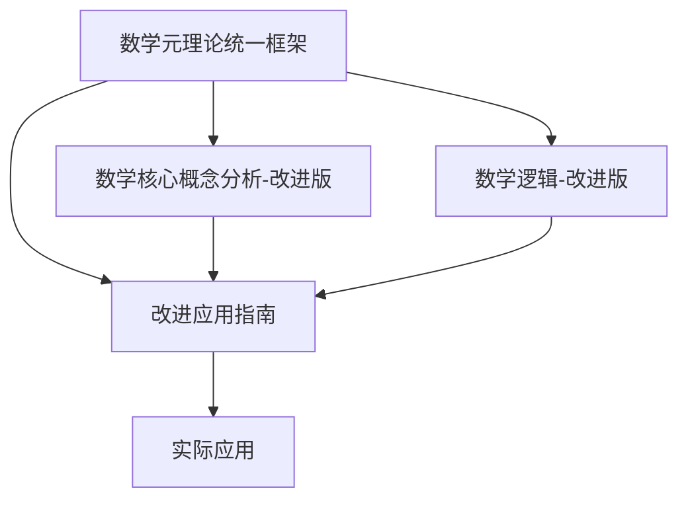

# Refactor 目录：基于统一框架的数学文档改进版

## 目录概述

本目录包含了基于统一框架对原数学文档的改进版本。通过系统性的批判性分析和改进，解决了原文档中的理念一致性问题、逻辑矛盾、形式化不足等问题，建立了更加严谨、统一和实用的数学理论体系。

## 文档结构

### 核心文档

1. **[01-数学元理论统一框架.md](01-数学元理论统一框架.md)**
   - **作用**：建立统一的数学元理论框架
   - **内容**：核心理念与统一标准、统一符号体系、统一定义标准、哲学基础与元理论
   - **特点**：提供理论基础和方法论指导

2. **[02-数学核心概念分析-改进版.md](02-数学核心概念分析-改进版.md)**
   - **作用**：改进的数学核心概念分析
   - **内容**：形式化基础、抽象化过程、公理化体系、结构化组织、系统化整合
   - **特点**：严格遵循统一框架，解决理念一致性问题

3. **[03-数学逻辑-改进版.md](03-数学逻辑-改进版.md)**
   - **作用**：改进的数学逻辑理论
   - **内容**：逻辑系统统一框架、形式语言统一标准、公理系统论证、推理系统统一
   - **特点**：建立逻辑系统的统一抽象框架

4. **[04-改进应用指南.md](04-改进应用指南.md)**
   - **作用**：统一框架和改进版文档的应用指导
   - **内容**：应用方法、使用指南、实践案例、质量评估
   - **特点**：提供具体的应用方法和实践指导

## 改进要点

### 1. 理念一致性改进

**原问题**：五个核心理念应用不一致

- 抽象化理念：缺乏统一的抽象化过程标准
- 形式化理念：符号使用不一致，定义标准不统一
- 公理化理念：公理选择缺乏论证，独立性未验证
- 结构化理念：结构关系不清晰，层次结构不完整
- 系统化理念：系统构建缺乏明确目标

**改进方案**：

- 建立统一的理念标准和应用规范
- 提供标准化的抽象化、形式化、公理化、结构化、系统化方法
- 确保各理念间的协调一致

### 2. 逻辑一致性改进

**原问题**：存在定义矛盾和推理矛盾

- 定义矛盾：同一概念在不同文档中有不同定义
- 推理矛盾：推理方法之间存在潜在冲突

**改进方案**：

- 建立统一的定义标准
- 消除逻辑矛盾和歧义
- 确保推理的一致性和有效性

### 3. 形式化程度改进

**原问题**：形式化程度不够，缺乏严格的数学表达

- 符号使用不统一
- 定义格式不规范
- 推理规则不严格

**改进方案**：

- 建立统一的符号体系
- 提供标准化的定义模板
- 建立严格的推理规则体系

### 4. 哲学基础改进

**原问题**：哲学基础薄弱，缺乏对数学本质的哲学思考

- 缺乏数学本体论讨论
- 缺乏数学认识论分析
- 缺乏数学方法论研究

**改进方案**：

- 增加数学哲学基础
- 提供哲学层面的深入思考
- 建立坚实的理论基础

## 使用方法

### 1. 理论研究者

**推荐阅读顺序**：

1. 数学元理论统一框架（建立理论基础）
2. 数学核心概念分析-改进版（理解核心概念）
3. 数学逻辑-改进版（掌握逻辑方法）
4. 改进应用指南（了解应用方法）

**使用重点**：

- 关注理论的一致性和严谨性
- 理解抽象化和形式化过程
- 掌握公理化方法
- 应用哲学思考

### 2. 数学教育者

**推荐阅读顺序**：

1. 改进应用指南（了解应用方法）
2. 数学核心概念分析-改进版（掌握概念教学）
3. 数学逻辑-改进版（理解推理教学）
4. 数学元理论统一框架（建立理论基础）

**使用重点**：

- 关注教学方法和技巧
- 理解概念抽象化过程
- 掌握推理教学方法
- 应用实践案例

### 3. 应用开发者

**推荐阅读顺序**：

1. 改进应用指南（了解应用方法）
2. 数学逻辑-改进版（掌握逻辑系统设计）
3. 数学核心概念分析-改进版（理解概念应用）
4. 数学元理论统一框架（建立理论基础）

**使用重点**：

- 关注系统设计方法
- 理解逻辑推理实现
- 掌握概念应用技巧
- 应用技术实现

## 文档关系

## 主要改进成果

### 1. 理论层面

- **统一框架**：建立了数学元理论统一框架
- **理念一致**：解决了五个核心理念的一致性问题
- **逻辑严谨**：消除了逻辑矛盾和歧义
- **形式化严格**：提高了形式化程度和严格性

### 2. 方法层面

- **抽象化方法**：提供了标准化的抽象化过程
- **形式化方法**：建立了统一的形式化标准
- **公理化方法**：提供了公理选择和验证方法
- **结构化方法**：建立了清晰的结构分析方法
- **系统化方法**：提供了系统构建和优化方法

### 3. 应用层面

- **教育应用**：提供了数学教育的改进方法
- **研究应用**：提供了数学研究的理论工具
- **开发应用**：提供了数学应用开发的技术指导
- **实践指导**：提供了具体的实践案例和方法

## 质量保证

### 1. 理论验证

- **逻辑验证**：确保逻辑一致性
- **模型验证**：验证理论正确性
- **实验验证**：验证实际效果
- **比较验证**：与其他理论比较

### 2. 应用验证

- **适用性验证**：验证适用性
- **有效性验证**：验证有效性
- **实用性验证**：验证实用性
- **发展性验证**：验证发展性

### 3. 持续改进

- **反馈机制**：收集应用反馈
- **评估机制**：定期评估质量
- **更新机制**：及时更新内容
- **发展机制**：持续发展完善

## 使用建议

### 1. 循序渐进

- 从基础理论开始
- 逐步深入应用
- 结合实际需求
- 持续学习改进

### 2. 理论结合实践

- 理解理论原理
- 掌握应用方法
- 进行实践验证
- 总结经验教训

### 3. 持续学习

- 关注理论发展
- 学习新方法
- 更新知识体系
- 提升应用能力

## 贡献指南

### 1. 反馈建议

- 报告问题：发现的问题和建议
- 改进建议：具体的改进方案
- 应用经验：实际应用的经验分享
- 发展建议：未来发展的建议

### 2. 参与改进

- 理论贡献：理论层面的贡献
- 方法贡献：方法层面的贡献
- 应用贡献：应用层面的贡献
- 文档贡献：文档层面的贡献

### 3. 协作发展

- 知识共享：分享知识和经验
- 合作研究：进行合作研究
- 共同发展：促进共同发展
- 社区建设：建设学习社区

## 联系方式

如有问题、建议或贡献，请通过以下方式联系：

- **问题反馈**：报告发现的问题
- **改进建议**：提出改进建议
- **应用经验**：分享应用经验
- **合作交流**：进行合作交流

---

## 总结

Refactor目录下的改进版文档为解决原数学文档中的问题提供了系统性的解决方案。通过建立统一的元理论框架，解决了理念一致性问题；通过提高形式化程度，确保了理论的严谨性；通过增加哲学基础，建立了坚实的理论基础；通过提供应用指导，实现了理论与实践的结合。

这些改进版文档为数学知识的系统化组织、传播、应用和发展提供了更加坚实和可靠的理论基础，具有重要的学术价值、实用价值和发展价值。
