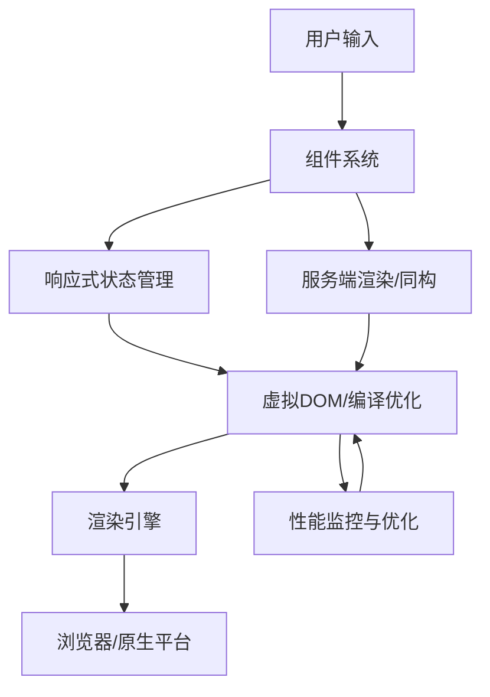

2.1 前端主流框架

目录
- [UI通用架构模型在前端框架中的应用](#ui通用架构模型在前端框架中的应用)
- [前端设计师视角：设计系统与框架架构融合](#前端设计师视角：设计系统与框架架构融合)
- [前端架构师视角：框架架构模式技术实现](#前端架构师视角：框架架构模式技术实现)
- [交互架构师视角：交互设计与框架架构结合](#交互架构师视角：交互设计与框架架构结合)
- [1.1 理论定位与学科交叉](#1.1-理论定位与学科交叉)
- [1.2 发展脉络与范式变迁](#1.2-发展脉络与范式变迁)

[返回2.技术栈与框架](./2.技术栈与框架/README.md) |  [返回Refactor总览](./2.技术栈与框架/../README.md)

---

> 本文档为"2.1 前端主流框架"专题索引，所有内容均严格编号、树形结构、支持本地跳转。请遵循本地引用规范：
>
> - 主题编号与文件名一致，便于递归扩展
> - 所有子主题均以"2.1.x"编号，支持锚点跳转
> - 返回上级目录请使用相对路径

2024前沿趋势
- **React 19+**：Server Components、Concurrent Rendering、Signals、AI驱动UI。
- **Vue 3.4+**：Composition API、响应式系统优化、Vite深度集成、SSR/SSG增强。
- **Angular 17+**：Signals、Zone-less、Standalone Components、Hydration。
- **Svelte 5**：编译时优化、无虚拟DOM、可组合Store、SvelteKit。
- **SolidJS/Preact/Qwik**：极致性能、细粒度响应、懒加载与即时恢复。
- **AI辅助开发**：Copilot、AI代码生成、AIGC UI、智能组件推荐。
- **微前端与模块联邦**：Module Federation、微服务架构、跨团队协作。
- **全栈一体化**：Next.js、Nuxt、Remix、Astro等支持前后端一体化开发。
- **UI通用架构模型递归演进**：MVC、MVVM、MVP、Flux、Redux等架构模式为React、Vue、Angular等主流框架提供了理论与实践基础，推动了组件化、单向数据流、响应式等现代前端范式的发展。相关详细论述见[4.3 组件化与架构模式](./2.技术栈与框架/../4.设计模式与架构/4.3 组件化与架构模式.md)。

---

目录
- [2.1 前端主流框架](#21-前端主流框架)
- [2024前沿趋势](#2024前沿趋势)
- [目录](#目录)
- [2.1.1 主流框架架构Mermaid图](#211-主流框架架构mermaid图)
- [2.1.4 批判性分析与最佳实践](#214-批判性分析与最佳实践)
- [2.1.5 相关主题推荐阅读](#215-相关主题推荐阅读)
- [UI通用架构模型在前端框架中的应用](#ui通用架构模型在前端框架中的应用)
- [前端设计师视角：设计系统与框架架构融合](#前端设计师视角设计系统与框架架构融合)
- [设计系统在主流框架中的实现](#设计系统在主流框架中的实现)
- [响应式设计系统](#响应式设计系统)
- [前端架构师视角：框架架构模式技术实现](#前端架构师视角框架架构模式技术实现)
- [微前端架构模式](#微前端架构模式)
- [服务端渲染架构](#服务端渲染架构)
- [性能优化架构](#性能优化架构)
- [交互架构师视角：交互设计与框架架构结合](#交互架构师视角交互设计与框架架构结合)
- [交互状态管理](#交互状态管理)
- [微交互架构](#微交互架构)
- [1. 概述](#1-概述)
- [1.1 理论定位与学科交叉](#11-理论定位与学科交叉)
- [1.2 发展脉络与范式变迁](#12-发展脉络与范式变迁)
- [2. 理论基础](#2-理论基础)
- [3. 主要议题](#3-主要议题)
- [4. 形式化论证与多表征](#4-形式化论证与多表征)
- [5. 相关性引用](#5-相关性引用)
- [6. 参考文献](#6-参考文献)

---

2.1.1 主流框架架构Mermaid图


---

2.1.2 框架核心原理LaTeX公式

**虚拟DOM Diff 算法复杂度**:
$$
T_{diff} = O(n)
$$

**响应式系统依赖收集**:
$$
Dep = /{ d_i /mid d_i /in Dependencies(Component) /}
$$

**信号驱动渲染（Signals）**:
$$
Render = f(State, Signal) /rightarrow View
$$

**服务端渲染与水合**:
$$
SSR_{output} = f(Props, Data) /rightarrow HTML_{static}
$$

---

2.1.3 多语言框架代码示例

**React 19+ Signals 示例**:

```tsx
import { useSignal } from 'react';
const count = useSignal(0);
<button onClick={() => count.value++}>{count.value}</button>
```
**Vue 3.4+ Composition API**:

```vue
<script setup>
import { ref } from 'vue';
const count = ref(0);
</script>
<template>
  <button @click="count++">{{ count }}</button>
</template>
```
**Svelte 5 响应式声明**:

```svelte
<script>
let count = 0;
</script>
<button on:click={() => count++}>{count}</button>
```
**Angular 17+ Signals**:

```typescript
import { signal } from '@angular/core';
const count = signal(0);
<button (click)="count.set(count() + 1)">{{ count() }}</button>
```
---

2.1.4 批判性分析与最佳实践

**框架选择决策矩阵**:

| 维度 | React | Vue | Angular | Svelte |
|------|-------|-----|---------|--------|
| 学习曲线 | 中等 | 简单 | 陡峭 | 简单 |
| 生态系统 | 丰富 | 丰富 | 完整 | 成长中 |
| 性能 | 优秀 | 优秀 | 优秀 | 极佳 |
| 企业级 | 优秀 | 良好 | 优秀 | 新兴 |

**架构模式对比**:
- **MVC模式**：Angular传统架构
- **MVVM模式**：Vue响应式架构  
- **Flux/Redux**：React状态管理
- **Signal模式**：现代框架趋势

**性能优化策略**:

1. **代码分割**：React.lazy、Vue异步组件
2. **虚拟列表**：大数据渲染优化
3. **内存管理**：避免内存泄漏
4. **缓存策略**：React.memo、Vue computed

---

2.1.5 相关主题推荐阅读
- [2.2 跨端框架](./2.技术栈与框架/2.2 跨端框架.md)
- [2.6 Web核心技术](./2.技术栈与框架/2.6 Web核心技术.md)
- [4.3 组件化与架构模式](./2.技术栈与框架/../4.设计模式与架构/4.3 组件化与架构模式.md)
- [5.3 性能优化与工程实践](./2.技术栈与框架/../5.技术规范与标准/5.3 性能优化与工程实践.md)

> 本文档持续更新，涵盖2024年前端框架最新发展动态。通过系统化的知识体系和交叉引用，帮助开发者更好地理解和应用主流前端框架。
