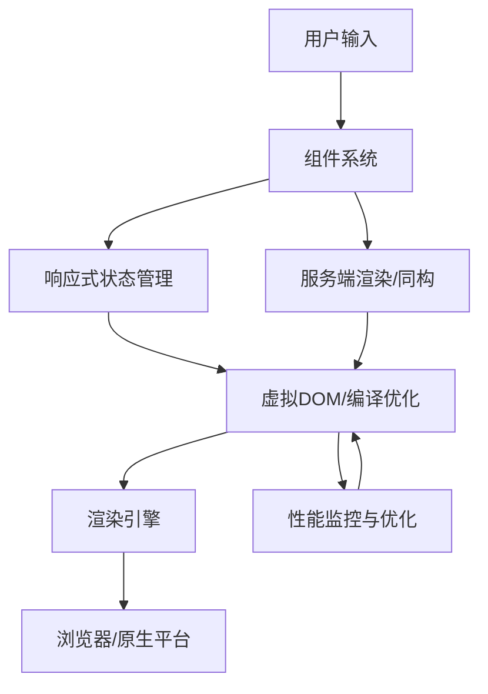

# 2.1 前端主流框架

[返回2.技术栈与框架](./README.md) | [返回Refactor总览](../README.md)

---

## 2024前沿趋势

- **React 19+**：Server Components、Concurrent Rendering、Signals、AI驱动UI。
- **Vue 3.4+**：Composition API、响应式系统优化、Vite深度集成、SSR/SSG增强。
- **Angular 17+**：Signals、Zone-less、Standalone Components、Hydration。
- **Svelte 5**：编译时优化、无虚拟DOM、可组合Store、SvelteKit。
- **SolidJS/Preact/Qwik**：极致性能、细粒度响应、懒加载与即时恢复。
- **AI辅助开发**：Copilot、AI代码生成、AIGC UI、智能组件推荐。
- **微前端与模块联邦**：Module Federation、微服务架构、跨团队协作。
- **全栈一体化**：Next.js、Nuxt、Remix、Astro等支持前后端一体化开发。

---

## 目录

- [2.1 前端主流框架](#21-前端主流框架)
  - [2024前沿趋势](#2024前沿趋势)
  - [目录](#目录)
  - [2.1.1 主流框架架构Mermaid图](#211-主流框架架构mermaid图)
  - [2.1.2 框架核心原理LaTeX公式](#212-框架核心原理latex公式)
  - [2.1.3 多语言框架代码示例](#213-多语言框架代码示例)
  - [2.1.4 批判性分析与最佳实践](#214-批判性分析与最佳实践)
  - [2.1.5 相关主题推荐阅读](#215-相关主题推荐阅读)
  - [1. 概述](#1-概述)
    - [1.1 理论定位与学科交叉](#11-理论定位与学科交叉)
    - [1.2 发展脉络与范式变迁](#12-发展脉络与范式变迁)
  - [2. 理论基础](#2-理论基础)
  - [3. 主要议题](#3-主要议题)
  - [4. 形式化论证与多表征](#4-形式化论证与多表征)
  - [5. 相关性引用](#5-相关性引用)
  - [6. 参考文献](#6-参考文献)

---

## 2.1.1 主流框架架构Mermaid图



---

## 2.1.2 框架核心原理LaTeX公式

**虚拟DOM Diff 算法复杂度**:
$$
T_{diff} = O(n)
$$

**响应式系统依赖收集**:
$$
Dep = \{ d_i \mid d_i \in Dependencies(Component) \}
$$

**信号驱动渲染（Signals）**:
$$
Render = f(State, Signal) \rightarrow View
$$

**服务端渲染与水合**
$$
SSR_{output} = f(Props, Data) \rightarrow HTML_{static}
$$

---

## 2.1.3 多语言框架代码示例

**React 19+ Signals 示例**

```tsx
import { useSignal } from 'react';
const count = useSignal(0);
<button onClick={() => count.value++}>{count.value}</button>
```

**Vue 3.4+ Composition API**

```vue
<script setup>
import { ref } from 'vue';
const count = ref(0);
</script>
<template>
  <button @click="count++">{{ count }}</button>
</template>
```

**Svelte 5 响应式声明**

```svelte
<script>
  let count = 0;
</script>
<button on:click={() => count++}>{count}</button>
```

**SolidJS 细粒度响应**

```jsx
import { createSignal } from 'solid-js';
const [count, setCount] = createSignal(0);
<button onClick={() => setCount(count() + 1)}>{count()}</button>
```

---

## 2.1.4 批判性分析与最佳实践

- **虚拟DOM与编译优化**：虚拟DOM适合复杂UI，编译型框架（Svelte、Solid）更适合极致性能场景。
- **响应式系统**：细粒度响应提升性能，但需关注依赖追踪与内存管理。
- **Server Components/SSR**：提升首屏体验，但需平衡服务端压力与客户端水合复杂度。
- **AI辅助开发**：提升开发效率，但需警惕AI生成代码的安全与可维护性。
- **微前端与模块联邦**：适合大型团队协作，但需关注依赖隔离与运行时性能。
- **全栈一体化**：提升开发一致性，但需关注前后端边界与安全。

---

## 2.1.5 相关主题推荐阅读

- [2.2 跨端框架](./2.2 跨端框架.md)
- [2.6 Web核心技术](./2.6 Web核心技术.md)
- [3.4 TypeScript-JavaScript](../3.编程语言范式/3.4 TypeScript-JavaScript.md)
- [5.1 UI-UE-UX设计规范](../../5.技术规范与标准/5.1 UI-UE-UX设计规范.md)
- [5.3 性能优化与工程实践](../../5.技术规范与标准/5.3 性能优化与工程实践.md)
- [6.1 AI基础原理](../../6.人工智能原理与算法/6.1 AI基础原理.md)

---

> 本文档持续递归优化，欢迎补充最新技术与学术内容。

## 1. 概述

前端主流框架是指用于构建Web应用用户界面的开发框架，极大提升了开发效率、可维护性和用户体验。主流框架如React、Vue、Angular等，推动了组件化、响应式、单页应用（SPA）、声明式UI、工程自动化等现代前端范式的发展。

### 1.1 理论定位与学科交叉

前端框架设计融合了人机交互（HCI）、软件工程、认知科学、函数式编程、系统论、符号学等多学科理论。其本质是开发者与用户、数据与界面、状态与行为之间的高效中介。

### 1.2 发展脉络与范式变迁

前端框架经历了从jQuery、Backbone、Knockout等早期库，到React、Vue、Angular等现代框架，再到Svelte、Solid等新兴编译型框架。每一次范式变迁都深刻影响了组件化、响应式、状态管理、工程实践与用户体验。

## 2. 理论基础

## 3. 主要议题

## 4. 形式化论证与多表征

## 5. 相关性引用

## 6. 参考文献

1. Jordan Walke. "Introducing React." Facebook Engineering, 2013.
2. Evan You. "Vue.js: The Progressive JavaScript Framework." 2014.
3. Google. "Angular: One framework. Mobile & desktop." 2016.
4. Rich Harris. "Rethinking reactivity: Svelte." 2019.
5. Dan Abramov, Andrew Clark. "Redux: Predictable State Container for JS Apps." 2015.
6. Eric Elliott. "Composing Software: The Book." 2018.
7. Norman, D. A. "The Design of Everyday Things." Basic Books, 2013.
8. Card, S. K., Moran, T. P., & Newell, A. "The Psychology of Human-Computer Interaction." 1983.
9. Gamma, E., Helm, R., Johnson, R., & Vlissides, J. "Design Patterns: Elements of Reusable Object-Oriented Software." Addison-Wesley, 1994.
10. W3C. "Web Content Accessibility Guidelines (WCAG) 2.1." 2018.
11. ISO/IEC 25010:2011. "Systems and software engineering — Systems and software Quality Requirements and Evaluation (SQuaRE) — System and software quality models."
12. 相关学术论文、技术文档与开源社区资料。
