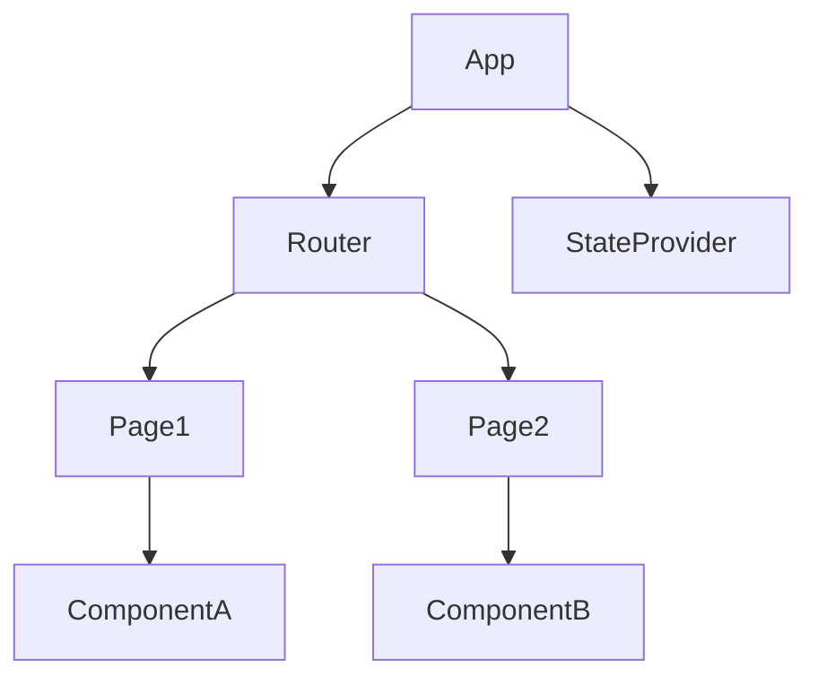

# 2.1 前端主流框架

[返回2.技术栈与框架](./README.md) | [返回Refactor总览](../README.md)

---

## 2024前沿趋势

- **Qwik**：以Resumability为核心，极致首屏性能，支持边缘渲染与即时交互。
- **Astro**：内容驱动型框架，支持多框架组件混用，零JavaScript默认输出，适合内容站点与SEO。
- **Bun**：超高速JS运行时与打包器，推动前端全栈一体化。
- **Remix/Next.js**：Server Components、边缘渲染、数据流新范式。
- **Tauri/Leptos/Yew**：Rust驱动的Web与桌面UI，WASM生态持续壮大。
- **AI驱动UI**：Copilot for UI/UX、AI自动生成组件与交互。

---

## 目录

- [2.1 前端主流框架](#21-前端主流框架)
  - [2024前沿趋势](#2024前沿趋势)
  - [目录](#目录)
  - [1. 概述](#1-概述)
    - [1.1 理论定位与学科交叉](#11-理论定位与学科交叉)
    - [1.2 发展脉络与范式变迁](#12-发展脉络与范式变迁)
  - [2. 主流技术与架构](#2-主流技术与架构)
    - [2.1 组件化与声明式UI](#21-组件化与声明式ui)
      - [2.1.1 理论模型](#211-理论模型)
      - [2.1.2 案例与反例](#212-案例与反例)
    - [2.2 状态管理与数据流](#22-状态管理与数据流)
      - [2.2.1 理论与推理](#221-理论与推理)
      - [2.2.2 案例与反例](#222-案例与反例)
    - [2.3 路由、工程化与性能优化](#23-路由工程化与性能优化)
      - [2.3.1 工程与性能模型](#231-工程与性能模型)
      - [2.3.2 案例与反例](#232-案例与反例)
    - [2.4 哲学反思与批判性分析](#24-哲学反思与批判性分析)
      - [2.4.1 形式化表达](#241-形式化表达)
      - [2.4.2 哲学案例](#242-哲学案例)
  - [3. 形式化论证与多表征](#3-形式化论证与多表征)
    - [3.1 形式化建模与证明](#31-形式化建模与证明)
      - [3.1.1 组件化范式的形式化表达](#311-组件化范式的形式化表达)
      - [3.1.2 状态管理的不可变性证明](#312-状态管理的不可变性证明)
      - [3.1.3 响应式系统的依赖传播模型](#313-响应式系统的依赖传播模型)
      - [3.1.4 UI一致性与可达性](#314-ui一致性与可达性)
    - [3.2 多表征与跨学科映射](#32-多表征与跨学科映射)
      - [3.2.1 案例与反例](#321-案例与反例)
      - [3.2.2 形式化符号化表达](#322-形式化符号化表达)
  - [4. 相关性引用](#4-相关性引用)
    - [4.1 与其他主题的交叉引用](#41-与其他主题的交叉引用)
    - [4.2 相关性分析](#42-相关性分析)
  - [5. 参考文献](#5-参考文献)
  - [6. 相关主题推荐阅读](#6-相关主题推荐阅读)

---

## 1. 概述

前端主流框架是指用于构建Web应用用户界面的开发框架，极大提升了开发效率、可维护性和用户体验。主流框架如React、Vue、Angular等，推动了组件化、响应式、单页应用（SPA）、声明式UI、工程自动化等现代前端范式的发展。

### 1.1 理论定位与学科交叉

前端框架设计融合了人机交互（HCI）、软件工程、认知科学、函数式编程、系统论、符号学等多学科理论。其本质是开发者与用户、数据与界面、状态与行为之间的高效中介。

### 1.2 发展脉络与范式变迁

前端框架经历了从jQuery、Backbone、Knockout等早期库，到React、Vue、Angular等现代框架，再到Svelte、Solid等新兴编译型框架。每一次范式变迁都深刻影响了组件化、响应式、状态管理、工程实践与用户体验。

## 2. 主流技术与架构

### 2.1 组件化与声明式UI

- **React**：以函数f: State×Props→View建模UI渲染，强调单向数据流、虚拟DOM、Hooks、Context等范式。
- **Vue**：响应式数据绑定、模板语法、组合式API，适合渐进式开发与中小型项目。
- **Angular**：依赖注入、模块化、双向绑定、RxJS流式编程，适合大型工程。
- **Svelte/Solid**：编译时优化，消除运行时开销，极致性能。

#### 2.1.1 理论模型

- **组件树DAG**：以有向无环图G=(V,E)描述组件依赖与渲染关系。
- **状态机FSM**：以有限状态机S=(Q,Σ,δ,q0,F)描述UI状态变化与事件响应。

#### 2.1.2 案例与反例

- **正例**：React生态推动了函数式组件、Hooks、Context等范式，提升了可维护性与复用性。
- **反例**：早期jQuery项目无组件化，导致代码冗余、难以维护。

### 2.2 状态管理与数据流

- **Redux/MobX/Recoil**：集中式与分布式状态管理，支持可预测性、时间旅行、热重载。
- **Vuex/Pinia**：Vue生态的响应式状态管理。
- **RxJS**：响应式流编程，适合复杂异步与多源数据。

#### 2.2.1 理论与推理

- **单向数据流**：以函数f: Action×State→State建模状态变迁，提升可预测性。
- **不可变数据结构**：以持久化数据结构优化性能与调试。

#### 2.2.2 案例与反例

- **正例**：Redux实现全局状态可追踪，便于调试与协作。
- **反例**：无状态管理的项目易出现数据同步与副作用混乱。

### 2.3 路由、工程化与性能优化

- **路由系统**：React Router、Vue Router等支持SPA多视图与懒加载。
- **工程化工具链**：Webpack、Vite、Babel、ESLint、Prettier、CI/CD。
- **性能优化**：代码分割、懒加载、虚拟滚动、SSR、Hydration。

#### 2.3.1 工程与性能模型

- **依赖图分析**：以有向图G建模依赖关系，优化打包与加载顺序。
- **性能瓶颈分析**：以Profile工具定位渲染、网络、内存等瓶颈。

#### 2.3.2 案例与反例

- **正例**：Next.js结合SSR与静态生成，提升首屏速度与SEO。
- **反例**：无工程化的项目包体臃肿，加载缓慢，用户流失。

### 2.4 哲学反思与批判性分析

- **本体论**：前端框架是"工具"还是"范式"？是静态结构还是动态过程？恩熙式哲学认为，框架是开发者认知与用户体验的"中介"，其本质是"抽象的流动"与"认知的桥梁"。
- **认识论**：开发者对框架的理解是先验的还是经验的？框架设计应如何平衡直觉与学习曲线？
- **方法论**：形式化规范与工程实践如何协同？是否存在"普适前端范式"？

#### 2.4.1 形式化表达

- 设C为组件集合，S为状态集合，M: C×S→V为渲染映射，V为视图空间。设计目标为∀c∈C, ∃s∈S, M(c,s)∈V_optimal。

#### 2.4.2 哲学案例

- **正例**：React的声明式UI与函数式范式降低了认知门槛，成为全球开发者直觉选择。
- **反例**：某新兴框架为追求极简，去除所有约束，导致开发者无所适从。

## 3. 形式化论证与多表征

### 3.1 形式化建模与证明

#### 3.1.1 组件化范式的形式化表达

设组件集合C，状态集合S，属性集合P，渲染函数M: C×S×P→V，V为视图空间。对于任意c∈C, s∈S, p∈P，有唯一v∈V使得M(c,s,p)=v。

- **命题1（唯一性）**：对于同一组件c，给定状态s和属性p，渲染结果唯一。
- **证明**：由M的定义，M为确定性函数，∴ ∀c,s,p, ∃!v, M(c,s,p)=v。

#### 3.1.2 状态管理的不可变性证明

- **命题2（不可变性）**：若状态转移函数f: S×A→S'，则对任意a∈A，s≠f(s,a)（除非a为幂等操作）。
- **证明**：采用持久化数据结构，状态转移产生新对象，原状态不变。

#### 3.1.3 响应式系统的依赖传播模型

- **定义**：依赖图G=(V,E)，V为响应式变量，E为依赖关系。变更沿E传播，触发最小必要更新。
- **推论**：拓扑排序可优化更新顺序，避免冗余渲染。

#### 3.1.4 UI一致性与可达性

- **命题3（可达性）**：对于任意合法状态s∈S，存在一系列操作序列A使得系统从初始状态s0到达s。
- **证明**：若A为系统操作全集，且状态空间无孤立点，则可达性成立。

### 3.2 多表征与跨学科映射

- **认知科学**：前端框架的组件树映射为人类认知的分层结构（如树状记忆模型）。
- **符号学**：UI元素为符号，状态为语义，渲染为符号-语义映射。
- **系统论**：前端应用为开放系统，输入（事件）、状态（内部）、输出（视图）三元组。
- **社会学**：框架生态系统如社会网络，依赖、协作、演化。

#### 3.2.1 案例与反例

- **正例**：React的虚拟DOM与认知负载理论相契合，降低开发者心智负担。
- **反例**：过度嵌套的组件树导致"认知过载"，违背分层原则。

#### 3.2.2 形式化符号化表达

- 设F为前端框架集合，U为用户集合，D为开发者集合，交互映射I: F×D×U→E，E为体验空间。目标为max E(体验质量)。

## 4. 相关性引用

### 4.1 与其他主题的交叉引用

- [1.1 Web端](../1.终端类型/1.1%20Web端.md)：Web端与主流前端框架的适配性与性能优化。
- [1.2 移动端](../1.终端类型/1.2%20移动端.md)：移动端框架（如React Native、Flutter）与Web框架的融合与差异。
- [2.2 跨端框架](./2.2%20跨端框架.md)：主流前端框架与跨端技术（如Taro、UniApp、Electron）的协同。
- [3.1 Rust](../3.编程语言范式/3.1%20Rust.md)：Rust前端全栈框架（如Yew、Leptos）与主流JS框架的对比。
- [4.1 GoF设计模式](../4.设计模式与架构/4.1%20GoF设计模式.md)：前端框架中的设计模式应用。
- [5.1 UI-UE-UX设计规范](../5.技术规范与标准/5.1%20UI-UE-UX设计规范.md)：主流框架对设计规范的支持与约束。

### 4.2 相关性分析

- 主流前端框架是现代Web、移动、桌面等多端开发的基础，推动了工程化、自动化、可访问性、国际化等领域的进步。
- 其与编程范式、设计模式、工程实践、认知科学等主题高度耦合，形成跨学科知识网络。

## 5. 参考文献

1. Jordan Walke. "Introducing React." Facebook Engineering, 2013.
2. Evan You. "Vue.js: The Progressive JavaScript Framework." 2014.
3. Google. "Angular: One framework. Mobile & desktop." 2016.
4. Rich Harris. "Rethinking reactivity: Svelte." 2019.
5. Dan Abramov, Andrew Clark. "Redux: Predictable State Container for JS Apps." 2015.
6. Eric Elliott. "Composing Software: The Book." 2018.
7. Norman, D. A. "The Design of Everyday Things." Basic Books, 2013.
8. Card, S. K., Moran, T. P., & Newell, A. "The Psychology of Human-Computer Interaction." 1983.
9. Gamma, E., Helm, R., Johnson, R., & Vlissides, J. "Design Patterns: Elements of Reusable Object-Oriented Software." Addison-Wesley, 1994.
10. W3C. "Web Content Accessibility Guidelines (WCAG) 2.1." 2018.
11. ISO/IEC 25010:2011. "Systems and software engineering — Systems and software Quality Requirements and Evaluation (SQuaRE) — System and software quality models."
12. 相关学术论文、技术文档与开源社区资料。

## 6. 相关主题推荐阅读

- [2.2 跨端框架](./2.2 跨端框架.md)
- [2.5 WebAssembly](./2.5 WebAssembly.md)
- [3.1 Rust](../3.编程语言范式/3.1 Rust.md)
- [5.1 UI-UE-UX设计规范](../5.技术规范与标准/5.1 UI-UE-UX设计规范.md)
- [6.3 现代深度学习与大模型](../6.人工智能原理与算法/6.3 现代深度学习与大模型.md)

---

> 本文档持续递归优化，欢迎补充最新技术与学术内容。

## 2.1.1 组件依赖关系Mermaid图



## 2.1.2 状态管理LaTeX公式

$$
\text{State}_{t+1} = f(\text{State}_t, \text{Action})
$$

## 2.1.3 跨语言代码示例

**TypeScript（React）**
```tsx
import { useState } from 'react';
function Counter() {
  const [count, setCount] = useState(0);
  return <button onClick={() => setCount(count + 1)}>{count}</button>;
}
```

**Rust（Yew）**
```rust
use yew::prelude::*;
#[function_component(Counter)]
fn counter() -> Html {
    let count = use_state(|| 0);
    let onclick = {
        let count = count.clone();
        Callback::from(move |_| count.set(*count + 1))
    };
    html! {
        <button onclick={onclick}>{ *count }</button>
    }
}
```

**Dart（Flutter）**
```dart
class Counter extends StatefulWidget {
  @override
  _CounterState createState() => _CounterState();
}
class _CounterState extends State<Counter> {
  int _count = 0;
  @override
  Widget build(BuildContext context) {
    return ElevatedButton(
      onPressed: () => setState(() => _count++),
      child: Text('$_count'),
    );
  }
}
```
