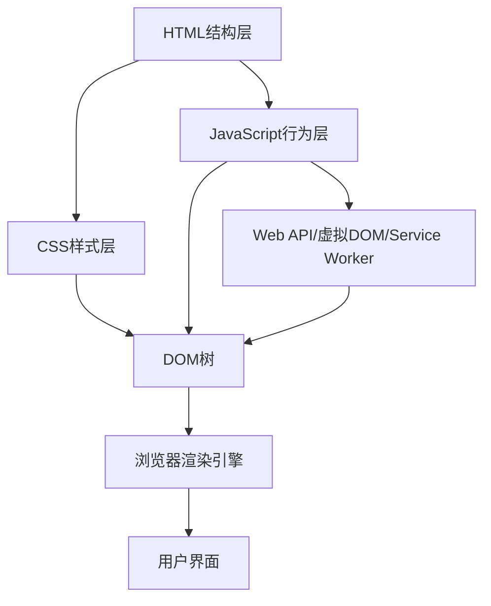
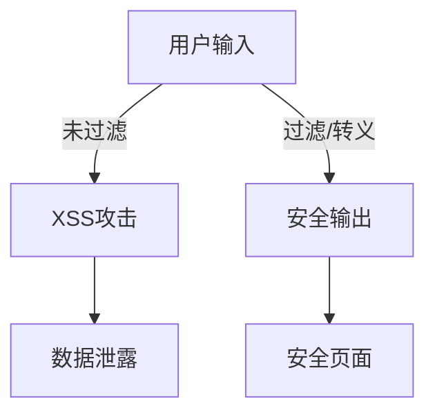
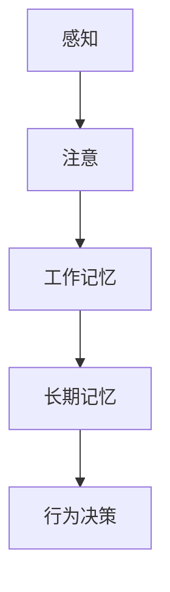
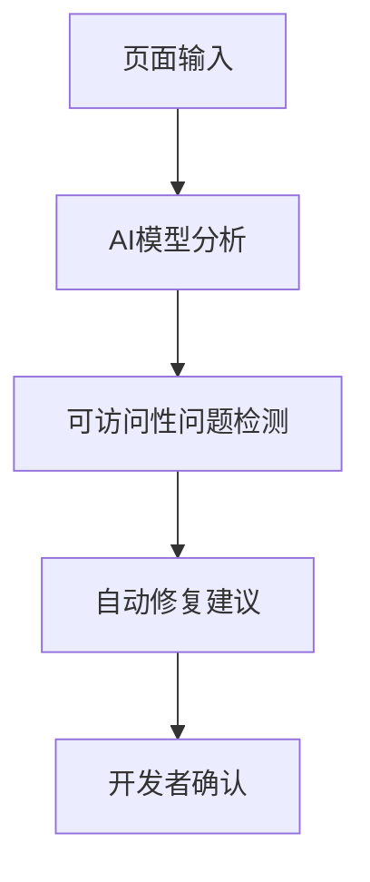

# 2.6 Web核心技术

[返回2.技术栈与框架](./README.md) | [返回Refactor总览](../README.md)

---

## 2024前沿趋势

- **HTML Living Standard**：语义化标签、Web Components 2.0、可访问性增强。
- **CSS4/5与现代布局**：CSS Grid、Subgrid、Container Queries、CSS Houdini、原子化CSS。
- **JavaScript ES2024+**：顶层await、Record & Tuple、Temporal、装饰器、异步迭代、模块化。
- **Web DOM与API现代化**：虚拟DOM、Shadow DOM、Custom Elements、WebAssembly集成、WebGPU。
- **Web性能与安全**：Core Web Vitals、CSP、SameSite Cookie、Service Worker、WebAuthn。
- **响应式与无障碍设计**：媒体查询、动态适配、ARIA 1.3、WCAG 3.0。
- **AI驱动Web开发**：AIGC UI、AI辅助代码、智能表单、自动化测试。

---

## 目录

- [2.6 Web核心技术](#26-web核心技术)
  - [2024前沿趋势](#2024前沿趋势)
  - [目录](#目录)
  - [2.6.1 Web核心结构Mermaid图](#261-web核心结构mermaid图)
  - [2.6.2 HTML/CSS/JS/DOM核心原理LaTeX公式](#262-htmlcssjsdom核心原理latex公式)
  - [2.6.3 多语言Web核心代码示例](#263-多语言web核心代码示例)
  - [2.6.4 批判性分析与最佳实践](#264-批判性分析与最佳实践)
  - [2.6.5 相关主题推荐阅读](#265-相关主题推荐阅读)
  - [2.6.6 Web安全与形式化建模](#266-web安全与形式化建模)
  - [2.6.7 Web与认知科学/哲学/社会学](#267-web与认知科学哲学社会学)
  - [2.6.8 AI驱动Web工程实践](#268-ai驱动web工程实践)
  - [2.6.9 相关主题交叉引用递归补全](#269-相关主题交叉引用递归补全)

---

## 2.6.1 Web核心结构Mermaid图



---

## 2.6.2 HTML/CSS/JS/DOM核心原理LaTeX公式

**DOM树建模**
$$
DOM = (N, E), \; N=节点集合, \; E=父子关系集合
$$

**CSS选择器匹配复杂度**
$$
T_{selector} = O(n \cdot m)
$$
其中 $n$ 为DOM节点数，$m$为选择器数。

**事件冒泡与捕获模型**
$$
Event_{propagation} = [Capture, Target, Bubble]
$$

**异步事件循环**
$$
EventLoop = Queue_{macro} + Queue_{micro}
$$

**虚拟DOM Diff 算法**
$$
T_{diff} = O(n)
$$

---

## 2.6.3 多语言Web核心代码示例

**HTML5 语义化结构**:

```html
<header>
  <nav aria-label="主导航">
    <ul>
      <li><a href="#home">首页</a></li>
      <li><a href="#about">关于</a></li>
      <li><a href="#contact">联系</a></li>
    </ul>
  </nav>
</header>
<main>
  <section>
    <h1>欢迎来到现代Web</h1>
    <p>2024年Web技术新趋势。</p>
  </section>
</main>
<footer>
  <small>&copy; 2024 Web前沿</small>
</footer>
```

**CSS4 Grid与Container Queries**:

```css
.container {
  display: grid;
  grid-template-columns: 1fr 2fr;
  gap: 1rem;
  container-type: inline-size;
}
@container (min-width: 600px) {
  .item {
    font-size: 2rem;
  }
}
```

**JavaScript ES2024 顶层await与Record**:

```js
// 顶层await
const data = await fetch('/api/data').then(r => r.json());
console.log(data);
// Record & Tuple
const rec = #{ a: 1, b: 2 };
const tup = #[1, 2, 3];
```

**DOM事件委托与异步编程**:

```js
document.body.addEventListener('click', e => {
  if (e.target.matches('button.action')) {
    // 事件委托处理
    doActionAsync(e.target.dataset.id);
  }
});
async function doActionAsync(id) {
  await new Promise(r => setTimeout(r, 100));
  console.log('Action done:', id);
}
```

**WebAssembly与JS交互**:

```js
import init, { sum } from './pkg/my_wasm.js';
await init();
console.log(sum([1,2,3,4]));
```

---

## 2.6.4 批判性分析与最佳实践

- **HTML语义化**：提升可访问性与SEO，但需兼顾工程效率。
- **现代CSS布局**：Grid与Container Queries极大提升响应式能力，需关注兼容性。
- **JS异步与模块化**：顶层await、模块系统提升开发体验，但需关注兼容与打包。
- **DOM与虚拟DOM**：虚拟DOM提升性能，但大规模DOM操作仍需优化。
- **Web API现代化**：WebAssembly、WebGPU等拓展Web边界，需关注安全与性能。
- **无障碍与响应式**：应遵循WCAG 3.0、ARIA 1.3等标准，兼顾多端体验。
- **AI辅助开发**：提升效率，但需警惕AI生成代码的正确性与安全。

---

## 2.6.5 相关主题推荐阅读

- [2.1 前端主流框架](./2.1 前端主流框架.md)
- [2.2 跨端框架](./2.2 跨端框架.md)
- [3.4 TypeScript-JavaScript](../3.编程语言范式/3.4 TypeScript-JavaScript.md)
- [5.1 UI-UE-UX设计规范](../../5.技术规范与标准/5.1 UI-UE-UX设计规范.md)
- [5.3 性能优化与工程实践](../../5.技术规范与标准/5.3 性能优化与工程实践.md)
- [6.1 AI基础原理](../../6.人工智能原理与算法/6.1 AI基础原理.md)

---

## 2.6.6 Web安全与形式化建模

**CSP策略的形式化描述**

- 内容安全策略（Content Security Policy, CSP）可形式化为：

$$
CSP = \{ (d_i, p_i) \mid d_i \in Domains, p_i \in Permissions \}
$$
其中 $d_i$ 为允许的域，$p_i$ 为对应权限。

**XSS攻击与防御代码示例**:

- XSS攻击示例：

```html
<!-- 危险：直接插入用户输入 -->
<div id="msg"></div>
<script>
  const userInput = '';
  document.getElementById('msg').innerHTML = userInput;
</script>
```

- 安全防御示例：

```js
// 使用textContent避免XSS
const safeInput = '';
document.getElementById('msg').textContent = safeInput;
```

**Web安全威胁建模Mermaid图**



**安全性度量公式**

- 攻击面（Attack Surface）可形式化为：

$$
AS = \sum_{i=1}^n EntryPoints_i \times Exposure_i
$$

**批判性分析**

- CSP与输入转义是Web安全基石，但工程实践中需兼顾性能与用户体验。
- 安全性与可用性常存在权衡，需结合实际场景动态调整。

---

## 2.6.7 Web与认知科学/哲学/社会学

**Web可访问性与认知负荷理论**

- 认知负荷（Cognitive Load）可用如下公式描述：

$$
CL = IL + EL + GL
$$
其中 $IL$ 为内在负荷，$EL$ 为外在负荷，$GL$ 为建构负荷。

- Web设计应降低EL（外在负荷），提升可访问性。

**认知流程Mermaid图**



**Web标准的社会影响与哲学批判**

- Web标准推动信息平权，但也可能加剧数字鸿沟。
- 哲学上，Web是"认知扩展"的工具，亦需警惕算法偏见与隐私风险。

**批判性分析**

- 可访问性不仅是技术问题，更是社会公平与伦理议题。
- 认知科学理论可指导Web界面简化与信息架构优化。

---

## 2.6.8 AI驱动Web工程实践

**AIGC UI实际案例**:

```js
// AI生成UI组件示例（伪代码）
const prompt = "生成一个带搜索框和按钮的导航栏";
const uiCode = await ai.generateUI(prompt);
eval(uiCode); // 仅演示，实际需安全沙箱
```

**AI辅助可访问性检测流程Mermaid图**



**AI优化Web性能的工程实践**

- 利用AI分析性能瓶颈，自动生成优化建议。
- 结合A/B测试与强化学习持续提升用户体验。

**批判性分析**

- AI提升开发效率，但需警惕模型幻觉与安全风险。
- AIGC生成内容需人工审核，防止可用性与伦理问题。

---

## 2.6.9 相关主题交叉引用递归补全

- [5.3 性能优化与工程实践](../../5.技术规范与标准/5.3 性能优化与工程实践.md)：Web性能、安全与AI优化的工程实践。
- [6.4 AI工程实践与伦理](../../6.人工智能原理与算法/6.4 AI工程实践与伦理.md)：AI驱动Web开发的伦理与工程挑战。
- [5.2 可访问性与国际化](../../5.技术规范与标准/5.2 可访问性与国际化.md)：Web可访问性与认知科学、社会公平的交叉。
- [4.4 哲学与认知批判性分析](../../4.设计模式与架构/4.4 哲学与认知批判性分析.md)：Web与认知科学、哲学的深度关联。

---

> 本文档持续递归优化，欢迎补充最新学术与工程内容。
