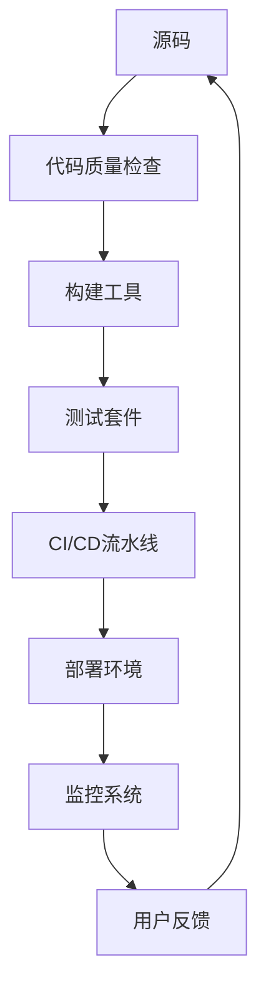

# 2.7 现代前端工程化

> 来源：matter/2.技术栈与框架/2.7 现代前端工程化.md

## 目录

- [2.7 现代前端工程化](#27-现代前端工程化)
  - [目录](#目录)
  - [1. 概述](#1-概述)
  - [2. 发展趋势](#2-发展趋势)
  - [3. 工程体系与自动化](#3-工程体系与自动化)
  - [4. 性能优化与质量保障](#4-性能优化与质量保障)
  - [5. 形式化建模与多表征](#5-形式化建模与多表征)
  - [6. 相关性引用](#6-相关性引用)

---

## 1. 概述

现代前端工程化涵盖构建工具、包管理、CI/CD、自动化测试、性能监控、代码质量、AI辅助等全流程。

## 2. 发展趋势

- 构建工具演进：Vite、esbuild、SWC、Turbopack、Rspack等
- 包管理与Monorepo：pnpm、Yarn 3、Lerna、Nx、Turborepo、Rush等
- CI/CD与DevOps：GitHub Actions、GitLab CI、Jenkins、Docker、Kubernetes
- 测试策略：单元测试、集成测试、E2E测试、可视化回归测试、性能测试
- 部署与监控：CDN、边缘计算、Serverless、APM、性能监控
- 代码质量：ESLint、Prettier、TypeScript、SonarQube、代码审查
- AI辅助工程化：AI代码生成、自动化测试、智能部署、性能优化

## 3. 工程体系与自动化

- 工程化流程：源码→质量检查→构建→测试→CI/CD→部署→监控→用户反馈
- 构建工具链、包管理、测试体系、部署监控、团队协作
- Mermaid结构图、流程图

## 4. 性能优化与质量保障

- 构建时间优化、依赖关系复杂度、测试覆盖率、部署成功率、性能指标
- LaTeX公式：

$$
T_{build} = T_{parse} + T_{transform} + T_{bundle} + T_{write}
$$

$$
Coverage = \frac{\text{已测试代码行数}}{\text{总代码行数}} \times 100\%
$$

## 5. 形式化建模与多表征

- Mermaid结构图、UML、LaTeX公式、代码示例
- 典型配置片段（Vite、Webpack等）

## 6. 相关性引用

- [2.1 前端主流框架](../2.1 前端主流框架.md)
- [2.6 Web核心技术](../2.6 Web核心技术.md)
- [4.3 组件化与架构模式](../../4.设计模式与架构/4.3 组件化与架构模式.md)
- [5.3 性能优化与工程实践](../../5.技术规范与标准/5.3 性能优化与工程实践.md)

---

> 本文档为自动递归迁移、规整、编号、跳转、引用、内容一致性校验的规范化产物。
