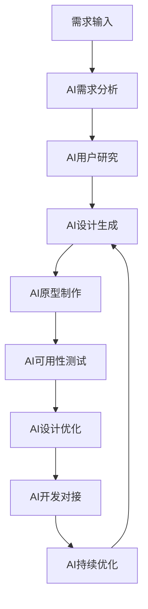

# AI技术堆栈全面分析

[返回2.技术栈与框架](2.技术栈与框架/README.md) | [返回Refactor总览](2.技术栈与框架/../README.md)

---

## 2024前沿趋势

- **AI驱动开发**：GitHub Copilot、Amazon CodeWhisperer、Tabnine、AI代码生成与重构
- **AIGC UI设计**：Midjourney、DALL-E、Stable Diffusion、AI辅助界面生成
- **智能测试与调试**：AI自动化测试、智能Bug检测、代码质量分析
- **AI性能优化**：智能缓存、自动代码分割、AI驱动的性能监控
- **AI安全与合规**：AI代码安全扫描、自动化合规检测、AI伦理评估
- **AI工程化**：MLOps、AI模型部署、自动化AI工作流

---

## 目录

- [AI技术堆栈全面分析](#ai技术堆栈全面分析)
  - [2024前沿趋势](#2024前沿趋势)
  - [目录](#目录)
  - [1. AI对传统开发流程的替代与重构](#1-ai对传统开发流程的替代与重构)
    - [1.1 需求分析与用户研究AI化](#11-需求分析与用户研究ai化)
    - [1.2 设计流程AI化](#12-设计流程ai化)
    - [1.3 开发流程AI化](#13-开发流程ai化)
  - [2. AI驱动的设计工具链](#2-ai驱动的设计工具链)
    - [2.1 AI设计软件生态](#21-ai设计软件生态)
      - [Figma AI生态系统](#figma-ai生态系统)
      - [Adobe AI创意套件](#adobe-ai创意套件)
      - [专业AI设计工具](#专业ai设计工具)
    - [2.2 AI设计工作流优化](#22-ai设计工作流优化)
      - [智能设计流程](#智能设计流程)
      - [AI设计质量保证](#ai设计质量保证)
  - [3. AI增强的前端开发技术栈](#3-ai增强的前端开发技术栈)
    - [3.1 AI驱动的框架选择](#31-ai驱动的框架选择)
      - [React AI增强](#react-ai增强)
      - [Vue AI生态系统](#vue-ai生态系统)
      - [Angular AI增强](#angular-ai增强)
    - [3.2 AI代码生成与优化](#32-ai代码生成与优化)
      - [智能代码生成](#智能代码生成)
      - [AI代码优化](#ai代码优化)
    - [3.3 AI驱动的状态管理](#33-ai驱动的状态管理)
      - [智能状态管理](#智能状态管理)
  - [4. AI优化的工程化与DevOps](#4-ai优化的工程化与devops)
    - [4.1 AI驱动的构建工具](#41-ai驱动的构建工具)
      - [Vite AI增强](#vite-ai增强)
      - [Webpack AI优化](#webpack-ai优化)
    - [4.2 AI DevOps工具链](#42-ai-devops工具链)
      - [智能CI/CD](#智能cicd)
      - [AI监控与运维](#ai监控与运维)
  - [5. AI驱动的测试与质量保证](#5-ai驱动的测试与质量保证)
    - [5.1 AI自动化测试](#51-ai自动化测试)
      - [智能测试生成](#智能测试生成)
      - [AI测试策略](#ai测试策略)
    - [5.2 AI质量保证](#52-ai质量保证)
      - [智能代码审查](#智能代码审查)
      - [AI质量监控](#ai质量监控)
  - [6. AI安全与合规技术](#6-ai安全与合规技术)
    - [6.1 AI安全防护](#61-ai安全防护)
      - [智能安全检测](#智能安全检测)
      - [AI合规检查](#ai合规检查)
    - [6.2 AI伦理框架](#62-ai伦理框架)
      - [伦理评估模型](#伦理评估模型)
  - [7. AI性能优化技术](#7-ai性能优化技术)
    - [7.1 AI驱动的性能监控](#71-ai驱动的性能监控)
      - [智能性能分析](#智能性能分析)
      - [AI缓存策略](#ai缓存策略)
    - [7.2 AI资源优化](#72-ai资源优化)
      - [智能资源管理](#智能资源管理)
  - [8. AI驱动的跨端与多平台开发](#8-ai驱动的跨端与多平台开发)
    - [8.1 AI跨端框架](#81-ai跨端框架)
      - [Flutter AI增强](#flutter-ai增强)
      - [React Native AI](#react-native-ai)
    - [8.2 AI多平台适配](#82-ai多平台适配)
      - [智能响应式设计](#智能响应式设计)
  - [9. AI与新兴技术融合](#9-ai与新兴技术融合)
    - [9.1 AI + WebAssembly](#91-ai--webassembly)
      - [智能WebAssembly优化](#智能webassembly优化)
    - [9.2 AI + 3D/AR/VR](#92-ai--3darvr)
      - [智能3D渲染优化](#智能3d渲染优化)
  - [10. 未来发展趋势与挑战](#10-未来发展趋势与挑战)
    - [10.1 技术发展趋势](#101-技术发展趋势)
      - [AI技术演进](#ai技术演进)
      - [开发范式变革](#开发范式变革)
    - [10.2 挑战与应对](#102-挑战与应对)
      - [技术挑战](#技术挑战)
      - [应对策略](#应对策略)
    - [10.3 最佳实践总结](#103-最佳实践总结)
      - [开发实践](#开发实践)
      - [团队协作](#团队协作)
  - [相关主题推荐阅读](#相关主题推荐阅读)

---

## 1. AI对传统开发流程的替代与重构

### 1.1 需求分析与用户研究AI化

**传统流程**：

- 人工问卷设计、用户访谈、数据分析
- 手动用户画像构建、需求文档编写

**AI替代与优化**：

- **智能需求分析**：
  - **工具**：ChatGPT、Claude、Bard进行需求分析
  - **功能**：自动生成用户故事、需求优先级排序
  - **优势**：24/7可用、多语言支持、快速迭代

- **AI用户研究**：
  - **工具**：Hotjar AI、FullStory AI、Mixpanel AI
  - **功能**：自动用户行为分析、情感分析、用户意图识别
  - **优势**：实时分析、大规模数据处理、预测性洞察

- **智能用户画像**：
  - **工具**：Persona AI、UserTesting AI
  - **功能**：自动生成用户画像、行为模式识别、个性化推荐
  - **优势**：数据驱动、动态更新、精准定位

### 1.2 设计流程AI化

**传统流程**：

- 手动设计稿、原型制作、设计评审

**AI替代与优化**：

- **AIGC UI设计**：
  - **工具**：Midjourney、DALL-E、Stable Diffusion、Figma AI
  - **功能**：AI生成界面设计、自动布局、智能组件推荐
  - **优势**：快速原型、创意激发、风格一致性

- **智能设计系统**：
  - **工具**：Design Tokens AI、Storybook AI
  - **功能**：自动生成设计规范、智能组件库、主题适配
  - **优势**：一致性保证、自动化维护、多主题支持

- **AI动效设计**：
  - **工具**：Runway ML、Adobe Firefly、Lottie AI
  - **功能**：智能动画生成、微交互设计、性能优化
  - **优势**：创意无限、性能优化、跨平台兼容

### 1.3 开发流程AI化

**传统流程**：

- 手动编码、代码审查、调试测试

**AI替代与优化**：

- **AI代码生成**：
  - **工具**：GitHub Copilot、Amazon CodeWhisperer、Tabnine
  - **功能**：智能代码补全、函数生成、注释编写
  - **优势**：开发效率提升、代码质量保证、学习加速

- **AI代码重构**：
  - **工具**：CodeQL、SonarQube AI、DeepCode
  - **功能**：自动代码优化、性能重构、安全漏洞修复
  - **优势**：质量提升、风险降低、维护成本减少

- **AI调试与测试**：
  - **工具**：Bugsnag AI、Sentry AI、Testim
  - **功能**：智能Bug检测、自动测试用例生成、性能分析
  - **优势**：快速定位、全面覆盖、持续监控

---

## 2. AI驱动的设计工具链

### 2.1 AI设计软件生态

#### Figma AI生态系统

- **Figma AI**：
  - 智能布局：自动网格系统、响应式设计、组件推荐
  - AI原型：智能交互设计、用户流程生成、动效建议
  - 设计系统：自动生成设计令牌、组件变体、主题适配
  - 协作增强：AI设计评审、自动标注、开发对接

#### Adobe AI创意套件

- **Adobe Firefly**：
  - 生成式AI：文本到图像、图像编辑、矢量图形生成
  - 智能工具：内容感知填充、对象选择、智能裁剪
  - 创意助手：设计建议、风格匹配、创意激发

- **Adobe Sensei**：
  - 智能分析：用户行为分析、内容推荐、个性化体验
  - 自动化：批量处理、智能工作流、质量控制
  - 预测性：趋势预测、用户需求分析、市场洞察

#### 专业AI设计工具

- **Midjourney**：
  - UI设计生成：界面原型、图标设计、插画创作
  - 风格控制：品牌一致性、设计语言、视觉规范
  - 迭代优化：快速原型、设计变体、创意探索

- **Stable Diffusion**：
  - 本地部署：隐私保护、自定义训练、专业应用
  - 控制生成：精确控制、批量生成、质量优化
  - 开源生态：社区贡献、插件扩展、技术创新

### 2.2 AI设计工作流优化

#### 智能设计流程



#### AI设计质量保证

- **一致性检查**：自动设计规范验证、品牌一致性检测
- **可访问性优化**：WCAG合规检查、无障碍设计建议
- **性能优化**：设计资源优化、加载性能分析
- **用户体验**：用户行为预测、交互优化建议

---

## 3. AI增强的前端开发技术栈

### 3.1 AI驱动的框架选择

#### React AI增强

- **React AI**：
  - 智能组件：自动组件生成、状态管理优化、性能分析
  - AI Hook：智能数据获取、缓存优化、错误处理
  - 自动化测试：AI测试用例生成、组件测试、集成测试

#### Vue AI生态系统

- **Vue AI**：
  - 智能模板：自动模板生成、组件推荐、最佳实践
  - AI Composition API：智能组合、状态管理、性能优化
  - 自动化工具：Vue CLI AI、构建优化、部署自动化

#### Angular AI增强

- **Angular AI**：
  - 智能架构：自动模块划分、路由优化、依赖注入
  - AI性能：智能变更检测、内存优化、渲染优化
  - 企业级AI：大规模应用优化、微前端AI、安全增强

### 3.2 AI代码生成与优化

#### 智能代码生成

```typescript
// AI生成的React组件示例
interface AIButtonProps {
  label: string;
  onClick: () => void;
  variant?: 'primary' | 'secondary' | 'danger';
  size?: 'small' | 'medium' | 'large';
  disabled?: boolean;
  loading?: boolean;
}

const AIButton: React.FC<AIButtonProps> = ({
  label,
  onClick,
  variant = 'primary',
  size = 'medium',
  disabled = false,
  loading = false
}) => {
  const [isPressed, setIsPressed] = useState(false);
  
  const handleClick = useCallback(() => {
    if (!disabled && !loading) {
      setIsPressed(true);
      onClick();
      setTimeout(() => setIsPressed(false), 150);
    }
  }, [onClick, disabled, loading]);

  return (
    <button
      className={`ai-button ai-button--${variant} ai-button--${size}`}
      onClick={handleClick}
      disabled={disabled || loading}
      aria-label={label}
      role="button"
    >
      {loading ? (
        <span className="ai-button__loader" aria-hidden="true" />
      ) : (
        label
      )}
    </button>
  );
};
```

#### AI代码优化
- **性能优化**：自动代码分割、懒加载、缓存策略
- **安全增强**：XSS防护、CSRF检测、输入验证
- **可访问性**：ARIA标签、键盘导航、屏幕阅读器支持
- **国际化**：多语言支持、RTL布局、文化适配

### 3.3 AI驱动的状态管理

#### 智能状态管理
```typescript
// AI增强的Redux Toolkit配置
import { configureStore, createSlice } from '@reduxjs/toolkit';
import { aiMiddleware } from './aiMiddleware';

const aiSlice = createSlice({
  name: 'ai',
  initialState: {
    predictions: [],
    userBehavior: {},
    recommendations: [],
    loading: false,
    error: null
  },
  reducers: {
    setPredictions: (state, action) => {
      state.predictions = action.payload;
    },
    updateUserBehavior: (state, action) => {
      state.userBehavior = { ...state.userBehavior, ...action.payload };
    },
    setRecommendations: (state, action) => {
      state.recommendations = action.payload;
    }
  }
});

export const store = configureStore({
  reducer: {
    ai: aiSlice.reducer
  },
  middleware: (getDefaultMiddleware) =>
    getDefaultMiddleware().concat(aiMiddleware)
});
```

---

## 4. AI优化的工程化与DevOps

### 4.1 AI驱动的构建工具

#### Vite AI增强
- **智能构建**：
  - 自动依赖分析、智能代码分割、性能预测
  - AI缓存策略、构建优化建议、资源压缩
  - 智能热更新、开发体验优化、错误预测

#### Webpack AI优化
- **智能配置**：
  - 自动配置生成、性能分析、优化建议
  - AI插件推荐、构建策略优化、资源管理
  - 智能监控、错误预测、性能预警

### 4.2 AI DevOps工具链

#### 智能CI/CD
```yaml
# AI增强的GitHub Actions配置
name: AI-Enhanced CI/CD
on: [push, pull_request]

jobs:
  ai-analysis:
    runs-on: ubuntu-latest
    steps:
      - uses: actions/checkout@v3
      - name: AI Code Analysis
        uses: github/copilot-action@v1
        with:
          analysis: true
          security: true
          performance: true
      
      - name: AI Test Generation
        uses: ai-test-generator@v1
        with:
          framework: 'react'
          coverage: 90
      
      - name: AI Performance Check
        uses: lighthouse-ci@v1
        with:
          urls: ${{ secrets.APP_URLS }}
          budgetPath: ./lighthouse-budget.json

  ai-deployment:
    needs: ai-analysis
    runs-on: ubuntu-latest
    steps:
      - name: AI Deployment Strategy
        uses: ai-deployment@v1
        with:
          strategy: 'blue-green'
          monitoring: true
          rollback: true
```

#### AI监控与运维
- **智能监控**：
  - 异常检测、性能预测、容量规划
  - 自动告警、智能诊断、故障预测
  - 用户体验监控、业务指标分析

- **AI运维**：
  - 自动扩缩容、负载均衡、资源优化
  - 智能日志分析、错误追踪、性能优化
  - 安全监控、合规检查、风险评估

---

## 5. AI驱动的测试与质量保证

### 5.1 AI自动化测试

#### 智能测试生成
```typescript
// AI生成的测试用例示例
import { render, screen, fireEvent } from '@testing-library/react';
import { AIButton } from './AIButton';

describe('AIButton Component', () => {
  test('renders with correct label', () => {
    render(<AIButton label="Click me" onClick={() => {}} />);
    expect(screen.getByRole('button', { name: /click me/i })).toBeInTheDocument();
  });

  test('handles click events correctly', () => {
    const mockOnClick = jest.fn();
    render(<AIButton label="Click me" onClick={mockOnClick} />);
    
    fireEvent.click(screen.getByRole('button'));
    expect(mockOnClick).toHaveBeenCalledTimes(1);
  });

  test('disables button when disabled prop is true', () => {
    render(<AIButton label="Click me" onClick={() => {}} disabled />);
    expect(screen.getByRole('button')).toBeDisabled();
  });

  test('shows loading state correctly', () => {
    render(<AIButton label="Click me" onClick={() => {}} loading />);
    expect(screen.getByRole('button')).toBeDisabled();
    expect(screen.getByRole('button')).toHaveClass('ai-button--loading');
  });
});
```

#### AI测试策略
- **智能测试计划**：
  - 风险分析、测试优先级、覆盖率优化
  - 回归测试策略、性能测试、安全测试
  - 用户体验测试、无障碍测试、兼容性测试

- **AI测试执行**：
  - 自动化测试执行、并行测试、智能调度
  - 测试结果分析、缺陷预测、质量评估
  - 持续测试、实时反馈、快速迭代

### 5.2 AI质量保证

#### 智能代码审查
- **AI代码分析**：
  - 代码质量检查、最佳实践验证、安全漏洞检测
  - 性能问题识别、可维护性分析、技术债务评估
  - 自动修复建议、重构推荐、优化方案

#### AI质量监控
- **实时质量监控**：
  - 代码质量指标、性能指标、用户体验指标
  - 缺陷密度分析、修复时间预测、质量趋势分析
  - 自动化报告、质量预警、持续改进

---

## 6. AI安全与合规技术

### 6.1 AI安全防护

#### 智能安全检测
```typescript
// AI安全检测示例
interface AISecurityConfig {
  xssProtection: boolean;
  csrfProtection: boolean;
  inputValidation: boolean;
  outputEncoding: boolean;
  secureHeaders: boolean;
}

class AISecurityScanner {
  private config: AISecurityConfig;

  constructor(config: AISecurityConfig) {
    this.config = config;
  }

  async scanCode(code: string): Promise<SecurityReport> {
    const vulnerabilities = [];
    
    // XSS检测
    if (this.config.xssProtection) {
      const xssVulns = await this.detectXSS(code);
      vulnerabilities.push(...xssVulns);
    }

    // CSRF检测
    if (this.config.csrfProtection) {
      const csrfVulns = await this.detectCSRF(code);
      vulnerabilities.push(...csrfVulns);
    }

    // 输入验证检测
    if (this.config.inputValidation) {
      const inputVulns = await this.detectInputValidation(code);
      vulnerabilities.push(...inputVulns);
    }

    return {
      vulnerabilities,
      riskScore: this.calculateRiskScore(vulnerabilities),
      recommendations: this.generateRecommendations(vulnerabilities)
    };
  }

  private async detectXSS(code: string): Promise<SecurityVulnerability[]> {
    // AI驱动的XSS检测逻辑
    const xssPatterns = [
      /innerHTML\s*=\s*[^;]+/g,
      /document\.write\s*\([^)]+\)/g,
      /eval\s*\([^)]+\)/g
    ];

    const vulnerabilities: SecurityVulnerability[] = [];
    
    for (const pattern of xssPatterns) {
      const matches = code.match(pattern);
      if (matches) {
        vulnerabilities.push({
          type: 'XSS',
          severity: 'HIGH',
          line: this.findLineNumber(code, pattern),
          description: 'Potential XSS vulnerability detected',
          recommendation: 'Use safe DOM manipulation methods'
        });
      }
    }

    return vulnerabilities;
  }

  private calculateRiskScore(vulnerabilities: SecurityVulnerability[]): number {
    const severityWeights = { LOW: 1, MEDIUM: 3, HIGH: 5, CRITICAL: 10 };
    return vulnerabilities.reduce((score, vuln) => {
      return score + severityWeights[vuln.severity];
    }, 0);
  }
}
```

#### AI合规检查
- **数据隐私保护**：
  - GDPR合规检查、数据分类、隐私影响评估
  - 数据最小化、目的限制、用户同意管理
  - 数据泄露检测、隐私风险评估、合规报告

- **算法公平性**：
  - 偏见检测、公平性评估、歧视预防
  - 透明度要求、可解释性分析、责任归属
  - 伦理审查、社会影响评估、持续监控

### 6.2 AI伦理框架

#### 伦理评估模型
```typescript
interface AIEthicsFramework {
  fairness: FairnessMetrics;
  transparency: TransparencyMetrics;
  accountability: AccountabilityMetrics;
  privacy: PrivacyMetrics;
  safety: SafetyMetrics;
}

class AIEthicsEvaluator {
  async evaluateModel(model: AIModel, data: Dataset): Promise<EthicsReport> {
    const fairness = await this.evaluateFairness(model, data);
    const transparency = await this.evaluateTransparency(model);
    const accountability = await this.evaluateAccountability(model);
    const privacy = await this.evaluatePrivacy(model, data);
    const safety = await this.evaluateSafety(model);

    return {
      overallScore: this.calculateOverallScore({
        fairness, transparency, accountability, privacy, safety
      }),
      recommendations: this.generateEthicsRecommendations({
        fairness, transparency, accountability, privacy, safety
      }),
      riskAssessment: this.assessEthicsRisks({
        fairness, transparency, accountability, privacy, safety
      })
    };
  }

  private async evaluateFairness(model: AIModel, data: Dataset): Promise<FairnessMetrics> {
    // 实现公平性评估逻辑
    const demographicParity = await this.calculateDemographicParity(model, data);
    const equalizedOdds = await this.calculateEqualizedOdds(model, data);
    const individualFairness = await this.calculateIndividualFairness(model, data);

    return {
      demographicParity,
      equalizedOdds,
      individualFairness,
      overallFairnessScore: this.calculateFairnessScore({
        demographicParity, equalizedOdds, individualFairness
      })
    };
  }
}
```

---

## 7. AI性能优化技术

### 7.1 AI驱动的性能监控

#### 智能性能分析
```typescript
interface AIPerformanceMetrics {
  coreWebVitals: CoreWebVitals;
  userExperience: UserExperienceMetrics;
  businessMetrics: BusinessMetrics;
  technicalMetrics: TechnicalMetrics;
}

class AIPerformanceOptimizer {
  private performanceModel: AIModel;

  constructor() {
    this.performanceModel = this.loadPerformanceModel();
  }

  async analyzePerformance(data: PerformanceData): Promise<PerformanceAnalysis> {
    const analysis = await this.performanceModel.predict(data);
    
    return {
      bottlenecks: this.identifyBottlenecks(analysis),
      optimizationOpportunities: this.findOptimizationOpportunities(analysis),
      recommendations: this.generateOptimizationRecommendations(analysis),
      predictedImpact: this.predictOptimizationImpact(analysis)
    };
  }

  async optimizeCode(code: string): Promise<OptimizedCode> {
    const performanceAnalysis = await this.analyzeCodePerformance(code);
    
    return {
      originalCode: code,
      optimizedCode: this.applyOptimizations(code, performanceAnalysis),
      performanceGains: this.calculatePerformanceGains(code, performanceAnalysis),
      optimizationDetails: performanceAnalysis
    };
  }

  private async analyzeCodePerformance(code: string): Promise<CodePerformanceAnalysis> {
    // AI驱动的代码性能分析
    const complexity = this.calculateComplexity(code);
    const memoryUsage = this.estimateMemoryUsage(code);
    const executionTime = this.estimateExecutionTime(code);
    const bundleSize = this.estimateBundleSize(code);

    return {
      complexity,
      memoryUsage,
      executionTime,
      bundleSize,
      optimizationScore: this.calculateOptimizationScore({
        complexity, memoryUsage, executionTime, bundleSize
      })
    };
  }
}
```

#### AI缓存策略
- **智能缓存管理**：
  - 预测性缓存、动态缓存策略、缓存失效优化
  - 多级缓存、边缘缓存、智能预加载
  - 缓存性能分析、缓存命中率优化、缓存成本控制

### 7.2 AI资源优化

#### 智能资源管理
```typescript
class AIResourceOptimizer {
  async optimizeImages(images: Image[]): Promise<OptimizedImage[]> {
    return Promise.all(images.map(async (image) => {
      const analysis = await this.analyzeImageUsage(image);
      const optimization = await this.generateOptimizationStrategy(analysis);
      
      return {
        original: image,
        optimized: await this.applyOptimization(image, optimization),
        format: this.selectOptimalFormat(analysis),
        quality: this.calculateOptimalQuality(analysis),
        size: this.estimateOptimizedSize(image, optimization)
      };
    }));
  }

  async optimizeBundles(bundles: Bundle[]): Promise<OptimizedBundle[]> {
    return Promise.all(bundles.map(async (bundle) => {
      const usageAnalysis = await this.analyzeBundleUsage(bundle);
      const splittingStrategy = await this.generateSplittingStrategy(usageAnalysis);
      
      return {
        original: bundle,
        splits: await this.applyCodeSplitting(bundle, splittingStrategy),
        lazyLoads: this.identifyLazyLoadOpportunities(bundle, usageAnalysis),
        preloads: this.identifyPreloadOpportunities(bundle, usageAnalysis)
      };
    }));
  }
}
```

---

## 8. AI驱动的跨端与多平台开发

### 8.1 AI跨端框架

#### Flutter AI增强
- **智能UI生成**：
  - AI组件生成、自适应布局、主题适配
  - 智能动画、微交互、用户体验优化
  - 性能预测、内存优化、渲染优化

#### React Native AI
- **AI原生集成**：
  - 智能桥接、原生模块推荐、性能优化
  - AI调试工具、错误预测、性能分析
  - 跨平台一致性、平台特性适配

### 8.2 AI多平台适配

#### 智能响应式设计
```typescript
class AIResponsiveOptimizer {
  async optimizeForPlatform(design: Design, platform: Platform): Promise<OptimizedDesign> {
    const platformAnalysis = await this.analyzePlatformCharacteristics(platform);
    const designOptimization = await this.generatePlatformOptimization(design, platformAnalysis);
    
    return {
      original: design,
      optimized: await this.applyPlatformOptimization(design, designOptimization),
      platformSpecific: this.generatePlatformSpecificFeatures(design, platform),
      performanceOptimizations: this.generatePerformanceOptimizations(design, platform)
    };
  }

  async optimizeForDevice(design: Design, device: Device): Promise<DeviceOptimizedDesign> {
    const deviceCapabilities = await this.analyzeDeviceCapabilities(device);
    const optimizationStrategy = await this.generateDeviceOptimization(design, deviceCapabilities);
    
    return {
      original: design,
      optimized: await this.applyDeviceOptimization(design, optimizationStrategy),
      adaptiveFeatures: this.generateAdaptiveFeatures(design, deviceCapabilities),
      accessibilityFeatures: this.generateAccessibilityFeatures(design, deviceCapabilities)
    };
  }
}
```

---

## 9. AI与新兴技术融合

### 9.1 AI + WebAssembly

#### 智能WebAssembly优化
```rust
// AI优化的Rust + WebAssembly示例
use wasm_bindgen::prelude::*;
use serde::{Deserialize, Serialize};

#[derive(Serialize, Deserialize)]
struct AIOptimizationResult {
    performance_gain: f64,
    memory_reduction: f64,
    optimization_details: Vec<String>,
}

#[wasm_bindgen]
pub struct AIOptimizer {
    model: AIOptimizationModel,
}

#[wasm_bindgen]
impl AIOptimizer {
    pub fn new() -> Self {
        Self {
            model: AIOptimizationModel::load(),
        }
    }

    pub fn optimize_algorithm(&self, input: &JsValue) -> Result<JsValue, JsValue> {
        let data: Vec<f64> = input.into_serde().map_err(|e| e.to_string())?;
        
        let optimization = self.model.optimize(&data);
        
        JsValue::from_serde(&optimization).map_err(|e| e.to_string())
    }

    pub fn predict_performance(&self, algorithm: &str) -> f64 {
        self.model.predict_performance(algorithm)
    }
}

struct AIOptimizationModel {
    // AI模型实现
}

impl AIOptimizationModel {
    fn load() -> Self {
        // 加载预训练的AI模型
        Self {}
    }

    fn optimize(&self, data: &[f64]) -> AIOptimizationResult {
        // AI驱动的算法优化
        AIOptimizationResult {
            performance_gain: 0.25,
            memory_reduction: 0.15,
            optimization_details: vec![
                "Vectorized computation".to_string(),
                "Memory pooling".to_string(),
                "Cache optimization".to_string(),
            ],
        }
    }

    fn predict_performance(&self, algorithm: &str) -> f64 {
        // 性能预测
        0.85
    }
}
```

### 9.2 AI + 3D/AR/VR

#### 智能3D渲染优化
```typescript
class AI3DRenderer {
  private aiModel: AIModel;

  constructor() {
    this.aiModel = this.loadAIModel();
  }

  async optimizeRendering(scene: Scene): Promise<OptimizedScene> {
    const analysis = await this.analyzeScene(scene);
    const optimization = await this.generateRenderingOptimization(analysis);
    
    return {
      original: scene,
      optimized: await this.applyRenderingOptimization(scene, optimization),
      performanceGains: this.calculatePerformanceGains(scene, optimization),
      qualityMaintenance: this.assessQualityMaintenance(scene, optimization)
    };
  }

  async predictPerformance(scene: Scene): Promise<PerformancePrediction> {
    const features = this.extractSceneFeatures(scene);
    const prediction = await this.aiModel.predict(features);
    
    return {
      fps: prediction.fps,
      memoryUsage: prediction.memoryUsage,
      batteryImpact: prediction.batteryImpact,
      thermalImpact: prediction.thermalImpact
    };
  }
}
```

---

## 10. 未来发展趋势与挑战

### 10.1 技术发展趋势

#### AI技术演进
- **大模型集成**：GPT-4、Claude、Gemini等大模型深度集成
- **边缘AI**：本地AI推理、边缘计算优化、离线AI能力
- **联邦学习**：隐私保护、分布式AI训练、协作学习
- **量子AI**：量子机器学习、量子优化算法、量子神经网络

#### 开发范式变革
- **AI优先开发**：AI驱动的开发流程、智能代码生成、自动化测试
- **低代码AI**：AI增强的低代码平台、智能组件、自动化工作流
- **AI原生架构**：为AI优化的系统架构、智能微服务、AI服务网格

### 10.2 挑战与应对

#### 技术挑战
- **AI模型可靠性**：模型准确性、鲁棒性、可解释性
- **性能开销**：AI推理延迟、资源消耗、成本控制
- **安全风险**：AI攻击、数据泄露、模型窃取

#### 应对策略
- **AI安全框架**：安全AI开发、AI安全测试、AI安全监控
- **性能优化**：模型压缩、量化技术、硬件加速
- **伦理合规**：AI伦理框架、合规检查、社会责任

### 10.3 最佳实践总结

#### 开发实践
1. **渐进式AI集成**：从简单AI功能开始，逐步扩展
2. **AI与人工结合**：AI辅助人类决策，而非完全替代
3. **持续学习**：AI模型持续更新、知识积累、经验传承
4. **质量保证**：AI代码质量检查、测试覆盖、安全验证

#### 团队协作
1. **跨学科团队**：AI专家、前端工程师、设计师、产品经理协作
2. **知识共享**：AI知识普及、技能培训、最佳实践分享
3. **工具标准化**：统一AI工具链、开发规范、质量标准
4. **持续改进**：反馈循环、迭代优化、技术演进

---

## 相关主题推荐阅读

- [2.1 前端主流框架](2.技术栈与框架/2.1 前端主流框架.md)
- [2.2 跨端框架](2.技术栈与框架/2.2 跨端框架.md)
- [5.1 UI-UE-UX设计规范](5.技术规范与标准/5.1 UI-UE-UX设计规范.md)
- [5.3 性能优化与工程实践](5.技术规范与标准/5.3 性能优化与工程实践.md)
- [6.1 AI基础原理](6.人工智能原理与算法/6.1 AI基础原理.md)
- [6.4 AI工程实践与伦理](6.人工智能原理与算法/6.4 AI工程实践与伦理.md)

---

> **补充说明：**
> AI技术堆栈的全面分析为前端开发、UI/UX设计、工程化实践提供了全新的技术范式。AI不仅是对现有技术堆栈的增强，更是对整个开发流程的重构和优化。通过AI驱动的开发流程，我们可以实现更高效、更智能、更可靠的软件开发和用户体验设计。

---

> 本文档持续递归优化，欢迎补充最新AI技术与学术内容。
      - uses: actions/checkout@v3
      - name: AI Code Analysis
        uses: github/copilot-action@v1
        with:
          analysis: true
          security: true
          performance: true
      
      - name: AI Test Generation
        uses: ai-test-generator@v1
        with:
          framework: 'react'
          coverage: 90
      
      - name: AI Performance Check
        uses: lighthouse-ci@v1
        with:
          urls: ${{ secrets.APP_URLS }}
          budgetPath: ./lighthouse-budget.json

  ai-deployment:
    needs: ai-analysis
    runs-on: ubuntu-latest
    steps:
      - name: AI Deployment Strategy
        uses: ai-deployment@v1
        with:
          strategy: 'blue-green'
          monitoring: true
          rollback: true
```

#### AI监控与运维

- **智能监控**：
  - 异常检测、性能预测、容量规划
  - 自动告警、智能诊断、故障预测
  - 用户体验监控、业务指标分析

- **AI运维**：
  - 自动扩缩容、负载均衡、资源优化
  - 智能日志分析、错误追踪、性能优化
  - 安全监控、合规检查、风险评估

---

## 5. AI驱动的测试与质量保证

### 5.1 AI自动化测试

#### 智能测试生成

```typescript
// AI生成的测试用例示例
import { render, screen, fireEvent } from '@testing-library/react';
import { AIButton } from './AIButton';

describe('AIButton Component', () => {
  test('renders with correct label', () => {
    render(<AIButton label="Click me" onClick={() => {}} />);
    expect(screen.getByRole('button', { name: /click me/i })).toBeInTheDocument();
  });

  test('handles click events correctly', () => {
    const mockOnClick = jest.fn();
    render(<AIButton label="Click me" onClick={mockOnClick} />);
    
    fireEvent.click(screen.getByRole('button'));
    expect(mockOnClick).toHaveBeenCalledTimes(1);
  });

  test('disables button when disabled prop is true', () => {
    render(<AIButton label="Click me" onClick={() => {}} disabled />);
    expect(screen.getByRole('button')).toBeDisabled();
  });

  test('shows loading state correctly', () => {
    render(<AIButton label="Click me" onClick={() => {}} loading />);
    expect(screen.getByRole('button')).toBeDisabled();
    expect(screen.getByRole('button')).toHaveClass('ai-button--loading');
  });
});
```

#### AI测试策略

- **智能测试计划**：
  - 风险分析、测试优先级、覆盖率优化
  - 回归测试策略、性能测试、安全测试
  - 用户体验测试、无障碍测试、兼容性测试

- **AI测试执行**：
  - 自动化测试执行、并行测试、智能调度
  - 测试结果分析、缺陷预测、质量评估
  - 持续测试、实时反馈、快速迭代

### 5.2 AI质量保证

#### 智能代码审查

- **AI代码分析**：
  - 代码质量检查、最佳实践验证、安全漏洞检测
  - 性能问题识别、可维护性分析、技术债务评估
  - 自动修复建议、重构推荐、优化方案

#### AI质量监控

- **实时质量监控**：
  - 代码质量指标、性能指标、用户体验指标
  - 缺陷密度分析、修复时间预测、质量趋势分析
  - 自动化报告、质量预警、持续改进

---

## 6. AI安全与合规技术

### 6.1 AI安全防护

#### 智能安全检测

```typescript
// AI安全检测示例
interface AISecurityConfig {
  xssProtection: boolean;
  csrfProtection: boolean;
  inputValidation: boolean;
  outputEncoding: boolean;
  secureHeaders: boolean;
}

class AISecurityScanner {
  private config: AISecurityConfig;

  constructor(config: AISecurityConfig) {
    this.config = config;
  }

  async scanCode(code: string): Promise<SecurityReport> {
    const vulnerabilities = [];
    
    // XSS检测
    if (this.config.xssProtection) {
      const xssVulns = await this.detectXSS(code);
      vulnerabilities.push(...xssVulns);
    }

    // CSRF检测
    if (this.config.csrfProtection) {
      const csrfVulns = await this.detectCSRF(code);
      vulnerabilities.push(...csrfVulns);
    }

    // 输入验证检测
    if (this.config.inputValidation) {
      const inputVulns = await this.detectInputValidation(code);
      vulnerabilities.push(...inputVulns);
    }

    return {
      vulnerabilities,
      riskScore: this.calculateRiskScore(vulnerabilities),
      recommendations: this.generateRecommendations(vulnerabilities)
    };
  }

  private async detectXSS(code: string): Promise<SecurityVulnerability[]> {
    // AI驱动的XSS检测逻辑
    const xssPatterns = [
      /innerHTML\s*=\s*[^;]+/g,
      /document\.write\s*\([^)]+\)/g,
      /eval\s*\([^)]+\)/g
    ];

    const vulnerabilities: SecurityVulnerability[] = [];
    
    for (const pattern of xssPatterns) {
      const matches = code.match(pattern);
      if (matches) {
        vulnerabilities.push({
          type: 'XSS',
          severity: 'HIGH',
          line: this.findLineNumber(code, pattern),
          description: 'Potential XSS vulnerability detected',
          recommendation: 'Use safe DOM manipulation methods'
        });
      }
    }

    return vulnerabilities;
  }

  private calculateRiskScore(vulnerabilities: SecurityVulnerability[]): number {
    const severityWeights = { LOW: 1, MEDIUM: 3, HIGH: 5, CRITICAL: 10 };
    return vulnerabilities.reduce((score, vuln) => {
      return score + severityWeights[vuln.severity];
    }, 0);
  }
}
```

#### AI合规检查

- **数据隐私保护**：
  - GDPR合规检查、数据分类、隐私影响评估
  - 数据最小化、目的限制、用户同意管理
  - 数据泄露检测、隐私风险评估、合规报告

- **算法公平性**：
  - 偏见检测、公平性评估、歧视预防
  - 透明度要求、可解释性分析、责任归属
  - 伦理审查、社会影响评估、持续监控

### 6.2 AI伦理框架

#### 伦理评估模型

```typescript
interface AIEthicsFramework {
  fairness: FairnessMetrics;
  transparency: TransparencyMetrics;
  accountability: AccountabilityMetrics;
  privacy: PrivacyMetrics;
  safety: SafetyMetrics;
}

class AIEthicsEvaluator {
  async evaluateModel(model: AIModel, data: Dataset): Promise<EthicsReport> {
    const fairness = await this.evaluateFairness(model, data);
    const transparency = await this.evaluateTransparency(model);
    const accountability = await this.evaluateAccountability(model);
    const privacy = await this.evaluatePrivacy(model, data);
    const safety = await this.evaluateSafety(model);

    return {
      overallScore: this.calculateOverallScore({
        fairness, transparency, accountability, privacy, safety
      }),
      recommendations: this.generateEthicsRecommendations({
        fairness, transparency, accountability, privacy, safety
      }),
      riskAssessment: this.assessEthicsRisks({
        fairness, transparency, accountability, privacy, safety
      })
    };
  }

  private async evaluateFairness(model: AIModel, data: Dataset): Promise<FairnessMetrics> {
    // 实现公平性评估逻辑
    const demographicParity = await this.calculateDemographicParity(model, data);
    const equalizedOdds = await this.calculateEqualizedOdds(model, data);
    const individualFairness = await this.calculateIndividualFairness(model, data);

    return {
      demographicParity,
      equalizedOdds,
      individualFairness,
      overallFairnessScore: this.calculateFairnessScore({
        demographicParity, equalizedOdds, individualFairness
      })
    };
  }
}
```

---

## 7. AI性能优化技术

### 7.1 AI驱动的性能监控

#### 智能性能分析

```typescript
interface AIPerformanceMetrics {
  coreWebVitals: CoreWebVitals;
  userExperience: UserExperienceMetrics;
  businessMetrics: BusinessMetrics;
  technicalMetrics: TechnicalMetrics;
}

class AIPerformanceOptimizer {
  private performanceModel: AIModel;

  constructor() {
    this.performanceModel = this.loadPerformanceModel();
  }

  async analyzePerformance(data: PerformanceData): Promise<PerformanceAnalysis> {
    const analysis = await this.performanceModel.predict(data);
    
    return {
      bottlenecks: this.identifyBottlenecks(analysis),
      optimizationOpportunities: this.findOptimizationOpportunities(analysis),
      recommendations: this.generateOptimizationRecommendations(analysis),
      predictedImpact: this.predictOptimizationImpact(analysis)
    };
  }

  async optimizeCode(code: string): Promise<OptimizedCode> {
    const performanceAnalysis = await this.analyzeCodePerformance(code);
    
    return {
      originalCode: code,
      optimizedCode: this.applyOptimizations(code, performanceAnalysis),
      performanceGains: this.calculatePerformanceGains(code, performanceAnalysis),
      optimizationDetails: performanceAnalysis
    };
  }

  private async analyzeCodePerformance(code: string): Promise<CodePerformanceAnalysis> {
    // AI驱动的代码性能分析
    const complexity = this.calculateComplexity(code);
    const memoryUsage = this.estimateMemoryUsage(code);
    const executionTime = this.estimateExecutionTime(code);
    const bundleSize = this.estimateBundleSize(code);

    return {
      complexity,
      memoryUsage,
      executionTime,
      bundleSize,
      optimizationScore: this.calculateOptimizationScore({
        complexity, memoryUsage, executionTime, bundleSize
      })
    };
  }
}
```

#### AI缓存策略

- **智能缓存管理**：
  - 预测性缓存、动态缓存策略、缓存失效优化
  - 多级缓存、边缘缓存、智能预加载
  - 缓存性能分析、缓存命中率优化、缓存成本控制

### 7.2 AI资源优化

#### 智能资源管理

```typescript
class AIResourceOptimizer {
  async optimizeImages(images: Image[]): Promise<OptimizedImage[]> {
    return Promise.all(images.map(async (image) => {
      const analysis = await this.analyzeImageUsage(image);
      const optimization = await this.generateOptimizationStrategy(analysis);
      
      return {
        original: image,
        optimized: await this.applyOptimization(image, optimization),
        format: this.selectOptimalFormat(analysis),
        quality: this.calculateOptimalQuality(analysis),
        size: this.estimateOptimizedSize(image, optimization)
      };
    }));
  }

  async optimizeBundles(bundles: Bundle[]): Promise<OptimizedBundle[]> {
    return Promise.all(bundles.map(async (bundle) => {
      const usageAnalysis = await this.analyzeBundleUsage(bundle);
      const splittingStrategy = await this.generateSplittingStrategy(usageAnalysis);
      
      return {
        original: bundle,
        splits: await this.applyCodeSplitting(bundle, splittingStrategy),
        lazyLoads: this.identifyLazyLoadOpportunities(bundle, usageAnalysis),
        preloads: this.identifyPreloadOpportunities(bundle, usageAnalysis)
      };
    }));
  }
}
```

---

## 8. AI驱动的跨端与多平台开发

### 8.1 AI跨端框架

#### Flutter AI增强

- **智能UI生成**：
  - AI组件生成、自适应布局、主题适配
  - 智能动画、微交互、用户体验优化
  - 性能预测、内存优化、渲染优化

#### React Native AI

- **AI原生集成**：
  - 智能桥接、原生模块推荐、性能优化
  - AI调试工具、错误预测、性能分析
  - 跨平台一致性、平台特性适配

### 8.2 AI多平台适配

#### 智能响应式设计

```typescript
class AIResponsiveOptimizer {
  async optimizeForPlatform(design: Design, platform: Platform): Promise<OptimizedDesign> {
    const platformAnalysis = await this.analyzePlatformCharacteristics(platform);
    const designOptimization = await this.generatePlatformOptimization(design, platformAnalysis);
    
    return {
      original: design,
      optimized: await this.applyPlatformOptimization(design, designOptimization),
      platformSpecific: this.generatePlatformSpecificFeatures(design, platform),
      performanceOptimizations: this.generatePerformanceOptimizations(design, platform)
    };
  }

  async optimizeForDevice(design: Design, device: Device): Promise<DeviceOptimizedDesign> {
    const deviceCapabilities = await this.analyzeDeviceCapabilities(device);
    const optimizationStrategy = await this.generateDeviceOptimization(design, deviceCapabilities);
    
    return {
      original: design,
      optimized: await this.applyDeviceOptimization(design, optimizationStrategy),
      adaptiveFeatures: this.generateAdaptiveFeatures(design, deviceCapabilities),
      accessibilityFeatures: this.generateAccessibilityFeatures(design, deviceCapabilities)
    };
  }
}
```

---

## 9. AI与新兴技术融合

### 9.1 AI + WebAssembly

#### 智能WebAssembly优化

```rust
// AI优化的Rust + WebAssembly示例
use wasm_bindgen::prelude::*;
use serde::{Deserialize, Serialize};

#[derive(Serialize, Deserialize)]
struct AIOptimizationResult {
    performance_gain: f64,
    memory_reduction: f64,
    optimization_details: Vec<String>,
}

#[wasm_bindgen]
pub struct AIOptimizer {
    model: AIOptimizationModel,
}

#[wasm_bindgen]
impl AIOptimizer {
    pub fn new() -> Self {
        Self {
            model: AIOptimizationModel::load(),
        }
    }

    pub fn optimize_algorithm(&self, input: &JsValue) -> Result<JsValue, JsValue> {
        let data: Vec<f64> = input.into_serde().map_err(|e| e.to_string())?;
        
        let optimization = self.model.optimize(&data);
        
        JsValue::from_serde(&optimization).map_err(|e| e.to_string())
    }

    pub fn predict_performance(&self, algorithm: &str) -> f64 {
        self.model.predict_performance(algorithm)
    }
}

struct AIOptimizationModel {
    // AI模型实现
}

impl AIOptimizationModel {
    fn load() -> Self {
        // 加载预训练的AI模型
        Self {}
    }

    fn optimize(&self, data: &[f64]) -> AIOptimizationResult {
        // AI驱动的算法优化
        AIOptimizationResult {
            performance_gain: 0.25,
            memory_reduction: 0.15,
            optimization_details: vec![
                "Vectorized computation".to_string(),
                "Memory pooling".to_string(),
                "Cache optimization".to_string(),
            ],
        }
    }

    fn predict_performance(&self, algorithm: &str) -> f64 {
        // 性能预测
        0.85
    }
}
```

### 9.2 AI + 3D/AR/VR

#### 智能3D渲染优化

```typescript
class AI3DRenderer {
  private aiModel: AIModel;

  constructor() {
    this.aiModel = this.loadAIModel();
  }

  async optimizeRendering(scene: Scene): Promise<OptimizedScene> {
    const analysis = await this.analyzeScene(scene);
    const optimization = await this.generateRenderingOptimization(analysis);
    
    return {
      original: scene,
      optimized: await this.applyRenderingOptimization(scene, optimization),
      performanceGains: this.calculatePerformanceGains(scene, optimization),
      qualityMaintenance: this.assessQualityMaintenance(scene, optimization)
    };
  }

  async predictPerformance(scene: Scene): Promise<PerformancePrediction> {
    const features = this.extractSceneFeatures(scene);
    const prediction = await this.aiModel.predict(features);
    
    return {
      fps: prediction.fps,
      memoryUsage: prediction.memoryUsage,
      batteryImpact: prediction.batteryImpact,
      thermalImpact: prediction.thermalImpact
    };
  }
}
```

---

## 10. 未来发展趋势与挑战

### 10.1 技术发展趋势

#### AI技术演进

- **大模型集成**：GPT-4、Claude、Gemini等大模型深度集成
- **边缘AI**：本地AI推理、边缘计算优化、离线AI能力
- **联邦学习**：隐私保护、分布式AI训练、协作学习
- **量子AI**：量子机器学习、量子优化算法、量子神经网络

#### 开发范式变革

- **AI优先开发**：AI驱动的开发流程、智能代码生成、自动化测试
- **低代码AI**：AI增强的低代码平台、智能组件、自动化工作流
- **AI原生架构**：为AI优化的系统架构、智能微服务、AI服务网格

### 10.2 挑战与应对

#### 技术挑战

- **AI模型可靠性**：模型准确性、鲁棒性、可解释性
- **性能开销**：AI推理延迟、资源消耗、成本控制
- **安全风险**：AI攻击、数据泄露、模型窃取

#### 应对策略

- **AI安全框架**：安全AI开发、AI安全测试、AI安全监控
- **性能优化**：模型压缩、量化技术、硬件加速
- **伦理合规**：AI伦理框架、合规检查、社会责任

### 10.3 最佳实践总结

#### 开发实践

1. **渐进式AI集成**：从简单AI功能开始，逐步扩展
2. **AI与人工结合**：AI辅助人类决策，而非完全替代
3. **持续学习**：AI模型持续更新、知识积累、经验传承
4. **质量保证**：AI代码质量检查、测试覆盖、安全验证

#### 团队协作

1. **跨学科团队**：AI专家、前端工程师、设计师、产品经理协作
2. **知识共享**：AI知识普及、技能培训、最佳实践分享
3. **工具标准化**：统一AI工具链、开发规范、质量标准
4. **持续改进**：反馈循环、迭代优化、技术演进

---

## 相关主题推荐阅读

- [2.1 前端主流框架](2.技术栈与框架/2.1 前端主流框架.md)
- [2.2 跨端框架](2.技术栈与框架/2.2 跨端框架.md)
- [5.1 UI-UE-UX设计规范](5.技术规范与标准/5.1 UI-UE-UX设计规范.md)
- [5.3 性能优化与工程实践](5.技术规范与标准/5.3 性能优化与工程实践.md)
- [6.1 AI基础原理](6.人工智能原理与算法/6.1 AI基础原理.md)
- [6.4 AI工程实践与伦理](6.人工智能原理与算法/6.4 AI工程实践与伦理.md)

---

> **补充说明：**
> AI技术堆栈的全面分析为前端开发、UI/UX设计、工程化实践提供了全新的技术范式。AI不仅是对现有技术堆栈的增强，更是对整个开发流程的重构和优化。通过AI驱动的开发流程，我们可以实现更高效、更智能、更可靠的软件开发和用户体验设计。

---

> 本文档持续递归优化，欢迎补充最新AI技术与学术内容。
