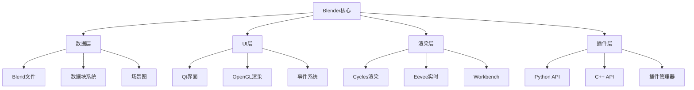

# Blender UI技术深度分析

[返回2.技术栈与框架](2.技术栈与框架/README.md) | [返回Refactor总览](2.技术栈与框架/../README.md)

---

## 2024前沿趋势

- **Blender 4.0+**：Python 3.12、GPU渲染优化、实时渲染、AI辅助建模
- **Blender UI框架**：Qt6集成、自定义界面、插件开发、Web UI集成
- **Blender Web技术**：WebAssembly、WebGL、Three.js集成、在线协作
- **Blender AI集成**：AI辅助建模、智能材质、自动UV展开、智能动画
- **Blender云服务**：Blender Cloud、在线渲染、协作编辑、版本控制
- **Blender移动端**：移动端查看器、AR预览、云端渲染、移动建模

---

## 目录

- [Blender UI技术深度分析](#blender-ui技术深度分析)
  - [2024前沿趋势](#2024前沿趋势)
  - [目录](#目录)
  - [1. Blender核心架构](#1-blender核心架构)
    - [1.1 Blender架构概览](#11-blender架构概览)
    - [1.2 Blender数据模型](#12-blender数据模型)
      - [数据块系统](#数据块系统)
      - [场景图结构](#场景图结构)
    - [1.3 Blender UI架构](#13-blender-ui架构)
      - [Qt集成](#qt集成)
  - [2. Blender UI框架](#2-blender-ui框架)
    - [2.1 Blender原生UI](#21-blender原生ui)
      - [面板系统](#面板系统)
      - [操作器系统](#操作器系统)
    - [2.2 Blender UI组件](#22-blender-ui组件)
      - [布局组件](#布局组件)
      - [自定义控件](#自定义控件)
  - [3. Blender插件开发](#3-blender插件开发)
    - [3.1 插件架构](#31-插件架构)
      - [插件结构](#插件结构)
      - [插件注册](#插件注册)
    - [3.2 高级插件开发](#32-高级插件开发)
      - [模态操作器](#模态操作器)
      - [自定义绘制](#自定义绘制)
  - [4. Blender Web集成](#4-blender-web集成)
    - [4.1 Blender Web技术](#41-blender-web技术)
      - [WebAssembly集成](#webassembly集成)
      - [WebGL渲染](#webgl渲染)
    - [4.2 Blender Web API](#42-blender-web-api)
      - [RESTful API](#restful-api)
  - [5. Blender AI技术](#5-blender-ai技术)
    - [5.1 AI辅助建模](#51-ai辅助建模)
      - [智能建模插件](#智能建模插件)
      - [智能材质生成](#智能材质生成)
    - [5.2 AI动画辅助](#52-ai动画辅助)
      - [智能动画生成](#智能动画生成)
  - [6. Blender云服务](#6-blender云服务)
    - [6.1 Blender Cloud架构](#61-blender-cloud架构)
      - [云渲染服务](#云渲染服务)
      - [协作编辑](#协作编辑)
  - [7. Blender移动端](#7-blender移动端)
    - [7.1 移动端查看器](#71-移动端查看器)
      - [React Native Blender Viewer](#react-native-blender-viewer)
      - [Flutter Blender Viewer](#flutter-blender-viewer)
    - [7.2 AR预览功能](#72-ar预览功能)
      - [AR Blender预览](#ar-blender预览)
  - [8. Blender性能优化](#8-blender性能优化)
    - [8.1 渲染性能优化](#81-渲染性能优化)
      - [GPU渲染优化](#gpu渲染优化)
      - [内存优化](#内存优化)
    - [8.2 实时性能优化](#82-实时性能优化)
      - [视口优化](#视口优化)
  - [9. Blender未来展望](#9-blender未来展望)
    - [9.1 技术发展趋势](#91-技术发展趋势)
      - [AI集成增强](#ai集成增强)
      - [云服务扩展](#云服务扩展)
      - [Web技术融合](#web技术融合)
    - [9.2 生态系统发展](#92-生态系统发展)
      - [插件生态](#插件生态)
      - [社区发展](#社区发展)
    - [9.3 应用场景扩展](#93-应用场景扩展)
      - [专业领域](#专业领域)
      - [新兴技术](#新兴技术)
  - [总结](#总结)
  - [相关主题推荐阅读](#相关主题推荐阅读)

---

## 1. Blender核心架构

### 1.1 Blender架构概览



### 1.2 Blender数据模型

#### 数据块系统

```python
# Blender数据块示例
import bpy

# 创建数据块
mesh = bpy.data.meshes.new("MyMesh")
obj = bpy.data.objects.new("MyObject", mesh)

# 数据块关系
print(f"Mesh: {mesh.name}")
print(f"Object: {obj.name}")
print(f"Object data: {obj.data.name}")
```

#### 场景图结构

```python
# 场景图遍历
def traverse_scene():
    for obj in bpy.context.scene.objects:
        print(f"Object: {obj.name}")
        if obj.type == 'MESH':
            mesh = obj.data
            print(f"  Vertices: {len(mesh.vertices)}")
            print(f"  Faces: {len(mesh.polygons)}")
```

### 1.3 Blender UI架构

#### Qt集成

```python
# Blender Qt集成示例
import bpy
from PyQt5 import QtWidgets

class BlenderQtWidget(QtWidgets.QWidget):
    def __init__(self):
        super().__init__()
        self.setup_ui()
    
    def setup_ui(self):
        layout = QtWidgets.QVBoxLayout()
        button = QtWidgets.QPushButton("Create Cube")
        button.clicked.connect(self.create_cube)
        layout.addWidget(button)
        self.setLayout(layout)
    
    def create_cube(self):
        bpy.ops.mesh.primitive_cube_add()
```

---

## 2. Blender UI框架

### 2.1 Blender原生UI

#### 面板系统

```python
# 自定义面板
import bpy
from bpy.types import Panel

class MY_PT_CustomPanel(Panel):
    bl_label = "Custom Panel"
    bl_idname = "MY_PT_CustomPanel"
    bl_space_type = 'VIEW_3D'
    bl_region_type = 'UI'
    bl_category = 'Custom'

    def draw(self, context):
        layout = self.layout
        layout.operator("mesh.primitive_cube_add")
        layout.prop(context.scene, "frame_current")
```

#### 操作器系统

```python
# 自定义操作器
import bpy
from bpy.types import Operator

class MESH_OT_custom_operator(Operator):
    bl_idname = "mesh.custom_operator"
    bl_label = "Custom Operator"
    bl_description = "Custom mesh operator"
    bl_options = {'REGISTER', 'UNDO'}

    def execute(self, context):
        # 执行操作
        bpy.ops.mesh.primitive_cube_add()
        return {'FINISHED'}

    def invoke(self, context, event):
        return self.execute(context)
```

### 2.2 Blender UI组件

#### 布局组件

```python
# 复杂布局示例
def draw_complex_layout(self, context):
    layout = self.layout
    
    # 行布局
    row = layout.row()
    row.prop(context.scene, "frame_current")
    row.operator("screen.frame_jump", text="", icon='REW')
    
    # 列布局
    col = layout.column()
    col.operator("mesh.primitive_cube_add")
    col.operator("mesh.primitive_uv_sphere_add")
    
    # 盒子布局
    box = layout.box()
    box.label(text="Advanced Options")
    box.prop(context.scene, "frame_current")
```

#### 自定义控件

```python
# 自定义控件
class CustomPropertyGroup(bpy.types.PropertyGroup):
    custom_float: bpy.props.FloatProperty(
        name="Custom Float",
        description="A custom float property",
        default=1.0,
        min=0.0,
        max=10.0
    )
    
    custom_enum: bpy.props.EnumProperty(
        name="Custom Enum",
        description="A custom enum property",
        items=[
            ('OPTION1', "Option 1", "First option"),
            ('OPTION2', "Option 2", "Second option"),
            ('OPTION3', "Option 3", "Third option")
        ],
        default='OPTION1'
    )
```

---

## 3. Blender插件开发

### 3.1 插件架构

#### 插件结构

```
my_blender_addon/
├── __init__.py          # 插件入口
├── operators.py         # 操作器
├── panels.py           # 面板
├── properties.py       # 属性
├── utils.py           # 工具函数
└── README.md          # 文档
```

#### 插件注册

```python
# __init__.py
bl_info = {
    "name": "My Blender Addon",
    "author": "Your Name",
    "version": (1, 0, 0),
    "blender": (3, 0, 0),
    "location": "View3D > Sidebar > My Tab",
    "description": "A custom Blender addon",
    "warning": "",
    "doc_url": "",
    "category": "Object",
}

import bpy
from . import operators, panels, properties

def register():
    properties.register()
    operators.register()
    panels.register()

def unregister():
    panels.unregister()
    operators.unregister()
    properties.unregister()

if __name__ == "__main__":
    register()
```

### 3.2 高级插件开发

#### 模态操作器

```python
# 模态操作器示例
class MESH_OT_modal_operator(Operator):
    bl_idname = "mesh.modal_operator"
    bl_label = "Modal Operator"
    
    def modal(self, context, event):
        if event.type == 'ESC':
            return {'CANCELLED'}
        
        if event.type == 'LEFTMOUSE' and event.value == 'PRESS':
            # 处理鼠标点击
            return {'FINISHED'}
        
        return {'RUNNING_MODAL'}
    
    def invoke(self, context, event):
        context.window_manager.modal_handler_add(self)
        return {'RUNNING_MODAL'}
```

#### 自定义绘制

```python
# 自定义绘制
import bpy
import bgl
import gpu
from gpu_extras.batch import batch_for_shader

class CustomDrawHandler:
    def __init__(self):
        self.draw_handler = None
    
    def draw_callback_3d(self, context):
        # 设置着色器
        shader = gpu.shader.from_builtin('3D_UNIFORM_COLOR')
        
        # 创建批处理
        vertices = ((0, 0, 0), (1, 0, 0), (0, 1, 0))
        indices = ((0, 1, 2),)
        batch = batch_for_shader(shader, 'TRIS', {"pos": vertices}, indices=indices)
        
        # 绘制
        shader.bind()
        shader.uniform_float("color", (1, 0, 0, 1))
        batch.draw(shader)
    
    def start(self, context):
        self.draw_handler = bpy.types.SpaceView3D.draw_handler_add(
            self.draw_callback_3d, (context,), 'WINDOW', 'POST_VIEW'
        )
    
    def stop(self):
        if self.draw_handler:
            bpy.types.SpaceView3D.draw_handler_remove(self.draw_handler, 'WINDOW')
```

---

## 4. Blender Web集成

### 4.1 Blender Web技术

#### WebAssembly集成

```javascript
// Blender WebAssembly集成
import { BlenderWasm } from './blender-wasm.js';

class BlenderWebUI {
    constructor() {
        this.blender = new BlenderWasm();
        this.init();
    }
    
    async init() {
        await this.blender.load();
        this.setupUI();
    }
    
    setupUI() {
        // 创建Web UI
        const container = document.getElementById('blender-container');
        this.blender.mount(container);
    }
    
    async loadFile(file) {
        const data = await file.arrayBuffer();
        await this.blender.loadBlendFile(data);
    }
}
```

#### WebGL渲染

```javascript
// Blender WebGL渲染
class BlenderWebGLRenderer {
    constructor(canvas) {
        this.canvas = canvas;
        this.gl = canvas.getContext('webgl2');
        this.initShaders();
    }
    
    initShaders() {
        // 顶点着色器
        const vertexShader = `
            attribute vec3 position;
            uniform mat4 modelViewMatrix;
            uniform mat4 projectionMatrix;
            
            void main() {
                gl_Position = projectionMatrix * modelViewMatrix * vec4(position, 1.0);
            }
        `;
        
        // 片段着色器
        const fragmentShader = `
            precision mediump float;
            uniform vec3 color;
            
            void main() {
                gl_FragColor = vec4(color, 1.0);
            }
        `;
        
        this.program = this.createProgram(vertexShader, fragmentShader);
    }
    
    render(scene) {
        // 渲染场景
        this.gl.clear(this.gl.COLOR_BUFFER_BIT | this.gl.DEPTH_BUFFER_BIT);
        // 渲染逻辑...
    }
}
```

### 4.2 Blender Web API

#### RESTful API

```python
# Blender Web API
from flask import Flask, request, jsonify
import bpy
import json

app = Flask(__name__)

@app.route('/api/scene', methods=['GET'])
def get_scene():
    scene = bpy.context.scene
    objects = []
    
    for obj in scene.objects:
        objects.append({
            'name': obj.name,
            'type': obj.type,
            'location': [obj.location.x, obj.location.y, obj.location.z]
        })
    
    return jsonify({
        'scene_name': scene.name,
        'objects': objects
    })

@app.route('/api/object/<name>', methods=['GET'])
def get_object(name):
    obj = bpy.data.objects.get(name)
    if obj:
        return jsonify({
            'name': obj.name,
            'type': obj.type,
            'location': [obj.location.x, obj.location.y, obj.location.z],
            'rotation': [obj.rotation_euler.x, obj.rotation_euler.y, obj.rotation_euler.z],
            'scale': [obj.scale.x, obj.scale.y, obj.scale.z]
        })
    else:
        return jsonify({'error': 'Object not found'}), 404

@app.route('/api/object', methods=['POST'])
def create_object():
    data = request.json
    obj_type = data.get('type', 'MESH')
    
    if obj_type == 'CUBE':
        bpy.ops.mesh.primitive_cube_add()
    elif obj_type == 'SPHERE':
        bpy.ops.mesh.primitive_uv_sphere_add()
    
    return jsonify({'status': 'success'})

if __name__ == '__main__':
    app.run(debug=True)
```

---

## 5. Blender AI技术

### 5.1 AI辅助建模

#### 智能建模插件

```python
# AI辅助建模插件
import bpy
import numpy as np
from sklearn.cluster import KMeans

class AI_MODELING_OT_smart_extrude(Operator):
    bl_idname = "ai_modeling.smart_extrude"
    bl_label = "AI Smart Extrude"
    
    def execute(self, context):
        obj = context.active_object
        if obj.type != 'MESH':
            return {'CANCELLED'}
        
        mesh = obj.data
        vertices = np.array([v.co for v in mesh.vertices])
        
        # 使用K-means聚类分析顶点
        kmeans = KMeans(n_clusters=3)
        clusters = kmeans.fit_predict(vertices)
        
        # 根据聚类结果智能挤出
        for i, cluster in enumerate(clusters):
            if cluster == 0:  # 选择特定聚类
                # 执行挤出操作
                pass
        
        return {'FINISHED'}
```

#### 智能材质生成

```python
# AI智能材质生成
import bpy
from PIL import Image
import torch
import torchvision.transforms as transforms

class AI_MATERIAL_OT_generate_material(Operator):
    bl_idname = "ai_material.generate_material"
    bl_label = "AI Generate Material"
    
    def execute(self, context):
        obj = context.active_object
        
        # 创建新材质
        material = bpy.data.materials.new(name="AI_Generated_Material")
        material.use_nodes = True
        nodes = material.node_tree.nodes
        
        # 使用AI生成纹理
        texture = self.generate_ai_texture()
        
        # 应用纹理到材质
        texture_node = nodes.new('ShaderNodeTexImage')
        texture_node.image = texture
        
        # 连接节点
        principled_bsdf = nodes.get('Principled BSDF')
        material.node_tree.links.new(
            texture_node.outputs['Color'],
            principled_bsdf.inputs['Base Color']
        )
        
        # 应用材质到对象
        if obj.data.materials:
            obj.data.materials[0] = material
        else:
            obj.data.materials.append(material)
        
        return {'FINISHED'}
    
    def generate_ai_texture(self):
        # AI纹理生成逻辑
        # 这里可以集成Stable Diffusion或其他AI模型
        pass
```

### 5.2 AI动画辅助

#### 智能动画生成

```python
# AI动画生成
import bpy
import numpy as np
from scipy.interpolate import splprep, splev

class AI_ANIMATION_OT_generate_animation(Operator):
    bl_idname = "ai_animation.generate_animation"
    bl_label = "AI Generate Animation"
    
    def execute(self, context):
        obj = context.active_object
        
        # 生成关键帧路径
        keyframes = self.generate_keyframes()
        
        # 设置动画
        obj.animation_data_create()
        action = obj.animation_data.action
        
        # 创建位置F曲线
        fcurve_x = action.fcurves.new(data_path="location", index=0)
        fcurve_y = action.fcurves.new(data_path="location", index=1)
        fcurve_z = action.fcurves.new(data_path="location", index=2)
        
        # 添加关键帧
        for frame, pos in keyframes:
            fcurve_x.keyframe_points.insert(frame, pos[0])
            fcurve_y.keyframe_points.insert(frame, pos[1])
            fcurve_z.keyframe_points.insert(frame, pos[2])
        
        return {'FINISHED'}
    
    def generate_keyframes(self):
        # AI生成关键帧逻辑
        # 可以使用机器学习模型预测动画路径
        frames = []
        for i in range(0, 100, 10):
            x = np.sin(i * 0.1) * 2
            y = np.cos(i * 0.1) * 2
            z = i * 0.1
            frames.append((i, (x, y, z)))
        return frames
```

---

## 6. Blender云服务

### 6.1 Blender Cloud架构

#### 云渲染服务

```python
# Blender云渲染API
import requests
import json

class BlenderCloudRenderer:
    def __init__(self, api_key):
        self.api_key = api_key
        self.base_url = "https://api.blender.cloud"
    
    def submit_render_job(self, blend_file, settings):
        """提交渲染任务"""
        headers = {
            'Authorization': f'Bearer {self.api_key}',
            'Content-Type': 'application/json'
        }
        
        data = {
            'blend_file': blend_file,
            'settings': settings,
            'output_format': 'PNG',
            'resolution': (1920, 1080)
        }
        
        response = requests.post(
            f"{self.base_url}/render/submit",
            headers=headers,
            json=data
        )
        
        return response.json()
    
    def get_render_status(self, job_id):
        """获取渲染状态"""
        headers = {
            'Authorization': f'Bearer {self.api_key}'
        }
        
        response = requests.get(
            f"{self.base_url}/render/status/{job_id}",
            headers=headers
        )
        
        return response.json()
    
    def download_render_result(self, job_id, output_path):
        """下载渲染结果"""
        headers = {
            'Authorization': f'Bearer {self.api_key}'
        }
        
        response = requests.get(
            f"{self.base_url}/render/download/{job_id}",
            headers=headers
        )
        
        with open(output_path, 'wb') as f:
            f.write(response.content)
```

#### 协作编辑

```python
# Blender协作编辑
import socket
import json
import threading

class BlenderCollaboration:
    def __init__(self, server_url):
        self.server_url = server_url
        self.socket = None
        self.is_connected = False
    
    def connect(self):
        """连接到协作服务器"""
        try:
            self.socket = socket.socket(socket.AF_INET, socket.SOCK_STREAM)
            self.socket.connect(('localhost', 8080))
            self.is_connected = True
            
            # 启动接收线程
            threading.Thread(target=self.receive_updates).start()
            
            return True
        except Exception as e:
            print(f"连接失败: {e}")
            return False
    
    def send_update(self, update_data):
        """发送更新"""
        if self.is_connected:
            message = json.dumps(update_data)
            self.socket.send(message.encode())
    
    def receive_updates(self):
        """接收更新"""
        while self.is_connected:
            try:
                data = self.socket.recv(1024)
                if data:
                    update = json.loads(data.decode())
                    self.apply_update(update)
            except Exception as e:
                print(f"接收更新失败: {e}")
                break
    
    def apply_update(self, update):
        """应用更新"""
        if update['type'] == 'object_transform':
            obj_name = update['object_name']
            obj = bpy.data.objects.get(obj_name)
            if obj:
                obj.location = update['location']
                obj.rotation_euler = update['rotation']
                obj.scale = update['scale']
```

---

## 7. Blender移动端

### 7.1 移动端查看器

#### React Native Blender Viewer

```javascript
// React Native Blender查看器
import React, { useEffect, useRef } from 'react';
import { View, StyleSheet } from 'react-native';
import { WebView } from 'react-native-webview';

const BlenderViewer = ({ blendFileUrl }) => {
    const webViewRef = useRef(null);
    
    const webViewContent = `
        <!DOCTYPE html>
        <html>
        <head>
            <meta name="viewport" content="width=device-width, initial-scale=1.0">
            <style>
                body { margin: 0; padding: 0; }
                #blender-container { width: 100vw; height: 100vh; }
            </style>
        </head>
        <body>
            <div id="blender-container"></div>
            <script>
                // Blender WebAssembly加载逻辑
                import('./blender-wasm.js').then(module => {
                    const BlenderWasm = module.default;
                    const blender = new BlenderWasm();
                    blender.load('${blendFileUrl}');
                });
            </script>
        </body>
        </html>
    `;
    
    return (
        <View style={styles.container}>
            <WebView
                ref={webViewRef}
                source={{ html: webViewContent }}
                style={styles.webview}
                javaScriptEnabled={true}
                domStorageEnabled={true}
            />
        </View>
    );
};

const styles = StyleSheet.create({
    container: {
        flex: 1,
    },
    webview: {
        flex: 1,
    },
});

export default BlenderViewer;
```

#### Flutter Blender Viewer

```dart
// Flutter Blender查看器
import 'package:flutter/material.dart';
import 'package:webview_flutter/webview_flutter.dart';

class BlenderViewer extends StatefulWidget {
  final String blendFileUrl;
  
  const BlenderViewer({Key? key, required this.blendFileUrl}) : super(key: key);
  
  @override
  _BlenderViewerState createState() => _BlenderViewerState();
}

class _BlenderViewerState extends State<BlenderViewer> {
  late WebViewController _controller;
  
  @override
  void initState() {
    super.initState();
    _controller = WebViewController()
      ..setJavaScriptMode(JavaScriptMode.unrestricted)
      ..loadHtmlString(_getBlenderViewerHTML());
  }
  
  String _getBlenderViewerHTML() {
    return '''
      <!DOCTYPE html>
      <html>
      <head>
        <meta name="viewport" content="width=device-width, initial-scale=1.0">
        <style>
          body { margin: 0; padding: 0; }
          #blender-container { width: 100vw; height: 100vh; }
        </style>
      </head>
      <body>
        <div id="blender-container"></div>
        <script>
          // Blender WebAssembly加载
          fetch('${widget.blendFileUrl}')
            .then(response => response.arrayBuffer())
            .then(data => {
              // 加载Blender文件
              const blender = new BlenderWasm();
              blender.loadBlendFile(data);
            });
        </script>
      </body>
      </html>
    ''';
  }
  
  @override
  Widget build(BuildContext context) {
    return Scaffold(
      appBar: AppBar(
        title: Text('Blender Viewer'),
      ),
      body: WebViewWidget(controller: _controller),
    );
  }
}
```

### 7.2 AR预览功能

#### AR Blender预览

```swift
// iOS AR Blender预览
import ARKit
import SceneKit

class ARBlenderViewController: UIViewController, ARSCNViewDelegate {
    @IBOutlet var sceneView: ARSCNView!
    
    override func viewDidLoad() {
        super.viewDidLoad()
        setupAR()
    }
    
    func setupAR() {
        sceneView.delegate = self
        sceneView.showsStatistics = true
        
        let configuration = ARWorldTrackingConfiguration()
        configuration.planeDetection = [.horizontal, .vertical]
        sceneView.session.run(configuration)
    }
    
    func renderer(_ renderer: SCNSceneRenderer, didAdd node: SCNNode, for anchor: ARAnchor) {
        guard let planeAnchor = anchor as? ARPlaneAnchor else { return }
        
        // 创建Blender模型节点
        let blenderNode = createBlenderModelNode()
        node.addChildNode(blenderNode)
    }
    
    func createBlenderModelNode() -> SCNNode {
        // 从Blender导出的模型文件加载
        guard let scene = SCNScene(named: "blender_model.scn") else {
            return SCNNode()
        }
        
        let node = SCNNode()
        for childNode in scene.rootNode.childNodes {
            node.addChildNode(childNode)
        }
        
        return node
    }
}
```

---

## 8. Blender性能优化

### 8.1 渲染性能优化

#### GPU渲染优化

```python
# GPU渲染优化
import bpy
import gpu

class BlenderGPURenderer:
    def __init__(self):
        self.device = None
        self.init_gpu()
    
    def init_gpu(self):
        """初始化GPU渲染"""
        # 检测可用GPU
        gpus = gpu.compute.get_devices()
        if gpus:
            self.device = gpus[0]
            print(f"使用GPU: {self.device.name}")
    
    def optimize_render_settings(self):
        """优化渲染设置"""
        scene = bpy.context.scene
        render = scene.render
        
        # 设置GPU渲染
        render.engine = 'CYCLES'
        scene.cycles.device = 'GPU'
        
        # 优化采样设置
        scene.cycles.samples = 128  # 减少采样数
        scene.cycles.use_denoising = True  # 启用降噪
        
        # 优化内存设置
        scene.cycles.tile_size = 256  # 优化瓦片大小
        scene.cycles.use_adaptive_sampling = True  # 自适应采样
    
    def optimize_mesh(self, obj):
        """优化网格"""
        if obj.type == 'MESH':
            mesh = obj.data
            
            # 移除重复顶点
            mesh.remove_doubles(threshold=0.001)
            
            # 重新计算法线
            mesh.calc_normals()
            
            # 优化UV坐标
            if mesh.uv_layers:
                for uv_layer in mesh.uv_layers:
                    # UV优化逻辑
                    pass
```

#### 内存优化

```python
# 内存优化
import bpy
import gc

class BlenderMemoryOptimizer:
    def __init__(self):
        self.memory_threshold = 1024 * 1024 * 1024  # 1GB
    
    def check_memory_usage(self):
        """检查内存使用"""
        import psutil
        process = psutil.Process()
        memory_usage = process.memory_info().rss
        return memory_usage
    
    def optimize_textures(self):
        """优化纹理内存"""
        for image in bpy.data.images:
            if image.size[0] > 2048 or image.size[1] > 2048:
                # 压缩大纹理
                image.scale(1024, 1024)
    
    def cleanup_unused_data(self):
        """清理未使用的数据"""
        # 清理未使用的网格
        for mesh in bpy.data.meshes:
            if mesh.users == 0:
                bpy.data.meshes.remove(mesh)
        
        # 清理未使用的材质
        for material in bpy.data.materials:
            if material.users == 0:
                bpy.data.materials.remove(material)
        
        # 清理未使用的纹理
        for texture in bpy.data.textures:
            if texture.users == 0:
                bpy.data.textures.remove(texture)
        
        # 强制垃圾回收
        gc.collect()
```

### 8.2 实时性能优化

#### 视口优化

```python
# 视口性能优化
import bpy

class ViewportOptimizer:
    def __init__(self):
        self.original_settings = {}
    
    def save_current_settings(self):
        """保存当前设置"""
        view3d = bpy.context.space_data
        self.original_settings = {
            'shading': view3d.shading.type,
            'overlays': view3d.overlay.show_overlays,
            'gizmos': view3d.show_gizmo
        }
    
    def optimize_viewport(self):
        """优化视口性能"""
        view3d = bpy.context.space_data
        
        # 切换到性能模式
        view3d.shading.type = 'WIREFRAME'
        view3d.overlay.show_overlays = False
        view3d.show_gizmo = False
        
        # 禁用不必要的显示
        for area in bpy.context.screen.areas:
            if area.type == 'VIEW_3D':
                for space in area.spaces:
                    if space.type == 'VIEW_3D':
                        space.show_region_toolbar = False
                        space.show_region_ui = False
    
    def restore_settings(self):
        """恢复原始设置"""
        view3d = bpy.context.space_data
        for key, value in self.original_settings.items():
            setattr(view3d, key, value)
```

---

## 9. Blender未来展望

### 9.1 技术发展趋势

#### AI集成增强

- **智能建模**：AI辅助几何建模、智能UV展开
- **材质生成**：AI自动生成PBR材质、智能纹理合成
- **动画辅助**：AI动作捕捉、智能动画插值
- **渲染优化**：AI降噪、智能采样、实时渲染

#### 云服务扩展

- **分布式渲染**：多GPU云渲染、实时协作
- **云端存储**：版本控制、资产管理、团队协作
- **AI云服务**：云端AI处理、智能优化建议
- **移动端集成**：移动端查看、AR预览、云端同步

#### Web技术融合

- **WebAssembly**：浏览器端Blender、在线编辑
- **WebGL渲染**：实时Web渲染、跨平台兼容
- **Web API集成**：RESTful API、实时通信
- **PWA支持**：离线编辑、推送通知

### 9.2 生态系统发展

#### 插件生态

- **AI插件**：机器学习集成、智能工具
- **行业插件**：建筑、游戏、影视专业工具
- **协作插件**：版本控制、团队协作
- **自动化插件**：批量处理、工作流自动化

#### 社区发展

- **开源贡献**：社区驱动开发、插件生态
- **教育培训**：在线课程、认证体系
- **行业应用**：专业领域定制、企业解决方案
- **国际化**：多语言支持、本地化适配

### 9.3 应用场景扩展

#### 专业领域

- **建筑设计**：BIM集成、参数化建模
- **游戏开发**：实时渲染、资产制作
- **影视制作**：特效制作、动画制作
- **工业设计**：CAD集成、3D打印

#### 新兴技术

- **VR/AR**：虚拟现实、增强现实应用
- **元宇宙**：虚拟世界构建、数字孪生
- **区块链**：NFT资产、去中心化创作
- **IoT集成**：传感器数据可视化、实时监控

---

## 总结

Blender作为开源3D创作软件，在UI技术方面展现出强大的创新能力和扩展性。从传统的桌面应用到现代的Web集成、移动端支持、AI辅助，Blender正在向全平台、智能化、协作化的方向发展。

**关键技术特点**：

1. **模块化架构**：插件系统、自定义UI、扩展性强
2. **跨平台支持**：桌面、Web、移动端全覆盖
3. **AI集成**：智能建模、材质生成、动画辅助
4. **云服务**：分布式渲染、协作编辑、资产管理
5. **性能优化**：GPU渲染、内存管理、实时性能

**未来发展方向**：

1. **AI驱动**：全流程AI辅助、智能创作工具
2. **云端协作**：实时协作、分布式工作流
3. **移动端**：移动建模、AR预览、云端同步
4. **Web集成**：浏览器端编辑、跨平台兼容
5. **行业应用**：专业领域定制、企业解决方案

Blender将继续在开源3D创作领域发挥重要作用，推动数字内容创作的民主化和普及化。

---

## 相关主题推荐阅读

- [UI技术栈与框架全面分析](2.技术栈与框架/UI技术栈与框架全面分析.md)
- [2.1 前端主流框架](2.技术栈与框架/2.1 前端主流框架.md)
- [2.2 跨端框架](2.技术栈与框架/2.2 跨端框架.md)
- [2.5 WebAssembly](2.技术栈与框架/2.5 WebAssembly.md)
- [5.1 UI-UE-UX设计规范](5.技术规范与标准/5.1 UI-UE-UX设计规范.md)
- [6.4 AI工程实践与伦理](6.人工智能原理与算法/6.4 AI工程实践与伦理.md)
