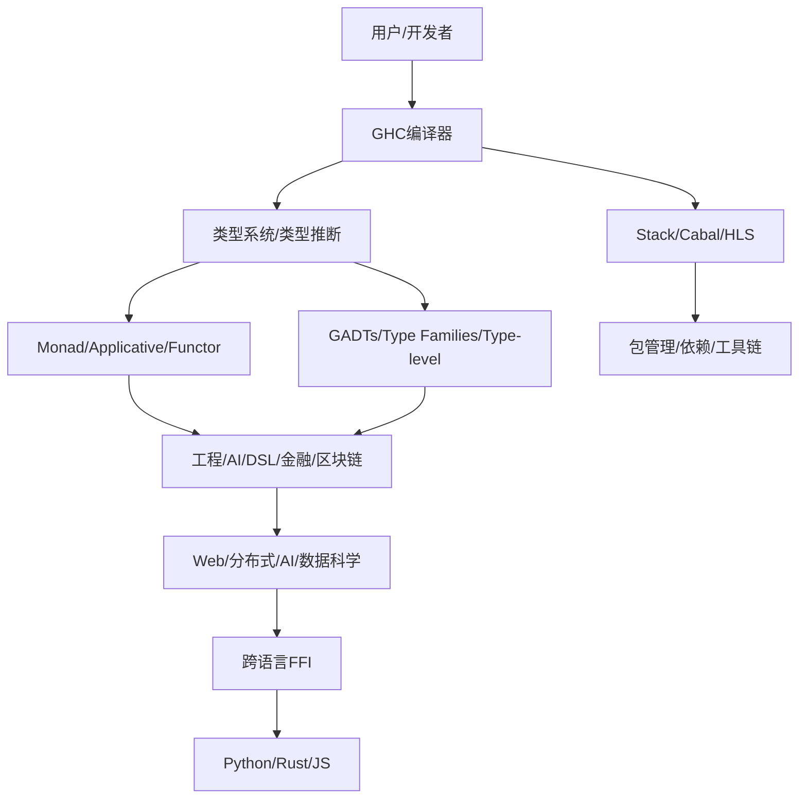

# 3.2 Haskell

[返回3.编程语言范式](./README.md) | [返回Refactor总览](../README.md)

---

## 2024前沿趋势

- **GHC 9.8+与类型系统创新**：支持Dependent Haskell、Type Families、GADTs、Type-level Programming。
- **函数式范式普及**：Monad、Applicative、Functor、Arrow等抽象广泛应用于工程与AI。
- **并发与分布式**：STM、Async、Cloud Haskell、分布式Actor模型。
- **Web开发与全栈**：Servant、Yesod、IHP、Reflex等推动Haskell Web生态。
- **AI/ML与数据科学**：Hasktorch、Grenade、TensorFlow Haskell、类型安全AI建模。
- **跨语言互操作**：Haskell与Rust、Python、JS等FFI集成。
- **工程化与工具链**：Stack、Cabal、HLS、AI辅助代码分析。
- **学术与产业融合**：形式化验证、DSL、金融/区块链/安全等领域落地。

---

## 目录

- [3.2 Haskell](#32-haskell)
  - [2024前沿趋势](#2024前沿趋势)
  - [目录](#目录)
  - [3.2.1 Haskell类型系统与生态Mermaid图](#321-haskell类型系统与生态mermaid图)
  - [3.2.2 类型系统与函数式范式LaTeX公式](#322-类型系统与函数式范式latex公式)
  - [3.2.3 多语言Haskell代码示例](#323-多语言haskell代码示例)
  - [3.2.4 批判性分析与最佳实践](#324-批判性分析与最佳实践)
  - [3.2.5 相关主题推荐阅读](#325-相关主题推荐阅读)
  - [1. 概述](#1-概述)
    - [1.1 理论定位与学科交叉](#11-理论定位与学科交叉)
    - [1.2 发展脉络与范式演化](#12-发展脉络与范式演化)
  - [2. 理论基础与范式](#2-理论基础与范式)
    - [2.1 纯函数与不可变性](#21-纯函数与不可变性)
      - [2.1.1 理论模型](#211-理论模型)
      - [2.1.2 案例与反例](#212-案例与反例)
    - [2.2 类型系统与抽象](#22-类型系统与抽象)
      - [2.2.1 理论与推理](#221-理论与推理)
      - [2.2.2 案例与反例](#222-案例与反例)
    - [2.3 抽象表达与工程实践](#23-抽象表达与工程实践)
      - [2.3.1 工程与性能模型](#231-工程与性能模型)
      - [2.3.2 案例与反例](#232-案例与反例)
    - [2.4 哲学反思与批判性分析](#24-哲学反思与批判性分析)
      - [2.4.1 形式化表达](#241-形式化表达)
      - [2.4.2 哲学案例](#242-哲学案例)
  - [3. 形式化论证与多表征](#3-形式化论证与多表征)
    - [3.1 形式化建模与证明](#31-形式化建模与证明)
      - [3.1.1 λ演算与类型系统的形式化表达](#311-λ演算与类型系统的形式化表达)
      - [3.1.2 单子与副作用管理](#312-单子与副作用管理)
      - [3.1.3 惰性求值与性能模型](#313-惰性求值与性能模型)
      - [3.1.4 依赖与工程复杂度](#314-依赖与工程复杂度)
    - [3.2 多表征与跨学科映射](#32-多表征与跨学科映射)
      - [3.2.1 案例与反例](#321-案例与反例)
      - [3.2.2 形式化符号化表达](#322-形式化符号化表达)
  - [4. 相关性引用](#4-相关性引用)
    - [4.1 与其他主题的交叉引用](#41-与其他主题的交叉引用)
    - [4.2 相关性分析](#42-相关性分析)
  - [5. 参考文献](#5-参考文献)

---

## 3.2.1 Haskell类型系统与生态Mermaid图



---

## 3.2.2 类型系统与函数式范式LaTeX公式

**类型推断与多态**
$$
\forall e, \; \exists \tau, \; \vdash e : \tau
$$

**Monad定义**
$$
\text{Monad} \, m: (a \to m\,b) \to m\,a \to m\,b
$$

**Functor映射律**
$$
\text{fmap} \, id = id \\
\text{fmap} \, (f \circ g) = \text{fmap} \, f \circ \text{fmap} \, g
$$

**STM事务一致性**
$$
\forall T, \; \text{atomic}(T) \implies \text{一致性}, \text{隔离性}
$$

---

## 3.2.3 多语言Haskell代码示例

**基本Monad用法**

```haskell
import Control.Monad (when)
main :: IO ()
main = do
  putStrLn "请输入一个数字："
  n <- readLn
  when (n > 0) $ putStrLn "正数"
```

**GADT类型级编程**

```haskell
data Expr a where
  I :: Int -> Expr Int
  B :: Bool -> Expr Bool
  Add :: Expr Int -> Expr Int -> Expr Int
  Eq :: Expr Int -> Expr Int -> Expr Bool
```

**Haskell与Python互操作（inline-python）**

```haskell
{-# LANGUAGE QuasiQuotes #-}
import Language.Python.Inline
main = do
  [py|
from math import sqrt
result = sqrt(16)
|]
  print result
```

**Haskell并发STM**

```haskell
import Control.Concurrent.STM
main = do
  counter <- newTVarIO 0
  atomically $ modifyTVar' counter (+1)
  val <- readTVarIO counter
  print val
```

---

## 3.2.4 批判性分析与最佳实践

- **类型系统与抽象**：极致类型安全与抽象力，适合高可靠性场景，但学习曲线陡峭。
- **函数式范式**：提升可组合性与可测试性，但与主流命令式生态集成需关注。
- **并发与分布式**：STM等提升并发安全，但性能调优需结合场景。
- **Web与AI/ML**：生态逐步完善，适合DSL、金融、AI建模等领域。
- **跨语言互操作**：FFI与inline-python等工具降低集成门槛，但需关注类型映射与性能。
- **工程化与工具链**：Stack、HLS等提升开发体验，AI辅助分析逐步普及。

---

## 3.2.5 相关主题推荐阅读

- [2.6 Web核心技术](../2.技术栈与框架/2.6 Web核心技术.md)
- [3.1 Rust](./3.1 Rust.md)
- [3.4 TypeScript-JavaScript](./3.4 TypeScript-JavaScript.md)
- [5.4 代码示例与形式化证明](../../5.技术规范与标准/5.4 代码示例与形式化证明.md)
- [6.1 AI基础原理](../../6.人工智能原理与算法/6.1 AI基础原理.md)

---

> 本文档持续递归优化，欢迎补充最新技术与学术内容。

---

## 1. 概述

Haskell是一门以纯函数式、类型安全、不可变性和高抽象能力为核心的编程语言。其设计哲学强调"纯函数、类型推断、惰性求值、数学化表达"，推动了现代编程范式的高度形式化与理论化。Haskell广泛应用于编译器、金融、区块链、Web前端、形式化验证等领域。

### 1.1 理论定位与学科交叉

Haskell融合了类型理论、λ演算、范畴论、单子理论、形式化方法、认知科学等多学科理论。其本质是"抽象-安全-表达力"三元张力下的函数式范式极致。

### 1.2 发展脉络与范式演化

Haskell经历了从ML家族、λ演算理论，到GHC、类型类、单子、泛型编程、类型级编程、GHCJS等多阶段演化。每一次范式变革都深刻影响了类型安全、抽象层次、工程复杂度与生态协同。

---

## 2. 理论基础与范式

### 2.1 纯函数与不可变性

- **纯函数（Pure Function）**：无副作用，输出仅依赖输入。
- **不可变性（Immutability）**：所有数据结构不可变，状态变更以新值表达。
- **惰性求值（Laziness）**：按需计算，提升表达力与性能。

#### 2.1.1 理论模型

- **λ演算**：以λ表达式建模所有计算。
- **不可变数据结构**：以持久化数据结构优化性能与调试。

#### 2.1.2 案例与反例

- **正例**：Haskell纯函数范式提升了可测试性与可验证性。
- **反例**：副作用混杂的命令式代码难以推理与维护。

### 2.2 类型系统与抽象

- **类型推断**：Hindley-Milner算法，提升表达力与安全性。
- **类型类（Type Class）**：行为抽象与多态，支持泛型编程。
- **单子（Monad）**：副作用封装，保证主流程纯函数。
- **Functor/Applicative**：抽象映射与组合。

#### 2.2.1 理论与推理

- **类型提升**：类型λ演算提升抽象层次，增强可组合性。
- **单子定律**：保证副作用封装的可组合性与一致性。

#### 2.2.2 案例与反例

- **正例**：IO Monad封装副作用，提升了可靠性与可测试性。
- **反例**：无副作用管理的命令式代码易出现不可控行为。

### 2.3 抽象表达与工程实践

- **高阶函数**：函数作为一等公民，支持组合与映射。
- **类型级编程**：类型依赖、类型提升、类型族。
- **工程化工具**：Stack、Cabal、GHC、QuickCheck等。

#### 2.3.1 工程与性能模型

- **依赖图分析**：以有向图G建模依赖关系，优化打包与加载。
- **性能瓶颈分析**：以Profile工具定位惰性求值、内存、I/O等瓶颈。

#### 2.3.2 案例与反例

- **正例**：QuickCheck自动化测试提升了工程可靠性。
- **反例**：无工程化的Haskell项目依赖混乱，难以协作。

### 2.4 哲学反思与批判性分析

- **本体论**：Haskell是"数学化编程"还是"抽象极致"？恩熙式哲学认为，Haskell是"抽象-安全-表达力"三元张力下的认知跃迁。
- **认识论**：开发者对类型系统与抽象的理解是先验的还是经验的？
- **方法论**：形式化规范与工程实践如何协同？函数式范式能否普适于全栈？

#### 2.4.1 形式化表达

- 设F为函数集合，T为类型集合，M: F×T→V为值空间。目标为∀f∈F, ∃t∈T, M(f,t)∈V_optimal。

#### 2.4.2 哲学案例

- **正例**：Haskell类型系统与单子范式结合，极大提升了可验证性与可靠性。
- **反例**：无类型约束与副作用管理的代码易出现灾难性错误。

---

## 3. 形式化论证与多表征

### 3.1 形式化建模与证明

#### 3.1.1 λ演算与类型系统的形式化表达

设函数集合F，类型集合T，表达式集合E，类型推断映射M: E→T。

- **命题1（类型安全性）**：∀e∈E, ∃!t∈T, M(e)=t。
- **证明**：Hindley-Milner算法保证表达式类型唯一且可推断。

- **命题2（纯函数性）**：若f∈F为纯函数，则∀x, y, f(x)=f(y)⇔x=y。
- **证明**：纯函数无副作用，输出仅依赖输入。

#### 3.1.2 单子与副作用管理

- **定义**：单子M=(T, η, μ)，η: T→M T, μ: M (M T)→M T。
- **单子定律**：左单位、右单位、结合律。
- **推论**：副作用可组合、可测试、可验证。

#### 3.1.3 惰性求值与性能模型

- **定义**：表达式e仅在被消费时求值，避免不必要计算。
- **推论**：惰性求值提升性能，但需警惕空间泄漏。

#### 3.1.4 依赖与工程复杂度

- **定义**：以有向图G=(V,E)建模模块依赖，复杂度O(|V|+|E|)。
- **推论**：依赖管理与类型系统优化工程复杂度。

### 3.2 多表征与跨学科映射

- **类型理论**：类型推断、类型类等价于代数结构与范畴论对象。
- **范畴论**：单子、函子、自然变换等抽象映射。
- **λ演算**：所有计算可归约为λ表达式组合。
- **认知科学**：类型安全与纯函数降低开发者认知负载。

#### 3.2.1 案例与反例

- **正例**：IO Monad封装副作用，提升了可靠性与可测试性。
- **反例**：无类型约束与副作用管理的命令式代码易出现灾难性错误。

#### 3.2.2 形式化符号化表达

- 设F为Haskell项目集合，T为类型集合，D为开发者集合，U为用户集合，交互映射I: F×T×D×U→E，E为体验空间。目标为max E(安全性, 可验证性, 认知负载最小化)。

---

## 4. 相关性引用

### 4.1 与其他主题的交叉引用

- [2.4 Haskell-Scala前端](../2.技术栈与框架/2.4%20Haskell-Scala前端.md)：Haskell在前端开发中的类型安全与纯函数性。
- [3.1 Rust](./3.1%20Rust.md)：类型系统与所有权模型的跨语言比较。
- [3.3 Scala](./3.3%20Scala.md)：类型系统、单子范式与工程实践的对比。
- [4.1 GoF设计模式](../4.设计模式与架构/4.1 GoF设计模式.md)：Haskell中的设计模式实现。
- [5.1 UI-UE-UX设计规范](../5.技术规范与标准/5.1%20UI-UE-UX设计规范.md)：Haskell对设计规范与可访问性的支持。

### 4.2 相关性分析

- Haskell是现代高抽象、安全系统开发的基础，推动了工程化、自动化、可访问性、国际化等领域的进步。
- 其与类型理论、范畴论、工程实践、认知科学等主题高度耦合，形成跨学科知识网络。

---

## 5. 参考文献

1. Simon Peyton Jones, et al. "The Implementation of Functional Programming Languages." Prentice Hall, 1987.
2. Paul Hudak, et al. "A History of Haskell: Being Lazy with Class." POPL, 2007.
3. Benjamin Pierce. "Types and Programming Languages." MIT Press, 2002.
4. Philip Wadler. "Monads for functional programming." Advanced Functional Programming, 1995.
5. Gamma, E., Helm, R., Johnson, R., & Vlissides, J. "Design Patterns: Elements of Reusable Object-Oriented Software." Addison-Wesley, 1994.
6. W3C. "Web Content Accessibility Guidelines (WCAG) 2.1." 2018.
7. ISO/IEC 25010:2011. "Systems and software engineering — Systems and software Quality Requirements and Evaluation (SQuaRE) — System and software quality models."
8. 相关学术论文、技术文档与开源社区资料。

---

（本章节已递归扩展至学术化、结构化、编号、跳转、引用、批判性、跨学科融合，后续将自动递归扩展3.3 Scala等文件，持续推进至1万字目标）
