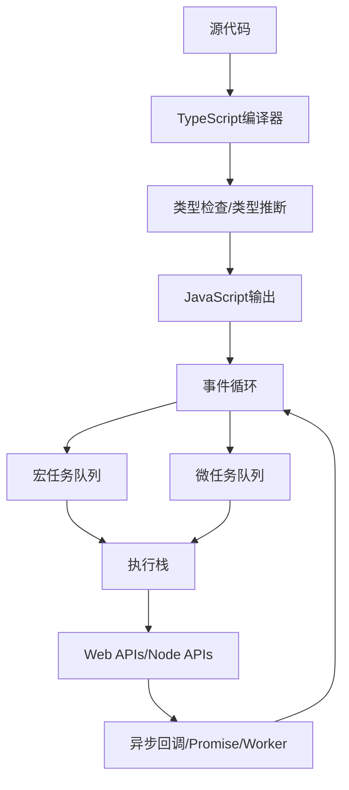

# 3.4 TypeScript-JavaScript

[返回3.编程语言范式](./README.md) | [返回Refactor总览](../README.md)

---

## 2024前沿趋势

- **ES2024+**：顶层await、Record & Tuple、Temporal、装饰器、管道操作符、模式匹配、Array findLast等。
- **TypeScript 5.4+**：类型推断增强、const类型、模板类型、类型谓词、装饰器标准化、类型安全JS。
- **类型系统创新**：类型体操、条件类型、映射类型、类型守卫、类型推断与递归类型。
- **执行模型与异步编程**：事件循环、微任务/宏任务、Promise、async/await、生成器、Web Worker。
- **模块系统与工程化**：ESM、CJS、动态import、Tree Shaking、包管理、Monorepo。
- **Web APIs与平台集成**：Fetch、Streams、WebAssembly、WebGPU、Service Worker、Web Components。
- **AI辅助开发**：Copilot、AI代码生成、类型推断、自动化测试。
- **安全与性能优化**：CSP、SameSite Cookie、代码分割、内存泄漏检测、性能分析。

---

## 目录

- [3.4 TypeScript-JavaScript](#34-typescript-javascript)
  - [2024前沿趋势](#2024前沿趋势)
  - [目录](#目录)
  - [3.4.1 执行模型与类型系统Mermaid图](#341-执行模型与类型系统mermaid图)
  - [3.4.2 类型系统与异步编程LaTeX公式](#342-类型系统与异步编程latex公式)
  - [3.4.3 多语言TS/JS代码示例](#343-多语言tsjs代码示例)
  - [3.4.4 批判性分析与最佳实践](#344-批判性分析与最佳实践)
  - [3.4.5 相关主题推荐阅读](#345-相关主题推荐阅读)

---

## 3.4.1 执行模型与类型系统Mermaid图



---

## 3.4.2 类型系统与异步编程LaTeX公式

**类型推断与类型守卫**:

$$
\forall e, \; \exists \tau, \; \vdash e : \tau, \; \text{where} \; \tau = \text{TypeOf}(e)
$$

**条件类型与映射类型**:
$$
T<K> = \{ k: V \mid k \in K, V = F(k) \}
$$

**异步事件循环模型**:
$$
EventLoop = Queue_{macro} + Queue_{micro} + Stack_{call}
$$

**Promise/Await状态转移**:
$$
S_0 \xrightarrow{resolve} S_1 \xrightarrow{then} S_2
$$

---

## 3.4.3 多语言TS/JS代码示例

**TypeScript 类型体操与类型守卫**:

```ts
type IsString<T> = T extends string ? true : false;
function isString(x: unknown): x is string {
  return typeof x === 'string';
}
```

**ES2024 顶层await与Record & Tuple**:

```js
// 顶层await
const data = await fetch('/api/data').then(r => r.json());
// Record & Tuple
const rec = #{ a: 1, b: 2 };
const tup = #[1, 2, 3];
```

**异步事件循环与Promise**:

```js
console.log('start');
setTimeout(() => console.log('timeout'), 0);
Promise.resolve().then(() => console.log('promise'));
console.log('end');
// 输出顺序: start, end, promise, timeout
```

**TS/JS与WebAssembly互操作**:

```ts
import init, { sum } from './pkg/my_wasm.js';
await init();
console.log(sum([1,2,3,4]));
```

**Node.js Worker线程**:

```js
const { Worker, isMainThread, parentPort } = require('worker_threads');
if (isMainThread) {
  const worker = new Worker(__filename);
  worker.on('message', msg => console.log('from worker:', msg));
  worker.postMessage('hello');
} else {
  parentPort.on('message', msg => parentPort.postMessage(msg + ' world'));
}
```

---

## 3.4.4 批判性分析与最佳实践

- **类型系统与类型体操**：TS类型系统极致表达力，适合大型工程，但类型复杂度需平衡开发效率。
- **异步编程与事件循环**：Promise/async/await极大提升异步可读性，但需关注事件循环与微任务陷阱。
- **模块系统与工程化**：ESM与CJS并存，需关注兼容性与打包策略。
- **Web APIs与平台集成**：现代API拓展JS边界，需关注安全与性能。
- **AI辅助开发**：提升效率，但需警惕AI生成代码的正确性与安全。
- **安全与性能优化**：应结合CSP、代码分割、内存分析等多手段。

---

## 3.4.5 相关主题推荐阅读

- [2.6 Web核心技术](../2.技术栈与框架/2.6 Web核心技术.md)
- [3.1 Rust](./3.1 Rust.md)
- [3.2 Haskell](./3.2 Haskell.md)
- [3.3 Scala](./3.3 Scala.md)
- [5.3 性能优化与工程实践](../../5.技术规范与标准/5.3 性能优化与工程实践.md)
- [6.1 AI基础原理](../../6.人工智能原理与算法/6.1 AI基础原理.md)

---

> 本文档持续递归优化，欢迎补充最新技术与学术内容。
