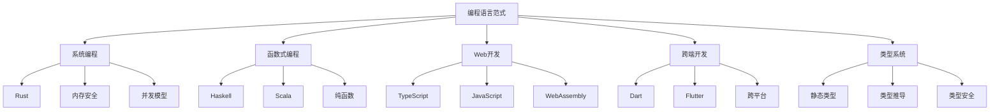

3.编程语言范式

目录
- [Web开发路径](#web开发路径)
- [系统编程路径](#系统编程路径)
- [函数式编程路径](#函数式编程路径)
- [跨端开发路径](#跨端开发路径)
- [Rust相关](#rust相关)
- [函数式编程相关](#函数式编程相关)
- [Web开发相关](#web开发相关)
- [跨端开发相关](#跨端开发相关)
- [类型系统](#类型系统)
- [内存管理](#内存管理)
- [并发模型](#并发模型)
- [生态系统](#生态系统)
- [架构模式与语言特性](#架构模式与语言特性)
- [架构模式与语言范式映射](#架构模式与语言范式映射)
- [前端设计师视角：设计系统与语言范式融合](#前端设计师视角：设计系统与语言范式融合)
- [前端架构师视角：架构模式与语言范式技术实现](#前端架构师视角：架构模式与语言范式技术实现)
- [交互架构师视角：交互设计与语言范式结合](#交互架构师视角：交互设计与语言范式结合)

[返回Refactor总览](./3.编程语言范式/../README.md)

> 本文档为"3.编程语言范式"主题索引，所有内容均严格编号、树形结构、支持本地跳转。请遵循本地引用规范：
>
> - 主题编号与文件名一致，便于递归扩展
> - 所有子主题均以"3.x"编号，支持锚点跳转
> - 返回上级目录请使用相对路径

# 2024语言趋势

- **Rust生态**：异步运行时、WASM优化、跨平台编译、安全性增强
- **函数式编程**：Haskell GHC 9.8、Scala 3.x、纯函数优化、类型推导
- **TypeScript**：类型系统增强、装饰器、模式匹配、运行时优化
- **Dart & Flutter**：性能优化、跨平台增强、原生集成、开发体验
- **WebAssembly**：WASI、组件模型、GC提案、线程支持、安全沙箱
- **编译优化**：增量编译、并行编译、AOT优化、JIT性能、热重载
- **工具链**：LSP增强、调试工具、性能分析、代码生成、类型检查

# 知识图谱



# 目录结构

3.1 [Rust](./3.编程语言范式/3.1 Rust.md)
- 所有权系统
- 并发安全
- 零成本抽象
- WASM优化

3.2 [Haskell](./3.编程语言范式/3.2 Haskell.md)
- 类型系统
- 函数组合
- 范畴论
- 形式验证

3.3 [Scala](./3.编程语言范式/3.3 Scala.md)
- 函数式特性
- 类型系统
- 并发模型
- JVM优化

3.4 [TypeScript-JavaScript](./3.编程语言范式/3.4 TypeScript-JavaScript.md)
- 类型系统
- 异步编程
- 装饰器
- 工程实践

3.5 [Dart-Flutter](./3.编程语言范式/3.5 Dart-Flutter.md)
- 语言特性
- UI框架
- 跨平台
- 性能优化

# 范式对比

```mermaid
graph TD
    A[编程范式] --> B[命令式]
    A --> C[声明式]
    A --> D[函数式]

    B --> B1[过程式]
    B --> B2[面向对象]

    C --> C1[SQL]
    C --> C2[HTML]

    D --> D1[纯函数]
    D --> D2[不可变性]
    D --> D3[高阶函数]

    B1 --> E1[JavaScript]
    B2 --> E2[Dart]
    D1 --> E3[Haskell]
    D2 --> E4[Rust]
```yaml

# 学习路径建议

# Web开发路径

1. [TypeScript-JavaScript](./3.编程语言范式/3.4 TypeScript-JavaScript.md)
2. [Web核心技术](./3.编程语言范式/../2.技术栈与框架/2.6 Web核心技术.md)
3. [现代前端工程化](./3.编程语言范式/../2.技术栈与框架/2.7 现代前端工程化.md)

# 系统编程路径

1. [Rust](./3.编程语言范式/3.1 Rust.md)
2. [Rust前端全栈](./3.编程语言范式/../2.技术栈与框架/2.3 Rust前端全栈.md)
3. [WebAssembly](./3.编程语言范式/../2.技术栈与框架/2.5 WebAssembly.md)

# 函数式编程路径

1. [Haskell](./3.编程语言范式/3.2 Haskell.md)
2. [Scala](./3.编程语言范式/3.3 Scala.md)
3. [Haskell-Scala前端](./3.编程语言范式/../2.技术栈与框架/2.4 Haskell-Scala前端.md)

# 跨端开发路径

1. [Dart-Flutter](./3.编程语言范式/3.5 Dart-Flutter.md)
2. [跨端框架](./3.编程语言范式/../2.技术栈与框架/2.2 跨端框架.md)
3. [移动端](./3.编程语言范式/../1.终端类型/1.2 移动端.md)

# 主题关联

# Rust相关

- [Rust](./3.编程语言范式/3.1 Rust.md)
- [Rust前端全栈](./3.编程语言范式/../2.技术栈与框架/2.3 Rust前端全栈.md)
- [WebAssembly](./3.编程语言范式/../2.技术栈与框架/2.5 WebAssembly.md)
- [性能优化与工程实践](./3.编程语言范式/../5.技术规范与标准/5.3 性能优化与工程实践.md)

# 函数式编程相关

- [Haskell](./3.编程语言范式/3.2 Haskell.md)
- [Scala](./3.编程语言范式/3.3 Scala.md)
- [Haskell-Scala前端](./3.编程语言范式/../2.技术栈与框架/2.4 Haskell-Scala前端.md)
- [形式化证明](./3.编程语言范式/../5.技术规范与标准/5.4 代码示例与形式化证明.md)

# Web开发相关

- [TypeScript-JavaScript](./3.编程语言范式/3.4 TypeScript-JavaScript.md)
- [Web核心技术](./3.编程语言范式/../2.技术栈与框架/2.6 Web核心技术.md)
- [前端主流框架](./3.编程语言范式/../2.技术栈与框架/2.1 前端主流框架.md)
- [现代前端工程化](./3.编程语言范式/../2.技术栈与框架/2.7 现代前端工程化.md)

# 跨端开发相关

- [Dart-Flutter](./3.编程语言范式/3.5 Dart-Flutter.md)
- [跨端框架](./3.编程语言范式/../2.技术栈与框架/2.2 跨端框架.md)
- [移动端](./3.编程语言范式/../1.终端类型/1.2 移动端.md)
- [桌面端](./3.编程语言范式/../1.终端类型/1.3 桌面端.md)

# 语言特性对比

# 类型系统

- **Rust**: 静态类型、所有权、生命周期
- **Haskell**: 强类型、类型推导、高级类型系统
- **TypeScript**: 渐进式类型、结构类型、类型推导
- **Dart**: 健全类型、空安全、泛型

# 内存管理

- **Rust**: 所有权系统、无GC、RAII
- **Haskell**: GC、不可变数据
- **JavaScript**: GC、引用计数
- **Dart**: GC、分代收集

# 并发模型

- **Rust**: async/await、线程安全、零成本抽象
- **Haskell**: STM、轻量级线程、并行计算
- **JavaScript**: 事件循环、Promise、Worker
- **Dart**: isolate、async/await、Stream

# 生态系统

- **Rust**: Cargo、crates.io、工具链
- **Haskell**: Cabal、Hackage、GHC
- **TypeScript**: npm、工具链、IDE支持
- **Dart**: pub.dev、Flutter、DevTools

# UI通用架构模型在编程语言范式中的应用

# 架构模式与语言特性

**Rust系统编程架构**
- 所有权系统：内存安全，无数据竞争
- 零成本抽象：高性能架构实现
- 类型安全：编译时错误检测

**函数式编程架构**
- 纯函数：无副作用，可预测性
- 不可变性：状态管理一致性
- 高阶函数：抽象层次提升

**TypeScript类型系统架构**
- 渐进式类型：灵活性与安全性平衡
- 结构类型：接口定义，契约编程
- 类型推导：开发体验优化

**Dart跨平台架构**
- 健全类型：空安全，类型安全
- 异步编程：并发处理能力
- 跨平台：统一开发体验

# 架构模式与语言范式映射

**MVC模式实现**
- Rust：所有权分离，生命周期管理
- Haskell：纯函数Model，类型安全View
- TypeScript：接口定义，类型约束
- Dart：类层次结构，异步处理

**MVVM模式实现**
- Rust：响应式系统，状态管理
- Haskell：FRP范式，信号驱动
- TypeScript：装饰器，响应式绑定
- Dart：Stream，响应式UI

**Flux/Redux模式实现**
- Rust：不可变状态，消息传递
- Haskell：单子，状态封装
- TypeScript：类型安全，状态管理
- Dart：Provider，状态注入

**相关技术栈**
- Rust：Yew、Leptos、Dioxus、Tauri
- Haskell：Reflex-DOM、Miso、GHCJS
- TypeScript：React、Vue、Angular、Next.js
- Dart：Flutter、Provider、Riverpod

**相关主题**
- [组件化与架构模式](./3.编程语言范式/../4.设计模式与架构/4.3 组件化与架构模式.md)
- [GoF设计模式](./3.编程语言范式/../4.设计模式与架构/4.1 GoF设计模式.md)
- [现代前端工程化](./3.编程语言范式/../2.技术栈与框架/2.7 现代前端工程化.md)
- [Web核心技术](./3.编程语言范式/../2.技术栈与框架/2.6 Web核心技术.md)

---

# 前端设计师视角：设计系统与语言范式融合

# 设计系统在不同语言范式中的实现

**TypeScript设计系统架构**：
```typescript
// TypeScript设计系统与类型安全架构
interface DesignTokens {
  colors: {
    primary: string;
    secondary: string;
    accent: string;
    semantic: {
      success: string;
      warning: string;
      error: string;
      info: string;
    };
  };
  typography: {
    fontFamily: {
      primary: string;
      secondary: string;
      monospace: string;
    };
    fontSize: Record<string, string>;
    fontWeight: Record<string, number>;
    lineHeight: Record<string, number>;
  };
  spacing: Record<string, string>;
  borderRadius: Record<string, string>;
  shadows: Record<string, string>;
  breakpoints: Record<string, number>;
}

// 类型安全的设计系统组件
interface DesignSystemComponentProps<T extends keyof DesignTokens['colors']> {
  variant: T;
  size: 'small' |  'medium'  |  'large';
  disabled?: boolean;
  children: React.ReactNode;
}

const DesignSystemButton = <T extends keyof DesignTokens['colors']>({
  variant,
  size,
  disabled,
  children
}: DesignSystemComponentProps<T>) => {
  const designTokens = useDesignTokens();
  const buttonTokens = designTokens.components.button[variant][size];

  return (
    <button
      className={`design-system-button ${variant} ${size}`}
      style={buttonTokens}
      disabled={disabled}
    >
      {children}
    </button>
  );
};
```text
**Rust设计系统架构**：
```rust
// Rust设计系统与所有权架构
#[derive(Debug, Clone, PartialEq)]
pub struct DesignTokens {
    pub colors: Colors,
    pub typography: Typography,
    pub spacing: Spacing,
    pub shadows: Shadows,
}

#[derive(Debug, Clone, PartialEq)]
pub struct Colors {
    pub primary: String,
    pub secondary: String,
    pub accent: String,
    pub semantic: SemanticColors,
}

#[derive(Debug, Clone, PartialEq)]
pub struct SemanticColors {
    pub success: String,
    pub warning: String,
    pub error: String,
    pub info: String,
}

// 设计系统管理器
pub struct DesignSystemManager {
    tokens: DesignTokens,
    theme: Theme,
}

impl DesignSystemManager {
    pub fn new(tokens: DesignTokens, theme: Theme) -> Self {
        Self { tokens, theme }
    }

    pub fn get_token(&self, path: &str) -> Option<String> {
        // 根据路径获取设计Token
        self.resolve_token_path(path)
    }

    pub fn update_theme(&mut self, theme: Theme) {
        self.theme = theme;
        self.notify_theme_change();
    }

    fn resolve_token_path(&self, path: &str) -> Option<String> {
        // 实现Token路径解析逻辑
        None
    }

    fn notify_theme_change(&self) {
        // 通知主题变更
    }
}

// 设计系统组件
pub struct DesignSystemButton {
    variant: ButtonVariant,
    size: ButtonSize,
    disabled: bool,
    tokens: DesignTokens,
}

impl DesignSystemButton {
    pub fn new(variant: ButtonVariant, size: ButtonSize, tokens: DesignTokens) -> Self {
        Self {
            variant,
            size,
            disabled: false,
            tokens,
        }
    }

    pub fn render(&self) -> String {
        let button_tokens = self.get_button_tokens();
        format!(
            "<button class=/"design-system-button {} {}/" style=/"{}/">",
            self.variant.to_string(),
            self.size.to_string(),
            button_tokens
        )
    }

    fn get_button_tokens(&self) -> String {
        // 获取按钮样式Token
        String::new()
    }
}
```text
**Haskell函数式设计系统架构**：
```haskell
-- Haskell设计系统与函数式架构
data DesignTokens = DesignTokens
  { colors :: Colors
  , typography :: Typography
  , spacing :: Spacing
  , shadows :: Shadows
  }

data Colors = Colors
  { primary :: String
  , secondary :: String
  , accent :: String
  , semantic :: SemanticColors
  }

data SemanticColors = SemanticColors
  { success :: String
  , warning :: String
  , error :: String
  , info :: String
  }

-- 设计系统状态
data DesignSystemState = DesignSystemState
  { tokens :: DesignTokens
  , theme :: Theme
  , locale :: String
  }

-- 设计系统操作
data DesignSystemAction
  = SetTheme Theme
   | UpdateTokens DesignTokens
  |  SetLocale String

-- 设计系统Reducer
designSystemReducer :: DesignSystemState -> DesignSystemAction -> DesignSystemState
designSystemReducer state (SetTheme theme) = state { theme = theme }
designSystemReducer state (UpdateTokens tokens) = state { tokens = tokens }
designSystemReducer state (SetLocale locale) = state { locale = locale }

-- 设计系统组件
data ButtonVariant = Primary  |  Secondary  | Danger |  Success
data ButtonSize = Small  |  Medium  | Large

data DesignSystemButton = DesignSystemButton
  { variant :: ButtonVariant
  , size :: ButtonSize
  , disabled :: Bool
  , children :: String
  }

-- 按钮渲染函数
renderButton :: DesignSystemButton -> DesignTokens -> String
renderButton button tokens =
  let buttonTokens = getButtonTokens button tokens
      className = "design-system-button " ++ show (variant button) ++ " " ++ show (size button)
      style = buttonTokens
  in "<button class=/"" ++ className ++ "/" style=/"" ++ style ++ "/">" ++ children button ++ "</button>"

-- 获取按钮Token
getButtonTokens :: DesignSystemButton -> DesignTokens -> String
getButtonTokens button tokens =
  -- 实现Token获取逻辑
  ""
```text
**Dart跨平台设计系统架构**：
```dart
// Dart设计系统与跨平台架构
class DesignTokens {
  final Colors colors;
  final Typography typography;
  final Spacing spacing;
  final Shadows shadows;

  const DesignTokens({
    required this.colors,
    required this.typography,
    required this.spacing,
    required this.shadows,
  });
}

class Colors {
  final String primary;
  final String secondary;
  final String accent;
  final SemanticColors semantic;

  const Colors({
    required this.primary,
    required this.secondary,
    required this.accent,
    required this.semantic,
  });
}

class SemanticColors {
  final String success;
  final String warning;
  final String error;
  final String info;

  const SemanticColors({
    required this.success,
    required this.warning,
    required this.error,
    required this.info,
  });
}

// 设计系统管理器
class DesignSystemManager extends ChangeNotifier {
  DesignTokens _tokens;
  Theme _theme;
  String _locale;

  DesignSystemManager({
    required DesignTokens tokens,
    required Theme theme,
    required String locale,
  }) : _tokens = tokens, _theme = theme, _locale = locale;

  DesignTokens get tokens => _tokens;
  Theme get theme => _theme;
  String get locale => _locale;

  void setTheme(Theme theme) {
    _theme = theme;
    notifyListeners();
  }

  void updateTokens(DesignTokens tokens) {
    _tokens = tokens;
    notifyListeners();
  }

  void setLocale(String locale) {
    _locale = locale;
    notifyListeners();
  }

  String? getToken(String path) {
    return _resolveTokenPath(path);
  }

  String? _resolveTokenPath(String path) {
    // 实现Token路径解析逻辑
    return null;
  }
}

// 设计系统组件
class DesignSystemButton extends StatelessWidget {
  final ButtonVariant variant;
  final ButtonSize size;
  final bool disabled;
  final Widget child;

  const DesignSystemButton({
    super.key,
    required this.variant,
    required this.size,
    this.disabled = false,
    required this.child,
  });

  @override
  Widget build(BuildContext context) {
    final designSystem = Provider.of<DesignSystemManager>(context);
    final buttonTokens = _getButtonTokens(designSystem);

    return ElevatedButton(
      style: buttonTokens,
      onPressed: disabled ? null : () {},
      child: child,
    );
  }

  ButtonStyle _getButtonTokens(DesignSystemManager designSystem) {
    // 实现按钮样式Token获取逻辑
    return ElevatedButton.styleFrom();
  }
}
```text

# 前端架构师视角：架构模式与语言范式技术实现

# 微前端架构模式

**TypeScript微前端架构**：
```typescript
// TypeScript微前端架构与类型安全
interface MicroFrontendConfig {
  name: string;
  framework: 'react' |  'vue'  |  'angular'  | 'svelte';
  entry: string;
  container: string;
  activeRule: string;
  sharedDependencies?: string[];
  props?: Record<string, any>;
}

class MicroFrontendManager {
  private apps: Map<string, MicroFrontendConfig> = new Map();
  private loadedApps: Set<string> = new Set();
  private sharedModules: Map<string, any> = new Map();

  registerApp(config: MicroFrontendConfig): void {
    this.apps.set(config.name, config);
  }

  async loadApp(name: string): Promise<void> {
    const app = this.apps.get(name);
    if (!app) throw new Error(`App ${name} not found`);

    if (this.loadedApps.has(name)) return;

    // 根据框架类型加载不同的模块
    switch (app.framework) {
      case 'react':
        await this.loadReactApp(app);
        break;
      case 'vue':
        await this.loadVueApp(app);
        break;
      case 'angular':
        await this.loadAngularApp(app);
        break;
      case 'svelte':
        await this.loadSvelteApp(app);
        break;
    }

    this.loadedApps.add(name);
  }

  private async loadReactApp(app: MicroFrontendConfig): Promise<void> {
    const module = await import(app.entry);
    const mountFunction = module.default ||  module.mount;

    if (mountFunction) {
      (window as any)[`mount${app.name}`] = mountFunction;
    }
  }

  private async loadVueApp(app: MicroFrontendConfig): Promise<void> {
    const module = await import(app.entry);
    const { createApp } = await import('vue');

    const mountFunction = (container: HTMLElement, props?: any) => {
      const appInstance = createApp(module.default, props);
      appInstance.mount(container);
      return appInstance;
    };

    (window as any)[`mount${app.name}`] = mountFunction;
  }

  private async loadAngularApp(app: MicroFrontendConfig): Promise<void> {
    const module = await import(app.entry);
    const { platformBrowserDynamic } = await import('@angular/platform-browser-dynamic');

    const mountFunction = async (container: HTMLElement, props?: any) => {
      const moduleRef = await platformBrowserDynamic().bootstrapModule(module.default);
      const componentRef = moduleRef.instance;

      // 将组件挂载到指定容器
      const element = moduleRef.injector.get(componentRef.constructor);
      container.appendChild(element.nativeElement);

      return moduleRef;
    };

    (window as any)[`mount${app.name}`] = mountFunction;
  }

  private async loadSvelteApp(app: MicroFrontendConfig): Promise<void> {
    const module = await import(app.entry);

    const mountFunction = (container: HTMLElement, props?: any) => {
      const appInstance = new module.default({
        target: container,
        props
      });

      return appInstance;
    };

    (window as any)[`mount${app.name}`] = mountFunction;
  }
}
```text
**Rust微前端架构**：
```rust
// Rust微前端架构与所有权管理
use std::collections::HashMap;
use std::sync::{Arc, Mutex};
use serde::{Deserialize, Serialize};

#[derive(Debug, Clone, Serialize, Deserialize)]
pub struct MicroFrontendConfig {
    pub name: String,
    pub framework: Framework,
    pub entry: String,
    pub container: String,
    pub active_rule: String,
    pub shared_dependencies: Option<Vec<String>>,
    pub props: Option<HashMap<String, serde_json::Value>>,
}

#[derive(Debug, Clone, Serialize, Deserialize)]
pub enum Framework {
    React,
    Vue,
    Angular,
    Svelte,
}

pub struct MicroFrontendManager {
    apps: Arc<Mutex<HashMap<String, MicroFrontendConfig>>>,
    loaded_apps: Arc<Mutex<Vec<String>>>,
    shared_modules: Arc<Mutex<HashMap<String, Box<dyn std::any::Any + Send + Sync>>>>,
}

impl MicroFrontendManager {
    pub fn new() -> Self {
        Self {
            apps: Arc::new(Mutex::new(HashMap::new())),
            loaded_apps: Arc::new(Mutex::new(Vec::new())),
            shared_modules: Arc::new(Mutex::new(HashMap::new())),
        }
    }

    pub fn register_app(&self, config: MicroFrontendConfig) -> Result<(), Box<dyn std::error::Error>> {
        let mut apps = self.apps.lock().unwrap();
        apps.insert(config.name.clone(), config);
        Ok(())
    }

    pub async fn load_app(&self, name: &str) -> Result<(), Box<dyn std::error::Error>> {
        let apps = self.apps.lock().unwrap();
        let config = apps.get(name).ok_or("App not found")?;

        let mut loaded_apps = self.loaded_apps.lock().unwrap();
        if loaded_apps.contains(&name.to_string()) {
            return Ok(());
        }

        // 根据框架类型加载不同的模块
        match config.framework {
            Framework::React => self.load_react_app(config).await?,
            Framework::Vue => self.load_vue_app(config).await?,
            Framework::Angular => self.load_angular_app(config).await?,
            Framework::Svelte => self.load_svelte_app(config).await?,
        }

        loaded_apps.push(name.to_string());
        Ok(())
    }

    async fn load_react_app(&self, config: &MicroFrontendConfig) -> Result<(), Box<dyn std::error::Error>> {
        // 实现React应用加载逻辑
        Ok(())
    }

    async fn load_vue_app(&self, config: &MicroFrontendConfig) -> Result<(), Box<dyn std::error::Error>> {
        // 实现Vue应用加载逻辑
        Ok(())
    }

    async fn load_angular_app(&self, config: &MicroFrontendConfig) -> Result<(), Box<dyn std::error::Error>> {
        // 实现Angular应用加载逻辑
        Ok(())
    }

    async fn load_svelte_app(&self, config: &MicroFrontendConfig) -> Result<(), Box<dyn std::error::Error>> {
        // 实现Svelte应用加载逻辑
        Ok(())
    }
}
```text

# 服务端渲染架构

**TypeScript SSR架构**：
```typescript
// TypeScript SSR架构与类型安全
interface SSRConfig {
  framework: 'react'  |  'vue'  | 'angular' |  'svelte';
  entry: string;
  template: string;
  serverBundle: string;
  clientBundle: string;
  preloadLinks?: string[];
}

class SSRManager {
  private config: SSRConfig;

  constructor(config: SSRConfig) {
    this.config = config;
  }

  async renderToString(url: string, context: any): Promise<string> {
    switch (this.config.framework) {
      case 'react':
        return await this.renderReactApp(url, context);
      case 'vue':
        return await this.renderVueApp(url, context);
      case 'angular':
        return await this.renderAngularApp(url, context);
      case 'svelte':
        return await this.renderSvelteApp(url, context);
      default:
        throw new Error(`Unsupported framework: ${this.config.framework}`);
    }
  }

  private async renderReactApp(url: string, context: any): Promise<string> {
    const { createElement } = await import('react');
    const { renderToString } = await import('react-dom/server');
    const { createApp } = await import(this.config.serverBundle);

    const app = createApp();
    app.router.push(url);
    await app.router.isReady();

    const html = renderToString(createElement(app));
    const state = app.store?.getState();

    return this.injectStateAndLinks(html, state);
  }

  private async renderVueApp(url: string, context: any): Promise<string> {
    const { createSSRApp } = await import('vue');
    const { renderToString } = await import('vue/server-renderer');
    const { createApp } = await import(this.config.serverBundle);

    const app = createSSRApp(createApp());
    app.router.push(url);
    await app.router.isReady();

    const html = await renderToString(app);
    const state = app.config.globalProperties.$store?.state;

    return this.injectStateAndLinks(html, state);
  }

  private async renderAngularApp(url: string, context: any): Promise<string> {
    const { platformServer } = await import('@angular/platform-server');
    const { renderModule } = await import('@angular/platform-server');
    const { createApp } = await import(this.config.serverBundle);

    const app = createApp();
    app.router.navigateByUrl(url);

    const html = await renderModule(app, {
      document: context.document,
      url: url
    });

    return this.injectStateAndLinks(html, {});
  }

  private async renderSvelteApp(url: string, context: any): Promise<string> {
    const { createApp } = await import(this.config.serverBundle);
    const { render } = await import('svelte/ssr');

    const app = createApp();
    const { html, head, css } = render(app);

    return this.injectStateAndLinks(html, {});
  }

  private injectStateAndLinks(html: string, state: any): string {
    const stateScript = `<script>window.__INITIAL_STATE__=${JSON.stringify(state)}</script>`;

    return this.config.template
      .replace('<!--app-html-->', html)
      .replace('<!--state-script-->', stateScript);
  }
}
```text

# 交互架构师视角：交互设计与语言范式结合

# 交互状态管理

**TypeScript交互状态架构**：
```typescript
// TypeScript交互状态管理架构
interface InteractionState {
  loading: boolean;
  error: string  |  null;
  success: boolean;
  data: any;
  userActions: UserAction[];
  interactionHistory: InteractionEvent[];
}

interface UserAction {
  type: 'click'  | 'hover' |  'scroll'  |  'input'  | 'gesture' |  'keyboard';
  target: string;
  timestamp: number;
  metadata: Record<string, any>;
}

interface InteractionEvent {
  id: string;
  type: string;
  timestamp: number;
  duration?: number;
  data: any;
}

class InteractionStateManager {
  private state: InteractionState;
  private listeners: Set<(state: InteractionState) => void> = new Set();
  private eventQueue: InteractionEvent[] = [];
  private framework: 'react'  |  'vue'  | 'angular' |  'svelte';

  constructor(framework: 'react'  |  'vue'  | 'angular' | 'svelte') {
    this.framework = framework;
    this.state = {
      loading: false,
      error: null,
      success: false,
      data: null,
      userActions: [],
      interactionHistory: []
    };
  }

  setLoading(loading: boolean): void {
    this.updateState({ loading });
  }

  setError(error: string | null): void {
    this.updateState({ error, success: false });
  }

  setSuccess(success: boolean): void {
    this.updateState({ success, error: null });
  }

  addUserAction(action: UserAction): void {
    this.updateState({
      userActions: [...this.state.userActions, action]
    });
  }

  addInteractionEvent(event: InteractionEvent): void {
    this.eventQueue.push(event);
    this.updateState({
      interactionHistory: [...this.state.interactionHistory, event]
    });
  }

  // 框架特定的状态更新
  updateFrameworkState(partial: Partial<InteractionState>): void {
    this.updateState(partial);

    // 根据框架类型触发相应的更新
    switch (this.framework) {
      case 'react':
        this.triggerReactUpdate();
        break;
      case 'vue':
        this.triggerVueUpdate();
        break;
      case 'angular':
        this.triggerAngularUpdate();
        break;
      case 'svelte':
        this.triggerSvelteUpdate();
        break;
    }
  }

  private triggerReactUpdate(): void {
    // React状态更新逻辑
    this.notifyListeners();
  }

  private triggerVueUpdate(): void {
    // Vue响应式更新逻辑
    this.notifyListeners();
  }

  private triggerAngularUpdate(): void {
    // Angular变更检测逻辑
    this.notifyListeners();
  }

  private triggerSvelteUpdate(): void {
    // Svelte响应式更新逻辑
    this.notifyListeners();
  }

  private updateState(partial: Partial<InteractionState>): void {
    this.state = { ...this.state, ...partial };
    this.notifyListeners();
  }

  private notifyListeners(): void {
    this.listeners.forEach(listener => listener(this.state));
  }
}
```text
**Rust交互状态架构**：
```rust
// Rust交互状态管理架构与所有权
use std::collections::HashMap;
use serde::{Deserialize, Serialize};
use tokio::sync::mpsc;

#[derive(Debug, Clone, Serialize, Deserialize)]
pub struct InteractionState {
    pub loading: bool,
    pub error: Option<String>,
    pub success: bool,
    pub data: Option<serde_json::Value>,
    pub user_actions: Vec<UserAction>,
    pub interaction_history: Vec<InteractionEvent>,
}

#[derive(Debug, Clone, Serialize, Deserialize)]
pub struct UserAction {
    pub action_type: String,
    pub target: String,
    pub timestamp: u64,
    pub metadata: HashMap<String, serde_json::Value>,
}

#[derive(Debug, Clone, Serialize, Deserialize)]
pub struct InteractionEvent {
    pub id: String,
    pub event_type: String,
    pub timestamp: u64,
    pub duration: Option<u64>,
    pub data: serde_json::Value,
}

pub struct InteractionStateManager {
    state: Arc<Mutex<InteractionState>>,
    listeners: Arc<Mutex<Vec<Box<dyn Fn(InteractionState) + Send + Sync>>>>,
    event_queue: Arc<Mutex<Vec<InteractionEvent>>>,
    framework: Framework,
}

impl InteractionStateManager {
    pub fn new(framework: Framework) -> Self {
        Self {
            state: Arc::new(Mutex::new(InteractionState {
                loading: false,
                error: None,
                success: false,
                data: None,
                user_actions: Vec::new(),
                interaction_history: Vec::new(),
            })),
            listeners: Arc::new(Mutex::new(Vec::new())),
            event_queue: Arc::new(Mutex::new(Vec::new())),
            framework,
        }
    }

    pub fn set_loading(&self, loading: bool) -> Result<(), Box<dyn std::error::Error>> {
        let mut state = self.state.lock().unwrap();
        state.loading = loading;
        self.notify_listeners(state.clone())?;
        Ok(())
    }

    pub fn set_error(&self, error: Option<String>) -> Result<(), Box<dyn std::error::Error>> {
        let mut state = self.state.lock().unwrap();
        state.error = error.clone();
        state.success = false;
        self.notify_listeners(state.clone())?;
        Ok(())
    }

    pub fn set_success(&self, success: bool) -> Result<(), Box<dyn std::error::Error>> {
        let mut state = self.state.lock().unwrap();
        state.success = success;
        state.error = None;
        self.notify_listeners(state.clone())?;
        Ok(())
    }

    pub fn add_user_action(&self, action: UserAction) -> Result<(), Box<dyn std::error::Error>> {
        let mut state = self.state.lock().unwrap();
        state.user_actions.push(action);
        self.notify_listeners(state.clone())?;
        Ok(())
    }

    pub fn add_interaction_event(&self, event: InteractionEvent) -> Result<(), Box<dyn std::error::Error>> {
        let mut event_queue = self.event_queue.lock().unwrap();
        event_queue.push(event.clone());

        let mut state = self.state.lock().unwrap();
        state.interaction_history.push(event);
        self.notify_listeners(state.clone())?;
        Ok(())
    }

    // 框架特定的状态更新
    pub fn update_framework_state(&self, partial: Partial<InteractionState>) -> Result<(), Box<dyn std::error::Error>> {
        let mut state = self.state.lock().unwrap();

        // 更新部分状态
        if let Some(loading) = partial.loading {
            state.loading = loading;
        }
        if let Some(error) = partial.error {
            state.error = error;
        }
        if let Some(success) = partial.success {
            state.success = success;
        }
        if let Some(data) = partial.data {
            state.data = Some(data);
        }

        // 根据框架类型触发相应的更新
        match self.framework {
            Framework::React => self.trigger_react_update()?,
            Framework::Vue => self.trigger_vue_update()?,
            Framework::Angular => self.trigger_angular_update()?,
            Framework::Svelte => self.trigger_svelte_update()?,
        }

        self.notify_listeners(state.clone())?;
        Ok(())
    }

    fn trigger_react_update(&self) -> Result<(), Box<dyn std::error::Error>> {
        // React状态更新逻辑
        Ok(())
    }

    fn trigger_vue_update(&self) -> Result<(), Box<dyn std::error::Error>> {
        // Vue响应式更新逻辑
        Ok(())
    }

    fn trigger_angular_update(&self) -> Result<(), Box<dyn std::error::Error>> {
        // Angular变更检测逻辑
        Ok(())
    }

    fn trigger_svelte_update(&self) -> Result<(), Box<dyn std::error::Error>> {
        // Svelte响应式更新逻辑
        Ok(())
    }

    fn notify_listeners(&self, state: InteractionState) -> Result<(), Box<dyn std::error::Error>> {
        let listeners = self.listeners.lock().unwrap();
        for listener in listeners.iter() {
            listener(state.clone());
        }
        Ok(())
    }
}

#[derive(Debug, Clone)]
pub enum Framework {
    React,
    Vue,
    Angular,
    Svelte,
}

#[derive(Debug, Clone)]
pub struct Partial<T> {
    pub loading: Option<bool>,
    pub error: Option<Option<String>>,
    pub success: Option<bool>,
    pub data: Option<Option<serde_json::Value>>,
}
```
---

> 本文档持续递归优化，欢迎补充最新语言特性与范式理论。编程语言范式是构建软件系统的理论基础，需要在实践中不断探索和创新。
