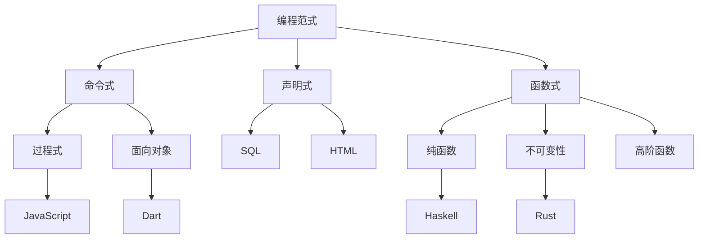

# 3.编程语言范式

[返回Refactor总览](../README.md)

> 本文档为"3.编程语言范式"主题索引，所有内容均严格编号、树形结构、支持本地跳转。请遵循本地引用规范：
>
> - 主题编号与文件名一致，便于递归扩展
> - 所有子主题均以"3.x"编号，支持锚点跳转
> - 返回上级目录请使用相对路径

## 2024语言趋势

- **Rust生态**：异步运行时、WASM优化、跨平台编译、安全性增强
- **函数式编程**：Haskell GHC 9.8、Scala 3.x、纯函数优化、类型推导
- **TypeScript**：类型系统增强、装饰器、模式匹配、运行时优化
- **Dart & Flutter**：性能优化、跨平台增强、原生集成、开发体验
- **WebAssembly**：WASI、组件模型、GC提案、线程支持、安全沙箱
- **编译优化**：增量编译、并行编译、AOT优化、JIT性能、热重载
- **工具链**：LSP增强、调试工具、性能分析、代码生成、类型检查

## 知识图谱

## 目录结构

3.1 [Rust](./3.1 Rust.md)

- 所有权系统
- 并发安全
- 零成本抽象
- WASM优化

3.2 [Haskell](./3.2 Haskell.md)

- 类型系统
- 函数组合
- 范畴论
- 形式验证

3.3 [Scala](./3.3 Scala.md)

- 函数式特性
- 类型系统
- 并发模型
- JVM优化

3.4 [TypeScript-JavaScript](./3.4 TypeScript-JavaScript.md)

- 类型系统
- 异步编程
- 装饰器
- 工程实践

3.5 [Dart-Flutter](./3.5 Dart-Flutter.md)

- 语言特性
- UI框架
- 跨平台
- 性能优化

## 范式对比

## 学习路径建议

### Web开发路径

1. [TypeScript-JavaScript](./3.4 TypeScript-JavaScript.md)
2. [Web核心技术](../2.技术栈与框架/2.6 Web核心技术.md)
3. [现代前端工程化](../2.技术栈与框架/2.7 现代前端工程化.md)

### 系统编程路径

1. [Rust](./3.1 Rust.md)
2. [Rust前端全栈](../2.技术栈与框架/2.3 Rust前端全栈.md)
3. [WebAssembly](../2.技术栈与框架/2.5 WebAssembly.md)

### 函数式编程路径

1. [Haskell](./3.2 Haskell.md)
2. [Scala](./3.3 Scala.md)
3. [Haskell-Scala前端](../2.技术栈与框架/2.4 Haskell-Scala前端.md)

### 跨端开发路径

1. [Dart-Flutter](./3.5 Dart-Flutter.md)
2. [跨端框架](../2.技术栈与框架/2.2 跨端框架.md)
3. [移动端](../1.终端类型/1.2 移动端.md)

## 主题关联

### Rust相关

- [Rust](./3.1 Rust.md)
- [Rust前端全栈](../2.技术栈与框架/2.3 Rust前端全栈.md)
- [WebAssembly](../2.技术栈与框架/2.5 WebAssembly.md)
- [性能优化与工程实践](../5.技术规范与标准/5.3 性能优化与工程实践.md)

### 函数式编程相关

- [Haskell](./3.2 Haskell.md)
- [Scala](./3.3 Scala.md)
- [Haskell-Scala前端](../2.技术栈与框架/2.4 Haskell-Scala前端.md)
- [形式化证明](../5.技术规范与标准/5.4 代码示例与形式化证明.md)

### Web开发相关

- [TypeScript-JavaScript](./3.4 TypeScript-JavaScript.md)
- [Web核心技术](../2.技术栈与框架/2.6 Web核心技术.md)
- [前端主流框架](../2.技术栈与框架/2.1 前端主流框架.md)
- [现代前端工程化](../2.技术栈与框架/2.7 现代前端工程化.md)

### 跨端开发相关

- [Dart-Flutter](./3.5 Dart-Flutter.md)
- [跨端框架](../2.技术栈与框架/2.2 跨端框架.md)
- [移动端](../1.终端类型/1.2 移动端.md)
- [桌面端](../1.终端类型/1.3 桌面端.md)

## 语言特性对比

### 类型系统

- **Rust**: 静态类型、所有权、生命周期
- **Haskell**: 强类型、类型推导、高级类型系统
- **TypeScript**: 渐进式类型、结构类型、类型推导
- **Dart**: 健全类型、空安全、泛型

### 内存管理

- **Rust**: 所有权系统、无GC、RAII
- **Haskell**: GC、不可变数据
- **JavaScript**: GC、引用计数
- **Dart**: GC、分代收集

### 并发模型

- **Rust**: async/await、线程安全、零成本抽象
- **Haskell**: STM、轻量级线程、并行计算
- **JavaScript**: 事件循环、Promise、Worker
- **Dart**: isolate、async/await、Stream

### 生态系统

- **Rust**: Cargo、crates.io、工具链
- **Haskell**: Cabal、Hackage、GHC
- **TypeScript**: npm、工具链、IDE支持
- **Dart**: pub.dev、Flutter、DevTools

---

> 本文档持续递归优化，欢迎补充最新语言特性与范式理论。编程语言范式是构建软件系统的理论基础，需要在实践中不断探索和创新。
