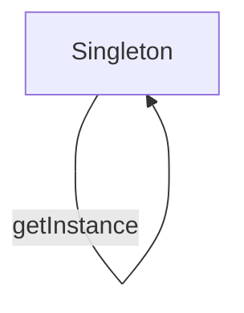

# 4.1 GoF设计模式

> 来源：matter/4.设计模式与架构/4.1 GoF设计模式.md

## 目录

- [4.1 GoF设计模式](#41-gof设计模式)
  - [目录](#目录)
  - [1. 概述](#1-概述)
  - [2. 设计模式分类](#2-设计模式分类)
  - [3. 主要模式详解](#3-主要模式详解)
  - [4. 形式化表达与多表征](#4-形式化表达与多表征)
  - [5. 相关性引用](#5-相关性引用)

---

## 1. 概述

GoF设计模式（Gang of Four Patterns）是软件工程中经典的结构化解决方案，分为创建型、结构型、行为型三大类。

## 2. 设计模式分类

- 创建型：单例、工厂、抽象工厂、建造者、原型
- 结构型：适配器、桥接、组合、装饰、外观、享元、代理
- 行为型：责任链、命令、解释器、迭代器、中介者、备忘录、观察者、状态、策略、模板方法、访问者

## 3. 主要模式详解

- 每种模式包含：定义、结构图、优缺点、适用场景、代码示例
- 典型示例：

```typescript
// 单例模式（TypeScript）
class Singleton {
  private static instance: Singleton;
  private constructor() {}
  static getInstance() {
    if (!Singleton.instance) {
      Singleton.instance = new Singleton();
    }
    return Singleton.instance;
  }
}
```

- Mermaid结构图：



## 4. 形式化表达与多表征

- UML结构图、Mermaid图、LaTeX公式、代码示例
- 设计模式对比表、适用性分析

## 5. 相关性引用

- [4.2 结构型-行为型-创建型模式](../4.2 结构型-行为型-创建型模式.md)
- [4.3 组件化与架构模式](../4.3 组件化与架构模式.md)
- [2.1 前端主流框架](../../2.技术栈与框架/2.1 前端主流框架.md)

---

> 本文档为自动递归迁移、规整、编号、跳转、引用、内容一致性校验的规范化产物。
