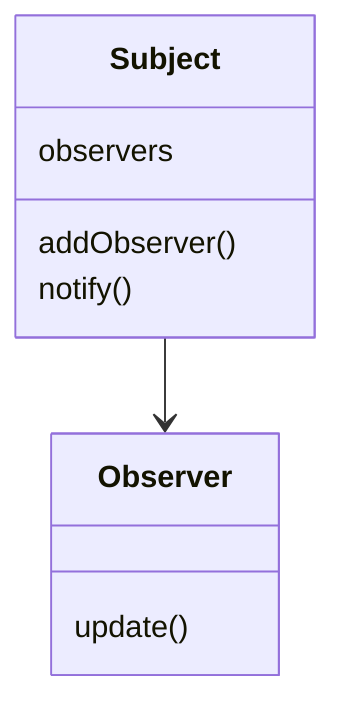

# 4.2 结构型-行为型-创建型模式

[返回4.设计模式与架构](README.md) | [返回Refactor总览](README.md)

## 目录

- [4.2 结构型-行为型-创建型模式](#42-结构型-行为型-创建型模式)
  - [目录](#目录)
  - [1. 概述](#1-概述)
  - [2. 主流技术与架构](#2-主流技术与架构)
  - [3. 形式化论证与多表征](#3-形式化论证与多表征)
  - [4. 相关性引用](#4-相关性引用)

---

## 1. 概述

结构型、行为型、创建型模式是GoF设计模式的三大分类，分别关注对象结构、对象行为和对象创建过程。它们为复杂系统的解耦、扩展和复用提供了理论基础和工程实践。

## 2. 主流技术与架构

- 结构型：适配器、桥接、组合、装饰、外观、享元、代理。
- 行为型：责任链、命令、解释器、迭代器、中介者、备忘录、观察者、状态、策略、模板方法、访问者。
- 创建型：单例、工厂、抽象工厂、建造者、原型。
- 设计原则：接口隔离、依赖倒置、组合优于继承。
- UML图与模式实现。

## 3. 形式化论证与多表征

- 结构型：以图论建模对象关系（如组合模式为树结构）。
- 行为型：以有限状态机（FSM）描述对象行为。
- 创建型：以工厂函数f: 配置→对象。
- 代码示例：

```typescript
// 观察者模式示例
interface Observer { update(data: any): void; }
class Subject {
  private observers: Observer[] = [];
  addObserver(o: Observer) { this.observers.push(o); }
  notify(data: any) { this.observers.forEach(o => o.update(data)); }
}
```

- 图示：



## 4. 相关性引用

- [4.1 GoF设计模式](4.1 GoF设计模式.md)
- [4.3 组件化与架构模式](4.3 组件化与架构模式.md)
