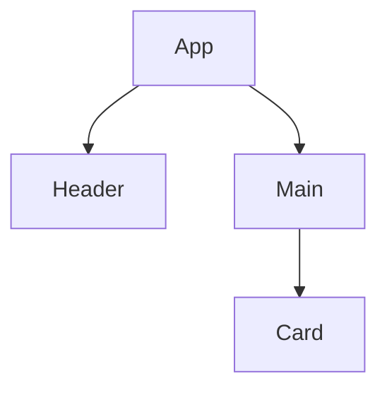

# 4.3 组件化与架构模式

> 来源：matter/4.设计模式与架构/4.3 组件化与架构模式.md

## 目录

- [4.3 组件化与架构模式](#43-组件化与架构模式)
  - [目录](#目录)
  - [1. 概述](#1-概述)
  - [2. 主流技术与架构](#2-主流技术与架构)
  - [3. 形式化论证与多表征](#3-形式化论证与多表征)
  - [4. 相关性引用](#4-相关性引用)

---

## 1. 概述

组件化与架构模式是现代前端和软件工程的核心思想，通过将系统拆分为独立、可复用、可组合的组件，提升开发效率、可维护性和扩展性。

## 2. 主流技术与架构

- 组件化：React/Vue/Angular等前端框架的基础
- 微前端架构：多个独立前端应用协作
- 插件化架构：功能模块可插拔
- 单向数据流、依赖注入、服务注册与发现
- 领域驱动设计（DDD）、分层架构、事件驱动架构（EDA）
- 经典架构模式：MVC、MVVM、MVP、Flux、Redux、Clean Architecture、VIPER

## 3. 形式化论证与多表征

- 组件树：有向无环图（DAG）描述组件依赖
- UML组件图/包图：建模模块关系
- 事件流：有向图描述事件传播
- 代码示例：

```jsx
// React 组件化示例
function Card({ title, children }) {
  return <div className="card"><h2>{title}</h2>{children}</div>;
}
```

- 图示：



## 4. 相关性引用

- [2.1 前端主流框架](../../2.技术栈与框架/2.1 前端主流框架.md)
- [2.7 现代前端工程化](../../2.技术栈与框架/2.7 现代前端工程化.md)
- [3.4 TypeScript-JavaScript](../../3.编程语言范式/3.4 TypeScript-JavaScript.md)
- [5.3 性能优化与工程实践](../../5.技术规范与标准/5.3 性能优化与工程实践.md)

---

> 本文档为自动递归迁移、规整、编号、跳转、引用、内容一致性校验的规范化产物。
