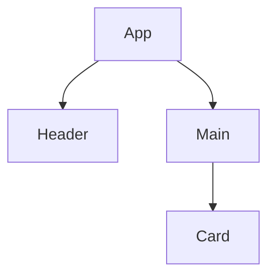
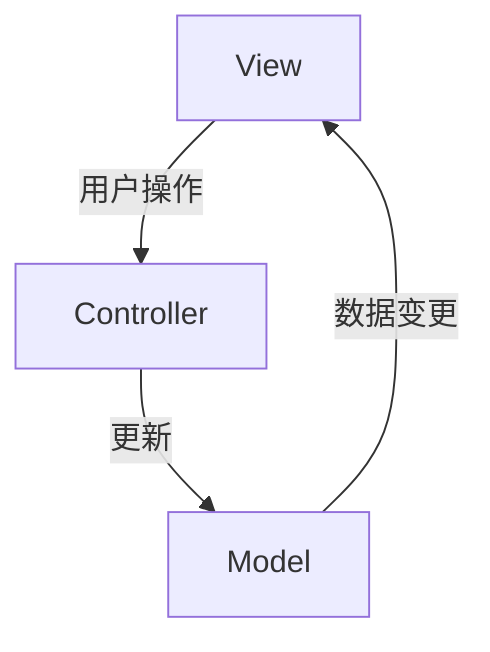
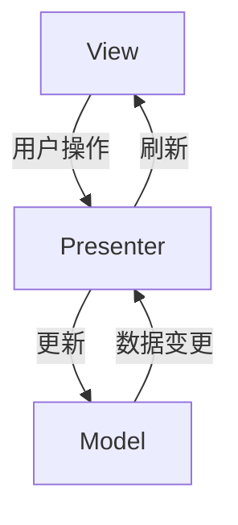
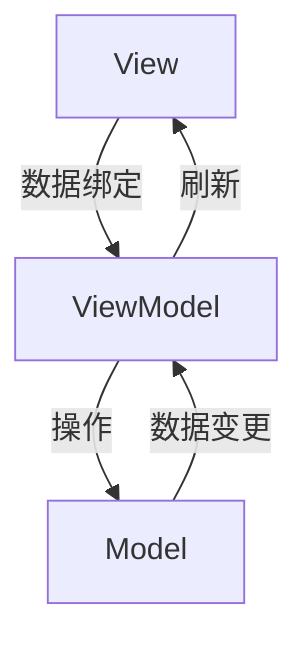
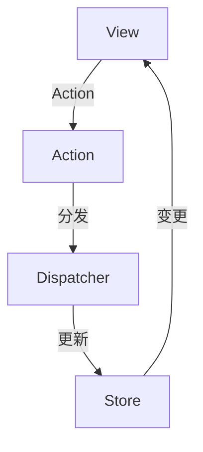
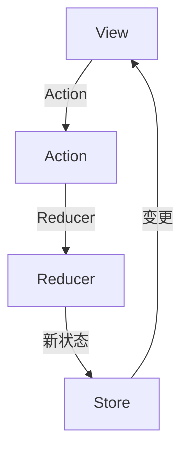
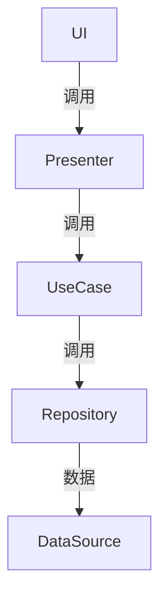
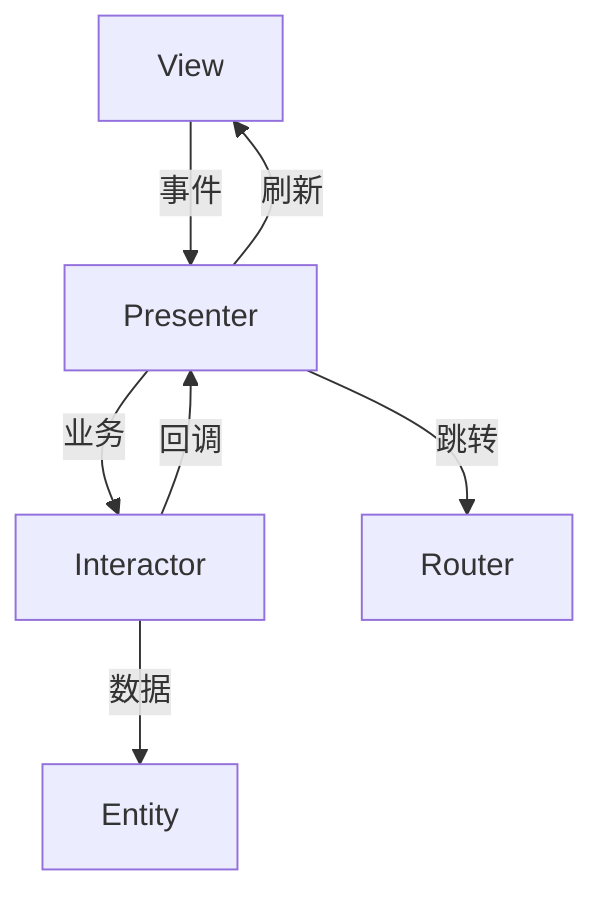

# 4.3 组件化与架构模式

[返回4.设计模式与架构](4.设计模式与架构/README.md) | [返回Refactor总览](4.设计模式与架构/../README.md)

## 目录

- [4.3 组件化与架构模式](#43-组件化与架构模式)
  - [目录](#目录)
  - [1. 概述](#1-概述)
  - [2. 主流技术与架构](#2-主流技术与架构)
  - [3. 形式化论证与多表征](#3-形式化论证与多表征)
  - [4. 相关性引用](#4-相关性引用)
  - [5. UI通用架构模型](#5-ui通用架构模型)
  - [目录](#目录-1)
    - [5.1 MVC（Model-View-Controller）](#51-mvcmodel-view-controller)
    - [5.2 MVP（Model-View-Presenter）](#52-mvpmodel-view-presenter)
    - [5.3 MVVM（Model-View-ViewModel）](#53-mvvmmodel-view-viewmodel)
    - [5.4 Flux 架构](#54-flux-架构)
    - [5.5 Redux 架构](#55-redux-架构)
    - [5.6 Clean Architecture](#56-clean-architecture)
    - [5.7 VIPER 架构](#57-viper-架构)

---

## 1. 概述

组件化与架构模式是现代前端和软件工程的核心思想，通过将系统拆分为独立、可复用、可组合的组件，提升开发效率、可维护性和扩展性。

## 2. 主流技术与架构

- 组件化：React/Vue/Angular等前端框架的基础。
- 微前端架构：多个独立前端应用协作。
- 插件化架构：功能模块可插拔。
- 单向数据流、依赖注入、服务注册与发现。
- 领域驱动设计（DDD）、分层架构、事件驱动架构（EDA）。

## 3. 形式化论证与多表征

- 组件树：以有向无环图（DAG）描述组件依赖。
- UML组件图/包图：建模模块关系。
- 事件流：以有向图描述事件传播。
- 代码示例：

```jsx
// React 组件化示例
function Card({ title, children }) {
  return <div className="card"><h2>{title}</h2>{children}</div>;
}
```text
- 图示：


## 4. 相关性引用

- [2.1 前端主流框架](4.设计模式与架构/../2.技术栈与框架/2.1 前端主流框架.md)
- [4.1 GoF设计模式](4.设计模式与架构/4.1 GoF设计模式.md)

## 5. UI通用架构模型

## 目录

- [4.3 组件化与架构模式](#43-组件化与架构模式)
  - [目录](#目录)
  - [1. 概述](#1-概述)
  - [2. 主流技术与架构](#2-主流技术与架构)
  - [3. 形式化论证与多表征](#3-形式化论证与多表征)
  - [4. 相关性引用](#4-相关性引用)
  - [5. UI通用架构模型](#5-ui通用架构模型)
  - [目录](#目录-1)
    - [5.1 MVC（Model-View-Controller）](#51-mvcmodel-view-controller)
    - [5.2 MVP（Model-View-Presenter）](#52-mvpmodel-view-presenter)
    - [5.3 MVVM（Model-View-ViewModel）](#53-mvvmmodel-view-viewmodel)
    - [5.4 Flux 架构](#54-flux-架构)
    - [5.5 Redux 架构](#55-redux-架构)
    - [5.6 Clean Architecture](#56-clean-architecture)
    - [5.7 VIPER 架构](#57-viper-架构)

---

### 5.1 MVC（Model-View-Controller）

**定义**：MVC是一种经典的软件架构模式，将应用分为模型（Model）、视图（View）、控制器（Controller）三部分，实现关注点分离。

**结构图**：



**优缺点**：

- 优点：结构清晰，易于维护和扩展，适合中小型项目。
- 缺点：随着项目复杂度提升，Controller易膨胀。

**适用场景**：早期Web开发、桌面应用、部分移动端。

**代码示例（TypeScript）**：

```typescript
class Model {
  data = 0;
  setData(val: number) { this.data = val; }
  getData() { return this.data; }
}
class View {
  render(data: number) { console.log('显示数据:', data); }
}
class Controller {
  constructor(private model: Model, private view: View) {}
  setData(val: number) { this.model.setData(val); this.view.render(this.model.getData()); }
}
```

---

### 5.2 MVP（Model-View-Presenter）

**定义**：MVP将View与Model解耦，通过Presenter进行交互，Presenter负责业务逻辑。

**结构图**：



**优缺点**：

- 优点：解耦彻底，易于单元测试。
- 缺点：Presenter代码量大，维护成本高。

**适用场景**：Android、部分Web和桌面应用。

---

### 5.3 MVVM（Model-View-ViewModel）

**定义**：MVVM通过ViewModel实现View与Model的双向绑定，常用于现代前端框架。

**结构图**：



**优缺点**：

- 优点：数据自动同步，适合复杂UI。
- 缺点：双向绑定实现复杂，调试难度大。

**适用场景**：Vue、Angular、WPF等。

**代码示例（Vue）**：

```vue
<template>
  <input v-model="msg" />
  <p>{{ msg }}</p>
</template>
<script setup>
import { ref } from 'vue';
const msg = ref('Hello');
</script>
```

---

### 5.4 Flux 架构

**定义**：Flux是一种单向数据流架构，强调Action→Dispatcher→Store→View的数据流动。

**结构图**：



**优缺点**：

- 优点：数据流清晰，易于调试。
- 缺点：样板代码多，学习曲线陡峭。

**适用场景**：React生态，复杂状态管理。

---

### 5.5 Redux 架构

**定义**：Redux是Flux的进化版，核心是Store、Action、Reducer，状态不可变。

**结构图**：



**优缺点**：

- 优点：状态可追溯，易于测试。
- 缺点：冗余代码多，简单场景下显得繁琐。

**适用场景**：React、Angular等大型前端项目。

**代码示例（Redux）**：

```typescript
// Action
type Action = { type: 'inc' } | { type: 'dec' };
// Reducer
function counter(state = 0, action: Action) {
  switch (action.type) {
    case 'inc': return state + 1;
    case 'dec': return state - 1;
    default: return state;
  }
}
```

---

### 5.6 Clean Architecture

**定义**：强调分层、依赖倒置，核心业务与外部实现解耦。

**结构图**：



**优缺点**：

- 优点：高内聚低耦合，易于测试和维护。
- 缺点：结构复杂，初学者门槛高。

**适用场景**：大型、复杂、可扩展项目。

---

### 5.7 VIPER 架构

**定义**：主要用于iOS开发，分为View、Interactor、Presenter、Entity、Router五层。

**结构图**：



**优缺点**：

- 优点：职责单一，易于测试。
- 缺点：结构繁琐，开发效率低。

**适用场景**：iOS中大型项目。

---

[返回目录](#目录)
