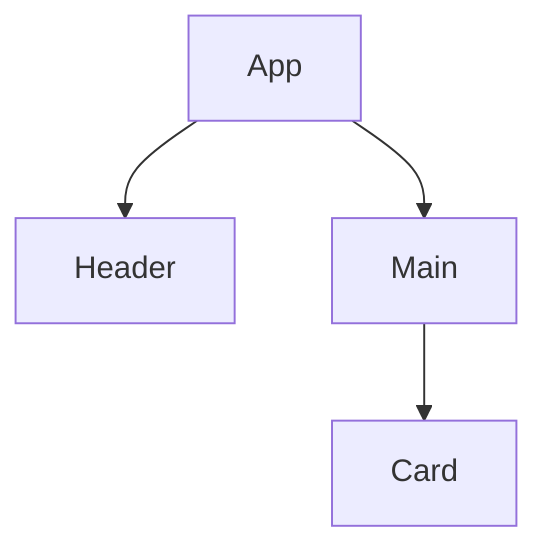
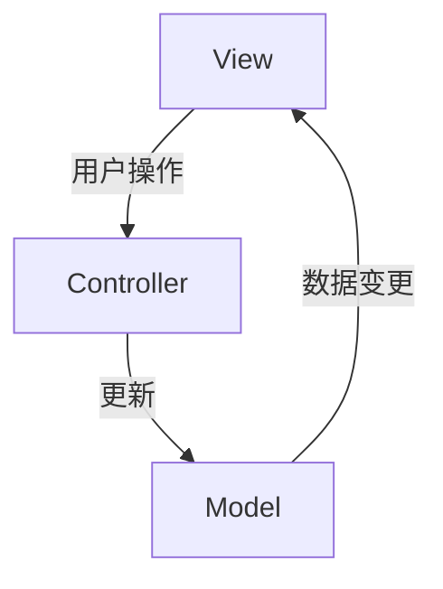
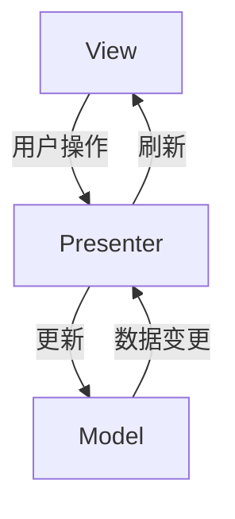
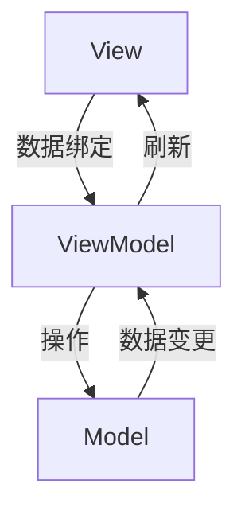
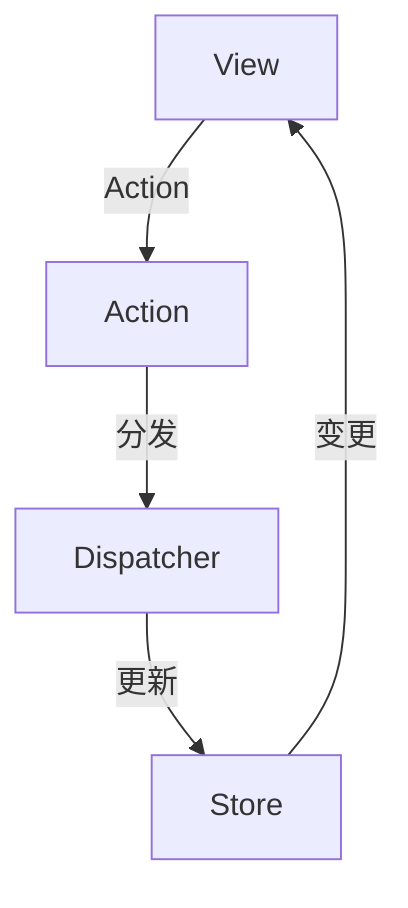
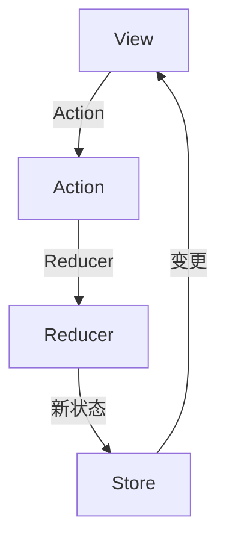
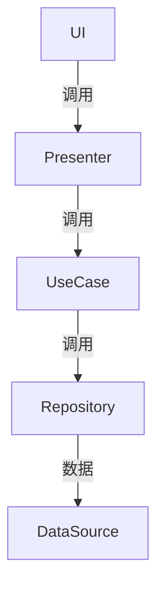
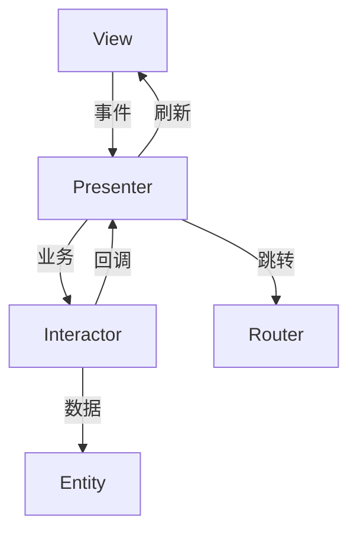

# 4.3 组件化与架构模式

[返回4.设计模式与架构](4.设计模式与架构/README.md) | [返回Refactor总览](4.设计模式与架构/../README.md)

## 目录

- [4.3 组件化与架构模式](#43-组件化与架构模式)
  - [目录](#目录)
  - [1. 概述](#1-概述)
  - [2. 主流技术与架构](#2-主流技术与架构)
  - [3. 形式化论证与多表征](#3-形式化论证与多表征)
  - [4. 相关性引用](#4-相关性引用)
  - [5. UI通用架构模型](#5-ui通用架构模型)
  - [目录](#目录-1)
    - [5.1 MVC（Model-View-Controller）](#51-mvcmodel-view-controller)
    - [5.2 MVP（Model-View-Presenter）](#52-mvpmodel-view-presenter)
    - [5.3 MVVM（Model-View-ViewModel）](#53-mvvmmodel-view-viewmodel)
    - [5.4 Flux 架构](#54-flux-架构)
    - [5.5 Redux 架构](#55-redux-架构)
    - [5.6 Clean Architecture](#56-clean-architecture)
    - [5.7 VIPER 架构](#57-viper-架构)
    - [5.8 架构模式对比与选型](#58-架构模式对比与选型)
    - [5.9 前端设计师视角：设计系统与架构模式融合](#59-前端设计师视角设计系统与架构模式融合)
    - [5.10 前端架构师视角：架构模式技术实现](#510-前端架构师视角架构模式技术实现)
    - [5.11 交互架构师视角：交互设计与架构模式结合](#511-交互架构师视角交互设计与架构模式结合)

---

## 1. 概述

组件化与架构模式是现代前端和软件工程的核心思想，通过将系统拆分为独立、可复用、可组合的组件，提升开发效率、可维护性和扩展性。

## 2. 主流技术与架构

- 组件化：React/Vue/Angular等前端框架的基础。
- 微前端架构：多个独立前端应用协作。
- 插件化架构：功能模块可插拔。
- 单向数据流、依赖注入、服务注册与发现。
- 领域驱动设计（DDD）、分层架构、事件驱动架构（EDA）。

## 3. 形式化论证与多表征

- 组件树：以有向无环图（DAG）描述组件依赖。
- UML组件图/包图：建模模块关系。
- 事件流：以有向图描述事件传播。
- 代码示例：

```jsx
// React 组件化示例
function Card({ title, children }) {
  return <div className="card"><h2>{title}</h2>{children}</div>;
}
```text
- 图示：


## 4. 相关性引用

- [2.1 前端主流框架](4.设计模式与架构/../2.技术栈与框架/2.1 前端主流框架.md)
- [2.2 跨端框架](4.设计模式与架构/../2.技术栈与框架/2.2 跨端框架.md)
- [2.6 Web核心技术](4.设计模式与架构/../2.技术栈与框架/2.6 Web核心技术.md)
- [2.7 现代前端工程化](4.设计模式与架构/../2.技术栈与框架/2.7 现代前端工程化.md)
- [3.4 TypeScript-JavaScript](4.设计模式与架构/../3.编程语言范式/3.4 TypeScript-JavaScript.md)
- [4.1 GoF设计模式](4.设计模式与架构/4.1 GoF设计模式.md)
- [4.2 结构型-行为型-创建型模式](4.设计模式与架构/4.2 结构型-行为型-创建型模式.md)
- [5.1 UI-UE-UX设计规范](4.设计模式与架构/../5.技术规范与标准/5.1 UI-UE-UX设计规范.md)
- [5.3 性能优化与工程实践](4.设计模式与架构/../5.技术规范与标准/5.3 性能优化与工程实践.md)
- [6.1 AI基础原理](4.设计模式与架构/../6.人工智能原理与算法/6.1 AI基础原理.md)

---

> **补充说明：**
> 本文档是UI通用架构模型的核心文档，详细阐述了MVC、MVVM、MVP、Flux、Redux、Clean Architecture、VIPER等经典架构模式的定义、结构、优缺点、适用场景和代码示例。这些架构模式为现代前端开发、跨端框架、工程化实践提供了重要的理论基础，与GoF设计模式、技术栈框架、编程语言范式等形成完整的知识网络。

## 5. UI通用架构模型

## 目录

- [5.1 MVC（Model-View-Controller）](#51-mvcmodel-view-controller)
- [5.2 MVP（Model-View-Presenter）](#52-mvpmodel-view-presenter)
- [5.3 MVVM（Model-View-ViewModel）](#53-mvvmmodel-view-viewmodel)
- [5.4 Flux 架构](#54-flux-架构)
- [5.5 Redux 架构](#55-redux-架构)
- [5.6 Clean Architecture](#56-clean-architecture)
- [5.7 VIPER 架构](#57-viper-架构)
- [5.8 架构模式对比与选型](#58-架构模式对比与选型)
- [5.9 前端设计师视角：设计系统与架构模式融合](#59-前端设计师视角设计系统与架构模式融合)
- [5.10 前端架构师视角：架构模式技术实现](#510-前端架构师视角架构模式技术实现)
- [5.11 交互架构师视角：交互设计与架构模式结合](#511-交互架构师视角交互设计与架构模式结合)

---

### 5.1 MVC（Model-View-Controller）

**定义**：MVC是一种经典的软件架构模式，将应用分为模型（Model）、视图（View）、控制器（Controller）三部分，实现关注点分离。

**结构图**：



**优缺点**：

- 优点：结构清晰，易于维护和扩展，适合中小型项目。
- 缺点：随着项目复杂度提升，Controller易膨胀。

**适用场景**：早期Web开发、桌面应用、部分移动端。

**代码示例（TypeScript）**：

```typescript
class Model {
  data = 0;
  setData(val: number) { this.data = val; }
  getData() { return this.data; }
}
class View {
  render(data: number) { console.log('显示数据:', data); }
}
class Controller {
  constructor(private model: Model, private view: View) {}
  setData(val: number) { this.model.setData(val); this.view.render(this.model.getData()); }
}
```

---

### 5.2 MVP（Model-View-Presenter）

**定义**：MVP将View与Model解耦，通过Presenter进行交互，Presenter负责业务逻辑。

**结构图**：



**优缺点**：

- 优点：解耦彻底，易于单元测试。
- 缺点：Presenter代码量大，维护成本高。

**适用场景**：Android、部分Web和桌面应用。

---

### 5.3 MVVM（Model-View-ViewModel）

**定义**：MVVM通过ViewModel实现View与Model的双向绑定，常用于现代前端框架。

**结构图**：



**优缺点**：

- 优点：数据自动同步，适合复杂UI。
- 缺点：双向绑定实现复杂，调试难度大。

**适用场景**：Vue、Angular、WPF等。

**代码示例（Vue）**：

```vue
<template>
  <input v-model="msg" />
  <p>{{ msg }}</p>
</template>
<script setup>
import { ref } from 'vue';
const msg = ref('Hello');
</script>
```

---

### 5.4 Flux 架构

**定义**：Flux是一种单向数据流架构，强调Action→Dispatcher→Store→View的数据流动。

**结构图**：



**优缺点**：

- 优点：数据流清晰，易于调试。
- 缺点：样板代码多，学习曲线陡峭。

**适用场景**：React生态，复杂状态管理。

---

### 5.5 Redux 架构

**定义**：Redux是Flux的进化版，核心是Store、Action、Reducer，状态不可变。

**结构图**：



**优缺点**：

- 优点：状态可追溯，易于测试。
- 缺点：冗余代码多，简单场景下显得繁琐。

**适用场景**：React、Angular等大型前端项目。

**代码示例（Redux）**：

```typescript
// Action
type Action = { type: 'inc' } | { type: 'dec' };
// Reducer
function counter(state = 0, action: Action) {
  switch (action.type) {
    case 'inc': return state + 1;
    case 'dec': return state - 1;
    default: return state;
  }
}
```

---

### 5.6 Clean Architecture

**定义**：强调分层、依赖倒置，核心业务与外部实现解耦。

**结构图**：



**优缺点**：

- 优点：高内聚低耦合，易于测试和维护。
- 缺点：结构复杂，初学者门槛高。

**适用场景**：大型、复杂、可扩展项目。

---

### 5.7 VIPER 架构

**定义**：主要用于iOS开发，分为View、Interactor、Presenter、Entity、Router五层。

**结构图**：



**优缺点**：

- 优点：职责单一，易于测试。
- 缺点：结构繁琐，开发效率低。

**适用场景**：iOS中大型项目。

---

### 5.8 架构模式对比与选型

**架构模式对比表**：

| 架构模式 | 适用场景 | 优点 | 缺点 | 复杂度 |
|---------|---------|------|------|--------|
| MVC | 中小型项目 | 结构清晰，易于理解 | Controller易膨胀 | 低 |
| MVP | 测试驱动开发 | 解耦彻底，易测试 | Presenter代码量大 | 中 |
| MVVM | 复杂UI应用 | 数据自动同步 | 双向绑定复杂 | 中 |
| Flux | 复杂状态管理 | 数据流清晰 | 样板代码多 | 高 |
| Redux | 大型前端项目 | 状态可追溯 | 冗余代码多 | 高 |
| Clean Architecture | 大型复杂项目 | 高内聚低耦合 | 结构复杂 | 很高 |
| VIPER | iOS应用 | 职责分离清晰 | 文件数量多 | 高 |

**选型建议**：

- **小型项目**：MVC或MVP
- **中型项目**：MVVM或Flux
- **大型项目**：Redux或Clean Architecture
- **移动端**：VIPER或MVVM
- **企业级**：Clean Architecture

---

### 5.9 前端设计师视角：设计系统与架构模式融合

#### 5.9.1 设计系统架构化

**设计Token与架构模式映射**：

```typescript
// 设计系统Token架构
interface DesignTokens {
  colors: {
    primary: string;
    secondary: string;
    accent: string;
  };
  typography: {
    fontFamily: string;
    fontSize: Record<string, string>;
    fontWeight: Record<string, number>;
  };
  spacing: Record<string, string>;
  borderRadius: Record<string, string>;
}

// 架构模式与设计Token集成
class DesignSystemStore {
  private tokens: DesignTokens;
  
  constructor(tokens: DesignTokens) {
    this.tokens = tokens;
  }
  
  getToken(path: string): any {
    return this.getNestedValue(this.tokens, path);
  }
  
  private getNestedValue(obj: any, path: string): any {
    return path.split('.').reduce((current, key) => current[key], obj);
  }
}
```

**组件化设计系统**：

```typescript
// 设计系统组件与MVVM架构结合
interface DesignSystemComponentProps {
  variant: 'primary' | 'secondary' | 'danger';
  size: 'small' | 'medium' | 'large';
  disabled?: boolean;
  children: React.ReactNode;
}

const DesignSystemButton: React.FC<DesignSystemComponentProps> = ({
  variant,
  size,
  disabled,
  children
}) => {
  const designTokens = useDesignTokens();
  const buttonStyles = designTokens.components.button[variant][size];
  
  return (
    <button
      className={`design-system-button ${variant} ${size}`}
      style={buttonStyles}
      disabled={disabled}
      aria-label={getAriaLabel(variant)}
    >
      {children}
    </button>
  );
};
```

#### 5.9.2 设计规范与架构模式

**设计规范状态管理**：

```typescript
// 设计规范状态管理（Redux模式）
interface DesignSystemState {
  theme: 'light' | 'dark';
  language: string;
  accessibility: {
    highContrast: boolean;
    fontSize: 'small' | 'medium' | 'large';
    reducedMotion: boolean;
  };
  brand: {
    primaryColor: string;
    logo: string;
    typography: string;
  };
}

const designSystemSlice = createSlice({
  name: 'designSystem',
  initialState,
  reducers: {
    setTheme: (state, action) => {
      state.theme = action.payload;
    },
    setAccessibility: (state, action) => {
      state.accessibility = { ...state.accessibility, ...action.payload };
    },
    updateBrand: (state, action) => {
      state.brand = { ...state.brand, ...action.payload };
    }
  }
});
```

**设计系统与Clean Architecture**：

```typescript
// 设计系统领域层（Clean Architecture）
interface DesignSystemEntity {
  id: string;
  name: string;
  type: 'color' | 'typography' | 'spacing' | 'component';
  value: any;
  metadata: Record<string, any>;
}

interface DesignSystemRepository {
  getToken(id: string): Promise<DesignSystemEntity>;
  updateToken(id: string, value: any): Promise<void>;
  getAllTokens(): Promise<DesignSystemEntity[]>;
}

// 设计系统用例层
class DesignSystemUseCase {
  constructor(private repository: DesignSystemRepository) {}
  
  async getDesignToken(id: string): Promise<DesignSystemEntity> {
    return await this.repository.getToken(id);
  }
  
  async updateDesignToken(id: string, value: any): Promise<void> {
    await this.repository.updateToken(id, value);
  }
}
```

#### 5.9.3 设计系统与用户体验

**响应式设计系统**：

```typescript
// 响应式设计系统与MVVM架构
class ResponsiveDesignSystem {
  private breakpoints = {
    mobile: 768,
    tablet: 1024,
    desktop: 1200
  };
  
  getResponsiveValue(values: Record<string, any>, currentWidth: number): any {
    if (currentWidth < this.breakpoints.mobile) {
      return values.mobile || values.default;
    } else if (currentWidth < this.breakpoints.tablet) {
      return values.tablet || values.default;
    } else {
      return values.desktop || values.default;
    }
  }
}

// 响应式组件
const ResponsiveComponent: React.FC = () => {
  const [windowWidth, setWindowWidth] = useState(window.innerWidth);
  const designSystem = useDesignSystem();
  
  useEffect(() => {
    const handleResize = () => setWindowWidth(window.innerWidth);
    window.addEventListener('resize', handleResize);
    return () => window.removeEventListener('resize', handleResize);
  }, []);
  
  const responsiveStyles = designSystem.getResponsiveValue({
    mobile: { fontSize: '14px', padding: '8px' },
    tablet: { fontSize: '16px', padding: '12px' },
    desktop: { fontSize: '18px', padding: '16px' }
  }, windowWidth);
  
  return <div style={responsiveStyles}>响应式内容</div>;
};
```

---

### 5.10 前端架构师视角：架构模式技术实现

#### 5.10.1 微前端架构模式

**微前端架构设计**：

```typescript
// 微前端架构模式
interface MicroFrontendConfig {
  name: string;
  entry: string;
  container: string;
  activeRule: string;
  props?: Record<string, any>;
}

class MicroFrontendManager {
  private apps: Map<string, MicroFrontendConfig> = new Map();
  
  registerApp(config: MicroFrontendConfig): void {
    this.apps.set(config.name, config);
  }
  
  loadApp(name: string): Promise<void> {
    const app = this.apps.get(name);
    if (!app) throw new Error(`App ${name} not found`);
    
    return this.loadScript(app.entry);
  }
  
  private async loadScript(src: string): Promise<void> {
    return new Promise((resolve, reject) => {
      const script = document.createElement('script');
      script.src = src;
      script.onload = () => resolve();
      script.onerror = () => reject(new Error(`Failed to load ${src}`));
      document.head.appendChild(script);
    });
  }
}
```

**微前端状态管理**：

```typescript
// 微前端全局状态管理
interface GlobalState {
  user: {
    id: string;
    name: string;
    permissions: string[];
  };
  theme: {
    mode: 'light' | 'dark';
    primaryColor: string;
  };
  navigation: {
    currentRoute: string;
    breadcrumbs: string[];
  };
}

class GlobalStateManager {
  private state: GlobalState;
  private listeners: Set<(state: GlobalState) => void> = new Set();
  
  constructor(initialState: GlobalState) {
    this.state = initialState;
  }
  
  getState(): GlobalState {
    return this.state;
  }
  
  setState(newState: Partial<GlobalState>): void {
    this.state = { ...this.state, ...newState };
    this.notifyListeners();
  }
  
  subscribe(listener: (state: GlobalState) => void): () => void {
    this.listeners.add(listener);
    return () => this.listeners.delete(listener);
  }
  
  private notifyListeners(): void {
    this.listeners.forEach(listener => listener(this.state));
  }
}
```

#### 5.10.2 服务端渲染架构

**SSR架构模式**：

```typescript
// SSR架构模式实现
interface SSRConfig {
  entry: string;
  template: string;
  serverBundle: string;
  clientBundle: string;
}

class SSRManager {
  private config: SSRConfig;
  
  constructor(config: SSRConfig) {
    this.config = config;
  }
  
  async renderToString(url: string, context: any): Promise<string> {
    const { createApp } = await import(this.config.serverBundle);
    const app = createApp();
    
    // 设置路由
    app.router.push(url);
    await app.router.isReady();
    
    // 渲染应用
    const html = await app.renderToString();
    
    // 注入状态
    const state = app.store.state;
    const stateScript = `<script>window.__INITIAL_STATE__=${JSON.stringify(state)}</script>`;
    
    return this.config.template
      .replace('<!--app-html-->', html)
      .replace('<!--state-script-->', stateScript);
  }
}
```

**同构应用架构**：

```typescript
// 同构应用架构
class IsomorphicApp {
  private store: Store;
  private router: Router;
  
  constructor() {
    this.store = createStore();
    this.router = createRouter();
  }
  
  // 服务端渲染
  async renderOnServer(url: string): Promise<string> {
    await this.router.push(url);
    await this.router.isReady();
    
    const components = this.router.getMatchedComponents();
    await Promise.all(components.map(component => {
      if (component.asyncData) {
        return component.asyncData({ store: this.store, route: this.router.currentRoute });
      }
    }));
    
    return this.renderToString();
  }
  
  // 客户端激活
  async hydrateOnClient(): Promise<void> {
    await this.router.isReady();
    this.mount();
  }
}
```

#### 5.10.3 性能优化架构

**代码分割架构**：

```typescript
// 代码分割架构模式
class CodeSplittingManager {
  private chunks: Map<string, () => Promise<any>> = new Map();
  
  registerChunk(name: string, loader: () => Promise<any>): void {
    this.chunks.set(name, loader);
  }
  
  async loadChunk(name: string): Promise<any> {
    const loader = this.chunks.get(name);
    if (!loader) throw new Error(`Chunk ${name} not found`);
    
    return await loader();
  }
  
  // 路由级代码分割
  async loadRouteComponent(route: string): Promise<any> {
    const chunkName = this.getChunkNameForRoute(route);
    return await this.loadChunk(chunkName);
  }
  
  private getChunkNameForRoute(route: string): string {
    // 路由到chunk名称的映射逻辑
    return `route-${route.replace(/\//g, '-')}`;
  }
}
```

**缓存架构模式**：

```typescript
// 缓存架构模式
interface CacheConfig {
  maxSize: number;
  ttl: number;
  strategy: 'lru' | 'lfu' | 'fifo';
}

class CacheManager {
  private cache: Map<string, { value: any; timestamp: number }> = new Map();
  private config: CacheConfig;
  
  constructor(config: CacheConfig) {
    this.config = config;
  }
  
  set(key: string, value: any): void {
    if (this.cache.size >= this.config.maxSize) {
      this.evict();
    }
    
    this.cache.set(key, {
      value,
      timestamp: Date.now()
    });
  }
  
  get(key: string): any {
    const item = this.cache.get(key);
    if (!item) return null;
    
    if (Date.now() - item.timestamp > this.config.ttl) {
      this.cache.delete(key);
      return null;
    }
    
    return item.value;
  }
  
  private evict(): void {
    switch (this.config.strategy) {
      case 'lru':
        this.evictLRU();
        break;
      case 'lfu':
        this.evictLFU();
        break;
      case 'fifo':
        this.evictFIFO();
        break;
    }
  }
}
```

---

### 5.11 交互架构师视角：交互设计与架构模式结合

#### 5.11.1 交互状态管理

**交互状态架构**：

```typescript
// 交互状态管理架构
interface InteractionState {
  loading: boolean;
  error: string | null;
  success: boolean;
  data: any;
  userActions: UserAction[];
}

interface UserAction {
  type: 'click' | 'hover' | 'scroll' | 'input' | 'gesture';
  target: string;
  timestamp: number;
  metadata: Record<string, any>;
}

class InteractionStateManager {
  private state: InteractionState;
  private listeners: Set<(state: InteractionState) => void> = new Set();
  
  constructor() {
    this.state = {
      loading: false,
      error: null,
      success: false,
      data: null,
      userActions: []
    };
  }
  
  setLoading(loading: boolean): void {
    this.updateState({ loading });
  }
  
  setError(error: string | null): void {
    this.updateState({ error, success: false });
  }
  
  setSuccess(success: boolean): void {
    this.updateState({ success, error: null });
  }
  
  addUserAction(action: UserAction): void {
    this.updateState({
      userActions: [...this.state.userActions, action]
    });
  }
  
  private updateState(partial: Partial<InteractionState>): void {
    this.state = { ...this.state, ...partial };
    this.notifyListeners();
  }
  
  private notifyListeners(): void {
    this.listeners.forEach(listener => listener(this.state));
  }
}
```

**交互模式与架构模式**：

```typescript
// 交互模式与MVVM架构结合
class InteractionPattern {
  private viewModel: ViewModel;
  private interactionState: InteractionStateManager;
  
  constructor(viewModel: ViewModel) {
    this.viewModel = viewModel;
    this.interactionState = new InteractionStateManager();
  }
  
  // 表单交互模式
  async handleFormSubmit(formData: any): Promise<void> {
    this.interactionState.setLoading(true);
    
    try {
      const result = await this.viewModel.submitForm(formData);
      this.interactionState.setSuccess(true);
      this.interactionState.addUserAction({
        type: 'click',
        target: 'submit-button',
        timestamp: Date.now(),
        metadata: { formData }
      });
    } catch (error) {
      this.interactionState.setError(error.message);
    } finally {
      this.interactionState.setLoading(false);
    }
  }
  
  // 列表交互模式
  handleListScroll(scrollData: any): void {
    this.interactionState.addUserAction({
      type: 'scroll',
      target: 'list-container',
      timestamp: Date.now(),
      metadata: scrollData
    });
    
    // 触发虚拟滚动或分页加载
    this.viewModel.handleScroll(scrollData);
  }
}
```

#### 5.11.2 微交互架构

**微交互状态机**：

```typescript
// 微交互状态机架构
interface MicroInteractionState {
  current: string;
  transitions: Map<string, string[]>;
  actions: Map<string, () => void>;
}

class MicroInteractionStateMachine {
  private state: MicroInteractionState;
  
  constructor(initialState: string) {
    this.state = {
      current: initialState,
      transitions: new Map(),
      actions: new Map()
    };
  }
  
  addTransition(from: string, to: string): void {
    const transitions = this.state.transitions.get(from) || [];
    transitions.push(to);
    this.state.transitions.set(from, transitions);
  }
  
  addAction(state: string, action: () => void): void {
    this.state.actions.set(state, action);
  }
  
  transition(to: string): boolean {
    const allowedTransitions = this.state.transitions.get(this.state.current) || [];
    
    if (allowedTransitions.includes(to)) {
      this.state.current = to;
      const action = this.state.actions.get(to);
      if (action) action();
      return true;
    }
    
    return false;
  }
}

// 按钮微交互示例
class ButtonMicroInteraction {
  private stateMachine: MicroInteractionStateMachine;
  
  constructor() {
    this.stateMachine = new MicroInteractionStateMachine('idle');
    
    // 定义状态转换
    this.stateMachine.addTransition('idle', 'hover');
    this.stateMachine.addTransition('hover', 'pressed');
    this.stateMachine.addTransition('pressed', 'idle');
    this.stateMachine.addTransition('hover', 'idle');
    
    // 定义状态动作
    this.stateMachine.addAction('hover', () => {
      this.applyHoverStyles();
    });
    
    this.stateMachine.addAction('pressed', () => {
      this.applyPressedStyles();
    });
    
    this.stateMachine.addAction('idle', () => {
      this.applyIdleStyles();
    });
  }
  
  handleMouseEnter(): void {
    this.stateMachine.transition('hover');
  }
  
  handleMouseLeave(): void {
    this.stateMachine.transition('idle');
  }
  
  handleMouseDown(): void {
    this.stateMachine.transition('pressed');
  }
  
  handleMouseUp(): void {
    this.stateMachine.transition('idle');
  }
  
  private applyHoverStyles(): void {
    // 应用悬停样式
  }
  
  private applyPressedStyles(): void {
    // 应用按下样式
  }
  
  private applyIdleStyles(): void {
    // 应用默认样式
  }
}
```

#### 5.11.3 无障碍交互架构

**无障碍交互模式**：

```typescript
// 无障碍交互架构
interface AccessibilityConfig {
  screenReader: boolean;
  keyboardNavigation: boolean;
  highContrast: boolean;
  reducedMotion: boolean;
  fontSize: 'small' | 'medium' | 'large';
}

class AccessibilityManager {
  private config: AccessibilityConfig;
  private focusManager: FocusManager;
  private screenReader: ScreenReaderManager;
  
  constructor(config: AccessibilityConfig) {
    this.config = config;
    this.focusManager = new FocusManager();
    this.screenReader = new ScreenReaderManager();
  }
  
  // 键盘导航管理
  handleKeyboardNavigation(event: KeyboardEvent): void {
    if (!this.config.keyboardNavigation) return;
    
    switch (event.key) {
      case 'Tab':
        this.focusManager.handleTabNavigation(event);
        break;
      case 'Enter':
      case ' ':
        this.handleActivation(event);
        break;
      case 'Escape':
        this.handleEscape(event);
        break;
      case 'ArrowUp':
      case 'ArrowDown':
        this.handleArrowNavigation(event);
        break;
    }
  }
  
  // 屏幕阅读器支持
  announceToScreenReader(message: string): void {
    if (this.config.screenReader) {
      this.screenReader.announce(message);
    }
  }
  
  // 焦点管理
  setFocus(element: HTMLElement): void {
    this.focusManager.setFocus(element);
  }
  
  // 高对比度模式
  toggleHighContrast(): void {
    this.config.highContrast = !this.config.highContrast;
    this.applyHighContrastStyles();
  }
  
  private handleActivation(event: KeyboardEvent): void {
    const target = event.target as HTMLElement;
    if (target.role === 'button' || target.tagName === 'BUTTON') {
      target.click();
    }
  }
  
  private handleEscape(event: KeyboardEvent): void {
    // 关闭模态框或返回上一级
  }
  
  private handleArrowNavigation(event: KeyboardEvent): void {
    // 处理列表或菜单导航
  }
  
  private applyHighContrastStyles(): void {
    // 应用高对比度样式
  }
}

// 焦点管理器
class FocusManager {
  private focusableElements: HTMLElement[] = [];
  private currentFocusIndex = 0;
  
  setFocusableElements(elements: HTMLElement[]): void {
    this.focusableElements = elements;
  }
  
  handleTabNavigation(event: KeyboardEvent): void {
    if (event.shiftKey) {
      this.focusPrevious();
    } else {
      this.focusNext();
    }
  }
  
  private focusNext(): void {
    this.currentFocusIndex = (this.currentFocusIndex + 1) % this.focusableElements.length;
    this.focusableElements[this.currentFocusIndex].focus();
  }
  
  private focusPrevious(): void {
    this.currentFocusIndex = this.currentFocusIndex === 0 
      ? this.focusableElements.length - 1 
      : this.currentFocusIndex - 1;
    this.focusableElements[this.currentFocusIndex].focus();
  }
  
  setFocus(element: HTMLElement): void {
    element.focus();
    this.currentFocusIndex = this.focusableElements.indexOf(element);
  }
}

// 屏幕阅读器管理器
class ScreenReaderManager {
  private liveRegion: HTMLElement;
  
  constructor() {
    this.liveRegion = document.createElement('div');
    this.liveRegion.setAttribute('aria-live', 'polite');
    this.liveRegion.setAttribute('aria-atomic', 'true');
    this.liveRegion.style.position = 'absolute';
    this.liveRegion.style.left = '-10000px';
    this.liveRegion.style.width = '1px';
    this.liveRegion.style.height = '1px';
    this.liveRegion.style.overflow = 'hidden';
    document.body.appendChild(this.liveRegion);
  }
  
  announce(message: string): void {
    this.liveRegion.textContent = message;
  }
}
```

---

### 5.9 前端设计师视角：设计系统与架构模式融合

#### 5.9.1 设计系统架构化

**设计Token与架构模式映射**：

```typescript
// 设计系统Token架构
interface DesignTokens {
  colors: {
    primary: string;
    secondary: string;
    accent: string;
  };
  typography: {
    fontFamily: string;
    fontSize: Record<string, string>;
    fontWeight: Record<string, number>;
  };
  spacing: Record<string, string>;
  borderRadius: Record<string, string>;
}

// 架构模式与设计Token集成
class DesignSystemStore {
  private tokens: DesignTokens;
  
  constructor(tokens: DesignTokens) {
    this.tokens = tokens;
  }
  
  getToken(path: string): any {
    return this.getNestedValue(this.tokens, path);
  }
  
  private getNestedValue(obj: any, path: string): any {
    return path.split('.').reduce((current, key) => current[key], obj);
  }
}
```

**组件化设计系统**：

```typescript
// 设计系统组件与MVVM架构结合
interface DesignSystemComponentProps {
  variant: 'primary' | 'secondary' | 'danger';
  size: 'small' | 'medium' | 'large';
  disabled?: boolean;
  children: React.ReactNode;
}

const DesignSystemButton: React.FC<DesignSystemComponentProps> = ({
  variant,
  size,
  disabled,
  children
}) => {
  const designTokens = useDesignTokens();
  const buttonStyles = designTokens.components.button[variant][size];
  
  return (
    <button
      className={`design-system-button ${variant} ${size}`}
      style={buttonStyles}
      disabled={disabled}
      aria-label={getAriaLabel(variant)}
    >
      {children}
    </button>
  );
};
```

#### 5.9.2 设计规范与架构模式

**设计规范状态管理**：

```typescript
// 设计规范状态管理（Redux模式）
interface DesignSystemState {
  theme: 'light' | 'dark';
  language: string;
  accessibility: {
    highContrast: boolean;
    fontSize: 'small' | 'medium' | 'large';
    reducedMotion: boolean;
  };
  brand: {
    primaryColor: string;
    logo: string;
    typography: string;
  };
}

const designSystemSlice = createSlice({
  name: 'designSystem',
  initialState,
  reducers: {
    setTheme: (state, action) => {
      state.theme = action.payload;
    },
    setAccessibility: (state, action) => {
      state.accessibility = { ...state.accessibility, ...action.payload };
    },
    updateBrand: (state, action) => {
      state.brand = { ...state.brand, ...action.payload };
    }
  }
});
```

**设计系统与Clean Architecture**：

```typescript
// 设计系统领域层（Clean Architecture）
interface DesignSystemEntity {
  id: string;
  name: string;
  type: 'color' | 'typography' | 'spacing' | 'component';
  value: any;
  metadata: Record<string, any>;
}

interface DesignSystemRepository {
  getToken(id: string): Promise<DesignSystemEntity>;
  updateToken(id: string, value: any): Promise<void>;
  getAllTokens(): Promise<DesignSystemEntity[]>;
}

// 设计系统用例层
class DesignSystemUseCase {
  constructor(private repository: DesignSystemRepository) {}
  
  async getDesignToken(id: string): Promise<DesignSystemEntity> {
    return await this.repository.getToken(id);
  }
  
  async updateDesignToken(id: string, value: any): Promise<void> {
    await this.repository.updateToken(id, value);
  }
}
```

#### 5.9.3 设计系统与用户体验

**响应式设计系统**：

```typescript
// 响应式设计系统与MVVM架构
class ResponsiveDesignSystem {
  private breakpoints = {
    mobile: 768,
    tablet: 1024,
    desktop: 1200
  };
  
  getResponsiveValue(values: Record<string, any>, currentWidth: number): any {
    if (currentWidth < this.breakpoints.mobile) {
      return values.mobile || values.default;
    } else if (currentWidth < this.breakpoints.tablet) {
      return values.tablet || values.default;
    } else {
      return values.desktop || values.default;
    }
  }
}

// 响应式组件
const ResponsiveComponent: React.FC = () => {
  const [windowWidth, setWindowWidth] = useState(window.innerWidth);
  const designSystem = useDesignSystem();
  
  useEffect(() => {
    const handleResize = () => setWindowWidth(window.innerWidth);
    window.addEventListener('resize', handleResize);
    return () => window.removeEventListener('resize', handleResize);
  }, []);
  
  const responsiveStyles = designSystem.getResponsiveValue({
    mobile: { fontSize: '14px', padding: '8px' },
    tablet: { fontSize: '16px', padding: '12px' },
    desktop: { fontSize: '18px', padding: '16px' }
  }, windowWidth);
  
  return <div style={responsiveStyles}>响应式内容</div>;
};
```

---

### 5.10 前端架构师视角：架构模式技术实现

#### 5.10.1 微前端架构模式

**微前端架构设计**：

```typescript
// 微前端架构模式
interface MicroFrontendConfig {
  name: string;
  entry: string;
  container: string;
  activeRule: string;
  props?: Record<string, any>;
}

class MicroFrontendManager {
  private apps: Map<string, MicroFrontendConfig> = new Map();
  
  registerApp(config: MicroFrontendConfig): void {
    this.apps.set(config.name, config);
  }
  
  loadApp(name: string): Promise<void> {
    const app = this.apps.get(name);
    if (!app) throw new Error(`App ${name} not found`);
    
    return this.loadScript(app.entry);
  }
  
  private async loadScript(src: string): Promise<void> {
    return new Promise((resolve, reject) => {
      const script = document.createElement('script');
      script.src = src;
      script.onload = () => resolve();
      script.onerror = () => reject(new Error(`Failed to load ${src}`));
      document.head.appendChild(script);
    });
  }
}
```

**微前端状态管理**：

```typescript
// 微前端全局状态管理
interface GlobalState {
  user: {
    id: string;
    name: string;
    permissions: string[];
  };
  theme: {
    mode: 'light' | 'dark';
    primaryColor: string;
  };
  navigation: {
    currentRoute: string;
    breadcrumbs: string[];
  };
}

class GlobalStateManager {
  private state: GlobalState;
  private listeners: Set<(state: GlobalState) => void> = new Set();
  
  constructor(initialState: GlobalState) {
    this.state = initialState;
  }
  
  getState(): GlobalState {
    return this.state;
  }
  
  setState(newState: Partial<GlobalState>): void {
    this.state = { ...this.state, ...newState };
    this.notifyListeners();
  }
  
  subscribe(listener: (state: GlobalState) => void): () => void {
    this.listeners.add(listener);
    return () => this.listeners.delete(listener);
  }
  
  private notifyListeners(): void {
    this.listeners.forEach(listener => listener(this.state));
  }
}
```

#### 5.10.2 服务端渲染架构

**SSR架构模式**：

```typescript
// SSR架构模式实现
interface SSRConfig {
  entry: string;
  template: string;
  serverBundle: string;
  clientBundle: string;
}

class SSRManager {
  private config: SSRConfig;
  
  constructor(config: SSRConfig) {
    this.config = config;
  }
  
  async renderToString(url: string, context: any): Promise<string> {
    const { createApp } = await import(this.config.serverBundle);
    const app = createApp();
    
    // 设置路由
    app.router.push(url);
    await app.router.isReady();
    
    // 渲染应用
    const html = await app.renderToString();
    
    // 注入状态
    const state = app.store.state;
    const stateScript = `<script>window.__INITIAL_STATE__=${JSON.stringify(state)}</script>`;
    
    return this.config.template
      .replace('<!--app-html-->', html)
      .replace('<!--state-script-->', stateScript);
  }
}
```

**同构应用架构**：

```typescript
// 同构应用架构
class IsomorphicApp {
  private store: Store;
  private router: Router;
  
  constructor() {
    this.store = createStore();
    this.router = createRouter();
  }
  
  // 服务端渲染
  async renderOnServer(url: string): Promise<string> {
    await this.router.push(url);
    await this.router.isReady();
    
    const components = this.router.getMatchedComponents();
    await Promise.all(components.map(component => {
      if (component.asyncData) {
        return component.asyncData({ store: this.store, route: this.router.currentRoute });
      }
    }));
    
    return this.renderToString();
  }
  
  // 客户端激活
  async hydrateOnClient(): Promise<void> {
    await this.router.isReady();
    this.mount();
  }
}
```

#### 5.10.3 性能优化架构

**代码分割架构**：

```typescript
// 代码分割架构模式
class CodeSplittingManager {
  private chunks: Map<string, () => Promise<any>> = new Map();
  
  registerChunk(name: string, loader: () => Promise<any>): void {
    this.chunks.set(name, loader);
  }
  
  async loadChunk(name: string): Promise<any> {
    const loader = this.chunks.get(name);
    if (!loader) throw new Error(`Chunk ${name} not found`);
    
    return await loader();
  }
  
  // 路由级代码分割
  async loadRouteComponent(route: string): Promise<any> {
    const chunkName = this.getChunkNameForRoute(route);
    return await this.loadChunk(chunkName);
  }
  
  private getChunkNameForRoute(route: string): string {
    // 路由到chunk名称的映射逻辑
    return `route-${route.replace(/\//g, '-')}`;
  }
}
```

**缓存架构模式**：

```typescript
// 缓存架构模式
interface CacheConfig {
  maxSize: number;
  ttl: number;
  strategy: 'lru' | 'lfu' | 'fifo';
}

class CacheManager {
  private cache: Map<string, { value: any; timestamp: number }> = new Map();
  private config: CacheConfig;
  
  constructor(config: CacheConfig) {
    this.config = config;
  }
  
  set(key: string, value: any): void {
    if (this.cache.size >= this.config.maxSize) {
      this.evict();
    }
    
    this.cache.set(key, {
      value,
      timestamp: Date.now()
    });
  }
  
  get(key: string): any {
    const item = this.cache.get(key);
    if (!item) return null;
    
    if (Date.now() - item.timestamp > this.config.ttl) {
      this.cache.delete(key);
      return null;
    }
    
    return item.value;
  }
  
  private evict(): void {
    switch (this.config.strategy) {
      case 'lru':
        this.evictLRU();
        break;
      case 'lfu':
        this.evictLFU();
        break;
      case 'fifo':
        this.evictFIFO();
        break;
    }
  }
}
```

---

### 5.11 交互架构师视角：交互设计与架构模式结合

#### 5.11.1 交互状态管理

**交互状态架构**：

```typescript
// 交互状态管理架构
interface InteractionState {
  loading: boolean;
  error: string | null;
  success: boolean;
  data: any;
  userActions: UserAction[];
}

interface UserAction {
  type: 'click' | 'hover' | 'scroll' | 'input' | 'gesture';
  target: string;
  timestamp: number;
  metadata: Record<string, any>;
}

class InteractionStateManager {
  private state: InteractionState;
  private listeners: Set<(state: InteractionState) => void> = new Set();
  
  constructor() {
    this.state = {
      loading: false,
      error: null,
      success: false,
      data: null,
      userActions: []
    };
  }
  
  setLoading(loading: boolean): void {
    this.updateState({ loading });
  }
  
  setError(error: string | null): void {
    this.updateState({ error, success: false });
  }
  
  setSuccess(success: boolean): void {
    this.updateState({ success, error: null });
  }
  
  addUserAction(action: UserAction): void {
    this.updateState({
      userActions: [...this.state.userActions, action]
    });
  }
  
  private updateState(partial: Partial<InteractionState>): void {
    this.state = { ...this.state, ...partial };
    this.notifyListeners();
  }
  
  private notifyListeners(): void {
    this.listeners.forEach(listener => listener(this.state));
  }
}
```

**交互模式与架构模式**：

```typescript
// 交互模式与MVVM架构结合
class InteractionPattern {
  private viewModel: ViewModel;
  private interactionState: InteractionStateManager;
  
  constructor(viewModel: ViewModel) {
    this.viewModel = viewModel;
    this.interactionState = new InteractionStateManager();
  }
  
  // 表单交互模式
  async handleFormSubmit(formData: any): Promise<void> {
    this.interactionState.setLoading(true);
    
    try {
      const result = await this.viewModel.submitForm(formData);
      this.interactionState.setSuccess(true);
      this.interactionState.addUserAction({
        type: 'click',
        target: 'submit-button',
        timestamp: Date.now(),
        metadata: { formData }
      });
    } catch (error) {
      this.interactionState.setError(error.message);
    } finally {
      this.interactionState.setLoading(false);
    }
  }
  
  // 列表交互模式
  handleListScroll(scrollData: any): void {
    this.interactionState.addUserAction({
      type: 'scroll',
      target: 'list-container',
      timestamp: Date.now(),
      metadata: scrollData
    });
    
    // 触发虚拟滚动或分页加载
    this.viewModel.handleScroll(scrollData);
  }
}
```

#### 5.11.2 微交互架构

**微交互状态机**：

```typescript
// 微交互状态机架构
interface MicroInteractionState {
  current: string;
  transitions: Map<string, string[]>;
  actions: Map<string, () => void>;
}

class MicroInteractionStateMachine {
  private state: MicroInteractionState;
  
  constructor(initialState: string) {
    this.state = {
      current: initialState,
      transitions: new Map(),
      actions: new Map()
    };
  }
  
  addTransition(from: string, to: string): void {
    const transitions = this.state.transitions.get(from) || [];
    transitions.push(to);
    this.state.transitions.set(from, transitions);
  }
  
  addAction(state: string, action: () => void): void {
    this.state.actions.set(state, action);
  }
  
  transition(to: string): boolean {
    const allowedTransitions = this.state.transitions.get(this.state.current) || [];
    
    if (allowedTransitions.includes(to)) {
      this.state.current = to;
      const action = this.state.actions.get(to);
      if (action) action();
      return true;
    }
    
    return false;
  }
}

// 按钮微交互示例
class ButtonMicroInteraction {
  private stateMachine: MicroInteractionStateMachine;
  
  constructor() {
    this.stateMachine = new MicroInteractionStateMachine('idle');
    
    // 定义状态转换
    this.stateMachine.addTransition('idle', 'hover');
    this.stateMachine.addTransition('hover', 'pressed');
    this.stateMachine.addTransition('pressed', 'idle');
    this.stateMachine.addTransition('hover', 'idle');
    
    // 定义状态动作
    this.stateMachine.addAction('hover', () => {
      this.applyHoverStyles();
    });
    
    this.stateMachine.addAction('pressed', () => {
      this.applyPressedStyles();
    });
    
    this.stateMachine.addAction('idle', () => {
      this.applyIdleStyles();
    });
  }
  
  handleMouseEnter(): void {
    this.stateMachine.transition('hover');
  }
  
  handleMouseLeave(): void {
    this.stateMachine.transition('idle');
  }
  
  handleMouseDown(): void {
    this.stateMachine.transition('pressed');
  }
  
  handleMouseUp(): void {
    this.stateMachine.transition('idle');
  }
  
  private applyHoverStyles(): void {
    // 应用悬停样式
  }
  
  private applyPressedStyles(): void {
    // 应用按下样式
  }
  
  private applyIdleStyles(): void {
    // 应用默认样式
  }
}
```

#### 5.11.3 无障碍交互架构

**无障碍交互模式**：

```typescript
// 无障碍交互架构
interface AccessibilityConfig {
  screenReader: boolean;
  keyboardNavigation: boolean;
  highContrast: boolean;
  reducedMotion: boolean;
  fontSize: 'small' | 'medium' | 'large';
}

class AccessibilityManager {
  private config: AccessibilityConfig;
  private focusManager: FocusManager;
  private screenReader: ScreenReaderManager;
  
  constructor(config: AccessibilityConfig) {
    this.config = config;
    this.focusManager = new FocusManager();
    this.screenReader = new ScreenReaderManager();
  }
  
  // 键盘导航管理
  handleKeyboardNavigation(event: KeyboardEvent): void {
    if (!this.config.keyboardNavigation) return;
    
    switch (event.key) {
      case 'Tab':
        this.focusManager.handleTabNavigation(event);
        break;
      case 'Enter':
      case ' ':
        this.handleActivation(event);
        break;
      case 'Escape':
        this.handleEscape(event);
        break;
      case 'ArrowUp':
      case 'ArrowDown':
        this.handleArrowNavigation(event);
        break;
    }
  }
  
  // 屏幕阅读器支持
  announceToScreenReader(message: string): void {
    if (this.config.screenReader) {
      this.screenReader.announce(message);
    }
  }
  
  // 焦点管理
  setFocus(element: HTMLElement): void {
    this.focusManager.setFocus(element);
  }
  
  // 高对比度模式
  toggleHighContrast(): void {
    this.config.highContrast = !this.config.highContrast;
    this.applyHighContrastStyles();
  }
  
  private handleActivation(event: KeyboardEvent): void {
    const target = event.target as HTMLElement;
    if (target.role === 'button' || target.tagName === 'BUTTON') {
      target.click();
    }
  }
  
  private handleEscape(event: KeyboardEvent): void {
    // 关闭模态框或返回上一级
  }
  
  private handleArrowNavigation(event: KeyboardEvent): void {
    // 处理列表或菜单导航
  }
  
  private applyHighContrastStyles(): void {
    // 应用高对比度样式
  }
}

// 焦点管理器
class FocusManager {
  private focusableElements: HTMLElement[] = [];
  private currentFocusIndex = 0;
  
  setFocusableElements(elements: HTMLElement[]): void {
    this.focusableElements = elements;
  }
  
  handleTabNavigation(event: KeyboardEvent): void {
    if (event.shiftKey) {
      this.focusPrevious();
    } else {
      this.focusNext();
    }
  }
  
  private focusNext(): void {
    this.currentFocusIndex = (this.currentFocusIndex + 1) % this.focusableElements.length;
    this.focusableElements[this.currentFocusIndex].focus();
  }
  
  private focusPrevious(): void {
    this.currentFocusIndex = this.currentFocusIndex === 0 
      ? this.focusableElements.length - 1 
      : this.currentFocusIndex - 1;
    this.focusableElements[this.currentFocusIndex].focus();
  }
  
  setFocus(element: HTMLElement): void {
    element.focus();
    this.currentFocusIndex = this.focusableElements.indexOf(element);
  }
}

// 屏幕阅读器管理器
class ScreenReaderManager {
  private liveRegion: HTMLElement;
  
  constructor() {
    this.liveRegion = document.createElement('div');
    this.liveRegion.setAttribute('aria-live', 'polite');
    this.liveRegion.setAttribute('aria-atomic', 'true');
    this.liveRegion.style.position = 'absolute';
    this.liveRegion.style.left = '-10000px';
    this.liveRegion.style.width = '1px';
    this.liveRegion.style.height = '1px';
    this.liveRegion.style.overflow = 'hidden';
    document.body.appendChild(this.liveRegion);
  }
  
  announce(message: string): void {
    this.liveRegion.textContent = message;
  }
}
```

---

[返回目录](#目录)
