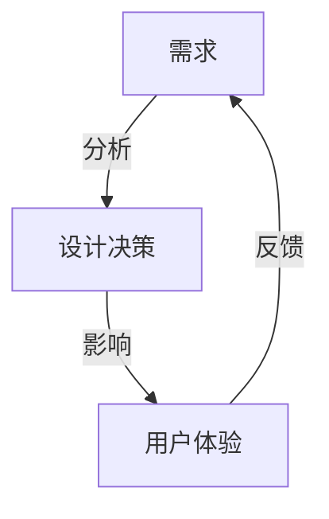

# 4.4 哲学与认知批判性分析

[返回4.设计模式与架构](4.设计模式与架构/README.md) | [返回Refactor总览](4.设计模式与架构/../README.md)

## 目录

- [4.4 哲学与认知批判性分析](#44-哲学与认知批判性分析)
  - [目录](#目录)
  - [1. 概述](#1-概述)
  - [2. 主流技术与架构](#2-主流技术与架构)
  - [3. 形式化论证与多表征](#3-形式化论证与多表征)
  - [4. 相关性引用](#4-相关性引用)

---

## 1. 概述

哲学与认知批判性分析关注软件设计、架构与用户体验背后的本体论、认识论和方法论基础。通过批判性思维，反思技术选择、设计范式与认知偏见，提升系统的合理性与人本关怀。

## 2. 主流技术与架构

- 设计哲学：形式主义、实用主义、人本主义。
- 认知科学：感知-行动环、分布式认知、认知负荷理论。
- 批判性思维：假设检验、反例分析、系统性怀疑。
- 设计伦理：可访问性、公平性、隐私保护。
- 交互范式：直觉交互、情感设计、可解释性。

## 3. 形式化论证与多表征

- 论证结构：以命题逻辑、因果图描述设计决策。
- 认知模型：以信息流图、认知流程图建模用户行为。
- 设计批判：用SWOT分析、五问法等工具。
- 代码示例：

```typescript
// 可访问性设计示例
<button aria-label="关闭">×</button>
```text
- 图示：


## 4. 相关性引用

- [5.1 UI-UE-UX设计规范](4.设计模式与架构/../5.技术规范与标准/5.1 UI-UE-UX设计规范.md)
- [5.2 可访问性与国际化](4.设计模式与架构/../5.技术规范与标准/5.2 可访问性与国际化.md)
- [4.3 组件化与架构模式（含UI通用架构模型）](4.设计模式与架构/4.3 组件化与架构模式.md)

> **补充说明：**
> UI通用架构模型（如MVC、MVVM、MVP等）不仅是技术实现的产物，更深受哲学范式（如形式主义与人本主义）、认知科学（如认知负荷、分布式认知）影响。合理的架构模式有助于降低认知负担、提升可解释性与可维护性，促进以人为本的系统设计。相关批判性分析与论证详见[4.3 组件化与架构模式](4.设计模式与架构/4.3 组件化与架构模式.md)。
