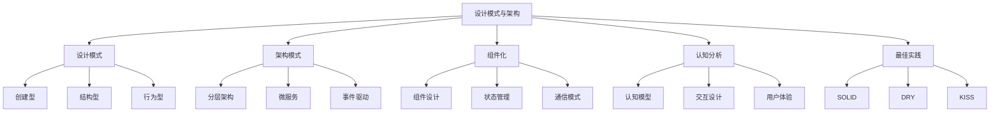
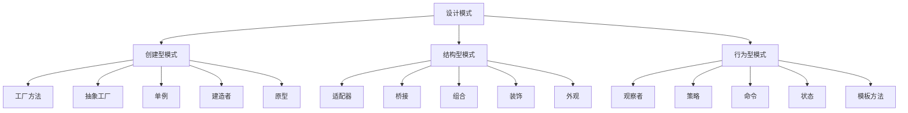
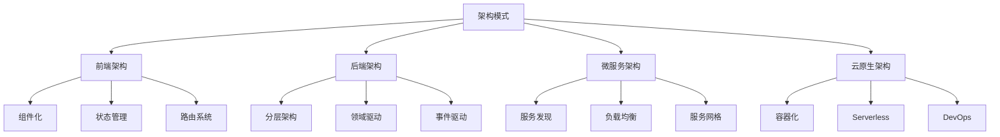

# 4.设计模式与架构

[返回Refactor总览](../README.md)

> 本文档为"4.设计模式与架构"主题索引，所有内容均严格编号、树形结构、支持本地跳转。请遵循本地引用规范：
>
> - 主题编号与文件名一致，便于递归扩展
> - 所有子主题均以"4.x"编号，支持锚点跳转
> - 返回上级目录请使用相对路径

## 2024架构趋势

- **微服务架构**：服务网格、API网关、容器编排、微前端
- **云原生架构**：Serverless、Edge Computing、Service Mesh、DevOps
- **响应式架构**：事件驱动、流处理、反应式宣言、弹性设计
- **DDD实践**：领域驱动设计、事件溯源、CQRS、聚合根
- **函数式架构**：纯函数、不可变性、副作用隔离、函数组合
- **AI架构**：大模型集成、智能服务、知识图谱、推理引擎
- **安全架构**：零信任、身份认证、访问控制、数据加密

## 知识图谱

## 目录结构

4.1 [GoF设计模式](./4.1 GoF设计模式.md)

- 创建型模式
- 结构型模式
- 行为型模式
- 实践案例

4.2 [结构型-行为型-创建型模式](./4.2 结构型-行为型-创建型模式.md)

- 模式分类
- 实现原理
- 应用场景
- 最佳实践

4.3 [组件化与架构模式](./4.3 组件化与架构模式.md)

- 组件设计
- 状态管理
- 通信模式
- 架构演进

4.4 [哲学与认知批判性分析](./4.4 哲学与认知批判性分析.md)

- 认知模型
- 交互设计
- 用户体验
- 批判思维

## 设计模式关系图

## 学习路径建议

### 设计模式路径

1. [GoF设计模式](./4.1 GoF设计模式.md)
2. [结构型-行为型-创建型模式](./4.2 结构型-行为型-创建型模式.md)
3. [组件化与架构模式](./4.3 组件化与架构模式.md)

### 架构设计路径

1. [组件化与架构模式](./4.3 组件化与架构模式.md)
2. [Web核心技术](../2.技术栈与框架/2.6 Web核心技术.md)
3. [现代前端工程化](../2.技术栈与框架/2.7 现代前端工程化.md)

### 认知分析路径

1. [哲学与认知批判性分析](./4.4 哲学与认知批判性分析.md)
2. [UI-UE-UX设计规范](../5.技术规范与标准/5.1 UI-UE-UX设计规范.md)
3. [可访问性与国际化](../5.技术规范与标准/5.2 可访问性与国际化.md)

## 主题关联

### 设计模式相关

- [GoF设计模式](./4.1 GoF设计模式.md)
- [结构型-行为型-创建型模式](./4.2 结构型-行为型-创建型模式.md)
- [TypeScript-JavaScript](../3.编程语言范式/3.4 TypeScript-JavaScript.md)
- [代码示例与形式化证明](../5.技术规范与标准/5.4 代码示例与形式化证明.md)

### 架构设计相关

- [组件化与架构模式](./4.3 组件化与架构模式.md)
- [前端主流框架](../2.技术栈与框架/2.1 前端主流框架.md)
- [Web核心技术](../2.技术栈与框架/2.6 Web核心技术.md)
- [现代前端工程化](../2.技术栈与框架/2.7 现代前端工程化.md)

### 认知分析相关

- [哲学与认知批判性分析](./4.4 哲学与认知批判性分析.md)
- [UI-UE-UX设计规范](../5.技术规范与标准/5.1 UI-UE-UX设计规范.md)
- [可访问性与国际化](../5.技术规范与标准/5.2 可访问性与国际化.md)
- [AI与认知科学](../6.人工智能原理与算法/6.6 AI与认知科学.md)

## 架构设计原则

### SOLID原则

- **单一职责原则** (Single Responsibility Principle)
- **开放封闭原则** (Open-Closed Principle)
- **里氏替换原则** (Liskov Substitution Principle)
- **接口隔离原则** (Interface Segregation Principle)
- **依赖倒置原则** (Dependency Inversion Principle)

### 组件设计原则

- **高内聚低耦合**
- **关注点分离**
- **最少知识原则**
- **依赖注入**
- **契约设计**

### 架构设计原则

- **分层架构**
- **微服务设计**
- **事件驱动**
- **响应式设计**
- **领域驱动设计**

### 认知设计原则

- **用户中心设计**
- **渐进增强**
- **优雅降级**
- **直觉交互**
- **认知负荷最小化**

## 架构模式分类

---

> 本文档持续递归优化，欢迎补充最新设计模式与架构理论。设计模式与架构是构建可维护、可扩展、高质量软件系统的重要基础。
