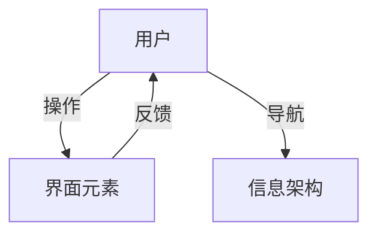

# 5.1 UI-UE-UX设计规范

[返回5.技术规范与标准](./README.md) | [返回Refactor总览](../README.md)

## 目录

- [5.1 UI-UE-UX设计规范](#51-ui-ue-ux设计规范)
  - [目录](#目录)
  - [1. 概述](#1-概述)
  - [2. 理论基础与发展](#2-理论基础与发展)
  - [3. 行业标准与规范](#3-行业标准与规范)
  - [4. 方法论与设计流程](#4-方法论与设计流程)
  - [5. 工程实践与落地](#5-工程实践与落地)
  - [6. 国际化与可访问性](#6-国际化与可访问性)
  - [7. 案例分析](#7-案例分析)
  - [8. 形式化论证与多表征](#8-形式化论证与多表征)
  - [9. 相关性引用](#9-相关性引用)
  - [10. 参考文献](#10-参考文献)

---

## 1. 概述

UI（User Interface，用户界面）、UE（User Engineering，用户工程）、UX（User Experience，用户体验）设计规范是数字产品设计的理论与实践基础。其目标在于提升产品的可用性、美观性、易学性和用户满意度。UI-UE-UX规范不仅关注界面视觉，更强调交互流程、信息架构、情感体验与社会文化适应性。

## 2. 理论基础与发展

UI-UE-UX设计理论源于人机交互（HCI）、认知心理学、符号学、美学、社会学等多学科交叉领域。早期以Shneiderman的"八大黄金法则"[1]、Norman的"可用性五原则"[2]为代表，强调一致性、反馈、容错、简洁等原则。近年来，情感化设计、包容性设计、数据驱动设计等新范式不断涌现。

**举例：**

- "门把手悖论"：Don Norman提出的"可感知性"理论，强调界面元素应自解释。
- "F型浏览模式"：基于眼动追踪的认知心理学实验，指导网页排版。

## 3. 行业标准与规范

主流设计系统和标准包括：

- **Material Design**（Google）：强调栅格系统、动效、色彩层次。
- **Apple Human Interface Guidelines**：注重一致性、直观性、平台特性。
- **Ant Design**（阿里）：面向企业级应用，强调数据密集型场景。
- **WCAG 2.1**（Web Content Accessibility Guidelines）：无障碍设计国际标准。
- **ISO 9241**：人机交互国际标准。

**举例：**

- Material Design 的"Elevation"规范通过阴影层级表达界面层次。
- WCAG 2.1 要求所有图片必须有alt文本，便于屏幕阅读器识别。

## 4. 方法论与设计流程

UI-UE-UX设计流程通常包括：需求分析、用户研究、信息架构、原型设计、可用性测试、迭代优化。

- **用户研究**：问卷、访谈、可用性测试、A/B测试。
- **信息架构**：卡片分类法、树状结构建模。
- **原型设计**：低保真（纸面、线框）、高保真（Figma、Sketch）。
- **可用性测试**：定性（观察、访谈）、定量（SUS量表、任务完成率）。

**举例：**

- 某电商App通过A/B测试优化结算流程，提升转化率15%。
- 使用树状图对复杂后台系统进行信息架构梳理。

## 5. 工程实践与落地

- **设计系统建设**：组件库、样式指南、Token管理、自动化文档。
- **前后端协作**：设计稿标注、自动生成代码、Storybook。
- **CI/CD集成**：设计规范Lint、自动化可用性测试。
- **多端适配**：响应式布局、断点管理、跨平台组件。

**举例：**

- Ant Design 通过Token机制实现主题切换和品牌定制。
- 某团队采用Figma+Storybook实现设计与开发的无缝对接。

## 6. 国际化与可访问性

- **国际化（i18n）**：多语言资源管理、RTL（从右到左）布局、文化适配。
- **本地化（l10n）**：货币、日期、单位、色彩、符号等本地化。
- **可访问性（a11y）**：语义化HTML、ARIA标签、键盘导航、色彩对比、屏幕阅读器支持。
- **包容性设计**：关注老年人、色盲、听障等特殊群体。

**举例：**

- Google 搜索支持200多种语言，界面元素根据文化习惯自动调整。
- 某政务网站通过WCAG 2.1认证，支持无障碍访问。

## 7. 案例分析

- **微信小程序**：通过统一的设计规范和组件库，实现了跨平台一致体验。
- **Apple iOS**：HIG推动了全球移动端UI设计的标准化。
- **GOV.UK**：英国政府数字服务采用严格的可用性和无障碍标准，提升全民服务体验。
- **反例**：某早期P2P理财平台因信息架构混乱、交互不一致导致用户大量流失。

## 8. 形式化论证与多表征

- **设计原则公式化**：如一致性原则可表达为∀x∈UI, Style(x)=Style(Ref(x))。
- **UML/流程图**：



- **代码示例**：

```html
<!-- BEM命名示例 -->
<button class="btn btn--primary">提交</button>
```

- **伪代码**：

```text
If 用户操作无响应:
    提供视觉/听觉/触觉反馈
```

## 9. 相关性引用

- [5.2 可访问性与国际化](./5.2 可访问性与国际化.md)
- [5.3 性能优化与工程实践](./5.3 性能优化与工程实践.md)
- [4.4 哲学与认知批判性分析](../4.设计模式与架构/4.4 哲学与认知批判性分析.md)

## 10. 参考文献

[1] Shneiderman, B. (1992). Designing the User Interface: Strategies for Effective Human-Computer Interaction. Addison-Wesley.
[2] Norman, D. A. (2013). The Design of Everyday Things: Revised and Expanded Edition. Basic Books.
[3] ISO 9241-210:2019 Ergonomics of human-system interaction—Part 210: Human-centred design for interactive systems.
[4] WCAG 2.1: Web Content Accessibility Guidelines. W3C Recommendation.
[5] Google. (2023). Material Design Guidelines. <https://material.io/design/>
[6] Apple. (2023). Human Interface Guidelines. <https://developer.apple.com/design/human-interface-guidelines/>
[7] GOV.UK Service Manual. <https://www.gov.uk/service-manual>
