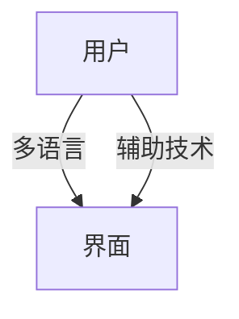

# 5.2 可访问性与国际化

[返回5.技术规范与标准](./README.md) | [返回Refactor总览](../README.md)

## 目录

- [5.2 可访问性与国际化](#52-可访问性与国际化)
  - [目录](#目录)
  - [1. 概述](#1-概述)
  - [2. 主流技术与架构](#2-主流技术与架构)
  - [3. 形式化论证与多表征](#3-形式化论证与多表征)
  - [4. 相关性引用](#4-相关性引用)

---

## 1. 概述

可访问性（Accessibility, a11y）与国际化（i18n）是数字产品面向多元用户群体的关键设计要求。
可访问性关注残障人士的无障碍体验，国际化关注多语言、多文化适配。

## 2. 主流技术与架构

- 可访问性标准：WCAG、ARIA、Section 508。
- 语义化HTML、键盘导航、屏幕阅读器支持。
- 国际化框架：i18next、react-intl、FormatJS。
- 本地化（l10n）：多语言资源、日期/货币/单位格式化。
- 文化适配：文本方向、色彩、符号、图片替换。

## 3. 形式化论证与多表征

- 可访问性测试：自动化工具（axe、Lighthouse）、用户测试。
- 国际化流程：资源抽取、翻译、回填。
- UML用例图：描述多用户、多语言场景。
- 代码示例：

```html
<!-- ARIA无障碍示例 -->
<button aria-label="关闭">×</button>
```

- 图示：



## 4. 相关性引用

- [5.1 UI-UE-UX设计规范](./5.1 UI-UE-UX设计规范.md)
- [5.4 代码示例与形式化证明](./5.4 代码示例与形式化证明.md)
