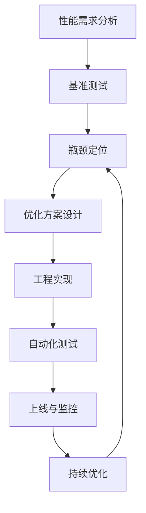
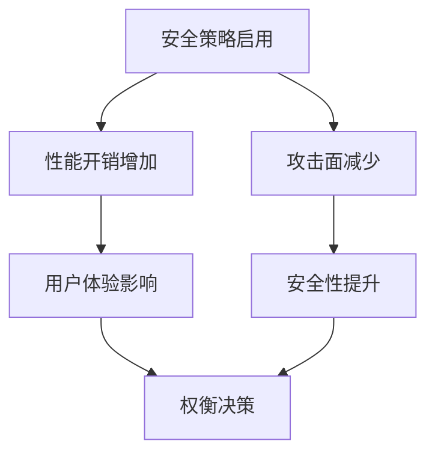
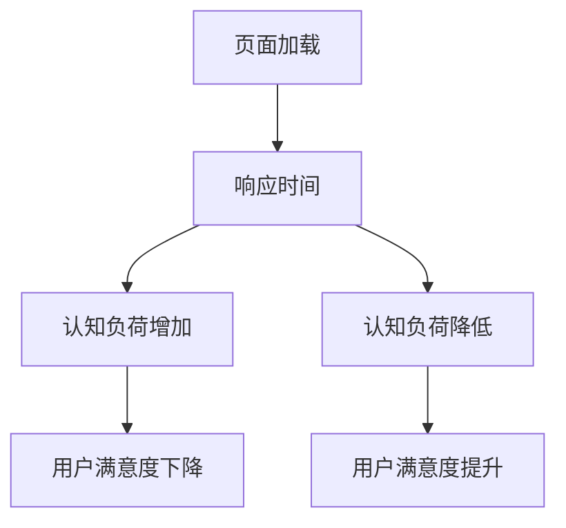

# 5.3 性能优化与工程实践

[返回5.技术规范与标准](./README.md) | [返回Refactor总览](../README.md)

---

## 2024前沿趋势

- **Web性能指标**：Core Web Vitals（LCP、FID、CLS）、INP、TTFB等。
- **构建工具与自动化**：Vite、Webpack 5、esbuild、AI辅助构建优化。
- **缓存策略与CDN**：Service Worker、HTTP缓存、边缘计算、智能CDN。
- **代码分割与懒加载**：动态import、Tree Shaking、按需加载。
- **内存管理与泄漏检测**：现代浏览器内存分析、自动化检测工具。
- **性能监控与分析**：Lighthouse、Sentry、AI驱动性能监控。
- **移动端与多端性能优化**：PWA、响应式图片、资源自适应。

---

## 目录

- [5.3 性能优化与工程实践](#53-性能优化与工程实践)
  - [2024前沿趋势](#2024前沿趋势)
  - [目录](#目录)
  - [5.3.1 性能优化流程Mermaid图](#531-性能优化流程mermaid图)
  - [5.3.2 性能优化LaTeX公式](#532-性能优化latex公式)
  - [5.3.3 多语言性能优化代码示例](#533-多语言性能优化代码示例)
  - [5.3.4 批判性分析与最佳实践](#534-批判性分析与最佳实践)
  - [5.3.5 相关主题推荐阅读](#535-相关主题推荐阅读)
  - [5.3.6 Web安全与AI优化](#536-web安全与ai优化)
  - [5.3.7 认知科学与性能体验](#537-认知科学与性能体验)
  - [5.3.8 相关主题交叉引用递归补全](#538-相关主题交叉引用递归补全)

---

## 5.3.1 性能优化流程Mermaid图



---

## 5.3.2 性能优化LaTeX公式

**响应时间（Response Time）**
$$
T_{response} = T_{network} + T_{server} + T_{render}
$$

**缓存命中率（Cache Hit Ratio）**
$$
Cache\ Hit\ Ratio = \frac{\text{命中请求数}}{\text{总请求数}}
$$

**内存泄漏检测（Memory Leak Detection）**
$$
Leak\ Rate = \frac{\Delta Memory}{\Delta Time}
$$

**性能得分（Performance Score）**
$$
Score = \sum_{i=1}^n w_i \cdot M_i
$$
其中 $M_i$ 为第 $i$ 项性能指标，$w_i$ 为权重。

---

## 5.3.3 多语言性能优化代码示例

**JavaScript 动态import与懒加载**:

```js
// 动态加载大模块
import('lodash').then(_ => {
  // 使用lodash
});
```

**React 代码分割**:

```tsx
import React, { Suspense, lazy } from 'react';
const LazyComponent = lazy(() => import('./HeavyComponent'));
export default function App() {
  return (
    <Suspense fallback={<div>Loading...</div>}>
      <LazyComponent />
    </Suspense>
  );
}
```

**Service Worker 缓存策略**:

```js
self.addEventListener('fetch', event => {
  event.respondWith(
    caches.match(event.request).then(response => {
      return response || fetch(event.request);
    })
  );
});
```

**Rust WebAssembly 性能优化示例**:

```rust
// Rust + wasm-bindgen 高性能计算
use wasm_bindgen::prelude::*;
#[wasm_bindgen]
pub fn sum(arr: &[f64]) -> f64 {
    arr.iter().sum()
}
```

---

## 5.3.4 批判性分析与最佳实践

- **Web性能指标**：应结合业务场景选择合适指标，避免唯分数论。
- **构建工具与自动化**：自动化可提升效率，但需关注配置复杂度与可维护性。
- **缓存策略**：合理分层缓存可大幅提升性能，但需防止缓存失效与一致性问题。
- **代码分割与懒加载**：提升首屏速度，但需平衡用户体验与加载时机。
- **内存管理**：自动化工具有助于发现问题，但根因分析需人工介入。
- **性能监控**：实时监控与AI分析可提前预警，但需防止误报与数据隐私泄露。
- **多端优化**：需兼顾Web、移动、桌面等多端特性，统一性能标准。

---

## 5.3.5 相关主题推荐阅读

- [2.6 Web核心技术](../2.技术栈与框架/2.6 Web核心技术.md)
- [3.4 TypeScript-JavaScript](../3.编程语言范式/3.4 TypeScript-JavaScript.md)
- [5.1 UI-UE-UX设计规范](./5.1 UI-UE-UX设计规范.md)
- [5.2 可访问性与国际化](./5.2 可访问性与国际化.md)
- [6.1 AI基础原理](../6.人工智能原理与算法/6.1 AI基础原理.md)
- [6.4 AI工程实践与伦理](../6.人工智能原理与算法/6.4 AI工程实践与伦理.md)

---

## 5.3.6 Web安全与AI优化

**Web安全与性能的权衡**
- CSP、SRI、HTTPS等安全机制对性能的影响。
- 安全策略的性能建模：
$$
T_{secure} = T_{base} + T_{CSP} + T_{SRI} + T_{TLS}
$$

**AI驱动性能优化案例**
- AI自动检测性能瓶颈与安全漏洞。
- 代码示例：
```js
// AI辅助性能分析伪代码
const report = await ai.analyzePerformanceAndSecurity(siteUrl);
console.log(report);
```

**安全与性能权衡Mermaid图**


**批判性分析**
- 安全措施提升防护但可能带来性能损耗，需结合业务场景动态权衡。
- AI可辅助自动化优化，但需警惕误报与模型偏见。

---

## 5.3.7 认知科学与性能体验

**认知负荷与性能体验公式**
$$
UX_{perf} = f(T_{response}, CL)
$$
其中 $CL$ 为认知负荷，$T_{response}$ 为响应时间。

**认知负荷与性能体验Mermaid图**


**批判性分析**
- 性能优化不仅是技术问题，更关乎用户认知与体验。
- 认知科学理论可指导性能优化优先级与界面简化。

---

## 5.3.8 相关主题交叉引用递归补全

- [2.6 Web核心技术](../2.技术栈与框架/2.6 Web核心技术.md)：Web性能、安全与AI优化的基础理论与实践。
- [6.4 AI工程实践与伦理](../6.人工智能原理与算法/6.4 AI工程实践与伦理.md)：AI驱动性能优化的伦理与工程挑战。
- [5.2 可访问性与国际化](./5.2 可访问性与国际化.md)：性能优化与可访问性、认知负荷的交叉。
- [4.4 哲学与认知批判性分析](../4.设计模式与架构/4.4 哲学与认知批判性分析.md)：性能体验的哲学与认知科学分析。

---

> 本文档持续递归优化，欢迎补充最新学术与工程内容。
