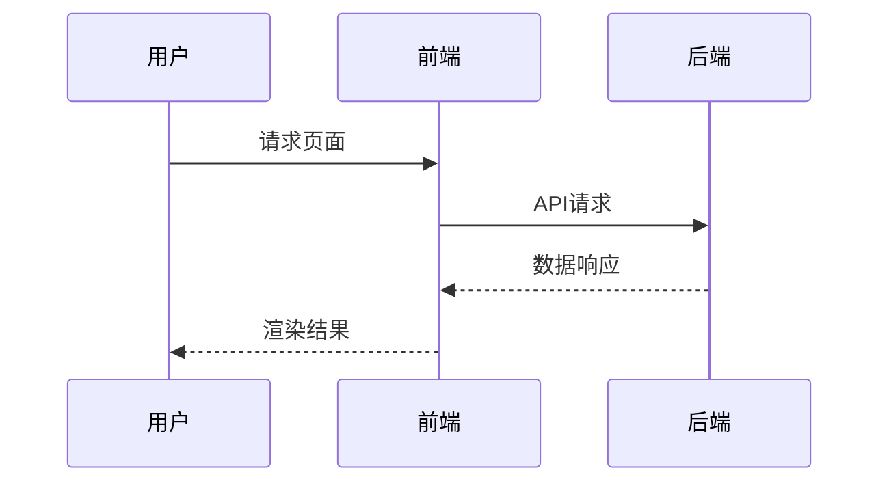

# 5.3 性能优化与工程实践

[返回5.技术规范与标准](./README.md) | [返回Refactor总览](../README.md)

## 目录

- [5.3 性能优化与工程实践](#53-性能优化与工程实践)
  - [目录](#目录)
  - [1. 概述](#1-概述)
  - [2. 主流技术与架构](#2-主流技术与架构)
  - [3. 形式化论证与多表征](#3-形式化论证与多表征)
  - [4. 相关性引用](#4-相关性引用)

---

## 1. 概述

性能优化与工程实践是保障数字产品高效、稳定、可扩展运行的关键。涵盖前端、后端、网络、存储等多层次的性能分析与优化方法。

## 2. 主流技术与架构

- 前端优化：懒加载、Tree Shaking、代码分割、CDN加速。
- 后端优化：缓存、负载均衡、异步处理、微服务架构。
- 网络优化：HTTP/2、压缩、长连接、边缘计算。
- 工程实践：CI/CD、自动化测试、监控与告警。
- 性能指标：FCP、LCP、TTFB、QPS、P99延迟。

## 3. 形式化论证与多表征

- 性能建模：以排队论、瓶颈分析描述系统性能。
- UML时序图：建模请求-响应流程。
- 代码示例：

```js
// 懒加载示例
const LazyComponent = React.lazy(() => import('./Component'));
```

- 图示：



## 4. 相关性引用

- [5.1 UI-UE-UX设计规范](./5.1 UI-UE-UX设计规范.md)
- [5.4 代码示例与形式化证明](./5.4 代码示例与形式化证明.md)
