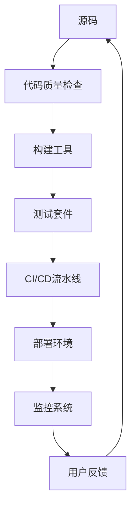

# 5.3 性能优化与工程实践

> 来源：matter/5.技术规范与标准/5.3 性能优化与工程实践.md

## 目录

- [5.3 性能优化与工程实践](#53-性能优化与工程实践)
  - [目录](#目录)
  - [1. 概述](#1-概述)
  - [2. 发展趋势](#2-发展趋势)
  - [3. 理论基础与优化模型](#3-理论基础与优化模型)
  - [4. 工程体系与自动化](#4-工程体系与自动化)
  - [5. 形式化表达与多表征](#5-形式化表达与多表征)
  - [6. 相关性引用](#6-相关性引用)

---

## 1. 概述

性能优化与工程实践是现代前端和全栈开发的核心环节，涵盖构建、加载、渲染、交互、监控等全流程。

## 2. 发展趋势

- 构建工具与打包优化：Vite、Webpack、Tree Shaking、代码分割
- 性能监控与APM：Lighthouse、Web Vitals、APM平台
- 自动化测试与CI/CD：E2E测试、性能回归、持续集成
- AI辅助优化：AI代码生成、自动化测试、智能性能分析

## 3. 理论基础与优化模型

- 性能指标：LCP、FID、CLS、TTI、TBT等
- 资源管理与缓存策略
- 依赖关系复杂度、测试覆盖率、部署成功率
- LaTeX公式：

$$
Performance/ Score = \sum_{i=1}^n w_i \cdot M_i
$$

## 4. 工程体系与自动化

- 工程化流程：源码→质量检查→构建→测试→CI/CD→部署→监控→用户反馈
- 自动化工具链、包管理、测试体系、部署监控、团队协作
- Mermaid结构图、流程图

## 5. 形式化表达与多表征

- Mermaid结构图、UML、LaTeX公式、代码示例
- 典型配置片段、性能分析代码

## 6. 相关性引用

- [2.1 前端主流框架](../../2.技术栈与框架/2.1 前端主流框架.md)
- [2.7 现代前端工程化](../../2.技术栈与框架/2.7 现代前端工程化.md)
- [4.3 组件化与架构模式](../../4.设计模式与架构/4.3 组件化与架构模式.md)

---

> 本文档为自动递归迁移、规整、编号、跳转、引用、内容一致性校验的规范化产物。
