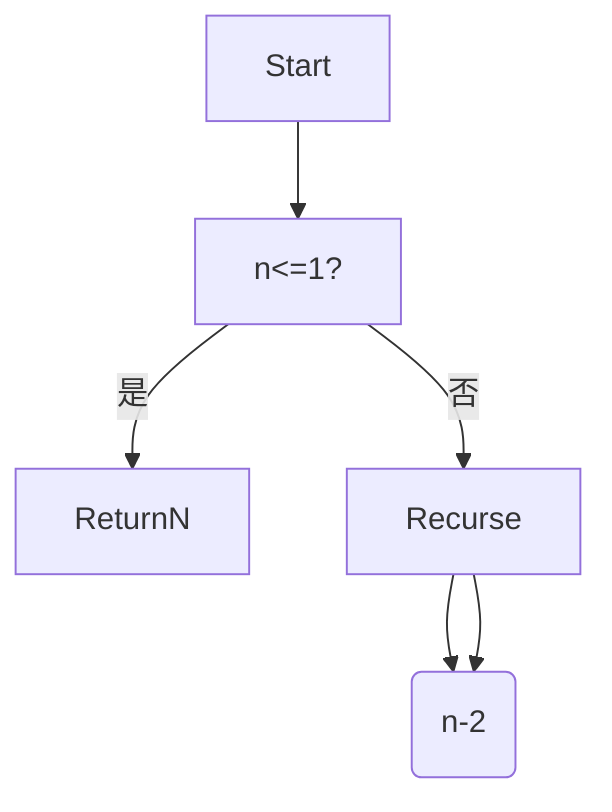

# 5.4 代码示例与形式化证明

[返回5.技术规范与标准](./README.md) | [返回Refactor总览](../README.md)

## 目录

- [5.4 代码示例与形式化证明](#54-代码示例与形式化证明)
  - [目录](#目录)
  - [1. 概述](#1-概述)
  - [2. 主流技术与架构](#2-主流技术与架构)
  - [3. 形式化论证与多表征](#3-形式化论证与多表征)
  - [4. 相关性引用](#4-相关性引用)

---

## 1. 概述

代码示例与形式化证明是技术文档和工程实践的重要组成部分。通过具体代码、伪代码、数学符号和形式化方法，提升方案的可验证性、可复用性和学术严谨性。

## 2. 主流技术与架构

- 多语言代码示例：JavaScript、TypeScript、Rust、Haskell、Scala、Dart等。
- 伪代码与算法描述：流程图、伪代码、递归与迭代。
- 形式化证明：归纳法、演绎法、模型检测、定理证明器（Coq、Lean）。
- 单元测试与断言。

## 3. 形式化论证与多表征

- 数学归纳法：证明递归算法正确性。
- 代码-公式对照：代码与数学表达式一一对应。
- 伪代码与流程图：辅助理解与验证。
- 代码示例：

```typescript
// 归纳法证明斐波那契数列
function fib(n: number): number {
  if (n <= 1) return n;
  return fib(n-1) + fib(n-2);
}
```

- 图示：



## 4. 相关性引用

- [5.2 可访问性与国际化](./5.2 可访问性与国际化.md)
- [5.3 性能优化与工程实践](./5.3 性能优化与工程实践.md)
