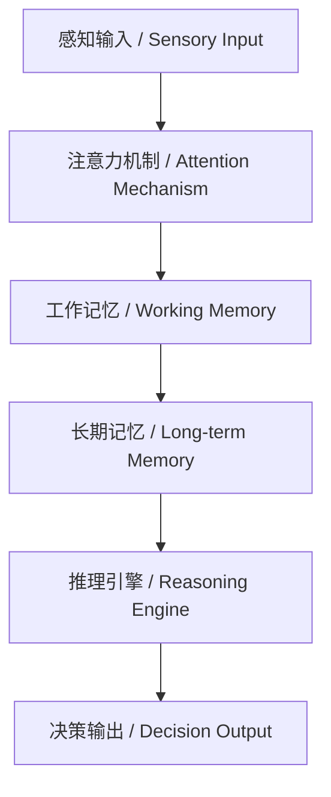
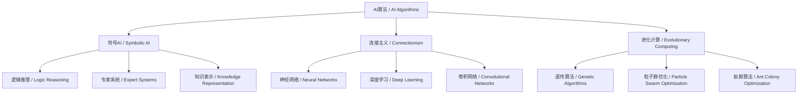

# 6.1 AI基础原理 / AI Fundamental Principles

> 来源：matter/6.人工智能原理与算法/6.1 AI基础原理.md

## 目录 / Table of Contents

- [6.1 AI基础原理](#61-ai基础原理--ai-fundamental-principles)
  - [目录 / Table of Contents](#目录--table-of-contents)
  - [1. 概述 / Overview](#1-概述--overview)
  - [2. 理论基础 / Theoretical Foundation](#2-理论基础--theoretical-foundation)
  - [3. 核心概念与形式化定义 / Core Concepts & Formal Definitions](#3-核心概念与形式化定义--core-concepts--formal-definitions)
  - [4. 算法分类与架构模式 / Algorithm Classification & Architectural Patterns](#4-算法分类与架构模式--algorithm-classification--architectural-patterns)
  - [5. 工程实践与最佳实践 / Engineering Practices & Best Practices](#5-工程实践与最佳实践--engineering-practices--best-practices)
  - [6. 形式化论证与多表征 / Formal Arguments & Multi-representation](#6-形式化论证与多表征--formal-arguments--multi-representation)
  - [7. 批判性分析与哲学思考 / Critical Analysis & Philosophical Reflection](#7-批判性分析与哲学思考--critical-analysis--philosophical-reflection)
  - [8. 相关性引用 / Related References](#8-相关性引用--related-references)

---

## 1. 概述 / Overview

人工智能（Artificial Intelligence, AI）是计算机科学的一个分支，旨在创建能够执行通常需要人类智能的任务的系统。AI基础原理涵盖了从符号推理到机器学习的广泛领域，为现代AI系统提供了理论基础。

Artificial Intelligence (AI) is a branch of computer science that aims to create systems capable of performing tasks that typically require human intelligence. AI fundamental principles cover a broad spectrum from symbolic reasoning to machine learning, providing the theoretical foundation for modern AI systems.

### 1.1 定义与范畴 / Definition and Scope

**中文定义：** AI是使机器能够模拟人类智能行为的技术，包括学习、推理、感知、语言理解和问题解决等能力。

**English Definition:** AI is the technology that enables machines to simulate human intelligent behaviors, including learning, reasoning, perception, language understanding, and problem-solving capabilities.

### 1.2 发展历程 / Historical Development

| 时期 / Period | 主要特征 / Key Characteristics | 代表性成果 / Representative Achievements |
|---------------|------------------------------|----------------------------------------|
| 1950s-1960s | 符号主义 / Symbolism | 逻辑推理、专家系统 / Logic reasoning, Expert systems |
| 1970s-1980s | 连接主义 / Connectionism | 神经网络、感知机 / Neural networks, Perceptron |
| 1990s-2000s | 统计学习 / Statistical Learning | 支持向量机、贝叶斯网络 / SVM, Bayesian networks |
| 2010s-至今 | 深度学习 / Deep Learning | 卷积神经网络、Transformer / CNN, Transformer |

---

## 2. 理论基础 / Theoretical Foundation

### 2.1 认知科学基础 / Cognitive Science Foundation

**中文：** AI的理论基础深深植根于认知科学，包括感知、记忆、学习、推理等认知过程的形式化建模。

**English:** The theoretical foundation of AI is deeply rooted in cognitive science, including formal modeling of cognitive processes such as perception, memory, learning, and reasoning.

#### 2.1.1 认知架构 / Cognitive Architecture



#### 2.1.2 信息处理理论 / Information Processing Theory

**形式化定义 / Formal Definition:**

设 $I$ 为输入信息集合，$O$ 为输出集合，$P$ 为处理函数，则AI系统可表示为：

Let $I$ be the input information set, $O$ be the output set, and $P$ be the processing function, then an AI system can be represented as:

$$P: I \rightarrow O$$

其中处理函数 $P$ 包含多个子函数：
Where the processing function $P$ contains multiple sub-functions:

$$P = f_{attention} \circ f_{memory} \circ f_{reasoning} \circ f_{decision}$$

### 2.2 数学基础 / Mathematical Foundation

#### 2.2.1 概率论与统计学 / Probability Theory & Statistics

**中文：** 不确定性处理是AI系统的核心挑战，概率论提供了处理不确定性的数学工具。

**English:** Uncertainty handling is a core challenge for AI systems, and probability theory provides mathematical tools for dealing with uncertainty.

**贝叶斯定理 / Bayes' Theorem:**

$$P(A|B) = \frac{P(B|A) \cdot P(A)}{P(B)}$$

#### 2.2.2 优化理论 / Optimization Theory

**中文：** AI算法本质上是优化问题，目标函数的最小化或最大化。

**English:** AI algorithms are essentially optimization problems, minimizing or maximizing objective functions.

**梯度下降 / Gradient Descent:**

$$\theta_{t+1} = \theta_t - \alpha \nabla J(\theta_t)$$

其中 $\alpha$ 是学习率，$\nabla J(\theta_t)$ 是目标函数在 $\theta_t$ 处的梯度。
Where $\alpha$ is the learning rate, and $\nabla J(\theta_t)$ is the gradient of the objective function at $\theta_t$.

---

## 3. 核心概念与形式化定义 / Core Concepts & Formal Definitions

### 3.1 智能的定义 / Definition of Intelligence

#### 3.1.1 图灵测试 / Turing Test

**中文定义：** 如果人类评判者无法区分机器和人类的回答，则认为机器具有智能。

**English Definition:** If a human judge cannot distinguish between machine and human responses, the machine is considered intelligent.

**形式化定义 / Formal Definition:**

设 $H$ 为人类集合，$M$ 为机器集合，$Q$ 为问题集合，$A$ 为回答集合，则图灵测试可表示为：

Let $H$ be the set of humans, $M$ be the set of machines, $Q$ be the set of questions, $A$ be the set of answers, then the Turing Test can be represented as:

$$T: H \times M \times Q \rightarrow \{0, 1\}$$

其中 $T(h, m, q) = 1$ 表示评判者 $h$ 认为机器 $m$ 对问题 $q$ 的回答是人类的。
Where $T(h, m, q) = 1$ indicates that judge $h$ believes machine $m$'s answer to question $q$ is human.

#### 3.1.2 智能的多元定义 / Multiple Definitions of Intelligence

| 维度 / Dimension | 定义 / Definition | 评估指标 / Evaluation Metrics |
|------------------|-------------------|------------------------------|
| 逻辑推理 / Logical Reasoning | 形式逻辑推理能力 / Formal logical reasoning ability | 数学证明、逻辑游戏 / Mathematical proofs, Logic games |
| 模式识别 / Pattern Recognition | 识别数据中的模式 / Recognizing patterns in data | 分类准确率、聚类质量 / Classification accuracy, Clustering quality |
| 学习能力 / Learning Ability | 从经验中改进 / Improving from experience | 学习曲线、泛化能力 / Learning curves, Generalization ability |
| 创造力 / Creativity | 生成新颖解决方案 / Generating novel solutions | 创新性评分、多样性 / Innovation scores, Diversity |

### 3.2 学习理论 / Learning Theory

#### 3.2.1 监督学习 / Supervised Learning

**中文：** 从标记的训练数据中学习输入到输出的映射关系。

**English:** Learning input-to-output mapping relationships from labeled training data.

**形式化定义 / Formal Definition:**

给定训练集 $D = \{(x_i, y_i)\}_{i=1}^n$，其中 $x_i \in \mathcal{X}$ 是输入，$y_i \in \mathcal{Y}$ 是标签，学习目标是找到函数 $f: \mathcal{X} \rightarrow \mathcal{Y}$ 使得：

Given training set $D = \{(x_i, y_i)\}_{i=1}^n$, where $x_i \in \mathcal{X}$ is input and $y_i \in \mathcal{Y}$ is label, the learning objective is to find function $f: \mathcal{X} \rightarrow \mathcal{Y}$ such that:

$$\min_f \sum_{i=1}^n L(f(x_i), y_i)$$

其中 $L$ 是损失函数。
Where $L$ is the loss function.

#### 3.2.2 无监督学习 / Unsupervised Learning

**中文：** 从未标记数据中发现隐藏的结构和模式。

**English:** Discovering hidden structures and patterns from unlabeled data.

**聚类算法 / Clustering Algorithm:**

$$C = \arg\min_C \sum_{i=1}^n \min_{c \in C} d(x_i, c)$$

其中 $C$ 是聚类中心集合，$d$ 是距离函数。
Where $C$ is the set of cluster centers, and $d$ is the distance function.

#### 3.2.3 强化学习 / Reinforcement Learning

**中文：** 通过与环境交互学习最优策略。

**English:** Learning optimal policies through interaction with the environment.

**马尔可夫决策过程 / Markov Decision Process (MDP):**

$$M = (\mathcal{S}, \mathcal{A}, \mathcal{P}, \mathcal{R}, \gamma)$$

其中 $\mathcal{S}$ 是状态空间，$\mathcal{A}$ 是动作空间，$\mathcal{P}$ 是转移概率，$\mathcal{R}$ 是奖励函数，$\gamma$ 是折扣因子。
Where $\mathcal{S}$ is the state space, $\mathcal{A}$ is the action space, $\mathcal{P}$ is the transition probability, $\mathcal{R}$ is the reward function, and $\gamma$ is the discount factor.

**价值函数 / Value Function:**

$$V^\pi(s) = \mathbb{E}_\pi \left[ \sum_{t=0}^{\infty} \gamma^t R(s_t, a_t) \right]$$

---

## 4. 算法分类与架构模式 / Algorithm Classification & Architectural Patterns

### 4.1 算法分类体系 / Algorithm Classification System



### 4.2 架构模式 / Architectural Patterns

#### 4.2.1 分层架构 / Layered Architecture

**中文：** 将AI系统分解为多个功能层，每层处理特定抽象级别的任务。

**English:** Decomposing AI systems into multiple functional layers, each handling tasks at specific abstraction levels.

```python
# 分层AI架构示例 / Layered AI Architecture Example
class LayeredAI:
    def __init__(self):
        self.perception_layer = PerceptionLayer()
        self.reasoning_layer = ReasoningLayer()
        self.decision_layer = DecisionLayer()
    
    def process(self, input_data):
        # 感知层 / Perception Layer
        features = self.perception_layer.extract_features(input_data)
        
        # 推理层 / Reasoning Layer
        reasoning_result = self.reasoning_layer.analyze(features)
        
        # 决策层 / Decision Layer
        decision = self.decision_layer.make_decision(reasoning_result)
        
        return decision
```

#### 4.2.2 模块化架构 / Modular Architecture

**中文：** 将AI系统分解为独立的功能模块，支持灵活组合和替换。

**English:** Decomposing AI systems into independent functional modules, supporting flexible combination and replacement.

```python
# 模块化AI架构示例 / Modular AI Architecture Example
class ModularAI:
    def __init__(self):
        self.modules = {
            'vision': VisionModule(),
            'language': LanguageModule(),
            'planning': PlanningModule(),
            'control': ControlModule()
        }
    
    def execute(self, task):
        # 任务分解 / Task decomposition
        subtasks = self.decompose_task(task)
        
        # 模块协作 / Module collaboration
        results = {}
        for subtask, module_name in subtasks:
            module = self.modules[module_name]
            results[subtask] = module.process(subtask)
        
        return self.integrate_results(results)
```

### 4.3 算法复杂度分析 / Algorithm Complexity Analysis

#### 4.3.1 时间复杂度 / Time Complexity

| 算法类型 / Algorithm Type | 平均时间复杂度 / Average Time Complexity | 空间复杂度 / Space Complexity |
|---------------------------|----------------------------------------|------------------------------|
| 线性回归 / Linear Regression | $O(n \cdot d)$ | $O(d)$ |
| 决策树 / Decision Tree | $O(n \cdot d \cdot \log n)$ | $O(n \cdot d)$ |
| 支持向量机 / SVM | $O(n^2 \cdot d)$ | $O(n \cdot d)$ |
| 神经网络 / Neural Network | $O(n \cdot d \cdot h)$ | $O(d \cdot h)$ |

其中 $n$ 是样本数，$d$ 是特征维度，$h$ 是隐藏层节点数。
Where $n$ is the number of samples, $d$ is the feature dimension, and $h$ is the number of hidden layer nodes.

#### 4.3.2 收敛性分析 / Convergence Analysis

**梯度下降收敛定理 / Gradient Descent Convergence Theorem:**

假设损失函数 $J(\theta)$ 是凸函数且Lipschitz连续，则梯度下降算法收敛到全局最优解：

Assuming the loss function $J(\theta)$ is convex and Lipschitz continuous, then gradient descent converges to the global optimal solution:

$$\|\theta_{t+1} - \theta^*\| \leq (1 - \alpha L)^t \|\theta_0 - \theta^*\|$$

其中 $L$ 是Lipschitz常数，$\alpha$ 是学习率。
Where $L$ is the Lipschitz constant and $\alpha$ is the learning rate.

---

## 5. 工程实践与最佳实践 / Engineering Practices & Best Practices

### 5.1 数据预处理 / Data Preprocessing

#### 5.1.1 数据清洗 / Data Cleaning

**中文：** 处理缺失值、异常值、重复数据等数据质量问题。

**English:** Handling missing values, outliers, duplicate data, and other data quality issues.

```python
# 数据清洗示例 / Data Cleaning Example
import pandas as pd
import numpy as np

def clean_data(df):
    # 处理缺失值 / Handle missing values
    df = df.fillna(df.mean())  # 数值型用均值填充 / Fill numeric with mean
    
    # 处理异常值 / Handle outliers
    Q1 = df.quantile(0.25)
    Q3 = df.quantile(0.75)
    IQR = Q3 - Q1
    df = df[~((df < (Q1 - 1.5 * IQR)) | (df > (Q3 + 1.5 * IQR))).any(axis=1)]
    
    # 标准化 / Standardization
    df = (df - df.mean()) / df.std()
    
    return df
```

#### 5.1.2 特征工程 / Feature Engineering

**中文：** 创建、选择和转换特征以提高模型性能。

**English:** Creating, selecting, and transforming features to improve model performance.

```python
# 特征工程示例 / Feature Engineering Example
from sklearn.feature_extraction.text import TfidfVectorizer
from sklearn.decomposition import PCA

def feature_engineering(X, y):
    # 文本特征提取 / Text feature extraction
    if isinstance(X[0], str):
        vectorizer = TfidfVectorizer(max_features=1000)
        X = vectorizer.fit_transform(X)
    
    # 降维 / Dimensionality reduction
    if X.shape[1] > 100:
        pca = PCA(n_components=50)
        X = pca.fit_transform(X)
    
    return X, y
```

### 5.2 模型评估 / Model Evaluation

#### 5.2.1 评估指标 / Evaluation Metrics

**分类问题 / Classification Problems:**

- **准确率 / Accuracy:** $\text{Accuracy} = \frac{TP + TN}{TP + T
