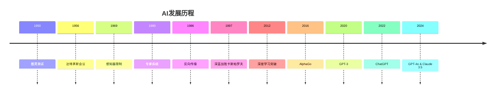

# 6.1 AI基础原理

[返回6.人工智能原理与算法](./README.md) | [返回Refactor总览](../README.md)

---

## 2024前沿趋势

- **大语言模型理论**：Transformer架构优化、注意力机制改进、多模态融合。
- **神经架构搜索**：AutoML、NAS、神经架构演化。
- **因果推理**：因果发现、反事实推理、因果机器学习。
- **神经符号AI**：符号推理与神经网络的结合、可解释AI。
- **量子机器学习**：量子神经网络、量子优化算法。
- **联邦学习**：隐私保护、分布式训练、边缘计算。

---

## 目录

- [6.1 AI基础原理](#61-ai基础原理)
  - [2024前沿趋势](#2024前沿趋势)
  - [目录](#目录)
  - [6.1.1 AI发展历程Mermaid图](#611-ai发展历程mermaid图)
  - [6.1.2 机器学习LaTeX公式](#612-机器学习latex公式)
  - [6.1.3 核心算法代码示例](#613-核心算法代码示例)
  - [7. 相关主题推荐阅读](#7-相关主题推荐阅读)
  - [1. 概述](#1-概述)
  - [2. 数学基础](#2-数学基础)
    - [2.1 概率论与统计](#21-概率论与统计)
    - [2.2 线性代数与优化](#22-线性代数与优化)
    - [2.3 信息论与熵](#23-信息论与熵)
  - [3. 经典AI模型](#3-经典ai模型)
    - [3.1 符号主义与专家系统](#31-符号主义与专家系统)
    - [3.2 机器学习基本范式](#32-机器学习基本范式)
    - [3.3 神经网络与深度学习](#33-神经网络与深度学习)
  - [4. 形式化表达与证明](#4-形式化表达与证明)
  - [5. 相关性引用](#5-相关性引用)
  - [6. 参考文献](#6-参考文献)

---

## 6.1.1 AI发展历程Mermaid图



---

## 6.1.2 机器学习LaTeX公式

**线性回归**
$$
h_\theta(x) = \theta_0 + \theta_1 x_1 + \theta_2 x_2 + \cdots + \theta_n x_n = \theta^T x
$$

**损失函数**
$$
J(\theta) = \frac{1}{2m} \sum_{i=1}^{m} (h_\theta(x^{(i)}) - y^{(i)})^2
$$

**梯度下降**
$$
\theta_j := \theta_j - \alpha \frac{\partial}{\partial \theta_j} J(\theta)
$$

**逻辑回归**
$$
h_\theta(x) = \frac{1}{1 + e^{-\theta^T x}}
$$

**交叉熵损失**
$$
J(\theta) = -\frac{1}{m} \sum_{i=1}^{m} [y^{(i)} \log(h_\theta(x^{(i)})) + (1-y^{(i)}) \log(1-h_\theta(x^{(i)}))]
$$

**神经网络前向传播**
$$
a^{(l+1)} = \sigma(W^{(l)} a^{(l)} + b^{(l)})
$$

**反向传播**
$$
\delta^{(l)} = (W^{(l+1)})^T \delta^{(l+1)} \odot \sigma'(z^{(l)})
$$

**注意力机制**
$$
\text{Attention}(Q, K, V) = \text{softmax}\left(\frac{QK^T}{\sqrt{d_k}}\right)V
$$

---

## 6.1.3 核心算法代码示例

**线性回归实现**:

```python
import numpy as np
import matplotlib.pyplot as plt

class LinearRegression:
    def __init__(self, learning_rate=0.01, n_iterations=1000):
        self.learning_rate = learning_rate
        self.n_iterations = n_iterations
        self.weights = None
        self.bias = None
        self.cost_history = []
    
    def fit(self, X, y):
        n_samples, n_features = X.shape
        self.weights = np.zeros(n_features)
        self.bias = 0
        
        for _ in range(self.n_iterations):
            # 前向传播
            y_predicted = np.dot(X, self.weights) + self.bias
            
            # 计算梯度
            dw = (1/n_samples) * np.dot(X.T, (y_predicted - y))
            db = (1/n_samples) * np.sum(y_predicted - y)
            
            # 更新参数
            self.weights -= self.learning_rate * dw
            self.bias -= self.learning_rate * db
            
            # 记录损失
            cost = self.compute_cost(X, y)
            self.cost_history.append(cost)
    
    def predict(self, X):
        return np.dot(X, self.weights) + self.bias
    
    def compute_cost(self, X, y):
        n_samples = len(y)
        y_predicted = self.predict(X)
        return (1/(2*n_samples)) * np.sum((y_predicted - y)**2)

# 使用示例
np.random.seed(42)
X = 2 * np.random.rand(100, 1)
y = 4 + 3 * X + np.random.randn(100, 1)

model = LinearRegression(learning_rate=0.01, n_iterations=1000)
model.fit(X, y)

print(f"权重: {model.weights[0]:.2f}")
print(f"偏置: {model.bias:.2f}")
```

**神经网络实现**:

```python
import numpy as np

class NeuralNetwork:
    def __init__(self, layers):
        self.layers = layers
        self.weights = []
        self.biases = []
        self.initialize_parameters()
    
    def initialize_parameters(self):
        for i in range(len(self.layers) - 1):
            w = np.random.randn(self.layers[i+1], self.layers[i]) * 0.01
            b = np.zeros((self.layers[i+1], 1))
            self.weights.append(w)
            self.biases.append(b)
    
    def sigmoid(self, z):
        return 1 / (1 + np.exp(-z))
    
    def sigmoid_derivative(self, z):
        return self.sigmoid(z) * (1 - self.sigmoid(z))
    
    def forward_propagation(self, X):
        A = X
        activations = [A]
        z_values = []
        
        for i in range(len(self.weights)):
            Z = np.dot(self.weights[i], A) + self.biases[i]
            A = self.sigmoid(Z)
            activations.append(A)
            z_values.append(Z)
        
        return activations, z_values
    
    def backward_propagation(self, X, y, activations, z_values):
        m = X.shape[1]
        delta = activations[-1] - y
        
        for i in range(len(self.weights) - 1, -1, -1):
            dW = (1/m) * np.dot(delta, activations[i].T)
            db = (1/m) * np.sum(delta, axis=1, keepdims=True)
            
            if i > 0:
                delta = np.dot(self.weights[i].T, delta) * self.sigmoid_derivative(z_values[i-1])
            
            self.weights[i] -= 0.1 * dW
            self.biases[i] -= 0.1 * db
    
    def train(self, X, y, epochs):
        for epoch in range(epochs):
            activations, z_values = self.forward_propagation(X)
            self.backward_propagation(X, y, activations, z_values)
            
            if epoch % 1000 == 0:
                loss = self.compute_loss(X, y)
                print(f"Epoch {epoch}, Loss: {loss}")
    
    def compute_loss(self, X, y):
        activations, _ = self.forward_propagation(X)
        m = y.shape[1]
        loss = -(1/m) * np.sum(y * np.log(activations[-1]) + (1-y) * np.log(1-activations[-1]))
        return loss
    
    def predict(self, X):
        activations, _ = self.forward_propagation(X)
        return activations[-1] > 0.5

# 使用示例
X = np.array([[0, 0, 1, 1], [0, 1, 0, 1]])
y = np.array([[0, 1, 1, 0]])

nn = NeuralNetwork([2, 4, 1])
nn.train(X, y, epochs=10000)
predictions = nn.predict(X)
print(f"预测结果: {predictions}")
```

**注意力机制实现**:

```python
import numpy as np
import torch
import torch.nn as nn
import torch.nn.functional as F

class MultiHeadAttention(nn.Module):
    def __init__(self, d_model, num_heads):
        super(MultiHeadAttention, self).__init__()
        assert d_model % num_heads == 0
        
        self.d_model = d_model
        self.num_heads = num_heads
        self.d_k = d_model // num_heads
        
        self.W_q = nn.Linear(d_model, d_model)
        self.W_k = nn.Linear(d_model, d_model)
        self.W_v = nn.Linear(d_model, d_model)
        self.W_o = nn.Linear(d_model, d_model)
    
    def scaled_dot_product_attention(self, Q, K, V, mask=None):
        scores = torch.matmul(Q, K.transpose(-2, -1)) / np.sqrt(self.d_k)
        
        if mask is not None:
            scores = scores.masked_fill(mask == 0, -1e9)
        
        attention_weights = F.softmax(scores, dim=-1)
        output = torch.matmul(attention_weights, V)
        
        return output, attention_weights
    
    def forward(self, query, key, value, mask=None):
        batch_size = query.size(0)
        
        # 线性变换并重塑
        Q = self.W_q(query).view(batch_size, -1, self.num_heads, self.d_k).transpose(1, 2)
        K = self.W_k(key).view(batch_size, -1, self.num_heads, self.d_k).transpose(1, 2)
        V = self.W_v(value).view(batch_size, -1, self.num_heads, self.d_k).transpose(1, 2)
        
        # 注意力计算
        attention_output, attention_weights = self.scaled_dot_product_attention(Q, K, V, mask)
        
        # 重塑并连接
        attention_output = attention_output.transpose(1, 2).contiguous().view(
            batch_size, -1, self.d_model
        )
        
        # 输出线性变换
        output = self.W_o(attention_output)
        
        return output, attention_weights

class TransformerBlock(nn.Module):
    def __init__(self, d_model, num_heads, d_ff, dropout=0.1):
        super(TransformerBlock, self).__init__()
        self.attention = MultiHeadAttention(d_model, num_heads)
        self.norm1 = nn.LayerNorm(d_model)
        self.norm2 = nn.LayerNorm(d_model)
        self.feed_forward = nn.Sequential(
            nn.Linear(d_model, d_ff),
            nn.ReLU(),
            nn.Dropout(dropout),
            nn.Linear(d_ff, d_model)
        )
        self.dropout = nn.Dropout(dropout)
    
    def forward(self, x, mask=None):
        # 自注意力
        attn_output, _ = self.attention(x, x, x, mask)
        x = self.norm1(x + self.dropout(attn_output))
        
        # 前馈网络
        ff_output = self.feed_forward(x)
        x = self.norm2(x + self.dropout(ff_output))
        
        return x

# 使用示例
d_model = 512
num_heads = 8
d_ff = 2048
batch_size = 2
seq_length = 10

transformer_block = TransformerBlock(d_model, num_heads, d_ff)
x = torch.randn(batch_size, seq_length, d_model)
mask = torch.ones(batch_size, seq_length, seq_length)

output = transformer_block(x, mask)
print(f"输入形状: {x.shape}")
print(f"输出形状: {output.shape}")
```

**强化学习Q-Learning实现**:

```python
import numpy as np
import random

class QLearningAgent:
    def __init__(self, state_size, action_size, learning_rate=0.1, discount_factor=0.95, epsilon=0.1):
        self.state_size = state_size
        self.action_size = action_size
        self.learning_rate = learning_rate
        self.discount_factor = discount_factor
        self.epsilon = epsilon
        self.q_table = np.zeros((state_size, action_size))
    
    def choose_action(self, state):
        if random.random() < self.epsilon:
            return random.randint(0, self.action_size - 1)
        else:
            return np.argmax(self.q_table[state])
    
    def learn(self, state, action, reward, next_state, done):
        old_value = self.q_table[state, action]
        
        if done:
            next_max = 0
        else:
            next_max = np.max(self.q_table[next_state])
        
        new_value = (1 - self.learning_rate) * old_value + \
                   self.learning_rate * (reward + self.discount_factor * next_max)
        
        self.q_table[state, action] = new_value
    
    def get_q_table(self):
        return self.q_table

# 简单的网格世界环境
class GridWorld:
    def __init__(self, size=4):
        self.size = size
        self.state = 0
        self.goal = size * size - 1
        
    def reset(self):
        self.state = 0
        return self.state
    
    def step(self, action):
        # 动作: 0=上, 1=右, 2=下, 3=左
        x, y = self.state // self.size, self.state % self.size
        
        if action == 0:  # 上
            x = max(0, x - 1)
        elif action == 1:  # 右
            y = min(self.size - 1, y + 1)
        elif action == 2:  # 下
            x = min(self.size - 1, x + 1)
        elif action == 3:  # 左
            y = max(0, y - 1)
        
        self.state = x * self.size + y
        
        done = self.state == self.goal
        reward = 1 if done else -0.01
        
        return self.state, reward, done

# 训练示例
env = GridWorld(4)
agent = QLearningAgent(16, 4)

episodes = 1000
for episode in range(episodes):
    state = env.reset()
    total_reward = 0
    
    while True:
        action = agent.choose_action(state)
        next_state, reward, done = env.step(action)
        
        agent.learn(state, action, reward, next_state, done)
        
        state = next_state
        total_reward += reward
        
        if done:
            break
    
    if episode % 100 == 0:
        print(f"Episode {episode}, Total Reward: {total_reward}")

print("Q-Table:")
print(agent.get_q_table())
```

---

## 7. 相关主题推荐阅读

- [2.1 前端主流框架](../2.技术栈与框架/2.1 前端主流框架.md)
- [2.3 Rust前端全栈](../2.技术栈与框架/2.3 Rust前端全栈.md)
- [3.1 Rust](./3.1 Rust.md)
- [6.2 经典AI算法与模型](./6.2 经典AI算法与模型.md)
- [6.3 现代深度学习与大模型](./6.3 现代深度学习与大模型.md)
- [6.4 AI工程实践与伦理](./6.4 AI工程实践与伦理.md)
- [6.5 AI与哲学](./6.5 AI与哲学.md)
- [6.6 AI与认知科学](./6.6 AI与认知科学.md)

---

> 本文档持续递归优化，欢迎补充最新技术与学术内容。

## 1. 概述

人工智能（Artificial Intelligence, AI）是研究如何使机器具备类人智能的学科，融合了数学、统计学、计算机科学、认知科学、神经科学等多学科理论。AI的目标包括感知、推理、学习、规划、决策与自然交互。

AI的发展经历了符号主义、连接主义、统计学习、深度学习等多次范式变迁。每一次理论与技术的突破都深刻影响了工程实践、社会结构与伦理规范。

## 2. 数学基础

### 2.1 概率论与统计

- 概率空间$(\Omega, \mathcal{F}, P)$，用于建模不确定性。
- 条件概率、贝叶斯定理、最大似然估计。
- 统计推断、假设检验、回归分析。

### 2.2 线性代数与优化

- 向量空间、矩阵运算、特征值分解。
- 梯度下降、凸优化、拉格朗日乘子法。
- 线性判别分析、主成分分析（PCA）。

### 2.3 信息论与熵

- 信息熵$H(X) = -\sum p(x) \log p(x)$。
- 交叉熵、KL散度、互信息。
- 信息增益在决策树中的应用。

## 3. 经典AI模型

### 3.1 符号主义与专家系统

- 规则推理系统：IF-THEN规则、推理机。
- 一阶逻辑、谓词演算、知识表示。
- 典型案例：MYCIN、DENDRAL。

### 3.2 机器学习基本范式

- 监督学习、无监督学习、强化学习。
- 感知机、决策树、支持向量机（SVM）、贝叶斯网络。
- 形式化定义：给定输入空间$X$、输出空间$Y$、假设空间$\mathcal{H}$，学习目标为$h^* = \arg\min_{h\in\mathcal{H}} \mathbb{E}_{(x,y)\sim D}[L(h(x), y)]$。

### 3.3 神经网络与深度学习

- 人工神经元模型、激活函数、前馈网络。
- 反向传播算法、梯度下降优化。
- 卷积神经网络（CNN）、循环神经网络（RNN）、Transformer。

## 4. 形式化表达与证明

- 以集合、函数、概率分布、优化目标等数学符号描述AI算法。
- 例：感知机学习算法的收敛性证明。
- 例：神经网络的通用逼近定理。
- 例：贝叶斯网络的联合概率分解。

## 5. 相关性引用

- [2.5 WebAssembly](../2.技术栈与框架/2.5%20WebAssembly.md)：AI推理与高性能计算的底层支撑。
- [3.1 Rust](../3.编程语言范式/3.1%20Rust.md)：AI系统的类型安全与高性能实现。
- [4.1 GoF设计模式](../4.设计模式与架构/4.1%20GoF设计模式.md)：AI系统架构中的设计模式应用。

## 6. 参考文献

1. Russell, S., & Norvig, P. (2021). Artificial Intelligence: A Modern Approach. Pearson.
2. Goodfellow, I., Bengio, Y., & Courville, A. (2016). Deep Learning. MIT Press.
3. Murphy, K. P. (2012). Machine Learning: A Probabilistic Perspective. MIT Press.
4. Pearl, J. (1988). Probabilistic Reasoning in Intelligent Systems. Morgan Kaufmann.
5. Shannon, C. E. (1948). A Mathematical Theory of Communication. Bell System Technical Journal.
