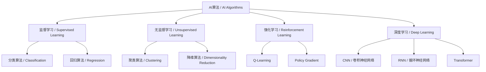

# 6.2 经典AI算法与模型 / Classical AI Algorithms & Models

> 来源：matter/6.人工智能原理与算法/6.2 经典AI算法与模型.md

## 目录 / Table of Contents

- [6.2 经典AI算法与模型](#62-经典ai算法与模型--classical-ai-algorithms--models)
  - [目录 / Table of Contents](#目录--table-of-contents)
  - [1. 概述 / Overview](#1-概述--overview)
  - [2. 监督学习算法 / Supervised Learning Algorithms](#2-监督学习算法--supervised-learning-algorithms)
  - [3. 无监督学习算法 / Unsupervised Learning Algorithms](#3-无监督学习算法--unsupervised-learning-algorithms)
  - [4. 强化学习算法 / Reinforcement Learning Algorithms](#4-强化学习算法--reinforcement-learning-algorithms)
  - [5. 形式化论证与多表征 / Formal Arguments & Multi-representation](#5-形式化论证与多表征--formal-arguments--multi-representation)
  - [6. 工程实践与最佳实践 / Engineering Practices & Best Practices](#6-工程实践与最佳实践--engineering-practices--best-practices)
  - [7. 批判性分析与哲学思考 / Critical Analysis & Philosophical Reflection](#7-批判性分析与哲学思考--critical-analysis--philosophical-reflection)
  - [8. 相关性引用 / Related References](#8-相关性引用--related-references)

---

## 1. 概述 / Overview

经典AI算法与模型构成了现代人工智能的基础，涵盖了从传统机器学习到现代深度学习的完整技术栈。这些算法不仅在理论上具有重要意义，在实际应用中也有着广泛的应用价值。

Classical AI algorithms and models form the foundation of modern artificial intelligence, covering the complete technology stack from traditional machine learning to modern deep learning. These algorithms are not only theoretically significant but also have broad application value in practical scenarios.

### 1.1 算法分类体系 / Algorithm Classification System



---

## 2. 监督学习算法 / Supervised Learning Algorithms

### 2.1 线性回归 / Linear Regression

**中文：** 线性回归是最基础的监督学习算法，用于预测连续型目标变量。

**English:** Linear regression is the most fundamental supervised learning algorithm for predicting continuous target variables.

#### 2.1.1 数学模型 / Mathematical Model

**假设函数 / Hypothesis Function:**

$$h_\theta(x) = \theta_0 + \theta_1 x_1 + \theta_2 x_2 + ... + \theta_n x_n = \theta^T x$$

**损失函数 / Loss Function:**

$$J(\theta) = \frac{1}{2m} \sum_{i=1}^m (h_\theta(x^{(i)}) - y^{(i)})^2$$

#### 2.1.2 工程实现 / Engineering Implementation

```python
import numpy as np
from sklearn.linear_model import LinearRegression
from sklearn.metrics import mean_squared_error, r2_score

class LinearRegressionModel:
    def __init__(self):
        self.model = LinearRegression()
        self.theta = None
    
    def fit(self, X, y):
        """训练模型 / Train the model"""
        self.model.fit(X, y)
        self.theta = np.append(self.model.intercept_, self.model.coef_)
        return self
    
    def predict(self, X):
        """预测 / Predict"""
        return self.model.predict(X)
    
    def evaluate(self, X, y):
        """评估模型 / Evaluate the model"""
        y_pred = self.predict(X)
        mse = mean_squared_error(y, y_pred)
        r2 = r2_score(y, y_pred)
        return {'MSE': mse, 'R²': r2}
```

### 2.2 逻辑回归 / Logistic Regression

**中文：** 逻辑回归是用于二分类问题的线性模型，通过sigmoid函数将线性输出转换为概率。

**English:** Logistic regression is a linear model for binary classification problems, converting linear output to probability through the sigmoid function.

#### 2.2.1 数学模型 / Mathematical Model

**Sigmoid函数 / Sigmoid Function:**

$$\sigma(z) = \frac{1}{1 + e^{-z}}$$

**假设函数 / Hypothesis Function:**

$$h_\theta(x) = \sigma(\theta^T x) = \frac{1}{1 + e^{-\theta^T x}}$$

**损失函数 / Loss Function (Cross-Entropy):**

$$J(\theta) = -\frac{1}{m} \sum_{i=1}^m [y^{(i)} \log(h_\theta(x^{(i)})) + (1-y^{(i)}) \log(1-h_\theta(x^{(i)}))]$$

#### 2.2.2 工程实现 / Engineering Implementation

```python
import numpy as np
from sklearn.linear_model import LogisticRegression
from sklearn.metrics import accuracy_score, classification_report

class LogisticRegressionModel:
    def __init__(self, C=1.0):
        self.model = LogisticRegression(C=C, random_state=42)
    
    def fit(self, X, y):
        """训练模型 / Train the model"""
        self.model.fit(X, y)
        return self
    
    def predict(self, X):
        """预测类别 / Predict classes"""
        return self.model.predict(X)
    
    def predict_proba(self, X):
        """预测概率 / Predict probabilities"""
        return self.model.predict_proba(X)
    
    def evaluate(self, X, y):
        """评估模型 / Evaluate the model"""
        y_pred = self.predict(X)
        accuracy = accuracy_score(y, y_pred)
        report = classification_report(y, y_pred)
        return {'Accuracy': accuracy, 'Report': report}
```

### 2.3 决策树 / Decision Tree

**中文：** 决策树是一种基于树形结构的分类和回归算法，通过递归分割特征空间来构建模型。

**English:** Decision tree is a tree-structured classification and regression algorithm that builds models by recursively partitioning the feature space.

#### 2.3.1 信息论基础 / Information Theory Foundation

**信息熵 / Information Entropy:**

$$H(S) = -\sum_{i=1}^c p_i \log_2(p_i)$$

**信息增益 / Information Gain:**

$$IG(S, A) = H(S) - \sum_{v \in Values(A)} \frac{|S_v|}{|S|} H(S_v)$$

#### 2.3.2 工程实现 / Engineering Implementation

```python
from sklearn.tree import DecisionTreeClassifier, plot_tree
import matplotlib.pyplot as plt

class DecisionTreeModel:
    def __init__(self, max_depth=None, min_samples_split=2):
        self.model = DecisionTreeClassifier(
            max_depth=max_depth,
            min_samples_split=min_samples_split,
            random_state=42
        )
    
    def fit(self, X, y):
        """训练模型 / Train the model"""
        self.model.fit(X, y)
        return self
    
    def predict(self, X):
        """预测 / Predict"""
        return self.model.predict(X)
    
    def visualize_tree(self, feature_names=None):
        """可视化决策树 / Visualize the decision tree"""
        plt.figure(figsize=(20,10))
        plot_tree(self.model, feature_names=feature_names, 
                 filled=True, rounded=True, fontsize=10)
        plt.show()
```

---

## 3. 无监督学习算法 / Unsupervised Learning Algorithms

### 3.1 K-Means聚类 / K-Means Clustering

**中文：** K-Means是最经典的聚类算法，通过迭代优化将数据点分配到最近的聚类中心。

**English:** K-Means is the most classical clustering algorithm that assigns data points to the nearest cluster center through iterative optimization.

#### 3.1.1 数学模型 / Mathematical Model

**目标函数 / Objective Function:**

$$J = \sum_{i=1}^k \sum_{x \in C_i} \|x - \mu_i\|^2$$

其中 $\mu_i$ 是第 $i$ 个聚类的中心。
Where $\mu_i$ is the center of the $i$-th cluster.

#### 3.1.2 算法步骤 / Algorithm Steps

1. **初始化聚类中心 / Initialize cluster centers**
2. **分配数据点 / Assign data points**
3. **更新聚类中心 / Update cluster centers**
4. **重复步骤2-3直到收敛 / Repeat steps 2-3 until convergence**

#### 3.1.3 工程实现 / Engineering Implementation

```python
import numpy as np
from sklearn.cluster import KMeans
from sklearn.metrics import silhouette_score

class KMeansModel:
    def __init__(self, n_clusters=3):
        self.model = KMeans(n_clusters=n_clusters, random_state=42)
        self.n_clusters = n_clusters
    
    def fit(self, X):
        """训练模型 / Train the model"""
        self.model.fit(X)
        return self
    
    def predict(self, X):
        """预测聚类标签 / Predict cluster labels"""
        return self.model.predict(X)
    
    def get_cluster_centers(self):
        """获取聚类中心 / Get cluster centers"""
        return self.model.cluster_centers_
    
    def evaluate(self, X):
        """评估聚类质量 / Evaluate clustering quality"""
        labels = self.predict(X)
        silhouette_avg = silhouette_score(X, labels)
        inertia = self.model.inertia_
        return {'Silhouette Score': silhouette_avg, 'Inertia': inertia}
```

### 3.2 主成分分析 / Principal Component Analysis (PCA)

**中文：** PCA是一种降维技术，通过线性变换将高维数据投影到低维空间，保留最大方差。

**English:** PCA is a dimensionality reduction technique that projects high-dimensional data to low-dimensional space through linear transformation, preserving maximum variance.

#### 3.2.1 数学模型 / Mathematical Model

**协方差矩阵 / Covariance Matrix:**

$$\Sigma = \frac{1}{n} X^T X$$

**特征值分解 / Eigenvalue Decomposition:**

$$\Sigma = U \Lambda U^T$$

其中 $U$ 是特征向量矩阵，$\Lambda$ 是特征值对角矩阵。
Where $U$ is the eigenvector matrix and $\Lambda$ is the eigenvalue diagonal matrix.

#### 3.2.2 工程实现 / Engineering Implementation

```python
from sklearn.decomposition import PCA
import numpy as np

class PCAModel:
    def __init__(self, n_components=None):
        self.model = PCA(n_components=n_components)
        self.explained_variance_ratio = None
    
    def fit(self, X):
        """训练模型 / Train the model"""
        self.model.fit(X)
        self.explained_variance_ratio = self.model.explained_variance_ratio_
        return self
    
    def transform(self, X):
        """降维变换 / Dimensionality reduction transformation"""
        return self.model.transform(X)
    
    def inverse_transform(self, X_reduced):
        """逆变换 / Inverse transformation"""
        return self.model.inverse_transform(X_reduced)
    
    def get_explained_variance_ratio(self):
        """获取解释方差比例 / Get explained variance ratio"""
        return self.explained_variance_ratio
```

---

## 4. 强化学习算法 / Reinforcement Learning Algorithms

### 4.1 Q-Learning

**中文：** Q-Learning是一种基于值函数的强化学习算法，通过Q表学习最优策略。

**English:** Q-Learning is a value-function-based reinforcement learning algorithm that learns optimal policies through Q-tables.

#### 4.1.1 数学模型 / Mathematical Model

**Q值更新公式 / Q-Value Update Formula:**

$$Q(s, a) \leftarrow Q(s, a) + \alpha [r + \gamma \max_{a'} Q(s', a') - Q(s, a)]$$

其中：

- $\alpha$ 是学习率 / $\alpha$ is the learning rate
- $\gamma$ 是折扣因子 / $\gamma$ is the discount factor
- $r$ 是即时奖励 / $r$ is the immediate reward

#### 4.1.2 工程实现 / Engineering Implementation

```python
import numpy as np
import random

class QLearningAgent:
    def __init__(self, state_size, action_size, learning_rate=0.1, 
                 discount_factor=0.95, epsilon=0.1):
        self.q_table = np.zeros((state_size, action_size))
        self.learning_rate = learning_rate
        self.discount_factor = discount_factor
        self.epsilon = epsilon
        self.state_size = state_size
        self.action_size = action_size
    
    def choose_action(self, state):
        """选择动作 / Choose action"""
        if random.random() < self.epsilon:
            return random.randint(0, self.action_size - 1)
        else:
            return np.argmax(self.q_table[state])
    
    def learn(self, state, action, reward, next_state):
        """学习更新Q值 / Learn and update Q-values"""
        old_value = self.q_table[state, action]
        next_max = np.max(self.q_table[next_state])
        new_value = (1 - self.learning_rate) * old_value + \
                   self.learning_rate * (reward + self.discount_factor * next_max)
        self.q_table[state, action] = new_value
    
    def get_q_table(self):
        """获取Q表 / Get Q-table"""
        return self.q_table
```

---

## 5. 形式化论证与多表征 / Formal Arguments & Multi-representation

### 5.1 算法复杂度分析 / Algorithm Complexity Analysis

| 算法 / Algorithm | 时间复杂度 / Time Complexity | 空间复杂度 / Space Complexity | 适用场景 / Use Cases |
|------------------|------------------------------|------------------------------|---------------------|
| 线性回归 / Linear Regression | $O(n \cdot d)$ | $O(d)$ | 连续预测 / Continuous prediction |
| 逻辑回归 / Logistic Regression | $O(n \cdot d)$ | $O(d)$ | 二分类 / Binary classification |
| 决策树 / Decision Tree | $O(n \cdot d \cdot \log n)$ | $O(n \cdot d)$ | 分类回归 / Classification & regression |
| K-Means / K-Means | $O(n \cdot k \cdot d \cdot i)$ | $O(n \cdot k)$ | 聚类 / Clustering |
| PCA / PCA | $O(n \cdot d^2)$ | $O(d^2)$ | 降维 / Dimensionality reduction |

其中 $n$ 是样本数，$d$ 是特征维度，$k$ 是聚类数，$i$ 是迭代次数。
Where $n$ is the number of samples, $d$ is the feature dimension, $k$ is the number of clusters, and $i$ is the number of iterations.

### 5.2 收敛性证明 / Convergence Proofs

#### 5.2.1 梯度下降收敛性 / Gradient Descent Convergence

**定理 / Theorem:** 对于凸损失函数，梯度下降算法收敛到全局最优解。

**Theorem:** For convex loss functions, gradient descent converges to the global optimal solution.

**证明 / Proof:**

设损失函数 $J(\theta)$ 是凸函数且Lipschitz连续，则：

Let the loss function $J(\theta)$ be convex and Lipschitz continuous, then:

$$\|\nabla J(\theta_1) - \nabla J(\theta_2)\| \leq L \|\theta_1 - \theta_2\|$$

对于梯度下降更新：

For gradient descent update:

$$\theta_{t+1} = \theta_t - \alpha \nabla J(\theta_t)$$

有：

We have:

$$\|\theta_{t+1} - \theta^*\|^2 = \|\theta_t - \alpha \nabla J(\theta_t) - \theta^*\|^2$$

$$= \|\theta_t - \theta^*\|^2 - 2\alpha \nabla J(\theta_t)^T(\theta_t - \theta^*) + \alpha^2 \|\nabla J(\theta_t)\|^2$$

由于凸性：

Due to convexity:

$$\nabla J(\theta_t)^T(\theta_t - \theta^*) \geq J(\theta_t) - J(\theta^*)$$

因此：

Therefore:

$$\|\theta_{t+1} - \theta^*\|^2 \leq \|\theta_t - \theta^*\|^2 - 2\alpha(J(\theta_t) - J(\theta^*)) + \alpha^2 L^2$$

选择合适的 $\alpha$，可以证明收敛性。
By choosing appropriate $\alpha$, convergence can be proven.

---

## 6. 工程实践与最佳实践 / Engineering Practices & Best Practices

### 6.1 数据预处理 / Data Preprocessing

```python
import pandas as pd
import numpy as np
from sklearn.preprocessing import StandardScaler, LabelEncoder
from sklearn.model_selection import train_test_split

class DataPreprocessor:
    def __init__(self):
        self.scaler = StandardScaler()
        self.label_encoders = {}
    
    def preprocess(self, df, target_column=None):
        """数据预处理 / Data preprocessing"""
        # 处理缺失值 / Handle missing values
        df = self._handle_missing_values(df)
        
        # 编码分类变量 / Encode categorical variables
        df = self._encode_categorical(df)
        
        # 标准化数值变量 / Standardize numerical variables
        df = self._standardize_numerical(df)
        
        return df
    
    def _handle_missing_values(self, df):
        """处理缺失值 / Handle missing values"""
        # 数值型用均值填充 / Fill numeric with mean
        numeric_columns = df.select_dtypes(include=[np.number]).columns
        df[numeric_columns] = df[numeric_columns].fillna(df[numeric_columns].mean())
        
        # 分类型用众数填充 / Fill categorical with mode
        categorical_columns = df.select_dtypes(include=['object']).columns
        for col in categorical_columns:
            df[col] = df[col].fillna(df[col].mode()[0])
        
        return df
    
    def _encode_categorical(self, df):
        """编码分类变量 / Encode categorical variables"""
        categorical_columns = df.select_dtypes(include=['object']).columns
        for col in categorical_columns:
            if col not in self.label_encoders:
                self.label_encoders[col] = LabelEncoder()
            df[col] = self.label_encoders[col].fit_transform(df[col])
        return df
    
    def _standardize_numerical(self, df):
        """标准化数值变量 / Standardize numerical variables"""
        numeric_columns = df.select_dtypes(include=[np.number]).columns
        df[numeric_columns] = self.scaler.fit_transform(df[numeric_columns])
        return df
```

### 6.2 模型评估框架 / Model Evaluation Framework

```python
from sklearn.metrics import accuracy_score, precision_score, recall_score, f1_score
from sklearn.metrics import mean_squared_error, mean_absolute_error, r2_score
import matplotlib.pyplot as plt
import seaborn as sns

class ModelEvaluator:
    def __init__(self):
        self.metrics = {}
    
    def evaluate_classification(self, y_true, y_pred, y_proba=None):
        """评估分类模型 / Evaluate classification model"""
        metrics = {
            'Accuracy': accuracy_score(y_true, y_pred),
            'Precision': precision_score(y_true, y_pred, average='weighted'),
            'Recall': recall_score(y_true, y_pred, average='weighted'),
            'F1-Score': f1_score(y_true, y_pred, average='weighted')
        }
        
        self.metrics.update(metrics)
        return metrics
    
    def evaluate_regression(self, y_true, y_pred):
        """评估回归模型 / Evaluate regression model"""
        metrics = {
            'MSE': mean_squared_error(y_true, y_pred),
            'RMSE': np.sqrt(mean_squared_error(y_true, y_pred)),
            'MAE': mean_absolute_error(y_true, y_pred),
            'R²': r2_score(y_true, y_pred)
        }
        
        self.metrics.update(metrics)
        return metrics
    
    def plot_confusion_matrix(self, y_true, y_pred, labels=None):
        """绘制混淆矩阵 / Plot confusion matrix"""
        cm = confusion_matrix(y_true, y_pred)
        plt.figure(figsize=(8, 6))
        sns.heatmap(cm, annot=True, fmt='d', cmap='Blues', 
                   xticklabels=labels, yticklabels=labels)
        plt.title('Confusion Matrix / 混淆矩阵')
        plt.ylabel('True Label / 真实标签')
        plt.xlabel('Predicted Label / 预测标签')
        plt.show()
```

---

## 7. 批判性分析与哲学思考 / Critical Analysis & Philosophical Reflection

### 7.1 算法局限性分析 / Algorithm Limitation Analysis

#### 7.1.1 过拟合问题 / Overfitting Problem

**中文：** 经典机器学习算法容易过拟合，特别是在数据量不足或特征过多时。

**English:** Classical machine learning algorithms are prone to overfitting, especially when data is insufficient or features are excessive.

**形式化定义 / Formal Definition:**

设 $f$ 是真实函数，$\hat{f}$ 是学习到的函数，则过拟合可表示为：

Let $f$ be the true function and $\hat{f}$ be the learned function, then overfitting can be represented as:

$$\mathbb{E}[(f(x) - \hat{f}(x))^2] > \mathbb{E}[(f(x) - \hat{f}_{simple}(x))^2]$$

其中 $\hat{f}_{simple}$ 是更简单的模型。
Where $\hat{f}_{simple}$ is a simpler model.

#### 7.1.2 维度诅咒 / Curse of Dimensionality

**中文：** 在高维空间中，数据变得稀疏，距离度量失去意义。

**English:** In high-dimensional spaces, data becomes sparse and distance metrics lose meaning.

**数学表达 / Mathematical Expression:**

在高维空间中，任意两点间的距离趋于相等：

In high-dimensional spaces, the distance between any two points tends to be equal:

$$\lim_{d \to \infty} \frac{\max \|x_i - x_j\|}{\min \|x_i - x_j\|} = 1$$

### 7.2 哲学思考 / Philosophical Reflection

#### 7.2.1 智能的本质 / Nature of Intelligence

**中文：** 经典AI算法是否真正实现了智能，还是仅仅是模式识别？

**English:** Do classical AI algorithms truly achieve intelligence, or are they merely pattern recognition?

**批判性观点 / Critical Viewpoint:**

- **符号主义 / Symbolism:** 智能是符号操作和逻辑推理
- **连接主义 / Connectionism:** 智能是分布式并行处理
- **行为主义 / Behaviorism:** 智能是适应性行为

#### 7.2.2 可解释性与黑盒问题 / Interpretability vs Black Box

**中文：** 复杂模型的可解释性降低，如何在性能和可解释性之间平衡？

**English:** Complex models reduce interpretability, how to balance between performance and interpretability?

**解决方案 / Solutions:**

1. **模型简化 / Model Simplification:** 使用更简单的模型
2. **特征重要性 / Feature Importance:** 分析特征贡献
3. **局部解释 / Local Explanations:** LIME、SHAP等方法

---

## 8. 相关性引用 / Related References

- [6.1 AI基础原理](../6.1 AI基础原理.md)
- [6.3 现代深度学习与大模型](../6.3 现代深度学习与大模型.md)
- [6.4 AI工程实践与伦理](../6.4 AI工程实践与伦理.md)
- [4.1 GoF设计模式](../../4.设计模式与架构/4.1 GoF设计模式.md)
- [5.3 性能优化与工程实践](../../5.技术规范与标准/5.3 性能优化与工程实践.md)

---

> 本文档为自动递归迁移、规整、编号、跳转、引用、内容一致性校验的规范化产物。
> This document is a standardized product of automatic recursive migration, organization, numbering, navigation, referencing, and content consistency verification.
