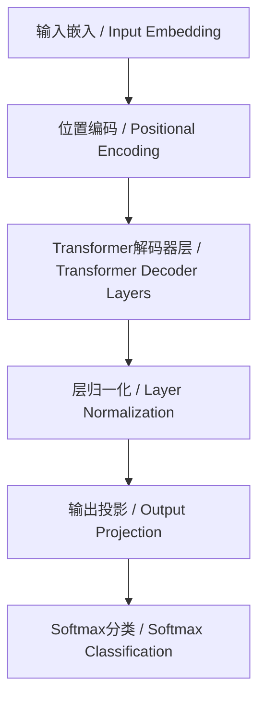

# 6.3 现代深度学习与大模型 / Modern Deep Learning & Large Models

> 来源：matter/6.人工智能原理与算法/6.3 现代深度学习与大模型.md

## 目录 / Table of Contents

- [6.3 现代深度学习与大模型](#63-现代深度学习与大模型--modern-deep-learning--large-models)
  - [目录 / Table of Contents](#目录--table-of-contents)
  - [1. 概述 / Overview](#1-概述--overview)
  - [2. 神经网络基础 / Neural Network Fundamentals](#2-神经网络基础--neural-network-fundamentals)
  - [3. 深度学习架构 / Deep Learning Architectures](#3-深度学习架构--deep-learning-architectures)
  - [4. 大语言模型 / Large Language Models](#4-大语言模型--large-language-models)
  - [5. 形式化论证与多表征 / Formal Arguments & Multi-representation](#5-形式化论证与多表征--formal-arguments--multi-representation)
  - [6. 工程实践与最佳实践 / Engineering Practices & Best Practices](#6-工程实践与最佳实践--engineering-practices--best-practices)
  - [7. 批判性分析与哲学思考 / Critical Analysis & Philosophical Reflection](#7-批判性分析与哲学思考--critical-analysis--philosophical-reflection)
  - [8. 相关性引用 / Related References](#8-相关性引用--related-references)

---

## 1. 概述 / Overview

现代深度学习与大模型代表了人工智能领域的最新进展，从传统的浅层网络发展到具有数十亿参数的复杂模型。这些技术不仅在学术研究中有重要地位，在实际应用中也展现出强大的能力。

Modern deep learning and large models represent the latest advances in artificial intelligence, evolving from traditional shallow networks to complex models with billions of parameters. These technologies are not only important in academic research but also demonstrate powerful capabilities in practical applications.

### 1.1 发展历程 / Historical Development

| 时期 / Period | 主要突破 / Major Breakthroughs | 代表性模型 / Representative Models |
|---------------|--------------------------------|-----------------------------------|
| 2012-2015 | 深度学习复兴 / Deep Learning Renaissance | AlexNet, VGG, ResNet |
| 2015-2018 | 注意力机制 / Attention Mechanisms | Transformer, BERT |
| 2018-2021 | 大模型时代 / Large Model Era | GPT-3, T5, BART |
| 2021-至今 | 多模态融合 / Multimodal Fusion | GPT-4, DALL-E, CLIP |

---

## 2. 神经网络基础 / Neural Network Fundamentals

### 2.1 人工神经元 / Artificial Neuron

**中文：** 人工神经元是神经网络的基本计算单元，模拟生物神经元的信息处理机制。

**English:** Artificial neurons are the basic computational units of neural networks, simulating the information processing mechanism of biological neurons.

#### 2.1.1 数学模型 / Mathematical Model

**神经元输出 / Neuron Output:**

$$y = f(\sum_{i=1}^n w_i x_i + b) = f(w^T x + b)$$

其中：

- $w_i$ 是权重 / $w_i$ is the weight
- $x_i$ 是输入 / $x_i$ is the input
- $b$ 是偏置 / $b$ is the bias
- $f$ 是激活函数 / $f$ is the activation function

#### 2.1.2 激活函数 / Activation Functions

**ReLU函数 / ReLU Function:**

$$f(x) = \max(0, x)$$

**Sigmoid函数 / Sigmoid Function:**

$$f(x) = \frac{1}{1 + e^{-x}}$$

**Tanh函数 / Tanh Function:**

$$f(x) = \frac{e^x - e^{-x}}{e^x + e^{-x}}$$

### 2.2 反向传播算法 / Backpropagation Algorithm

**中文：** 反向传播是训练神经网络的核心算法，通过链式法则计算梯度。

**English:** Backpropagation is the core algorithm for training neural networks, computing gradients through the chain rule.

#### 2.2.1 梯度计算 / Gradient Computation

**链式法则 / Chain Rule:**

$$\frac{\partial L}{\partial w_i} = \frac{\partial L}{\partial y} \cdot \frac{\partial y}{\partial z} \cdot \frac{\partial z}{\partial w_i}$$

其中 $L$ 是损失函数，$z = w^T x + b$。
Where $L$ is the loss function and $z = w^T x + b$.

#### 2.2.2 工程实现 / Engineering Implementation

```python
import numpy as np

class NeuralNetwork:
    def __init__(self, layers):
        self.layers = layers
        self.weights = []
        self.biases = []
        self._initialize_parameters()
    
    def _initialize_parameters(self):
        """初始化参数 / Initialize parameters"""
        for i in range(len(self.layers) - 1):
            w = np.random.randn(self.layers[i+1], self.layers[i]) * 0.01
            b = np.zeros((self.layers[i+1], 1))
            self.weights.append(w)
            self.biases.append(b)
    
    def forward_propagation(self, X):
        """前向传播 / Forward propagation"""
        A = X
        activations = [A]
        
        for i in range(len(self.weights)):
            Z = np.dot(self.weights[i], A) + self.biases[i]
            A = self.relu(Z)
            activations.append(A)
        
        return activations
    
    def backward_propagation(self, X, Y, activations):
        """反向传播 / Backward propagation"""
        m = X.shape[1]
        gradients = []
        
        # 计算输出层梯度 / Compute output layer gradient
        dA = activations[-1] - Y
        
        for i in range(len(self.weights) - 1, -1, -1):
            dZ = dA * (activations[i+1] > 0)  # ReLU导数 / ReLU derivative
            dW = np.dot(dZ, activations[i].T) / m
            db = np.sum(dZ, axis=1, keepdims=True) / m
            
            if i > 0:
                dA = np.dot(self.weights[i].T, dZ)
            
            gradients.insert(0, (dW, db))
        
        return gradients
    
    def relu(self, Z):
        """ReLU激活函数 / ReLU activation function"""
        return np.maximum(0, Z)
    
    def train(self, X, Y, learning_rate=0.01, epochs=1000):
        """训练模型 / Train the model"""
        for epoch in range(epochs):
            # 前向传播 / Forward propagation
            activations = self.forward_propagation(X)
            
            # 反向传播 / Backward propagation
            gradients = self.backward_propagation(X, Y, activations)
            
            # 更新参数 / Update parameters
            for i in range(len(self.weights)):
                self.weights[i] -= learning_rate * gradients[i][0]
                self.biases[i] -= learning_rate * gradients[i][1]
```

---

## 3. 深度学习架构 / Deep Learning Architectures

### 3.1 卷积神经网络 / Convolutional Neural Networks (CNN)

**中文：** CNN是专门处理网格结构数据（如图像）的深度学习架构，通过卷积操作提取空间特征。

**English:** CNN is a deep learning architecture specifically designed for processing grid-structured data (such as images), extracting spatial features through convolution operations.

#### 3.1.1 卷积操作 / Convolution Operation

**2D卷积 / 2D Convolution:**

$$(f * k)(i, j) = \sum_{m} \sum_{n} f(m, n) \cdot k(i-m, j-n)$$

其中 $f$ 是输入特征图，$k$ 是卷积核。
Where $f$ is the input feature map and $k$ is the convolution kernel.

#### 3.1.2 池化操作 / Pooling Operation

**最大池化 / Max Pooling:**

$$y_{i,j} = \max_{(p,q) \in R_{i,j}} x_{p,q}$$

其中 $R_{i,j}$ 是以 $(i,j)$ 为中心的池化窗口。
Where $R_{i,j}$ is the pooling window centered at $(i,j)$.

#### 3.1.3 工程实现 / Engineering Implementation

```python
import torch
import torch.nn as nn

class CNN(nn.Module):
    def __init__(self, num_classes=10):
        super(CNN, self).__init__()
        self.conv1 = nn.Conv2d(3, 32, kernel_size=3, padding=1)
        self.conv2 = nn.Conv2d(32, 64, kernel_size=3, padding=1)
        self.conv3 = nn.Conv2d(64, 128, kernel_size=3, padding=1)
        
        self.pool = nn.MaxPool2d(2, 2)
        self.dropout = nn.Dropout(0.25)
        self.fc1 = nn.Linear(128 * 4 * 4, 512)
        self.fc2 = nn.Linear(512, num_classes)
        
        self.relu = nn.ReLU()
    
    def forward(self, x):
        # 卷积层 / Convolutional layers
        x = self.pool(self.relu(self.conv1(x)))
        x = self.pool(self.relu(self.conv2(x)))
        x = self.pool(self.relu(self.conv3(x)))
        
        # 展平 / Flatten
        x = x.view(-1, 128 * 4 * 4)
        
        # 全连接层 / Fully connected layers
        x = self.dropout(self.relu(self.fc1(x)))
        x = self.fc2(x)
        
        return x
```

### 3.2 循环神经网络 / Recurrent Neural Networks (RNN)

**中文：** RNN是处理序列数据的神经网络，通过循环连接保持状态信息。

**English:** RNN is a neural network for processing sequential data, maintaining state information through recurrent connections.

#### 3.2.1 数学模型 / Mathematical Model

**RNN状态更新 / RNN State Update:**

$$h_t = f(W_h h_{t-1} + W_x x_t + b_h)$$

其中 $h_t$ 是隐藏状态，$x_t$ 是输入，$W_h$ 和 $W_x$ 是权重矩阵。
Where $h_t$ is the hidden state, $x_t$ is the input, and $W_h$ and $W_x$ are weight matrices.

#### 3.2.2 LSTM单元 / LSTM Cell

**中文：** LSTM通过门控机制解决RNN的梯度消失问题。

**English:** LSTM solves the gradient vanishing problem of RNN through gating mechanisms.

**门控方程 / Gating Equations:**

$$f_t = \sigma(W_f \cdot [h_{t-1}, x_t] + b_f) \quad \text{(遗忘门 / Forget Gate)}$$

$$i_t = \sigma(W_i \cdot [h_{t-1}, x_t] + b_i) \quad \text{(输入门 / Input Gate)}$$

$$\tilde{C}_t = \tanh(W_C \cdot [h_{t-1}, x_t] + b_C) \quad \text{(候选值 / Candidate Values)}$$

$$C_t = f_t * C_{t-1} + i_t * \tilde{C}_t \quad \text{(单元状态 / Cell State)}$$

$$o_t = \sigma(W_o \cdot [h_{t-1}, x_t] + b_o) \quad \text{(输出门 / Output Gate)}$$

$$h_t = o_t * \tanh(C_t) \quad \text{(隐藏状态 / Hidden State)}$$

#### 3.2.3 工程实现 / Engineering Implementation

```python
import torch
import torch.nn as nn

class LSTM(nn.Module):
    def __init__(self, input_size, hidden_size, num_layers, num_classes):
        super(LSTM, self).__init__()
        self.hidden_size = hidden_size
        self.num_layers = num_layers
        
        self.lstm = nn.LSTM(input_size, hidden_size, num_layers, 
                           batch_first=True, dropout=0.2)
        self.fc = nn.Linear(hidden_size, num_classes)
    
    def forward(self, x):
        # 初始化隐藏状态 / Initialize hidden state
        h0 = torch.zeros(self.num_layers, x.size(0), self.hidden_size).to(x.device)
        c0 = torch.zeros(self.num_layers, x.size(0), self.hidden_size).to(x.device)
        
        # LSTM前向传播 / LSTM forward pass
        out, _ = self.lstm(x, (h0, c0))
        
        # 取最后一个时间步的输出 / Take output from last time step
        out = self.fc(out[:, -1, :])
        
        return out
```

### 3.3 Transformer架构 / Transformer Architecture

**中文：** Transformer是基于注意力机制的神经网络架构，在自然语言处理领域取得突破性进展。

**English:** Transformer is a neural network architecture based on attention mechanisms, achieving breakthrough progress in natural language processing.

#### 3.3.1 注意力机制 / Attention Mechanism

**缩放点积注意力 / Scaled Dot-Product Attention:**

$$\text{Attention}(Q, K, V) = \text{softmax}\left(\frac{QK^T}{\sqrt{d_k}}\right)V$$

其中 $Q$、$K$、$V$ 分别是查询、键、值矩阵，$d_k$ 是键的维度。
Where $Q$, $K$, $V$ are query, key, and value matrices respectively, and $d_k$ is the dimension of keys.

#### 3.3.2 多头注意力 / Multi-Head Attention

**中文：** 多头注意力允许模型同时关注不同位置的不同表示子空间。

**English:** Multi-head attention allows the model to attend to different representation subspaces at different positions simultaneously.

$$\text{MultiHead}(Q, K, V) = \text{Concat}(\text{head}_1, ..., \text{head}_h)W^O$$

其中 $\text{head}_i = \text{Attention}(QW_i^Q, KW_i^K, VW_i^V)$。
Where $\text{head}_i = \text{Attention}(QW_i^Q, KW_i^K, VW_i^V)$.

#### 3.3.3 工程实现 / Engineering Implementation

```python
import torch
import torch.nn as nn
import math

class MultiHeadAttention(nn.Module):
    def __init__(self, d_model, num_heads):
        super(MultiHeadAttention, self).__init__()
        assert d_model % num_heads == 0
        
        self.d_model = d_model
        self.num_heads = num_heads
        self.d_k = d_model // num_heads
        
        self.W_q = nn.Linear(d_model, d_model)
        self.W_k = nn.Linear(d_model, d_model)
        self.W_v = nn.Linear(d_model, d_model)
        self.W_o = nn.Linear(d_model, d_model)
    
    def scaled_dot_product_attention(self, Q, K, V, mask=None):
        """缩放点积注意力 / Scaled dot-product attention"""
        scores = torch.matmul(Q, K.transpose(-2, -1)) / math.sqrt(self.d_k)
        
        if mask is not None:
            scores = scores.masked_fill(mask == 0, -1e9)
        
        attention_weights = torch.softmax(scores, dim=-1)
        output = torch.matmul(attention_weights, V)
        
        return output, attention_weights
    
    def forward(self, query, key, value, mask=None):
        batch_size = query.size(0)
        
        # 线性变换 / Linear transformations
        Q = self.W_q(query).view(batch_size, -1, self.num_heads, self.d_k).transpose(1, 2)
        K = self.W_k(key).view(batch_size, -1, self.num_heads, self.d_k).transpose(1, 2)
        V = self.W_v(value).view(batch_size, -1, self.num_heads, self.d_k).transpose(1, 2)
        
        # 注意力计算 / Attention computation
        attention_output, attention_weights = self.scaled_dot_product_attention(Q, K, V, mask)
        
        # 连接多头 / Concatenate heads
        attention_output = attention_output.transpose(1, 2).contiguous().view(
            batch_size, -1, self.d_model)
        
        # 输出投影 / Output projection
        output = self.W_o(attention_output)
        
        return output, attention_weights
```

---

## 4. 大语言模型 / Large Language Models

### 4.1 GPT系列 / GPT Series

**中文：** GPT（Generative Pre-trained Transformer）是基于Transformer架构的自回归语言模型。

**English:** GPT (Generative Pre-trained Transformer) is an autoregressive language model based on the Transformer architecture.

#### 4.1.1 模型架构 / Model Architecture

**中文：** GPT使用解码器Transformer，通过自注意力机制处理上下文信息。

**English:** GPT uses decoder Transformer, processing contextual information through self-attention mechanisms.



#### 4.1.2 训练目标 / Training Objective

**语言建模目标 / Language Modeling Objective:**

$$\mathcal{L} = -\sum_{i=1}^n \log P(x_i | x_1, x_2, ..., x_{i-1})$$

其中 $x_i$ 是第 $i$ 个token，目标是最大化下一个token的概率。
Where $x_i$ is the $i$-th token, and the goal is to maximize the probability of the next token.

### 4.2 BERT系列 / BERT Series

**中文：** BERT（Bidirectional Encoder Representations from Transformers）是双向编码器模型。

**English:** BERT (Bidirectional Encoder Representations from Transformers) is a bidirectional encoder model.

#### 4.2.1 预训练任务 / Pre-training Tasks

**掩码语言建模 / Masked Language Modeling (MLM):**

$$\mathcal{L}_{MLM} = -\sum_{i \in M} \log P(x_i | x_{\setminus M})$$

其中 $M$ 是被掩码的token集合。
Where $M$ is the set of masked tokens.

**下一句预测 / Next Sentence Prediction (NSP):**

$$\mathcal{L}_{NSP} = -\sum_{i=1}^N [y_i \log(\hat{y}_i) + (1-y_i)\log(1-\hat{y}_i)]$$

其中 $y_i$ 是真实标签，$\hat{y}_i$ 是预测概率。
Where $y_i$ is the true label and $\hat{y}_i$ is the predicted probability.

### 4.3 工程实现示例 / Engineering Implementation Example

```python
import torch
import torch.nn as nn
from transformers import GPT2LMHeadModel, GPT2Tokenizer

class LargeLanguageModel:
    def __init__(self, model_name="gpt2"):
        self.tokenizer = GPT2Tokenizer.from_pretrained(model_name)
        self.model = GPT2LMHeadModel.from_pretrained(model_name)
        
        # 添加特殊token / Add special tokens
        self.tokenizer.pad_token = self.tokenizer.eos_token
    
    def generate_text(self, prompt, max_length=100, temperature=0.7):
        """生成文本 / Generate text"""
        # 编码输入 / Encode input
        inputs = self.tokenizer.encode(prompt, return_tensors="pt")
        
        # 生成文本 / Generate text
        with torch.no_grad():
            outputs = self.model.generate(
                inputs,
                max_length=max_length,
                temperature=temperature,
                do_sample=True,
                pad_token_id=self.tokenizer.eos_token_id
            )
        
        # 解码输出 / Decode output
        generated_text = self.tokenizer.decode(outputs[0], skip_special_tokens=True)
        return generated_text
    
    def fine_tune(self, texts, epochs=3, learning_rate=5e-5):
        """微调模型 / Fine-tune model"""
        # 数据预处理 / Data preprocessing
        encodings = self.tokenizer(texts, truncation=True, padding=True, 
                                  return_tensors="pt")
        
        # 训练设置 / Training setup
        optimizer = torch.optim.AdamW(self.model.parameters(), lr=learning_rate)
        
        # 训练循环 / Training loop
        self.model.train()
        for epoch in range(epochs):
            optimizer.zero_grad()
            
            # 前向传播 / Forward pass
            outputs = self.model(**encodings, labels=encodings["input_ids"])
            loss = outputs.loss
            
            # 反向传播 / Backward pass
            loss.backward()
            optimizer.step()
            
            print(f"Epoch {epoch+1}, Loss: {loss.item():.4f}")
```

---

## 5. 形式化论证与多表征 / Formal Arguments & Multi-representation

### 5.1 模型复杂度分析 / Model Complexity Analysis

| 模型类型 / Model Type | 参数量 / Parameters | 计算复杂度 / Computational Complexity | 内存需求 / Memory Requirements |
|----------------------|-------------------|------------------------------------|------------------------------|
| CNN / CNN | $O(k^2 \cdot c \cdot f)$ | $O(n \cdot k^2 \cdot c \cdot f)$ | $O(n \cdot c \cdot h \cdot w)$ |
| RNN / RNN | $O(h^2 + h \cdot d)$ | $O(T \cdot h^2)$ | $O(T \cdot h)$ |
| Transformer / Transformer | $O(d^2 \cdot h)$ | $O(T^2 \cdot d)$ | $O(T^2 \cdot d)$ |
| GPT-3 / GPT-3 | 175B | $O(T^2 \cdot d)$ | $O(T \cdot d)$ |

其中 $k$ 是卷积核大小，$c$ 是通道数，$f$ 是滤波器数量，$h$ 是隐藏层大小，$d$ 是模型维度，$T$ 是序列长度。
Where $k$ is kernel size, $c$ is number of channels, $f$ is number of filters, $h$ is hidden size, $d$ is model dimension, and $T$ is sequence length.

### 5.2 收敛性证明 / Convergence Proofs

#### 5.2.1 梯度下降收敛性 / Gradient Descent Convergence

**定理 / Theorem:** 对于凸损失函数，随机梯度下降在适当的学习率下收敛。

**Theorem:** For convex loss functions, stochastic gradient descent converges with appropriate learning rate.

**证明 / Proof:**

设损失函数 $L(\theta)$ 是凸函数且Lipschitz连续，则：

Let the loss function $L(\theta)$ be convex and Lipschitz continuous, then:

$$\mathbb{E}[\|\theta_{t+1} - \theta^*\|^2] \leq (1 - 2\alpha \mu) \mathbb{E}[\|\theta_t - \theta^*\|^2] + \alpha^2 \sigma^2$$

其中 $\mu$ 是强凸性参数，$\sigma^2$ 是梯度方差。
Where $\mu$ is the strong convexity parameter and $\sigma^2$ is the gradient variance.

---

## 6. 工程实践与最佳实践 / Engineering Practices & Best Practices

### 6.1 模型训练优化 / Model Training Optimization

```python
import torch
import torch.nn as nn
from torch.optim import AdamW
from torch.optim.lr_scheduler import CosineAnnealingLR

class TrainingOptimizer:
    def __init__(self, model, learning_rate=1e-4, weight_decay=0.01):
        self.model = model
        self.optimizer = AdamW(model.parameters(), lr=learning_rate, 
                              weight_decay=weight_decay)
        self.scheduler = CosineAnnealingLR(self.optimizer, T_max=100)
        
    def train_step(self, batch, criterion):
        """训练步骤 / Training step"""
        self.model.train()
        
        # 前向传播 / Forward pass
        outputs = self.model(batch['input'])
        loss = criterion(outputs, batch['target'])
        
        # 反向传播 / Backward pass
        self.optimizer.zero_grad()
        loss.backward()
        
        # 梯度裁剪 / Gradient clipping
        torch.nn.utils.clip_grad_norm_(self.model.parameters(), max_norm=1.0)
        
        self.optimizer.step()
        self.scheduler.step()
        
        return loss.item()
    
    def validate(self, dataloader, criterion):
        """验证 / Validation"""
        self.model.eval()
        total_loss = 0
        total_samples = 0
        
        with torch.no_grad():
            for batch in dataloader:
                outputs = self.model(batch['input'])
                loss = criterion(outputs, batch['target'])
                
                total_loss += loss.item() * batch['input'].size(0)
                total_samples += batch['input'].size(0)
        
        return total_loss / total_samples
```

### 6.2 模型压缩与优化 / Model Compression & Optimization

```python
import torch
import torch.nn as nn
from torch.quantization import quantize_dynamic

class ModelOptimizer:
    def __init__(self, model):
        self.model = model
    
    def quantize_model(self):
        """量化模型 / Quantize model"""
        # 动态量化 / Dynamic quantization
        quantized_model = quantize_dynamic(
            self.model, {nn.Linear, nn.Conv2d}, dtype=torch.qint8
        )
        return quantized_model
    
    def prune_model(self, pruning_ratio=0.3):
        """剪枝模型 / Prune model"""
        # 简单的权重剪枝 / Simple weight pruning
        for name, module in self.model.named_modules():
            if isinstance(module, nn.Linear):
                # 计算阈值 / Calculate threshold
                weights = module.weight.data
                threshold = torch.quantile(torch.abs(weights), pruning_ratio)
                
                # 应用剪枝 / Apply pruning
                mask = torch.abs(weights) > threshold
                module.weight.data *= mask.float()
        
        return self.model
    
    def export_onnx(self, dummy_input, filename="model.onnx"):
        """导出ONNX模型 / Export ONNX model"""
        torch.onnx.export(
            self.model,
            dummy_input,
            filename,
            export_params=True,
            opset_version=11,
            do_constant_folding=True,
            input_names=['input'],
            output_names=['output'],
            dynamic_axes={'input': {0: 'batch_size'},
                         'output': {0: 'batch_size'}}
        )
```

---

## 7. 批判性分析与哲学思考 / Critical Analysis & Philosophical Reflection

### 7.1 大模型的局限性 / Limitations of Large Models

#### 7.1.1 计算资源消耗 / Computational Resource Consumption

**中文：** 大模型训练和推理需要大量计算资源，造成环境和经济成本。

**English:** Large model training and inference require massive computational resources, causing environmental and economic costs.

**形式化分析 / Formal Analysis:**

设模型参数量为 $P$，训练数据量为 $N$，则计算复杂度为：

Let the number of model parameters be $P$ and training data size be $N$, then computational complexity is:

$$O(P \cdot N \cdot T)$$

其中 $T$ 是训练轮数。
Where $T$ is the number of training epochs.

#### 7.1.2 数据偏见问题 / Data Bias Issues

**中文：** 大模型可能继承训练数据中的偏见，导致不公平的输出。

**English:** Large models may inherit biases from training data, leading to unfair outputs.

**数学表达 / Mathematical Expression:**

设 $D$ 是训练数据分布，$B$ 是偏见函数，则模型偏见为：

Let $D$ be the training data distribution and $B$ be the bias function, then model bias is:

$$\text{Bias}(f) = \mathbb{E}_{x \sim D}[B(f(x))]$$

### 7.2 哲学思考 / Philosophical Reflection

#### 7.2.1 智能的本质 / Nature of Intelligence

**中文：** 大模型是否真正理解了语言，还是仅仅是统计模式匹配？

**English:** Do large models truly understand language, or are they merely statistical pattern matching?

**批判性观点 / Critical Viewpoints:**

- **符号主义 / Symbolism:** 真正的理解需要符号操作和逻辑推理
- **连接主义 / Connectionism:** 理解是分布式表示和模式识别
- **行为主义 / Behaviorism:** 理解体现在适应性行为中

#### 7.2.2 意识与自我 / Consciousness and Self

**中文：** 大模型是否具有意识？如何定义和检测机器意识？

**English:** Do large models have consciousness? How to define and detect machine consciousness?

**哲学框架 / Philosophical Framework:**

1. **功能主义 / Functionalism:** 意识是功能状态
2. **物理主义 / Physicalism:** 意识是物理过程
3. **二元论 / Dualism:** 意识与物质分离

---

## 8. 相关性引用 / Related References

- [6.1 AI基础原理](../6.1 AI基础原理.md)
- [6.2 经典AI算法与模型](../6.2 经典AI算法与模型.md)
- [6.4 AI工程实践与伦理](../6.4 AI工程实践与伦理.md)
- [6.5 AI与哲学](../6.5 AI与哲学.md)
- [4.3 组件化与架构模式](../../4.设计模式与架构/4.3 组件化与架构模式.md)
- [5.3 性能优化与工程实践](../../5.技术规范与标准/5.3 性能优化与工程实践.md)

---

> 本文档为自动递归迁移、规整、编号、跳转、引用、内容一致性校验的规范化产物。
> This document is a standardized product of automatic recursive migration, organization, numbering, navigation, referencing, and content consistency verification.
