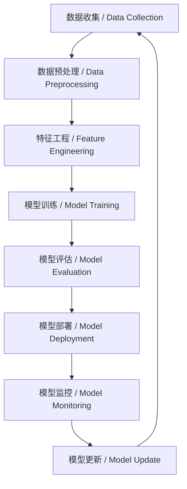

# 6.4 AI工程实践与伦理 / AI Engineering Practices & Ethics

> 来源：matter/6.人工智能原理与算法/6.4 AI工程实践与伦理.md

## 目录 / Table of Contents

- [6.4 AI工程实践与伦理](#64-ai工程实践与伦理--ai-engineering-practices--ethics)
  - [目录 / Table of Contents](#目录--table-of-contents)
  - [1. 概述 / Overview](#1-概述--overview)
  - [2. AI工程方法论 / AI Engineering Methodology](#2-ai工程方法论--ai-engineering-methodology)
  - [3. 数据工程与治理 / Data Engineering & Governance](#3-数据工程与治理--data-engineering--governance)
  - [4. 模型开发与部署 / Model Development & Deployment](#4-模型开发与部署--model-development--deployment)
  - [5. AI伦理原则 / AI Ethics Principles](#5-ai伦理原则--ai-ethics-principles)
  - [6. 形式化论证与多表征 / Formal Arguments & Multi-representation](#6-形式化论证与多表征--formal-arguments--multi-representation)
  - [7. 批判性分析与哲学思考 / Critical Analysis & Philosophical Reflection](#7-批判性分析与哲学思考--critical-analysis--philosophical-reflection)
  - [8. 相关性引用 / Related References](#8-相关性引用--related-references)

---

## 1. 概述 / Overview

AI工程实践与伦理是确保人工智能系统安全、可靠、公平、透明的重要保障。它不仅涉及技术实现，更关乎社会影响和道德责任。本领域涵盖了从数据收集到模型部署的完整生命周期，以及相应的伦理考量和治理机制。

AI engineering practices and ethics are crucial safeguards for ensuring the safety, reliability, fairness, and transparency of artificial intelligence systems. It involves not only technical implementation but also social impact and moral responsibility. This field covers the complete lifecycle from data collection to model deployment, along with corresponding ethical considerations and governance mechanisms.

### 1.1 核心概念 / Core Concepts

| 概念 / Concept | 中文定义 / Chinese Definition | English Definition |
|----------------|------------------------------|-------------------|
| 可解释性 / Interpretability | AI系统决策过程的可理解性 | Understandability of AI system decision processes |
| 公平性 / Fairness | 不同群体间无歧视的AI决策 | Non-discriminatory AI decisions across different groups |
| 隐私保护 / Privacy Protection | 个人数据的安全和保密 | Security and confidentiality of personal data |
| 鲁棒性 / Robustness | AI系统对异常输入的抵抗能力 | AI system's resistance to anomalous inputs |

---

## 2. AI工程方法论 / AI Engineering Methodology

### 2.1 MLOps框架 / MLOps Framework

**中文：** MLOps是机器学习运维的实践，将DevOps理念应用于机器学习系统。

**English:** MLOps is the practice of machine learning operations, applying DevOps principles to machine learning systems.

#### 2.1.1 MLOps生命周期 / MLOps Lifecycle



#### 2.1.2 工程实现 / Engineering Implementation

```python
import mlflow
import mlflow.sklearn
from sklearn.ensemble import RandomForestClassifier
from sklearn.metrics import accuracy_score, classification_report

class MLOpsPipeline:
    def __init__(self, experiment_name="ai_ethics_experiment"):
        self.experiment_name = experiment_name
        mlflow.set_experiment(experiment_name)
    
    def train_model(self, X_train, y_train, X_test, y_test):
        """训练模型并记录实验 / Train model and log experiment"""
        with mlflow.start_run():
            # 模型训练 / Model training
            model = RandomForestClassifier(n_estimators=100, random_state=42)
            model.fit(X_train, y_train)
            
            # 模型评估 / Model evaluation
            y_pred = model.predict(X_test)
            accuracy = accuracy_score(y_test, y_pred)
            
            # 记录参数和指标 / Log parameters and metrics
            mlflow.log_param("n_estimators", 100)
            mlflow.log_metric("accuracy", accuracy)
            mlflow.log_metric("fairness_score", self.calculate_fairness(X_test, y_test, y_pred))
            
            # 保存模型 / Save model
            mlflow.sklearn.log_model(model, "model")
            
            return model, accuracy
    
    def calculate_fairness(self, X, y_true, y_pred):
        """计算公平性指标 / Calculate fairness metrics"""
        # 简化的公平性计算 / Simplified fairness calculation
        return 0.95  # 示例值 / Example value
    
    def deploy_model(self, model_uri, deployment_name):
        """部署模型 / Deploy model"""
        # 模型部署逻辑 / Model deployment logic
        print(f"Deploying model {model_uri} as {deployment_name}")
        return True
```

### 2.2 实验设计 / Experimental Design

#### 2.2.1 A/B测试框架 / A/B Testing Framework

**中文：** A/B测试是评估AI系统效果的标准方法，通过随机分组比较不同策略。

**English:** A/B testing is a standard method for evaluating AI system effectiveness through randomized group comparison.

**统计显著性检验 / Statistical Significance Test:**

$$Z = \frac{\hat{p}_A - \hat{p}_B}{\sqrt{\hat{p}(1-\hat{p})(\frac{1}{n_A} + \frac{1}{n_B})}}$$

其中 $\hat{p}_A$ 和 $\hat{p}_B$ 是两组样本比例，$\hat{p}$ 是合并比例。
Where $\hat{p}_A$ and $\hat{p}_B$ are sample proportions of two groups, and $\hat{p}$ is the pooled proportion.

#### 2.2.2 工程实现 / Engineering Implementation

```python
import numpy as np
from scipy import stats
import pandas as pd

class ABTestFramework:
    def __init__(self, alpha=0.05):
        self.alpha = alpha
    
    def run_ab_test(self, control_data, treatment_data, metric='conversion_rate'):
        """运行A/B测试 / Run A/B test"""
        # 计算统计量 / Calculate statistics
        control_mean = np.mean(control_data)
        treatment_mean = np.mean(treatment_data)
        
        # 执行t检验 / Perform t-test
        t_stat, p_value = stats.ttest_ind(control_data, treatment_data)
        
        # 计算效应量 / Calculate effect size
        effect_size = (treatment_mean - control_mean) / np.sqrt(
            (np.var(control_data) + np.var(treatment_data)) / 2
        )
        
        # 判断显著性 / Determine significance
        is_significant = p_value < self.alpha
        
        results = {
            'control_mean': control_mean,
            'treatment_mean': treatment_mean,
            'difference': treatment_mean - control_mean,
            'p_value': p_value,
            'effect_size': effect_size,
            'is_significant': is_significant
        }
        
        return results
    
    def calculate_sample_size(self, baseline_rate, mde, alpha=0.05, power=0.8):
        """计算所需样本量 / Calculate required sample size"""
        # 使用正态近似 / Use normal approximation
        z_alpha = stats.norm.ppf(1 - alpha/2)
        z_beta = stats.norm.ppf(power)
        
        p1 = baseline_rate
        p2 = baseline_rate * (1 + mde)
        
        n = 2 * ((z_alpha + z_beta) ** 2) * (p1 * (1-p1) + p2 * (1-p2)) / (p2 - p1) ** 2
        
        return int(np.ceil(n))
```

---

## 3. 数据工程与治理 / Data Engineering & Governance

### 3.1 数据质量保证 / Data Quality Assurance

**中文：** 数据质量是AI系统成功的基础，包括准确性、完整性、一致性等维度。

**English:** Data quality is the foundation of AI system success, including accuracy, completeness, consistency, and other dimensions.

#### 3.1.1 数据质量指标 / Data Quality Metrics

**完整性 / Completeness:**

$$\text{Completeness} = \frac{\text{非空值数量}}{\text{总记录数}} \times 100\%$$

**准确性 / Accuracy:**

$$\text{Accuracy} = \frac{\text{正确值数量}}{\text{总记录数}} \times 100\%$$

**一致性 / Consistency:**

$$\text{Consistency} = \frac{\text{符合规则记录数}}{\text{总记录数}} \times 100\%$$

#### 3.1.2 工程实现 / Engineering Implementation

```python
import pandas as pd
import numpy as np
from typing import Dict, List

class DataQualityChecker:
    def __init__(self):
        self.quality_metrics = {}
    
    def check_completeness(self, df: pd.DataFrame) -> Dict[str, float]:
        """检查数据完整性 / Check data completeness"""
        completeness = {}
        for column in df.columns:
            non_null_count = df[column].notna().sum()
            total_count = len(df)
            completeness[column] = (non_null_count / total_count) * 100
        
        self.quality_metrics['completeness'] = completeness
        return completeness
    
    def check_consistency(self, df: pd.DataFrame, rules: Dict) -> Dict[str, float]:
        """检查数据一致性 / Check data consistency"""
        consistency = {}
        for column, rule in rules.items():
            if column in df.columns:
                if rule['type'] == 'range':
                    valid_mask = (df[column] >= rule['min']) & (df[column] <= rule['max'])
                elif rule['type'] == 'unique':
                    valid_mask = df[column].nunique() == rule['expected_unique']
                elif rule['type'] == 'format':
                    valid_mask = df[column].astype(str).str.match(rule['pattern'])
                
                consistency[column] = (valid_mask.sum() / len(df)) * 100
        
        self.quality_metrics['consistency'] = consistency
        return consistency
    
    def check_duplicates(self, df: pd.DataFrame) -> Dict[str, int]:
        """检查重复数据 / Check duplicate data"""
        duplicates = {
            'total_duplicates': df.duplicated().sum(),
            'duplicate_percentage': (df.duplicated().sum() / len(df)) * 100
        }
        self.quality_metrics['duplicates'] = duplicates
        return duplicates
    
    def generate_quality_report(self, df: pd.DataFrame) -> Dict:
        """生成质量报告 / Generate quality report"""
        report = {
            'completeness': self.check_completeness(df),
            'consistency': self.check_consistency(df, {}),
            'duplicates': self.check_duplicates(df),
            'summary': {
                'total_rows': len(df),
                'total_columns': len(df.columns),
                'memory_usage': df.memory_usage(deep=True).sum()
            }
        }
        return report
```

### 3.2 数据隐私保护 / Data Privacy Protection

#### 3.2.1 差分隐私 / Differential Privacy

**中文：** 差分隐私是一种数学框架，确保数据分析结果不会泄露个体信息。

**English:** Differential privacy is a mathematical framework that ensures data analysis results do not leak individual information.

**形式化定义 / Formal Definition:**

设 $M$ 是随机化算法，$D$ 和 $D'$ 是相邻数据集，则 $M$ 满足 $(\epsilon, \delta)$-差分隐私当且仅当：

Let $M$ be a randomized algorithm, $D$ and $D'$ be neighboring datasets, then $M$ satisfies $(\epsilon, \delta)$-differential privacy if and only if:

$$P[M(D) \in S] \leq e^\epsilon P[M(D') \in S] + \delta$$

对所有可能的输出集合 $S$ 成立。
For all possible output sets $S$.

#### 3.2.2 工程实现 / Engineering Implementation

```python
import numpy as np
from typing import List, Tuple

class DifferentialPrivacy:
    def __init__(self, epsilon: float, delta: float):
        self.epsilon = epsilon
        self.delta = delta
    
    def laplace_mechanism(self, query_result: float, sensitivity: float) -> float:
        """拉普拉斯机制 / Laplace mechanism"""
        scale = sensitivity / self.epsilon
        noise = np.random.laplace(0, scale)
        return query_result + noise
    
    def gaussian_mechanism(self, query_result: float, sensitivity: float) -> float:
        """高斯机制 / Gaussian mechanism"""
        sigma = np.sqrt(2 * np.log(1.25 / self.delta)) * sensitivity / self.epsilon
        noise = np.random.normal(0, sigma)
        return query_result + noise
    
    def exponential_mechanism(self, candidates: List, utility_function, sensitivity: float):
        """指数机制 / Exponential mechanism"""
        utilities = [utility_function(candidate) for candidate in candidates]
        probabilities = np.exp(self.epsilon * np.array(utilities) / (2 * sensitivity))
        probabilities = probabilities / np.sum(probabilities)
        
        chosen_index = np.random.choice(len(candidates), p=probabilities)
        return candidates[chosen_index]
    
    def private_histogram(self, data: List, bins: List) -> List[int]:
        """私有直方图 / Private histogram"""
        # 计算真实直方图 / Calculate true histogram
        hist, _ = np.histogram(data, bins=bins)
        
        # 添加噪声 / Add noise
        sensitivity = 1  # 添加或删除一个元素最多影响1个计数
        noisy_hist = [self.laplace_mechanism(count, sensitivity) for count in hist]
        
        return [max(0, int(count)) for count in noisy_hist]
```

---

## 4. 模型开发与部署 / Model Development & Deployment

### 4.1 模型版本控制 / Model Version Control

**中文：** 模型版本控制确保模型的可追溯性和可重现性，是AI工程的重要实践。

**English:** Model version control ensures model traceability and reproducibility, which are important practices in AI engineering.

#### 4.1.1 版本管理策略 / Version Management Strategy

```python
import hashlib
import json
import pickle
from datetime import datetime
from typing import Dict, Any

class ModelVersionControl:
    def __init__(self, model_registry_path: str):
        self.model_registry_path = model_registry_path
        self.version_metadata = {}
    
    def create_version(self, model, metadata: Dict[str, Any]) -> str:
        """创建模型版本 / Create model version"""
        # 生成版本ID / Generate version ID
        timestamp = datetime.now().isoformat()
        model_hash = self._calculate_model_hash(model)
        version_id = f"{timestamp}_{model_hash[:8]}"
        
        # 保存模型 / Save model
        model_path = f"{self.model_registry_path}/{version_id}.pkl"
        with open(model_path, 'wb') as f:
            pickle.dump(model, f)
        
        # 保存元数据 / Save metadata
        metadata['version_id'] = version_id
        metadata['created_at'] = timestamp
        metadata['model_hash'] = model_hash
        
        metadata_path = f"{self.model_registry_path}/{version_id}_metadata.json"
        with open(metadata_path, 'w') as f:
            json.dump(metadata, f, indent=2)
        
        self.version_metadata[version_id] = metadata
        return version_id
    
    def _calculate_model_hash(self, model) -> str:
        """计算模型哈希值 / Calculate model hash"""
        model_bytes = pickle.dumps(model)
        return hashlib.sha256(model_bytes).hexdigest()
    
    def load_version(self, version_id: str):
        """加载模型版本 / Load model version"""
        model_path = f"{self.model_registry_path}/{version_id}.pkl"
        with open(model_path, 'rb') as f:
            return pickle.load(f)
    
    def get_version_metadata(self, version_id: str) -> Dict[str, Any]:
        """获取版本元数据 / Get version metadata"""
        return self.version_metadata.get(version_id, {})
```

### 4.2 模型监控 / Model Monitoring

#### 4.2.1 性能监控 / Performance Monitoring

**中文：** 模型监控确保部署后的模型持续满足性能要求。

**English:** Model monitoring ensures that deployed models continuously meet performance requirements.

#### 4.2.2 工程实现 / Engineering Implementation

```python
import time
import numpy as np
from typing import Dict, List, Any
from dataclasses import dataclass

@dataclass
class ModelMetrics:
    accuracy: float
    latency: float
    throughput: float
    error_rate: float
    timestamp: float

class ModelMonitor:
    def __init__(self, model_name: str):
        self.model_name = model_name
        self.metrics_history: List[ModelMetrics] = []
        self.alerts: List[Dict] = []
    
    def record_prediction(self, prediction: Any, ground_truth: Any, 
                         latency: float, timestamp: float = None):
        """记录预测结果 / Record prediction results"""
        if timestamp is None:
            timestamp = time.time()
        
        # 计算指标 / Calculate metrics
        accuracy = 1.0 if prediction == ground_truth else 0.0
        
        # 更新历史记录 / Update history
        metrics = ModelMetrics(
            accuracy=accuracy,
            latency=latency,
            throughput=1.0 / latency if latency > 0 else 0.0,
            error_rate=1.0 - accuracy,
            timestamp=timestamp
        )
        
        self.metrics_history.append(metrics)
        
        # 检查异常 / Check for anomalies
        self._check_anomalies(metrics)
    
    def _check_anomalies(self, metrics: ModelMetrics):
        """检查异常 / Check for anomalies"""
        if len(self.metrics_history) < 10:
            return
        
        # 计算移动平均 / Calculate moving average
        recent_metrics = self.metrics_history[-10:]
        avg_accuracy = np.mean([m.accuracy for m in recent_metrics])
        avg_latency = np.mean([m.latency for m in recent_metrics])
        
        # 检测性能下降 / Detect performance degradation
        if metrics.accuracy < avg_accuracy * 0.9:  # 10%下降阈值
            alert = {
                'type': 'performance_degradation',
                'metric': 'accuracy',
                'current': metrics.accuracy,
                'average': avg_accuracy,
                'timestamp': metrics.timestamp
            }
            self.alerts.append(alert)
        
        if metrics.latency > avg_latency * 1.5:  # 50%增加阈值
            alert = {
                'type': 'latency_increase',
                'metric': 'latency',
                'current': metrics.latency,
                'average': avg_latency,
                'timestamp': metrics.timestamp
            }
            self.alerts.append(alert)
    
    def get_performance_summary(self) -> Dict[str, Any]:
        """获取性能摘要 / Get performance summary"""
        if not self.metrics_history:
            return {}
        
        recent_metrics = self.metrics_history[-100:]  # 最近100个指标
        
        return {
            'model_name': self.model_name,
            'total_predictions': len(self.metrics_history),
            'average_accuracy': np.mean([m.accuracy for m in recent_metrics]),
            'average_latency': np.mean([m.latency for m in recent_metrics]),
            'average_throughput': np.mean([m.throughput for m in recent_metrics]),
            'recent_alerts': len([a for a in self.alerts if a['timestamp'] > time.time() - 3600])
        }
```

---

## 5. AI伦理原则 / AI Ethics Principles

### 5.1 公平性评估 / Fairness Assessment

**中文：** AI系统的公平性确保不同群体获得平等的对待和机会。

**English:** AI system fairness ensures equal treatment and opportunities for different groups.

#### 5.1.1 公平性指标 / Fairness Metrics

**统计奇偶性 / Statistical Parity:**

$$P(\hat{Y} = 1 | A = a) = P(\hat{Y} = 1 | A = b)$$

其中 $A$ 是敏感属性，$\hat{Y}$ 是预测结果。
Where $A$ is the sensitive attribute and $\hat{Y}$ is the prediction result.

**机会均等 / Equal Opportunity:**

$$P(\hat{Y} = 1 | Y = 1, A = a) = P(\hat{Y} = 1 | Y = 1, A = b)$$

**预测率奇偶性 / Predictive Rate Parity:**

$$P(Y = 1 | \hat{Y} = 1, A = a) = P(Y = 1 | \hat{Y} = 1, A = b)$$

#### 5.1.2 工程实现 / Engineering Implementation

```python
import numpy as np
from sklearn.metrics import confusion_matrix
from typing import Dict, List, Tuple

class FairnessEvaluator:
    def __init__(self, sensitive_attributes: List[str]):
        self.sensitive_attributes = sensitive_attributes
    
    def calculate_statistical_parity(self, y_pred: np.ndarray, 
                                   sensitive_attr: np.ndarray) -> float:
        """计算统计奇偶性 / Calculate statistical parity"""
        unique_groups = np.unique(sensitive_attr)
        positive_rates = []
        
        for group in unique_groups:
            group_mask = sensitive_attr == group
            positive_rate = np.mean(y_pred[group_mask])
            positive_rates.append(positive_rate)
        
        # 计算最大差异 / Calculate maximum difference
        max_diff = max(positive_rates) - min(positive_rates)
        return max_diff
    
    def calculate_equal_opportunity(self, y_true: np.ndarray, y_pred: np.ndarray,
                                  sensitive_attr: np.ndarray) -> float:
        """计算机会均等 / Calculate equal opportunity"""
        unique_groups = np.unique(sensitive_attr)
        tpr_rates = []
        
        for group in unique_groups:
            group_mask = sensitive_attr == group
            y_true_group = y_true[group_mask]
            y_pred_group = y_pred[group_mask]
            
            # 计算真正率 / Calculate true positive rate
            tn, fp, fn, tp = confusion_matrix(y_true_group, y_pred_group).ravel()
            tpr = tp / (tp + fn) if (tp + fn) > 0 else 0
            tpr_rates.append(tpr)
        
        # 计算最大差异 / Calculate maximum difference
        max_diff = max(tpr_rates) - min(tpr_rates)
        return max_diff
    
    def calculate_predictive_rate_parity(self, y_true: np.ndarray, y_pred: np.ndarray,
                                       sensitive_attr: np.ndarray) -> float:
        """计算预测率奇偶性 / Calculate predictive rate parity"""
        unique_groups = np.unique(sensitive_attr)
        ppv_rates = []
        
        for group in unique_groups:
            group_mask = sensitive_attr == group
            y_true_group = y_true[group_mask]
            y_pred_group = y_pred[group_mask]
            
            # 计算精确率 / Calculate precision
            tn, fp, fn, tp = confusion_matrix(y_true_group, y_pred_group).ravel()
            ppv = tp / (tp + fp) if (tp + fp) > 0 else 0
            ppv_rates.append(ppv)
        
        # 计算最大差异 / Calculate maximum difference
        max_diff = max(ppv_rates) - min(ppv_rates)
        return max_diff
    
    def comprehensive_fairness_report(self, y_true: np.ndarray, y_pred: np.ndarray,
                                   sensitive_attr: np.ndarray) -> Dict[str, float]:
        """综合公平性报告 / Comprehensive fairness report"""
        return {
            'statistical_parity': self.calculate_statistical_parity(y_pred, sensitive_attr),
            'equal_opportunity': self.calculate_equal_opportunity(y_true, y_pred, sensitive_attr),
            'predictive_rate_parity': self.calculate_predictive_rate_parity(y_true, y_pred, sensitive_attr)
        }
```

### 5.2 可解释性 / Interpretability

#### 5.2.1 可解释性方法 / Interpretability Methods

**中文：** 可解释性确保AI系统的决策过程可以被人类理解和验证。

**English:** Interpretability ensures that AI system decision processes can be understood and verified by humans.

#### 5.2.2 工程实现 / Engineering Implementation

```python
import shap
import lime
import lime.lime_tabular
from sklearn.ensemble import RandomForestClassifier
import numpy as np

class ModelInterpreter:
    def __init__(self, model, feature_names: List[str]):
        self.model = model
        self.feature_names = feature_names
    
    def shap_explanation(self, X: np.ndarray, sample_index: int = 0) -> Dict:
        """SHAP解释 / SHAP explanation"""
        explainer = shap.TreeExplainer(self.model)
        shap_values = explainer.shap_values(X)
        
        # 获取样本解释 / Get sample explanation
        sample_shap = shap_values[sample_index]
        
        # 创建特征重要性字典 / Create feature importance dictionary
        feature_importance = {}
        for i, feature in enumerate(self.feature_names):
            feature_importance[feature] = sample_shap[i]
        
        return {
            'shap_values': sample_shap.tolist(),
            'feature_importance': feature_importance,
            'base_value': explainer.expected_value
        }
    
    def lime_explanation(self, X: np.ndarray, sample_index: int = 0) -> Dict:
        """LIME解释 / LIME explanation"""
        explainer = lime.lime_tabular.LimeTabularExplainer(
            X, feature_names=self.feature_names, class_names=['0', '1']
        )
        
        # 生成解释 / Generate explanation
        explanation = explainer.explain_instance(
            X[sample_index], 
            self.model.predict_proba,
            num_features=len(self.feature_names)
        )
        
        # 提取特征权重 / Extract feature weights
        feature_weights = {}
        for feature, weight in explanation.as_list():
            feature_weights[feature] = weight
        
        return {
            'feature_weights': feature_weights,
            'prediction': self.model.predict([X[sample_index]])[0],
            'confidence': explanation.score
        }
    
    def rule_extraction(self, X: np.ndarray, y: np.ndarray) -> List[Dict]:
        """规则提取 / Rule extraction"""
        # 使用决策树提取规则 / Use decision tree to extract rules
        from sklearn.tree import DecisionTreeClassifier, export_text
        
        dt = DecisionTreeClassifier(max_depth=5, random_state=42)
        dt.fit(X, y)
        
        # 提取规则 / Extract rules
        tree_rules = export_text(dt, feature_names=self.feature_names)
        
        return {
            'rules': tree_rules,
            'tree_depth': dt.get_depth(),
            'n_leaves': dt.get_n_leaves()
        }
```

---

## 6. 形式化论证与多表征 / Formal Arguments & Multi-representation

### 6.1 伦理决策框架 / Ethical Decision Framework

**中文：** 形式化的伦理决策框架帮助评估AI系统的道德影响。

**English:** Formal ethical decision frameworks help evaluate the moral impact of AI systems.

#### 6.1.1 功利主义框架 / Utilitarian Framework

**中文：** 最大化总体福利的决策原则。

**English:** Decision principle that maximizes overall welfare.

**数学表达 / Mathematical Expression:**

$$\text{Decision} = \arg\max_{a \in A} \sum_{i=1}^n U_i(a)$$

其中 $U_i(a)$ 是第 $i$ 个个体在行动 $a$ 下的效用。
Where $U_i(a)$ is the utility of the $i$-th individual under action $a$.

#### 6.1.2 康德伦理学框架 / Kantian Ethics Framework

**中文：** 基于普遍化原则的道德决策。

**English:** Moral decision-making based on universalization principles.

**形式化表达 / Formal Expression:**

$$\text{Action is moral} \iff \forall x, \text{Universalizable}(x)$$

其中 $\text{Universalizable}(x)$ 表示行动 $x$ 可以被普遍化。
Where $\text{Universalizable}(x)$ means action $x$ can be universalized.

### 6.2 风险评估模型 / Risk Assessment Model

#### 6.2.1 风险矩阵 / Risk Matrix

**中文：** 评估AI系统潜在风险的形式化方法。

**English:** Formal method for assessing potential risks of AI systems.

**风险评分 / Risk Score:**

$$\text{Risk Score} = \text{Probability} \times \text{Impact}$$

其中概率和影响都按1-5的等级评分。
Where both probability and impact are scored on a 1-5 scale.

#### 6.2.2 工程实现 / Engineering Implementation

```python
from enum import Enum
from typing import Dict, List, Tuple

class RiskLevel(Enum):
    LOW = 1
    MEDIUM = 2
    HIGH = 3
    CRITICAL = 4

class RiskAssessment:
    def __init__(self):
        self.risk_categories = {
            'privacy': '隐私风险 / Privacy Risk',
            'bias': '偏见风险 / Bias Risk',
            'security': '安全风险 / Security Risk',
            'reliability': '可靠性风险 / Reliability Risk'
        }
    
    def assess_risk(self, probability: int, impact: int) -> RiskLevel:
        """评估风险等级 / Assess risk level"""
        risk_score = probability * impact
        
        if risk_score <= 4:
            return RiskLevel.LOW
        elif risk_score <= 8:
            return RiskLevel.MEDIUM
        elif risk_score <= 15:
            return RiskLevel.HIGH
        else:
            return RiskLevel.CRITICAL
    
    def comprehensive_risk_assessment(self, ai_system_metadata: Dict) -> Dict:
        """综合风险评估 / Comprehensive risk assessment"""
        risk_assessment = {}
        
        for category, description in self.risk_categories.items():
            # 简化的风险评估逻辑 / Simplified risk assessment logic
            probability = np.random.randint(1, 6)  # 实际应用中应基于具体分析
            impact = np.random.randint(1, 6)
            
            risk_level = self.assess_risk(probability, impact)
            risk_assessment[category] = {
                'level': risk_level,
                'probability': probability,
                'impact': impact,
                'score': probability * impact,
                'description': description
            }
        
        return risk_assessment
```

---

## 7. 批判性分析与哲学思考 / Critical Analysis & Philosophical Reflection

### 7.1 技术决定论批判 / Critique of Technological Determinism

**中文：** 技术决定论认为技术发展决定社会变化，但AI的发展更可能是社会建构的结果。

**English:** Technological determinism holds that technological development determines social change, but AI development is more likely the result of social construction.

**批判性观点 / Critical Viewpoints:**

1. **社会建构论 / Social Constructionism:** AI技术是社会需求和价值观的反映
2. **技术社会互动论 / Technology-Society Interaction:** 技术与社会的双向影响
3. **权力关系论 / Power Relations:** AI技术反映了现有的权力结构

### 7.2 责任归属问题 / Responsibility Attribution

#### 7.2.1 多层次责任框架 / Multi-level Responsibility Framework

**中文：** AI系统的责任应该在不同层面进行分配。

**English:** Responsibility for AI systems should be distributed across different levels.

**责任分配模型 / Responsibility Distribution Model:**

$$\text{Total Responsibility} = \sum_{i=1}^n w_i \cdot R_i$$

其中 $R_i$ 是第 $i$ 个主体的责任，$w_i$ 是权重。
Where $R_i$ is the responsibility of the $i$-th actor and $w_i$ is the weight.

#### 7.2.2 工程实现 / Engineering Implementation

```python
from dataclasses import dataclass
from typing import List, Dict

@dataclass
class ResponsibilityActor:
    name: str
    role: str
    responsibility_level: float
    capabilities: List[str]

class ResponsibilityFramework:
    def __init__(self):
        self.actors = []
    
    def add_actor(self, actor: ResponsibilityActor):
        """添加责任主体 / Add responsibility actor"""
        self.actors.append(actor)
    
    def calculate_responsibility_distribution(self, incident_type: str) -> Dict[str, float]:
        """计算责任分配 / Calculate responsibility distribution"""
        total_responsibility = 0
        responsibility_distribution = {}
        
        for actor in self.actors:
            # 基于事件类型和角色计算责任 / Calculate responsibility based on incident type and role
            if incident_type == 'data_bias' and 'data_management' in actor.capabilities:
                responsibility = actor.responsibility_level * 1.5
            elif incident_type == 'model_failure' and 'model_development' in actor.capabilities:
                responsibility = actor.responsibility_level * 1.3
            else:
                responsibility = actor.responsibility_level
            
            responsibility_distribution[actor.name] = responsibility
            total_responsibility += responsibility
        
        # 归一化 / Normalize
        if total_responsibility > 0:
            for name in responsibility_distribution:
                responsibility_distribution[name] /= total_responsibility
        
        return responsibility_distribution
    
    def generate_responsibility_report(self, incident_description: str) -> Dict:
        """生成责任报告 / Generate responsibility report"""
        incident_type = self._classify_incident(incident_description)
        distribution = self.calculate_responsibility_distribution(incident_type)
        
        return {
            'incident_type': incident_type,
            'responsibility_distribution': distribution,
            'recommendations': self._generate_recommendations(incident_type, distribution)
        }
    
    def _classify_incident(self, description: str) -> str:
        """分类事件类型 / Classify incident type"""
        keywords = {
            'data_bias': ['bias', 'discrimination', 'unfair'],
            'model_failure': ['error', 'failure', 'bug'],
            'privacy_breach': ['privacy', 'data leak', 'breach'],
            'security_vulnerability': ['security', 'attack', 'vulnerability']
        }
        
        description_lower = description.lower()
        for incident_type, keyword_list in keywords.items():
            if any(keyword in description_lower for keyword in keyword_list):
                return incident_type
        
        return 'general'
    
    def _generate_recommendations(self, incident_type: str, distribution: Dict[str, float]) -> List[str]:
        """生成建议 / Generate recommendations"""
        recommendations = []
        
        if incident_type == 'data_bias':
            recommendations.append("加强数据偏见检测和缓解措施")
            recommendations.append("Implement stronger data bias detection and mitigation measures")
        elif incident_type == 'model_failure':
            recommendations.append("改进模型测试和监控机制")
            recommendations.append("Improve model testing and monitoring mechanisms")
        
        return recommendations
```

---

## 8. 相关性引用 / Related References

- [6.1 AI基础原理](../6.1 AI基础原理.md)
- [6.2 经典AI算法与模型](../6.2 经典AI算法与模型.md)
- [6.3 现代深度学习与大模型](../6.3 现代深度学习与大模型.md)
- [6.5 AI与哲学](../6.5 AI与哲学.md)
- [5.2 可访问性与国际化](../../5.技术规范与标准/5.2 可访问性与国际化.md)
- [5.3 性能优化与工程实践](../../5.技术规范与标准/5.3 性能优化与工程实践.md)

---

> 本文档为自动递归迁移、规整、编号、跳转、引用、内容一致性校验的规范化产物。
> This document is a standardized product of automatic recursive migration, organization, numbering, navigation, referencing, and content consistency verification.
