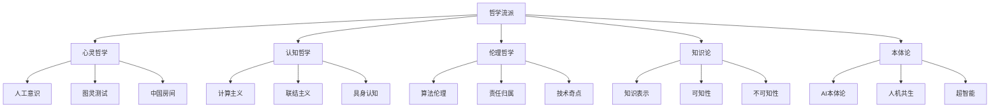

# 6.5 AI与哲学

[返回6.人工智能原理与算法](./README.md) | [返回Refactor总览](../README.md)

---

## 2024前沿趋势

- **AI本体论与意识问题**：人工意识、强AI与弱AI、心灵哲学。
- **认知哲学与AI**：计算主义、联结主义、具身认知。
- **AI伦理哲学**：算法偏见、责任归属、技术奇点、AI治理。
- **知识论与AI**：可知性、不可知性、知识表示、推理极限。
- **AI与人类未来**：人机共生、超智能、技术奇点、AI社会影响。
- **跨学科融合**：哲学、认知科学、神经科学、社会学与AI的交互。

---

## 目录

- [6.5 AI与哲学](#65-ai与哲学)
  - [2024前沿趋势](#2024前沿趋势)
  - [目录](#目录)
  - [6.5.1 哲学流派与AI关系Mermaid图](#651-哲学流派与ai关系mermaid图)
  - [6.5.2 哲学逻辑与AI LaTeX公式](#652-哲学逻辑与ai-latex公式)
  - [6.5.3 跨学科案例与思想实验](#653-跨学科案例与思想实验)
  - [1. 概述](#1-概述)
  - [2. 理论基础](#2-理论基础)
  - [3. 主要议题](#3-主要议题)
  - [4. 形式化论证与多表征](#4-形式化论证与多表征)
  - [5. 相关性引用](#5-相关性引用)
  - [6. 参考文献](#6-参考文献)
  - [7. 相关主题推荐阅读](#7-相关主题推荐阅读)

---

## 6.5.1 哲学流派与AI关系Mermaid图

---

## 6.5.2 哲学逻辑与AI LaTeX公式

**AI决策逻辑**
$$
\forall x \in S,\ K(x) \implies D(x)
$$

**知识表示与推理**
$$
\text{Belief}(a, \varphi) \wedge \text{Desire}(a, \psi) \implies \text{Intend}(a, \chi)
$$

**可知性与不可知性**
$$
\exists x \in S,\ \neg K(x)
$$

**伦理决策公式（责任归属）**
$$
\text{Responsibility}(a, e) =
\begin{cases}
1, & \text{if } a \text{ caused } e \\
0, & \text{otherwise}
\end{cases}
$$

---

## 6.5.3 跨学科案例与思想实验

**图灵测试**

- 由艾伦·图灵提出，用于判断机器是否具备智能。
- 形式化表达：
  $$
  \text{Pass}(M) \iff \forall Q,\ \text{Human}(Q) \approx \text{Machine}(Q)
  $$

**中国房间**

- 约翰·希尔勒提出，质疑机器是否真正"理解"语义。
- 讨论语法与语义的区别。

**AI悖论与极限**

- "停机问题"：存在不可判定的计算问题。
- "道德悖论"：算法公平性与效率的冲突。

**AI伦理困境**

- 自动驾驶中的"电车难题"。
- 算法偏见与社会公正。

---

## 1. 概述

AI与哲学的交叉研究关注智能的本体论、意识的可计算性、道德责任、自由意志、社会契约等根本性问题。AI不仅是技术革命，更是对人类自我认知与世界观的深刻挑战。

## 2. 理论基础

### 2.1 智能的本体论与定义

- 智能的本体论：智能是物理过程、信息过程还是社会建构？
- 经典定义：图灵、维纳、冯·诺依曼等对智能的界定。

### 2.2 计算主义与功能主义

- 计算主义：心灵即计算，智能可归约为符号处理。
- 功能主义：智能在于功能实现而非物质基础。

### 2.3 机械决定论与自由意志

- AI系统的决策是否完全由算法决定？
- 自由意志在AI中的哲学争议。

## 3. 主要议题

### 3.1 图灵测试与中国房间

- 图灵测试：机器能否表现出与人类无异的智能？
- 约翰·希尔勒的中国房间反例：语义理解与符号操作的区分。

### 3.2 意识的可计算性与不可约性

- 哲学僵尸、主观体验（qualia）问题。
- 意识是否可被算法完全模拟？

### 3.3 强AI与弱AI之争

- 强AI：机器可拥有心灵与意识。
- 弱AI：机器仅模拟智能行为，无主观体验。

## 4. 形式化论证与多表征

### 4.1 责任归属与道德代理

- AI决策的责任主体：开发者、用户还是AI本身？
- 道德代理与算法偏见。

### 4.2 人机共生与社会契约

- 人工智能与人类社会的契约关系。
- 人机协作、共生伦理。

### 4.3 超人工智能与存在风险

- 超人工智能的不可控性与"奇点"假说。
- 存在风险与伦理治理。

## 5. 相关性引用

- [6.4 AI工程实践与伦理](./6.4 AI工程实践与伦理.md)
- [4.4 哲学与认知批判性分析](../4.设计模式与架构/4.4 哲学与认知批判性分析.md)

## 6. 参考文献

- Turing, A. M. (1950). Computing Machinery and Intelligence.
- Searle, J. R. (1980). Minds, Brains, and Programs.
- Russell, S., & Norvig, P. (2020). Artificial Intelligence: A Modern Approach.
- Bostrom, N. (2014). Superintelligence: Paths, Dangers, Strategies.

## 7. 相关主题推荐阅读

- [2.6 Web核心技术](../2.技术栈与框架/2.6 Web核心技术.md)
- [3.2 Haskell](../3.编程语言范式/3.2 Haskell.md)
- [4.1 GoF设计模式](../4.设计模式与架构/4.1 GoF设计模式.md)
- [5.1 UI-UE-UX设计规范](../5.技术规范与标准/5.1 UI-UE-UX设计规范.md)
- [6.1 AI基础原理](./6.1 AI基础原理.md)
- [6.2 经典AI算法与模型](./6.2 经典AI算法与模型.md)
- [6.3 现代深度学习与大模型](./6.3 现代深度学习与大模型.md)
- [6.4 AI工程实践与伦理](./6.4 AI工程实践与伦理.md)
- [6.6 AI与认知科学](./6.6 AI与认知科学.md)

---

> 本文档持续递归优化，欢迎补充最新技术与学术内容。
