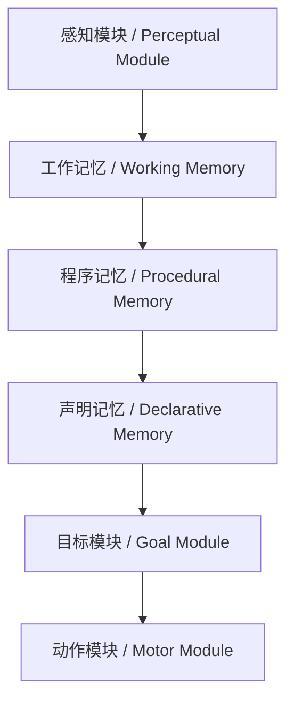
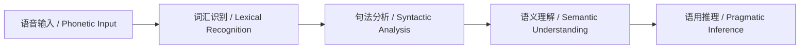

# 6.6 AI与认知科学 / AI & Cognitive Science

> 来源：matter/6.人工智能原理与算法/6.6 AI与认知科学.md

## 目录 / Table of Contents

- [6.6 AI与认知科学](#66-ai与认知科学--ai--cognitive-science)
  - [目录 / Table of Contents](#目录--table-of-contents)
  - [1. 概述 / Overview](#1-概述--overview)
  - [2. 认知架构 / Cognitive Architecture](#2-认知架构--cognitive-architecture)
  - [3. 学习与记忆 / Learning & Memory](#3-学习与记忆--learning--memory)
  - [4. 注意力与意识 / Attention & Consciousness](#4-注意力与意识--attention--consciousness)
  - [5. 语言与思维 / Language & Thinking](#5-语言与思维--language--thinking)
  - [6. 形式化论证与多表征 / Formal Arguments & Multi-representation](#6-形式化论证与多表征--formal-arguments--multi-representation)
  - [7. 批判性分析与哲学思考 / Critical Analysis & Philosophical Reflection](#7-批判性分析与哲学思考--critical-analysis--philosophical-reflection)
  - [8. 相关性引用 / Related References](#8-相关性引用--related-references)

---

## 1. 概述 / Overview

AI与认知科学的交叉研究探讨了人工智能如何模拟和增强人类认知过程。这不仅涉及技术实现，更关乎对人类智能本质的理解。认知科学为AI提供了理论基础，而AI技术也为认知科学研究提供了新的工具和方法。

The intersection of AI and cognitive science explores how artificial intelligence can simulate and enhance human cognitive processes. This involves not only technical implementation but also understanding the nature of human intelligence. Cognitive science provides theoretical foundations for AI, while AI technology provides new tools and methods for cognitive science research.

### 1.1 核心领域 / Core Domains

| 认知领域 / Cognitive Domain | AI对应技术 / AI Corresponding Technology | 研究重点 / Research Focus |
|----------------------------|----------------------------------------|-------------------------|
| 感知 / Perception | 计算机视觉、语音识别 | 模式识别与理解 |
| 记忆 / Memory | 知识图谱、向量数据库 | 信息存储与检索 |
| 推理 / Reasoning | 逻辑推理、概率推理 | 问题解决与决策 |
| 学习 / Learning | 机器学习、深度学习 | 知识获取与适应 |

---

## 2. 认知架构 / Cognitive Architecture

### 2.1 ACT-R架构 / ACT-R Architecture

**中文：** ACT-R是一个认知架构，模拟人类认知过程，包括感知、记忆、推理等。

**English:** ACT-R is a cognitive architecture that simulates human cognitive processes, including perception, memory, reasoning, etc.

#### 2.1.1 架构组件 / Architecture Components



#### 2.1.2 数学模型 / Mathematical Model

**激活扩散 / Activation Spreading:**

$$A_i = B_i + \sum_{j} W_{ij} S_j$$

其中 $A_i$ 是节点 $i$ 的激活值，$B_i$ 是基础激活，$W_{ij}$ 是权重，$S_j$ 是源节点激活。
Where $A_i$ is the activation of node $i$, $B_i$ is the base activation, $W_{ij}$ is the weight, and $S_j$ is the source node activation.

#### 2.1.3 工程实现 / Engineering Implementation

```python
import numpy as np
from typing import Dict, List, Tuple

class ACTRModel:
    def __init__(self):
        self.declarative_memory = {}
        self.procedural_memory = {}
        self.working_memory = []
        self.goals = []
        self.activation_threshold = 0.0
    
    def add_declarative_chunk(self, chunk_id: str, content: Dict[str, any]):
        """添加声明记忆块 / Add declarative chunk"""
        self.declarative_memory[chunk_id] = {
            'content': content,
            'activation': 0.0,
            'creation_time': time.time()
        }
    
    def add_procedural_rule(self, rule_id: str, condition: Dict, action: Dict):
        """添加程序规则 / Add procedural rule"""
        self.procedural_memory[rule_id] = {
            'condition': condition,
            'action': action,
            'utility': 0.0
        }
    
    def calculate_activation(self, chunk_id: str) -> float:
        """计算激活值 / Calculate activation"""
        if chunk_id not in self.declarative_memory:
            return 0.0
        
        chunk = self.declarative_memory[chunk_id]
        base_activation = chunk['activation']
        
        # 计算上下文激活 / Calculate contextual activation
        contextual_activation = 0.0
        for goal in self.goals:
            if self._is_related(chunk_id, goal):
                contextual_activation += 1.0
        
        total_activation = base_activation + contextual_activation
        return total_activation
    
    def retrieve_chunk(self, pattern: Dict) -> str:
        """检索记忆块 / Retrieve chunk"""
        best_chunk = None
        best_activation = -float('inf')
        
        for chunk_id, chunk in self.declarative_memory.items():
            if self._matches_pattern(chunk['content'], pattern):
                activation = self.calculate_activation(chunk_id)
                if activation > best_activation:
                    best_activation = activation
                    best_chunk = chunk_id
        
        return best_chunk if best_activation > self.activation_threshold else None
    
    def _is_related(self, chunk_id: str, goal: str) -> bool:
        """检查相关性 / Check relatedness"""
        # 简化的相关性检查 / Simplified relatedness check
        return chunk_id.lower() in goal.lower() or goal.lower() in chunk_id.lower()
    
    def _matches_pattern(self, content: Dict, pattern: Dict) -> bool:
        """模式匹配 / Pattern matching"""
        for key, value in pattern.items():
            if key not in content or content[key] != value:
                return False
        return True
```

### 2.2 Soar架构 / Soar Architecture

**中文：** Soar是一个通用认知架构，强调问题解决和学习能力。

**English:** Soar is a general cognitive architecture emphasizing problem-solving and learning capabilities.

#### 2.2.1 决策周期 / Decision Cycle

**中文：** Soar通过感知-决策-行动循环进行认知处理。

**English:** Soar performs cognitive processing through perception-decision-action cycles.

**形式化表达 / Formal Expression:**

$$\text{Decision Cycle} = \text{Perception} \circ \text{Decision} \circ \text{Action}$$

其中 $\circ$ 表示函数复合。
Where $\circ$ represents function composition.

#### 2.2.2 工程实现 / Engineering Implementation

```python
from enum import Enum
from typing import List, Dict, Any

class DecisionPhase(Enum):
    PERCEPTION = "perception"
    DECISION = "decision"
    ACTION = "action"

class SoarModel:
    def __init__(self):
        self.working_memory = {}
        self.production_rules = []
        self.decision_cycle = 0
        self.current_phase = DecisionPhase.PERCEPTION
    
    def add_production_rule(self, condition: Dict, action: Dict, utility: float = 0.0):
        """添加产生式规则 / Add production rule"""
        rule = {
            'condition': condition,
            'action': action,
            'utility': utility,
            'usage_count': 0
        }
        self.production_rules.append(rule)
    
    def perception_phase(self, sensory_input: Dict):
        """感知阶段 / Perception phase"""
        # 更新工作记忆 / Update working memory
        for key, value in sensory_input.items():
            self.working_memory[f"sensory.{key}"] = value
        
        self.current_phase = DecisionPhase.DECISION
    
    def decision_phase(self) -> Dict:
        """决策阶段 / Decision phase"""
        applicable_rules = []
        
        # 找到适用的规则 / Find applicable rules
        for rule in self.production_rules:
            if self._matches_condition(rule['condition']):
                applicable_rules.append(rule)
        
        # 选择最佳规则 / Select best rule
        if applicable_rules:
            best_rule = max(applicable_rules, key=lambda r: r['utility'])
            best_rule['usage_count'] += 1
            
            self.current_phase = DecisionPhase.ACTION
            return best_rule['action']
        
        return {}
    
    def action_phase(self, action: Dict):
        """行动阶段 / Action phase"""
        # 执行行动 / Execute action
        for key, value in action.items():
            self.working_memory[f"action.{key}"] = value
        
        self.decision_cycle += 1
        self.current_phase = DecisionPhase.PERCEPTION
    
    def _matches_condition(self, condition: Dict) -> bool:
        """检查条件匹配 / Check condition matching"""
        for key, value in condition.items():
            if key not in self.working_memory or self.working_memory[key] != value:
                return False
        return True
    
    def run_cycle(self, sensory_input: Dict) -> Dict:
        """运行决策周期 / Run decision cycle"""
        self.perception_phase(sensory_input)
        action = self.decision_phase()
        self.action_phase(action)
        
        return action
```

---

## 3. 学习与记忆 / Learning & Memory

### 3.1 记忆模型 / Memory Models

**中文：** 记忆模型描述了信息如何被编码、存储和检索。

**English:** Memory models describe how information is encoded, stored, and retrieved.

#### 3.1.1 工作记忆模型 / Working Memory Model

**中文：** 工作记忆是有限的认知资源，用于临时存储和处理信息。

**English:** Working memory is a limited cognitive resource for temporary storage and processing of information.

**容量限制 / Capacity Limitation:**

$$\text{Working Memory Capacity} = 7 \pm 2 \text{ chunks}$$

其中chunk是信息的基本单位。
Where chunk is the basic unit of information.

#### 3.1.2 工程实现 / Engineering Implementation

```python
import time
from typing import List, Dict, Any
import numpy as np

class WorkingMemory:
    def __init__(self, capacity: int = 7):
        self.capacity = capacity
        self.items = []
        self.activation_decay = 0.1
    
    def add_item(self, item: Dict[str, Any]) -> bool:
        """添加项目到工作记忆 / Add item to working memory"""
        if len(self.items) >= self.capacity:
            # 移除激活最低的项目 / Remove item with lowest activation
            self._remove_least_activated()
        
        item['activation'] = 1.0
        item['timestamp'] = time.time()
        self.items.append(item)
        return True
    
    def retrieve_item(self, pattern: Dict) -> Dict[str, Any]:
        """检索项目 / Retrieve item"""
        best_item = None
        best_activation = -float('inf')
        
        for item in self.items:
            if self._matches_pattern(item, pattern):
                current_activation = self._calculate_activation(item)
                if current_activation > best_activation:
                    best_activation = current_activation
                    best_item = item
        
        if best_item:
            # 增强激活 / Strengthen activation
            best_item['activation'] = min(1.0, best_item['activation'] + 0.2)
        
        return best_item
    
    def _calculate_activation(self, item: Dict[str, Any]) -> float:
        """计算激活值 / Calculate activation"""
        time_decay = np.exp(-self.activation_decay * (time.time() - item['timestamp']))
        return item['activation'] * time_decay
    
    def _remove_least_activated(self):
        """移除激活最低的项目 / Remove least activated item"""
        if not self.items:
            return
        
        least_activated = min(self.items, key=lambda x: self._calculate_activation(x))
        self.items.remove(least_activated)
    
    def _matches_pattern(self, item: Dict[str, Any], pattern: Dict[str, Any]) -> bool:
        """模式匹配 / Pattern matching"""
        for key, value in pattern.items():
            if key not in item or item[key] != value:
                return False
        return True
```

### 3.2 学习机制 / Learning Mechanisms

#### 3.2.1 强化学习 / Reinforcement Learning

**中文：** 强化学习模拟了人类通过试错学习的过程。

**English:** Reinforcement learning simulates human learning through trial and error.

**Q学习算法 / Q-Learning Algorithm:**

$$Q(s, a) \leftarrow Q(s, a) + \alpha [r + \gamma \max_{a'} Q(s', a') - Q(s, a)]$$

其中 $\alpha$ 是学习率，$\gamma$ 是折扣因子。
Where $\alpha$ is the learning rate and $\gamma$ is the discount factor.

#### 3.2.2 工程实现 / Engineering Implementation

```python
import numpy as np
from typing import Dict, Tuple, List

class CognitiveReinforcementLearning:
    def __init__(self, state_size: int, action_size: int, learning_rate: float = 0.1):
        self.q_table = np.zeros((state_size, action_size))
        self.learning_rate = learning_rate
        self.discount_factor = 0.95
        self.epsilon = 0.1
    
    def choose_action(self, state: int) -> int:
        """选择动作 / Choose action"""
        if np.random.random() < self.epsilon:
            return np.random.randint(0, self.q_table.shape[1])
        else:
            return np.argmax(self.q_table[state])
    
    def learn(self, state: int, action: int, reward: float, next_state: int):
        """学习更新 / Learning update"""
        old_value = self.q_table[state, action]
        next_max = np.max(self.q_table[next_state])
        
        new_value = (1 - self.learning_rate) * old_value + \
                   self.learning_rate * (reward + self.discount_factor * next_max)
        
        self.q_table[state, action] = new_value
    
    def get_optimal_policy(self) -> List[int]:
        """获取最优策略 / Get optimal policy"""
        return [np.argmax(self.q_table[state]) for state in range(self.q_table.shape[0])]
```

---

## 4. 注意力与意识 / Attention & Consciousness

### 4.1 注意力机制 / Attention Mechanisms

**中文：** 注意力机制是认知科学的核心概念，决定了哪些信息被优先处理。

**English:** Attention mechanisms are core concepts in cognitive science, determining which information is prioritized for processing.

#### 4.1.1 选择性注意力 / Selective Attention

**中文：** 选择性注意力允许系统专注于特定刺激而忽略其他信息。

**English:** Selective attention allows the system to focus on specific stimuli while ignoring other information.

**数学模型 / Mathematical Model:**

$$\text{Attention}(x) = \text{Softmax}(Q \cdot K^T / \sqrt{d_k}) \cdot V$$

其中 $Q$、$K$、$V$ 分别是查询、键、值矩阵。
Where $Q$, $K$, $V$ are query, key, and value matrices respectively.

#### 4.1.2 工程实现 / Engineering Implementation

```python
import torch
import torch.nn as nn
import torch.nn.functional as F

class CognitiveAttention(nn.Module):
    def __init__(self, input_dim: int, attention_dim: int):
        super(CognitiveAttention, self).__init__()
        self.input_dim = input_dim
        self.attention_dim = attention_dim
        
        # 注意力权重 / Attention weights
        self.attention_weights = nn.Linear(input_dim, attention_dim)
        self.attention_output = nn.Linear(attention_dim, input_dim)
    
    def forward(self, inputs: torch.Tensor, context: torch.Tensor = None) -> torch.Tensor:
        """前向传播 / Forward pass"""
        batch_size, seq_len, input_dim = inputs.size()
        
        # 计算注意力分数 / Calculate attention scores
        if context is None:
            context = inputs
        
        # 计算查询、键、值 / Calculate query, key, value
        query = self.attention_weights(inputs)  # [batch_size, seq_len, attention_dim]
        key = self.attention_weights(context)   # [batch_size, seq_len, attention_dim]
        value = context  # [batch_size, seq_len, input_dim]
        
        # 计算注意力权重 / Calculate attention weights
        attention_scores = torch.bmm(query, key.transpose(1, 2)) / (self.attention_dim ** 0.5)
        attention_weights = F.softmax(attention_scores, dim=-1)
        
        # 应用注意力 / Apply attention
        attended_output = torch.bmm(attention_weights, value)
        
        return attended_output, attention_weights
    
    def get_attention_visualization(self, inputs: torch.Tensor) -> torch.Tensor:
        """获取注意力可视化 / Get attention visualization"""
        _, attention_weights = self.forward(inputs)
        return attention_weights
```

### 4.2 意识模型 / Consciousness Models

#### 4.2.1 全局工作空间理论 / Global Workspace Theory

**中文：** 全局工作空间理论认为意识是信息在全局工作空间中的广播。

**English:** Global workspace theory holds that consciousness is the broadcasting of information in a global workspace.

**形式化表达 / Formal Expression:**

$$\text{Consciousness} = \text{Broadcast}(\text{GlobalWorkspace}, \text{Information})$$

其中 $\text{Broadcast}$ 是广播函数。
Where $\text{Broadcast}$ is the broadcast function.

#### 4.2.2 工程实现 / Engineering Implementation

```python
from typing import List, Dict, Any
import numpy as np

class GlobalWorkspace:
    def __init__(self, capacity: int = 10):
        self.capacity = capacity
        self.workspace = []
        self.broadcast_history = []
        self.modules = {}
    
    def add_module(self, module_name: str, module_function):
        """添加认知模块 / Add cognitive module"""
        self.modules[module_name] = module_function
    
    def broadcast_information(self, information: Dict[str, Any], source_module: str):
        """广播信息 / Broadcast information"""
        broadcast_item = {
            'information': information,
            'source': source_module,
            'timestamp': time.time(),
            'attention_level': 1.0
        }
        
        # 添加到工作空间 / Add to workspace
        if len(self.workspace) >= self.capacity:
            self.workspace.pop(0)  # 移除最旧的项目
        
        self.workspace.append(broadcast_item)
        self.broadcast_history.append(broadcast_item)
        
        # 通知其他模块 / Notify other modules
        for module_name, module_func in self.modules.items():
            if module_name != source_module:
                module_func(broadcast_item)
    
    def get_conscious_content(self) -> List[Dict[str, Any]]:
        """获取意识内容 / Get conscious content"""
        # 按注意力级别排序 / Sort by attention level
        sorted_workspace = sorted(self.workspace, 
                                key=lambda x: x['attention_level'], 
                                reverse=True)
        return sorted_workspace
    
    def update_attention(self, item_index: int, new_attention: float):
        """更新注意力 / Update attention"""
        if 0 <= item_index < len(self.workspace):
            self.workspace[item_index]['attention_level'] = new_attention
```

---

## 5. 语言与思维 / Language & Thinking

### 5.1 语言处理模型 / Language Processing Models

**中文：** 语言处理模型模拟人类如何理解和生成语言。

**English:** Language processing models simulate how humans understand and generate language.

#### 5.1.1 心理语言学模型 / Psycholinguistic Model

**中文：** 心理语言学模型描述了语言处理的认知过程。

**English:** Psycholinguistic models describe the cognitive processes of language processing.

**处理阶段 / Processing Stages:**



#### 5.1.2 工程实现 / Engineering Implementation

```python
import re
from typing import List, Dict, Tuple

class PsycholinguisticProcessor:
    def __init__(self):
        self.lexicon = {}
        self.syntactic_rules = []
        self.semantic_network = {}
    
    def add_word(self, word: str, meaning: str, syntactic_category: str):
        """添加词汇 / Add word"""
        self.lexicon[word] = {
            'meaning': meaning,
            'category': syntactic_category,
            'frequency': 1.0
        }
    
    def lexical_recognition(self, input_text: str) -> List[Dict]:
        """词汇识别 / Lexical recognition"""
        words = re.findall(r'\b\w+\b', input_text.lower())
        recognized_words = []
        
        for word in words:
            if word in self.lexicon:
                recognized_words.append({
                    'word': word,
                    'meaning': self.lexicon[word]['meaning'],
                    'category': self.lexicon[word]['category'],
                    'confidence': self.lexicon[word]['frequency']
                })
        
        return recognized_words
    
    def syntactic_analysis(self, words: List[Dict]) -> Dict:
        """句法分析 / Syntactic analysis"""
        # 简化的句法分析 / Simplified syntactic analysis
        structure = {
            'subject': None,
            'verb': None,
            'object': None
        }
        
        for word in words:
            if word['category'] == 'noun' and not structure['subject']:
                structure['subject'] = word['word']
            elif word['category'] == 'verb' and not structure['verb']:
                structure['verb'] = word['word']
            elif word['category'] == 'noun' and structure['subject'] and not structure['object']:
                structure['object'] = word['word']
        
        return structure
    
    def semantic_understanding(self, syntactic_structure: Dict) -> Dict:
        """语义理解 / Semantic understanding"""
        # 基于句法结构的语义理解 / Semantic understanding based on syntactic structure
        meaning = {
            'action': syntactic_structure.get('verb', ''),
            'agent': syntactic_structure.get('subject', ''),
            'patient': syntactic_structure.get('object', ''),
            'proposition': f"{syntactic_structure.get('subject', '')} {syntactic_structure.get('verb', '')} {syntactic_structure.get('object', '')}"
        }
        
        return meaning
    
    def process_language(self, input_text: str) -> Dict:
        """处理语言 / Process language"""
        # 词汇识别 / Lexical recognition
        words = self.lexical_recognition(input_text)
        
        # 句法分析 / Syntactic analysis
        syntax = self.syntactic_analysis(words)
        
        # 语义理解 / Semantic understanding
        semantics = self.semantic_understanding(syntax)
        
        return {
            'words': words,
            'syntax': syntax,
            'semantics': semantics
        }
```

### 5.2 思维模型 / Thinking Models

#### 5.2.1 推理模型 / Reasoning Models

**中文：** 推理模型描述了人类如何进行逻辑推理和问题解决。

**English:** Reasoning models describe how humans perform logical reasoning and problem-solving.

**演绎推理 / Deductive Reasoning:**

$$\text{If } P \rightarrow Q \text{ and } P, \text{ then } Q$$

**归纳推理 / Inductive Reasoning:**

$$\text{If } P_1, P_2, ..., P_n \text{ are observed, then } Q \text{ is likely}$$

#### 5.2.2 工程实现 / Engineering Implementation

```python
from typing import List, Dict, Any
import numpy as np

class CognitiveReasoning:
    def __init__(self):
        self.knowledge_base = []
        self.rules = []
        self.confidence_threshold = 0.7
    
    def add_knowledge(self, proposition: str, confidence: float = 1.0):
        """添加知识 / Add knowledge"""
        self.knowledge_base.append({
            'proposition': proposition,
            'confidence': confidence
        })
    
    def add_rule(self, condition: str, conclusion: str, strength: float = 1.0):
        """添加推理规则 / Add reasoning rule"""
        self.rules.append({
            'condition': condition,
            'conclusion': conclusion,
            'strength': strength
        })
    
    def deductive_reasoning(self, premises: List[str]) -> List[Dict]:
        """演绎推理 / Deductive reasoning"""
        conclusions = []
        
        for rule in self.rules:
            # 检查前提是否满足 / Check if premises are satisfied
            if all(premise in [k['proposition'] for k in self.knowledge_base] 
                   for premise in premises):
                
                conclusion = {
                    'conclusion': rule['conclusion'],
                    'confidence': rule['strength'],
                    'method': 'deductive',
                    'premises': premises
                }
                conclusions.append(conclusion)
        
        return conclusions
    
    def inductive_reasoning(self, observations: List[str]) -> Dict:
        """归纳推理 / Inductive reasoning"""
        # 基于观察的模式识别 / Pattern recognition based on observations
        patterns = self._find_patterns(observations)
        
        if patterns:
            most_likely_pattern = max(patterns, key=lambda x: x['frequency'])
            
            return {
                'conclusion': most_likely_pattern['pattern'],
                'confidence': most_likely_pattern['frequency'] / len(observations),
                'method': 'inductive',
                'observations': observations
            }
        
        return {'conclusion': None, 'confidence': 0.0}
    
    def _find_patterns(self, observations: List[str]) -> List[Dict]:
        """查找模式 / Find patterns"""
        patterns = []
        
        # 简化的模式识别 / Simplified pattern recognition
        for i in range(len(observations) - 1):
            pattern = f"{observations[i]} -> {observations[i+1]}"
            frequency = observations.count(observations[i])
            
            patterns.append({
                'pattern': pattern,
                'frequency': frequency
            })
        
        return patterns
```

---

## 6. 形式化论证与多表征 / Formal Arguments & Multi-representation

### 6.1 认知过程的形式化 / Formalization of Cognitive Processes

#### 6.1.1 信息处理模型 / Information Processing Model

**中文：** 认知过程可以形式化为信息处理管道。

**English:** Cognitive processes can be formalized as information processing pipelines.

**形式化表达 / Formal Expression:**

$$\text{Cognitive Process} = f_{output} \circ f_{decision} \circ f_{memory} \circ f_{perception} \circ f_{input}$$

其中 $\circ$ 表示函数复合。
Where $\circ$ represents function composition.

#### 6.1.2 工程实现 / Engineering Implementation

```python
from typing import Callable, Any
import numpy as np

class CognitivePipeline:
    def __init__(self):
        self.stages = []
        self.data_flow = []
    
    def add_stage(self, stage_name: str, stage_function: Callable):
        """添加处理阶段 / Add processing stage"""
        self.stages.append({
            'name': stage_name,
            'function': stage_function
        })
    
    def process(self, input_data: Any) -> Any:
        """处理数据 / Process data"""
        current_data = input_data
        self.data_flow = [{'stage': 'input', 'data': input_data}]
        
        for stage in self.stages:
            try:
                current_data = stage['function'](current_data)
                self.data_flow.append({
                    'stage': stage['name'],
                    'data': current_data
                })
            except Exception as e:
                print(f"Error in stage {stage['name']}: {e}")
                break
        
        return current_data
    
    def get_processing_trace(self) -> List[Dict]:
        """获取处理轨迹 / Get processing trace"""
        return self.data_flow
```

### 6.2 多表征方法 / Multi-representation Methods

#### 6.2.1 符号表征 / Symbolic Representation

```python
from typing import Dict, List, Any

class SymbolicRepresentation:
    def __init__(self):
        self.symbols = {}
        self.relations = {}
    
    def add_symbol(self, symbol: str, meaning: Any):
        """添加符号 / Add symbol"""
        self.symbols[symbol] = meaning
    
    def add_relation(self, symbol1: str, relation: str, symbol2: str):
        """添加关系 / Add relation"""
        if relation not in self.relations:
            self.relations[relation] = []
        self.relations[relation].append((symbol1, symbol2))
    
    def query_symbol(self, symbol: str) -> Any:
        """查询符号 / Query symbol"""
        return self.symbols.get(symbol)
    
    def find_related_symbols(self, symbol: str, relation: str) -> List[str]:
        """查找相关符号 / Find related symbols"""
        if relation not in self.relations:
            return []
        
        related = []
        for s1, s2 in self.relations[relation]:
            if s1 == symbol:
                related.append(s2)
            elif s2 == symbol:
                related.append(s1)
        
        return related
```

#### 6.2.2 连接主义表征 / Connectionist Representation

```python
import torch
import torch.nn as nn

class ConnectionistRepresentation(nn.Module):
    def __init__(self, input_size: int, hidden_size: int, output_size: int):
        super(ConnectionistRepresentation, self).__init__()
        self.hidden_layer = nn.Linear(input_size, hidden_size)
        self.output_layer = nn.Linear(hidden_size, output_size)
        self.activation = nn.ReLU()
    
    def forward(self, x: torch.Tensor) -> torch.Tensor:
        """前向传播 / Forward pass"""
        hidden = self.activation(self.hidden_layer(x))
        output = self.output_layer(hidden)
        return output
    
    def encode_concept(self, concept_vector: torch.Tensor) -> torch.Tensor:
        """编码概念 / Encode concept"""
        return self.forward(concept_vector)
    
    def decode_concept(self, encoded_vector: torch.Tensor) -> torch.Tensor:
        """解码概念 / Decode concept"""
        # 简化的解码过程 / Simplified decoding process
        return encoded_vector
```

---

## 7. 批判性分析与哲学思考 / Critical Analysis & Philosophical Reflection

### 7.1 认知科学的局限性 / Limitations of Cognitive Science

#### 7.1.1 还原论批判 / Critique of Reductionism

**中文：** 认知科学的还原论方法可能忽略了认知过程的整体性。

**English:** The reductionist approach of cognitive science may ignore the holistic nature of cognitive processes.

**批判性观点 / Critical Viewpoints:**

1. **整体论 / Holism:** 认知过程不能完全分解为独立组件
2. **涌现性 / Emergence:** 认知特性从系统整体中涌现
3. **情境性 / Situatedness:** 认知依赖于具体情境

#### 7.1.2 工程实现 / Engineering Implementation

```python
from typing import Dict, List, Any
import numpy as np

class HolisticCognitiveModel:
    def __init__(self):
        self.components = {}
        self.interactions = {}
        self.emergent_properties = {}
    
    def add_component(self, component_name: str, component_function):
        """添加组件 / Add component"""
        self.components[component_name] = component_function
    
    def add_interaction(self, component1: str, component2: str, interaction_strength: float):
        """添加交互 / Add interaction"""
        interaction_key = f"{component1}-{component2}"
        self.interactions[interaction_key] = interaction_strength
    
    def calculate_emergent_property(self, property_name: str) -> float:
        """计算涌现属性 / Calculate emergent property"""
        # 基于组件交互计算涌现属性 / Calculate emergent property based on component interactions
        total_interaction = sum(self.interactions.values())
        component_count = len(self.components)
        
        # 简化的涌现计算 / Simplified emergence calculation
        emergence_level = total_interaction / (component_count * (component_count - 1))
        
        self.emergent_properties[property_name] = emergence_level
        return emergence_level
    
    def holistic_processing(self, input_data: Any) -> Dict[str, Any]:
        """整体处理 / Holistic processing"""
        results = {}
        
        # 并行处理所有组件 / Process all components in parallel
        for component_name, component_func in self.components.items():
            try:
                results[component_name] = component_func(input_data)
            except Exception as e:
                results[component_name] = f"Error: {e}"
        
        # 计算涌现属性 / Calculate emergent properties
        emergence = self.calculate_emergent_property("cognitive_emergence")
        
        return {
            'component_results': results,
            'emergent_properties': self.emergent_properties,
            'holistic_score': emergence
        }
```

### 7.2 认知增强的伦理问题 / Ethical Issues of Cognitive Enhancement

#### 7.2.1 认知增强的定义 / Definition of Cognitive Enhancement

**中文：** 认知增强涉及使用技术改善认知能力，但引发了伦理争议。

**English:** Cognitive enhancement involves using technology to improve cognitive abilities, but raises ethical controversies.

**形式化定义 / Formal Definition:**

$$\text{Cognitive Enhancement} = \text{Technology} \circ \text{Cognitive Function} \rightarrow \text{Enhanced Function}$$

#### 7.2.2 伦理分析框架 / Ethical Analysis Framework

```python
from dataclasses import dataclass
from typing import List, Dict, Any

@dataclass
class EnhancementMethod:
    name: str
    effectiveness: float
    safety: float
    accessibility: float
    ethical_concerns: List[str]

class CognitiveEnhancementEthics:
    def __init__(self):
        self.enhancement_methods = []
        self.ethical_principles = {
            'autonomy': 1.0,
            'beneficence': 1.0,
            'non_maleficence': 1.0,
            'justice': 1.0
        }
    
    def add_enhancement_method(self, method: EnhancementMethod):
        """添加增强方法 / Add enhancement method"""
        self.enhancement_methods.append(method)
    
    def evaluate_ethical_acceptability(self, method_name: str) -> Dict[str, float]:
        """评估伦理可接受性 / Evaluate ethical acceptability"""
        method = next((m for m in self.enhancement_methods if m.name == method_name), None)
        
        if not method:
            return {'acceptability': 0.0, 'reason': 'Method not found'}
        
        # 计算伦理分数 / Calculate ethical score
        safety_score = method.safety
        effectiveness_score = method.effectiveness
        accessibility_score = method.accessibility
        
        # 加权平均 / Weighted average
        ethical_score = (safety_score * 0.4 + 
                        effectiveness_score * 0.3 + 
                        accessibility_score * 0.3)
        
        return {
            'acceptability': ethical_score,
            'safety_score': safety_score,
            'effectiveness_score': effectiveness_score,
            'accessibility_score': accessibility_score,
            'concerns': method.ethical_concerns
        }
    
    def generate_ethical_guidelines(self) -> List[str]:
        """生成伦理指导原则 / Generate ethical guidelines"""
        guidelines = [
            "确保认知增强的自愿性 / Ensure voluntariness of cognitive enhancement",
            "评估安全性和有效性 / Assess safety and effectiveness",
            "考虑公平性和可及性 / Consider fairness and accessibility",
            "保护个人隐私和自主权 / Protect personal privacy and autonomy",
            "避免社会不平等加剧 / Avoid exacerbating social inequality"
        ]
        
        return guidelines
```

---

## 8. 相关性引用 / Related References

- [6.1 AI基础原理](../6.1 AI基础原理.md)
- [6.2 经典AI算法与模型](../6.2 经典AI算法与模型.md)
- [6.3 现代深度学习与大模型](../6.3 现代深度学习与大模型.md)
- [6.5 AI与哲学](../6.5 AI与哲学.md)
- [4.4 哲学与认知批判性分析](../../4.设计模式与架构/4.4 哲学与认知批判性分析.md)
- [5.2 可访问性与国际化](../../5.技术规范与标准/5.2 可访问性与国际化.md)

---

> 本文档为自动递归迁移、规整、编号、跳转、引用、内容一致性校验的规范化产物。
> This document is a standardized product of automatic recursive migration, organization, numbering, navigation, referencing, and content consistency verification.
