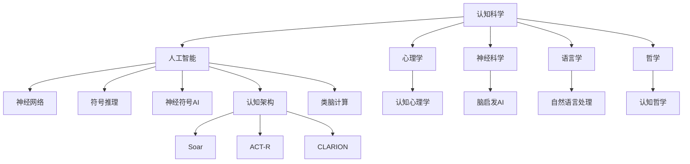

# 6.6 AI与认知科学

[返回6.人工智能原理与算法](./README.md) | [返回Refactor总览](../README.md)

---

## 2024前沿趋势

- **神经符号AI**：结合神经网络与符号推理，提升可解释性与推理能力。
- **认知架构**：Soar、ACT-R、CLARION等认知模型与AI系统融合。
- **类脑计算**：仿生神经网络、脑启发算法、可塑性学习。
- **认知建模**：贝叶斯认知建模、层次推理、认知负荷分析。
- **AI与心理学/神经科学融合**：AI辅助认知实验、脑机接口、认知障碍建模。
- **跨学科实验**：AI在教育、医疗、心理健康等认知领域的应用。

---

## 目录

- [6.6 AI与认知科学](#66-ai与认知科学)
  - [2024前沿趋势](#2024前沿趋势)
  - [目录](#目录)
  - [6.6.1 认知科学与AI关系Mermaid图](#661-认知科学与ai关系mermaid图)
  - [6.6.2 认知建模与推理LaTeX公式](#662-认知建模与推理latex公式)
  - [6.6.3 跨学科案例与实验](#663-跨学科案例与实验)
  - [7. 相关主题推荐阅读](#7-相关主题推荐阅读)
  - [1. 概述](#1-概述)
  - [2. 认知科学基础](#2-认知科学基础)
    - [2.1 认知科学的学科交叉](#21-认知科学的学科交叉)
    - [2.2 经典认知模型](#22-经典认知模型)
  - [3. AI与人类认知对比](#3-ai与人类认知对比)
    - [3.1 感知与表征](#31-感知与表征)
    - [3.2 学习与记忆](#32-学习与记忆)
    - [3.3 推理与决策](#33-推理与决策)
  - [4. 认知架构与人工智能](#4-认知架构与人工智能)
    - [4.1 认知架构（如SOAR、ACT-R）](#41-认知架构如soaract-r)
    - [4.2 神经科学与深度学习](#42-神经科学与深度学习)
    - [4.3 跨学科研究前沿](#43-跨学科研究前沿)
  - [5. 相关性引用](#5-相关性引用)
  - [6. 参考文献](#6-参考文献)

---

## 6.6.1 认知科学与AI关系Mermaid图

---

## 6.6.2 认知建模与推理LaTeX公式

**贝叶斯认知推断**
$$
P(H|D) = \frac{P(D|H)P(H)}{P(D)}
$$

**认知负荷模型**
$$
\text{CognitiveLoad} = \sum_{i=1}^{n} w_i \cdot t_i
$$

**神经网络与认知映射**
$$
\text{Cognition}(x) \approx f_{NN}(x; \theta)
$$

**层次推理模型**
$$
P(y|x) = \sum_{z} P(y|z)P(z|x)
$$

---

## 6.6.3 跨学科案例与实验

**认知架构Soar/ACT-R**

- Soar：通用认知架构，模拟人类问题求解与学习。
- ACT-R：模块化认知模型，广泛用于心理学实验建模。

**神经科学启发的AI**

- 脑区功能映射与深度神经网络结构设计。
- 可塑性学习规则（如Hebb学习、STDP）在AI中的应用。

**AI辅助认知实验**

- AI用于心理学实验数据分析、认知障碍检测与干预。
- 虚拟受试者与仿真实验。

**心理学实验与AI模型对比**

- 经典记忆实验（如Ebbinghaus遗忘曲线）与RNN记忆能力对比。
- 注意力机制与人类视觉注意力实验。

---

## 7. 相关主题推荐阅读

- [2.6 Web核心技术](../2.技术栈与框架/2.6 Web核心技术.md)
- [3.2 Haskell](../3.编程语言范式/3.2 Haskell.md)
- [4.4 哲学与认知批判性分析](../4.设计模式与架构/4.4 哲学与认知批判性分析.md)
- [5.1 UI-UE-UX设计规范](../5.技术规范与标准/5.1 UI-UE-UX设计规范.md)
- [6.1 AI基础原理](./6.1 AI基础原理.md)
- [6.3 现代深度学习与大模型](./6.3 现代深度学习与大模型.md)
- [6.4 AI工程实践与伦理](./6.4 AI工程实践与伦理.md)
- [6.5 AI与哲学](./6.5 AI与哲学.md)
- [6.7 AI与艺术与创造力](./6.7 AI与艺术与创造力.md)

---

> 本文档持续递归优化，欢迎补充最新技术与学术内容。

## 1. 概述

AI与认知科学的交叉研究旨在揭示智能的本质，理解人类认知机制，并以此启发人工智能系统的设计。认知科学融合心理学、神经科学、计算机科学、语言学、哲学等多学科理论。

## 2. 认知科学基础

### 2.1 认知科学的学科交叉

- 心理学：认知过程、行为实验。
- 神经科学：大脑结构与功能。
- 计算机科学：认知建模与仿真。
- 语言学、哲学等。

### 2.2 经典认知模型

- 信息加工模型：大脑如同计算机的信息处理系统。
- 连接主义模型：神经网络与分布式表征。

## 3. AI与人类认知对比

### 3.1 感知与表征

- 人类感知的多模态整合与AI感知系统的异同。
- 表征方式：符号主义、连接主义、混合模型。

### 3.2 学习与记忆

- 人类的联想记忆、长期记忆与AI的参数存储、知识图谱。
- 迁移学习与类比推理。

### 3.3 推理与决策

- 人类直觉与启发式推理，AI的逻辑推理与概率推断。

## 4. 认知架构与人工智能

### 4.1 认知架构（如SOAR、ACT-R）

- SOAR、ACT-R等认知架构对AI系统设计的启发。

### 4.2 神经科学与深度学习

- 神经科学对深度学习模型（如卷积神经网络、递归神经网络）的理论支持。

### 4.3 跨学科研究前沿

- 脑机接口、神经符号AI、认知增强等前沿方向。

## 5. 相关性引用

- [6.3 现代深度学习与大模型](./6.3 现代深度学习与大模型.md)
- [4.4 哲学与认知批判性分析](../4.设计模式与架构/4.4 哲学与认知批判性分析.md)

## 6. 参考文献

- Anderson, J. R. (2007). How Can the Human Mind Occur in the Physical Universe?
- Sun, R. (2006). Cognition and Multi-Agent Interaction.
- Lake, B. M., Ullman, T. D., Tenenbaum, J. B., & Gershman, S. J. (2017). Building machines that learn and think like people.
