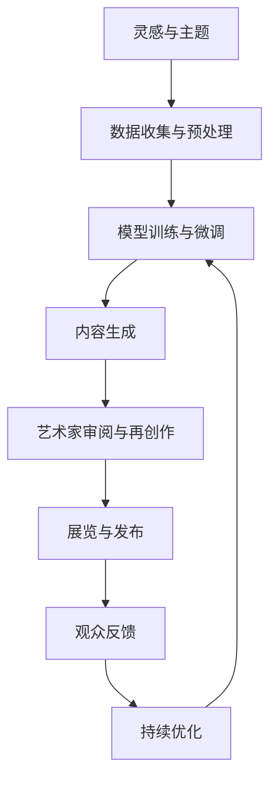

# 6.7 AI与艺术与创造力

[返回6.人工智能原理与算法](./README.md) | [返回Refactor总览](../README.md)

---

## 2024前沿趋势

- **AIGC（AI Generated Content）**：大模型驱动的文本、图像、音频、视频生成。
- **AI美学与风格迁移**：AI艺术风格分析、风格迁移、AI美学评价。
- **AI音乐与文学创作**：AI作曲、AI诗歌、AI小说、AI剧本。
- **生成式设计**：AI辅助建筑、工业、交互设计。
- **人机共创与协同**：AI与艺术家协作、AI辅助创意流程。
- **跨界实验与展览**：AI艺术展、数字艺术、虚拟现实与AI融合。

---

## 目录

- [6.7 AI与艺术与创造力](#67-ai与艺术与创造力)
  - [2024前沿趋势](#2024前沿趋势)
  - [目录](#目录)
  - [6.7.1 AI艺术创作流程Mermaid图](#671-ai艺术创作流程mermaid图)
  - [6.7.2 生成模型与创造力LaTeX公式](#672-生成模型与创造力latex公式)
  - [6.7.3 跨学科案例与实验](#673-跨学科案例与实验)
  - [1. 概述](#1-概述)
  - [2. 理论基础](#2-理论基础)
  - [3. 主要议题](#3-主要议题)
  - [4. 形式化论证与多表征](#4-形式化论证与多表征)
  - [5. 相关性引用](#5-相关性引用)
  - [6. 参考文献](#6-参考文献)
  - [7. 相关主题推荐阅读](#7-相关主题推荐阅读)

---

## 6.7.1 AI艺术创作流程Mermaid图

---

## 6.7.2 生成模型与创造力LaTeX公式

**生成对抗网络（GAN）目标函数**
$$
\min_G \max_D V(D, G) = \mathbb{E}_{x \sim p_{data}(x)} [\log D(x)] + \mathbb{E}_{z \sim p_z(z)} [\log(1 - D(G(z)))]
$$

**创造力度量（新颖性-实用性）**
$$
\text{Creativity} = \alpha \cdot \text{Novelty} + \beta \cdot \text{Utility}
$$

**风格迁移损失函数**
$$
L_{total} = \alpha L_{content} + \beta L_{style}
$$

**多模态生成建模**
$$
P(y|x_{text}, x_{image}, x_{audio}) = f_{MM}(x_{text}, x_{image}, x_{audio}; \theta)
$$

---

## 6.7.3 跨学科案例与实验

**AI绘画与风格迁移**
- Stable Diffusion、Midjourney、DALL·E等AI绘画工具。
- 风格迁移算法将梵高、毕加索等艺术风格迁移到现代图像。

**AI音乐生成**
- OpenAI MuseNet、Google Magenta、AIVA等AI作曲系统。
- 生成多风格、多乐器、多段落的音乐作品。

**AI文学与诗歌创作**
- GPT-4o、Claude等大模型生成诗歌、小说、剧本。
- AI与作家协同创作，AI辅助润色与灵感激发。

**生成式设计与建筑**
- AI辅助建筑平面设计、结构优化、参数化建模。
- 生成式交互界面与工业产品设计。

**AI艺术展与跨界实验**
- AI艺术作品在国际双年展、数字艺术节展出。
- 虚拟现实、增强现实与AI艺术融合体验。

---

## 7. 相关主题推荐阅读

- [2.6 Web核心技术](../2.技术栈与框架/2.6 Web核心技术.md)
- [3.4 TypeScript-JavaScript](../3.编程语言范式/3.4 TypeScript-JavaScript.md)
- [5.1 UI-UE-UX设计规范](../5.技术规范与标准/5.1 UI-UE-UX设计规范.md)
- [6.1 AI基础原理](./6.1 AI基础原理.md)
- [6.3 现代深度学习与大模型](./6.3 现代深度学习与大模型.md)
- [6.4 AI工程实践与伦理](./6.4 AI工程实践与伦理.md)
- [6.5 AI与哲学](./6.5 AI与哲学.md)
- [6.6 AI与认知科学](./6.6 AI与认知科学.md)
- [6.8 AI与社会治理](./6.8 AI与社会治理.md)

---

> 本文档持续递归优化，欢迎补充最新技术与学术内容。

## 1. 概述

AI在艺术与创造力领域的应用推动了生成艺术、创意写作、音乐创作等新兴方向的发展。AI不仅是工具，更成为艺术创作的合作者与创新主体。

## 2. AI艺术基础与发展

### 2.1 生成艺术与算法美学

- 生成对抗网络（GAN）、扩散模型等推动了图像、视频、动画等生成艺术的发展。
- 算法美学：利用数学与算法规则创造艺术作品。

### 2.2 AI与创意写作

- 大语言模型（如GPT）在诗歌、小说、剧本等文本生成中的应用。
- 人机协作写作与创意辅助。

### 2.3 AI音乐与多模态创作

- AI作曲、自动编曲、声音合成。
- 多模态生成：文本-图像-音频跨模态创作。

## 3. AI创造力理论

### 3.1 创造力的认知与计算模型

- 创造力的心理学与认知科学理论。
- 计算创造力：AI如何模拟和实现创新。

### 3.2 生成模型与创新机制

- 变分自编码器（VAE）、GAN等生成模型的创新机制。
- AI在艺术风格迁移、创新表达中的应用。

## 4. 伦理与社会影响

### 4.1 艺术原创性与版权

- AI生成作品的版权归属与法律挑战。
- 原创性、署名权、数据来源伦理。

### 4.2 AI艺术的社会接受度

- 公众对AI艺术的认知与接受。
- 艺术家与AI的协作关系。

## 5. 相关性引用

- [6.3 现代深度学习与大模型](./6.3 现代深度学习与大模型.md)
- [5.2 可访问性与国际化](../5.技术规范与标准/5.2 可访问性与国际化.md)

## 6. 参考文献

- McCormack, J., Gifford, T., & Hutchings, P. (2019). Autonomy, Authenticity, Authorship and Intention in Computer Generated Art.
- Elgammal, A., Liu, B., Elhoseiny, M., & Mazzone, M. (2017). CAN: Creative Adversarial Networks, Generating "Art" by Learning About Styles and Deviating from Style Norms.
- Colton, S., & Wiggins, G. A. (2012). Computational Creativity: The Final Frontier?
