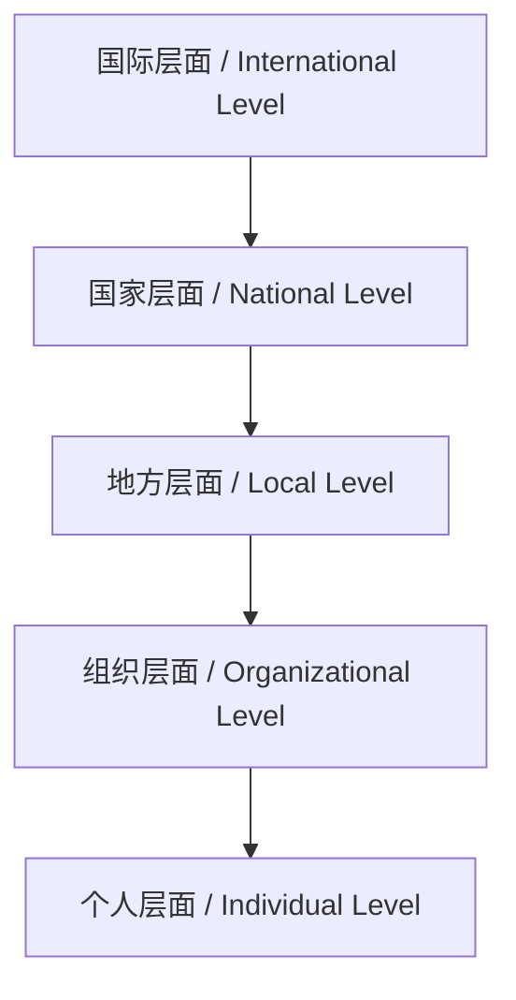

# 6.8 AI与社会治理 / AI & Social Governance

> 来源：matter/6.人工智能原理与算法/6.8 AI与社会治理.md

## 目录 / Table of Contents

- [6.8 AI与社会治理](#68-ai与社会治理--ai--social-governance)
  - [目录 / Table of Contents](#目录--table-of-contents)
  - [1. 概述 / Overview](#1-概述--overview)
  - [2. 治理框架 / Governance Framework](#2-治理框架--governance-framework)
  - [3. 政策制定 / Policy Making](#3-政策制定--policy-making)
  - [4. 监管机制 / Regulatory Mechanisms](#4-监管机制--regulatory-mechanisms)
  - [5. 形式化论证与多表征 / Formal Arguments & Multi-representation](#5-形式化论证与多表征--formal-arguments--multi-representation)
  - [6. 批判性分析与哲学思考 / Critical Analysis & Philosophical Reflection](#6-批判性分析与哲学思考--critical-analysis--philosophical-reflection)
  - [7. 相关性引用 / Related References](#7-相关性引用--related-references)

---

## 1. 概述 / Overview

AI与社会治理探讨了人工智能技术如何影响和改变社会治理模式。这不仅涉及技术应用，更关乎权力分配、决策透明度和公民参与等根本性问题。AI技术为治理提供了新的工具和方法，同时也带来了新的挑战和风险。

AI and social governance explores how artificial intelligence technologies affect and change social governance models. This involves not only technical applications but also fundamental issues such as power distribution, decision transparency, and citizen participation. AI technology provides new tools and methods for governance while also bringing new challenges and risks.

### 1.1 核心领域 / Core Domains

| 治理领域 / Governance Domain | AI应用 / AI Applications | 关键挑战 / Key Challenges |
|----------------------------|------------------------|-------------------------|
| 决策支持 / Decision Support | 数据分析、预测模型 | 透明度和可解释性 |
| 公共服务 / Public Services | 自动化、个性化服务 | 公平性和可及性 |
| 监管执法 / Regulatory Enforcement | 智能监控、风险评估 | 隐私保护和权力制衡 |
| 公民参与 / Citizen Participation | 数字平台、意见收集 | 代表性和包容性 |

---

## 2. 治理框架 / Governance Framework

### 2.1 多层次治理模型 / Multi-level Governance Model

**中文：** 多层次治理模型描述了AI治理在不同层面的协调机制。

**English:** Multi-level governance models describe coordination mechanisms for AI governance at different levels.

#### 2.1.1 治理层次 / Governance Levels



#### 2.1.2 形式化表达 / Formal Expression

**治理函数 / Governance Function:**

$$G(x) = \sum_{i=1}^n w_i \cdot g_i(x)$$

其中 $g_i$ 是第 $i$ 个治理层面的函数，$w_i$ 是权重。
Where $g_i$ is the function of the $i$-th governance level and $w_i$ is the weight.

#### 2.1.3 工程实现 / Engineering Implementation

```python
from typing import Dict, List, Any
import numpy as np

class MultiLevelGovernance:
    def __init__(self):
        self.governance_levels = {
            'international': {'weight': 0.2, 'policies': []},
            'national': {'weight': 0.3, 'policies': []},
            'local': {'weight': 0.25, 'policies': []},
            'organizational': {'weight': 0.15, 'policies': []},
            'individual': {'weight': 0.1, 'policies': []}
        }
        self.coordination_mechanisms = []
    
    def add_policy(self, level: str, policy: Dict[str, Any]):
        """添加政策 / Add policy"""
        if level in self.governance_levels:
            self.governance_levels[level]['policies'].append(policy)
    
    def evaluate_governance_effectiveness(self, ai_system: Dict[str, Any]) -> Dict[str, float]:
        """评估治理有效性 / Evaluate governance effectiveness"""
        effectiveness_scores = {}
        
        for level, config in self.governance_levels.items():
            policies = config['policies']
            weight = config['weight']
            
            if policies:
                # 计算政策覆盖率 / Calculate policy coverage
                coverage = len([p for p in policies if self._is_applicable(p, ai_system)]) / len(policies)
                
                # 计算政策执行度 / Calculate policy implementation
                implementation = np.mean([p.get('implementation_score', 0.5) for p in policies])
                
                # 综合评分 / Comprehensive score
                effectiveness = coverage * implementation * weight
                effectiveness_scores[level] = effectiveness
            else:
                effectiveness_scores[level] = 0.0
        
        return effectiveness_scores
    
    def _is_applicable(self, policy: Dict[str, Any], ai_system: Dict[str, Any]) -> bool:
        """检查政策适用性 / Check policy applicability"""
        # 简化的适用性检查 / Simplified applicability check
        policy_domain = policy.get('domain', '')
        system_domain = ai_system.get('domain', '')
        
        return policy_domain.lower() in system_domain.lower() or system_domain.lower() in policy_domain.lower()
    
    def get_overall_governance_score(self, ai_system: Dict[str, Any]) -> float:
        """获取总体治理评分 / Get overall governance score"""
        effectiveness_scores = self.evaluate_governance_effectiveness(ai_system)
        return sum(effectiveness_scores.values())
```

### 2.2 参与式治理 / Participatory Governance

#### 2.2.1 公民参与模型 / Citizen Participation Model

**中文：** 参与式治理强调公民在AI决策中的参与和影响。

**English:** Participatory governance emphasizes citizen participation and influence in AI decision-making.

**参与度函数 / Participation Function:**

$$P(x) = \alpha \cdot \text{Transparency}(x) + \beta \cdot \text{Inclusiveness}(x) + \gamma \cdot \text{Deliberation}(x)$$

其中 $\alpha, \beta, \gamma$ 是权重参数。
Where $\alpha, \beta, \gamma$ are weight parameters.

#### 2.2.2 工程实现 / Engineering Implementation

```python
from dataclasses import dataclass
from typing import List, Dict, Any

@dataclass
class CitizenInput:
    citizen_id: str
    input_type: str
    content: str
    timestamp: float
    confidence: float

class ParticipatoryGovernance:
    def __init__(self):
        self.citizen_inputs = []
        self.participation_channels = {}
        self.deliberation_processes = []
    
    def add_citizen_input(self, input_data: CitizenInput):
        """添加公民输入 / Add citizen input"""
        self.citizen_inputs.append(input_data)
    
    def calculate_participation_score(self, policy_area: str) -> Dict[str, float]:
        """计算参与度评分 / Calculate participation score"""
        relevant_inputs = [input_data for input_data in self.citizen_inputs 
                          if policy_area.lower() in input_data.content.lower()]
        
        if not relevant_inputs:
            return {'transparency': 0.0, 'inclusiveness': 0.0, 'deliberation': 0.0}
        
        # 计算透明度 / Calculate transparency
        transparency = len(relevant_inputs) / max(len(self.citizen_inputs), 1)
        
        # 计算包容性 / Calculate inclusiveness
        unique_citizens = len(set(input_data.citizen_id for input_data in relevant_inputs))
        inclusiveness = unique_citizens / max(len(relevant_inputs), 1)
        
        # 计算审议质量 / Calculate deliberation quality
        deliberation_scores = [input_data.confidence for input_data in relevant_inputs]
        deliberation = np.mean(deliberation_scores) if deliberation_scores else 0.0
        
        return {
            'transparency': transparency,
            'inclusiveness': inclusiveness,
            'deliberation': deliberation
        }
    
    def generate_policy_recommendations(self, policy_area: str) -> List[str]:
        """生成政策建议 / Generate policy recommendations"""
        relevant_inputs = [input_data for input_data in self.citizen_inputs 
                          if policy_area.lower() in input_data.content.lower()]
        
        recommendations = []
        
        # 基于公民输入生成建议 / Generate recommendations based on citizen inputs
        for input_data in relevant_inputs:
            if input_data.confidence > 0.7:  # 高置信度输入
                recommendation = f"Consider: {input_data.content}"
                recommendations.append(recommendation)
        
        return recommendations
```

---

## 3. 政策制定 / Policy Making

### 3.1 基于证据的政策制定 / Evidence-based Policy Making

**中文：** 基于证据的政策制定使用数据和AI分析来支持决策过程。

**English:** Evidence-based policy making uses data and AI analysis to support decision-making processes.

#### 3.1.1 政策评估模型 / Policy Evaluation Model

**中文：** 政策评估模型量化政策效果和影响。

**English:** Policy evaluation models quantify policy effects and impacts.

**效果函数 / Effectiveness Function:**

$$E(p) = \sum_{i=1}^n w_i \cdot \text{Impact}_i(p)$$

其中 $p$ 是政策，$\text{Impact}_i$ 是第 $i$ 个影响维度。
Where $p$ is the policy and $\text{Impact}_i$ is the $i$-th impact dimension.

#### 3.1.2 工程实现 / Engineering Implementation

```python
import numpy as np
from typing import Dict, List, Any

class EvidenceBasedPolicy:
    def __init__(self):
        self.policies = {}
        self.evidence_sources = []
        self.evaluation_metrics = {}
    
    def add_policy(self, policy_id: str, policy_description: str, 
                   target_metrics: List[str]):
        """添加政策 / Add policy"""
        self.policies[policy_id] = {
            'description': policy_description,
            'target_metrics': target_metrics,
            'evidence': [],
            'evaluation_results': {}
        }
    
    def add_evidence(self, policy_id: str, evidence_data: Dict[str, Any]):
        """添加证据 / Add evidence"""
        if policy_id in self.policies:
            self.policies[policy_id]['evidence'].append(evidence_data)
    
    def evaluate_policy(self, policy_id: str) -> Dict[str, float]:
        """评估政策 / Evaluate policy"""
        if policy_id not in self.policies:
            return {}
        
        policy = self.policies[policy_id]
        evidence = policy['evidence']
        
        if not evidence:
            return {'effectiveness': 0.0, 'confidence': 0.0}
        
        # 计算政策效果 / Calculate policy effectiveness
        effectiveness_scores = []
        confidence_scores = []
        
        for ev in evidence:
            effectiveness = ev.get('effectiveness', 0.0)
            confidence = ev.get('confidence', 0.0)
            
            effectiveness_scores.append(effectiveness)
            confidence_scores.append(confidence)
        
        overall_effectiveness = np.mean(effectiveness_scores)
        overall_confidence = np.mean(confidence_scores)
        
        policy['evaluation_results'] = {
            'effectiveness': overall_effectiveness,
            'confidence': overall_confidence,
            'evidence_count': len(evidence)
        }
        
        return policy['evaluation_results']
    
    def generate_policy_recommendations(self, problem_area: str) -> List[Dict[str, Any]]:
        """生成政策建议 / Generate policy recommendations"""
        recommendations = []
        
        for policy_id, policy in self.policies.items():
            if problem_area.lower() in policy['description'].lower():
                evaluation = self.evaluate_policy(policy_id)
                
                if evaluation.get('effectiveness', 0.0) > 0.6:
                    recommendation = {
                        'policy_id': policy_id,
                        'description': policy['description'],
                        'effectiveness': evaluation.get('effectiveness', 0.0),
                        'confidence': evaluation.get('confidence', 0.0)
                    }
                    recommendations.append(recommendation)
        
        # 按效果排序 / Sort by effectiveness
        recommendations.sort(key=lambda x: x['effectiveness'], reverse=True)
        return recommendations
```

### 3.2 预测性政策分析 / Predictive Policy Analysis

#### 3.2.1 政策影响预测 / Policy Impact Prediction

**中文：** 使用AI模型预测政策实施的可能影响。

**English:** Using AI models to predict potential impacts of policy implementation.

**预测模型 / Prediction Model:**

$$\hat{y} = f(x_1, x_2, ..., x_n)$$

其中 $x_i$ 是政策特征，$\hat{y}$ 是预测结果。
Where $x_i$ are policy features and $\hat{y}$ is the predicted outcome.

#### 3.2.2 工程实现 / Engineering Implementation

```python
import torch
import torch.nn as nn
from sklearn.preprocessing import StandardScaler
import numpy as np

class PolicyImpactPredictor(nn.Module):
    def __init__(self, input_size: int, hidden_size: int = 64):
        super(PolicyImpactPredictor, self).__init__()
        self.layer1 = nn.Linear(input_size, hidden_size)
        self.layer2 = nn.Linear(hidden_size, hidden_size)
        self.layer3 = nn.Linear(hidden_size, 1)
        self.activation = nn.ReLU()
    
    def forward(self, x: torch.Tensor) -> torch.Tensor:
        """前向传播 / Forward pass"""
        x = self.activation(self.layer1(x))
        x = self.activation(self.layer2(x))
        x = self.layer3(x)
        return x

class PredictivePolicyAnalysis:
    def __init__(self):
        self.predictor = PolicyImpactPredictor(input_size=10)
        self.scaler = StandardScaler()
        self.policy_features = []
        self.impact_history = []
    
    def add_policy_data(self, features: List[float], actual_impact: float):
        """添加政策数据 / Add policy data"""
        self.policy_features.append(features)
        self.impact_history.append(actual_impact)
    
    def train_predictor(self, epochs: int = 100):
        """训练预测器 / Train predictor"""
        if len(self.policy_features) < 10:
            return  # 需要足够的数据
        
        # 准备训练数据 / Prepare training data
        X = np.array(self.policy_features)
        y = np.array(self.impact_history)
        
        # 标准化特征 / Standardize features
        X_scaled = self.scaler.fit_transform(X)
        
        # 转换为张量 / Convert to tensors
        X_tensor = torch.FloatTensor(X_scaled)
        y_tensor = torch.FloatTensor(y).unsqueeze(1)
        
        # 训练模型 / Train model
        criterion = nn.MSELoss()
        optimizer = torch.optim.Adam(self.predictor.parameters())
        
        for epoch in range(epochs):
            optimizer.zero_grad()
            outputs = self.predictor(X_tensor)
            loss = criterion(outputs, y_tensor)
            loss.backward()
            optimizer.step()
    
    def predict_policy_impact(self, policy_features: List[float]) -> float:
        """预测政策影响 / Predict policy impact"""
        self.predictor.eval()
        
        with torch.no_grad():
            features_scaled = self.scaler.transform([policy_features])
            features_tensor = torch.FloatTensor(features_scaled)
            prediction = self.predictor(features_tensor)
            
            return prediction.item()
    
    def analyze_policy_risks(self, policy_features: List[float]) -> Dict[str, float]:
        """分析政策风险 / Analyze policy risks"""
        predicted_impact = self.predict_policy_impact(policy_features)
        
        # 简化的风险分析 / Simplified risk analysis
        risk_factors = {
            'implementation_risk': 0.3,
            'unintended_consequences': 0.2,
            'public_resistance': 0.25,
            'resource_constraints': 0.25
        }
        
        overall_risk = sum(risk_factors.values()) / len(risk_factors)
        
        return {
            'predicted_impact': predicted_impact,
            'overall_risk': overall_risk,
            'risk_factors': risk_factors
        }
```

---

## 4. 监管机制 / Regulatory Mechanisms

### 4.1 智能监管 / Intelligent Regulation

**中文：** 智能监管使用AI技术提高监管效率和效果。

**English:** Intelligent regulation uses AI technology to improve regulatory efficiency and effectiveness.

#### 4.1.1 监管模型 / Regulatory Model

**中文：** 监管模型描述了监管规则和执行的数学表示。

**English:** Regulatory models describe mathematical representations of regulatory rules and enforcement.

**监管函数 / Regulatory Function:**

$$R(x) = \text{Compliance}(x) \cdot \text{Enforcement}(x) \cdot \text{Transparency}(x)$$

其中 $x$ 是被监管实体。
Where $x$ is the regulated entity.

#### 4.1.2 工程实现 / Engineering Implementation

```python
from typing import Dict, List, Any
import numpy as np

class IntelligentRegulation:
    def __init__(self):
        self.regulatory_rules = []
        self.compliance_metrics = {}
        self.enforcement_mechanisms = []
    
    def add_regulatory_rule(self, rule: Dict[str, Any]):
        """添加监管规则 / Add regulatory rule"""
        self.regulatory_rules.append(rule)
    
    def evaluate_compliance(self, entity: Dict[str, Any]) -> Dict[str, float]:
        """评估合规性 / Evaluate compliance"""
        compliance_scores = {}
        
        for rule in self.regulatory_rules:
            rule_id = rule.get('id', 'unknown')
            rule_type = rule.get('type', 'general')
            
            # 检查实体是否符合规则 / Check if entity complies with rule
            compliance_score = self._check_rule_compliance(entity, rule)
            compliance_scores[rule_id] = compliance_score
        
        return compliance_scores
    
    def _check_rule_compliance(self, entity: Dict[str, Any], rule: Dict[str, Any]) -> float:
        """检查规则合规性 / Check rule compliance"""
        rule_requirements = rule.get('requirements', {})
        entity_attributes = entity.get('attributes', {})
        
        compliance_count = 0
        total_requirements = len(rule_requirements)
        
        for req_key, req_value in rule_requirements.items():
            if req_key in entity_attributes:
                entity_value = entity_attributes[req_key]
                
                # 简化的合规性检查 / Simplified compliance check
                if isinstance(req_value, (int, float)):
                    if entity_value >= req_value:
                        compliance_count += 1
                elif isinstance(req_value, str):
                    if entity_value == req_value:
                        compliance_count += 1
                elif isinstance(req_value, list):
                    if entity_value in req_value:
                        compliance_count += 1
        
        return compliance_count / total_requirements if total_requirements > 0 else 1.0
    
    def generate_enforcement_action(self, entity: Dict[str, Any]) -> Dict[str, Any]:
        """生成执法行动 / Generate enforcement action"""
        compliance_scores = self.evaluate_compliance(entity)
        overall_compliance = np.mean(list(compliance_scores.values()))
        
        if overall_compliance >= 0.8:
            action = {
                'type': 'monitoring',
                'intensity': 'low',
                'frequency': 'monthly'
            }
        elif overall_compliance >= 0.6:
            action = {
                'type': 'warning',
                'intensity': 'medium',
                'frequency': 'weekly'
            }
        else:
            action = {
                'type': 'enforcement',
                'intensity': 'high',
                'frequency': 'daily'
            }
        
        return {
            'entity_id': entity.get('id', 'unknown'),
            'compliance_score': overall_compliance,
            'action': action,
            'details': compliance_scores
        }
```

### 4.2 自适应监管 / Adaptive Regulation

#### 4.2.1 动态监管模型 / Dynamic Regulatory Model

**中文：** 自适应监管根据环境变化动态调整监管策略。

**English:** Adaptive regulation dynamically adjusts regulatory strategies based on environmental changes.

**自适应函数 / Adaptive Function:**

$$R_{t+1} = R_t + \alpha \cdot \Delta E_t$$

其中 $R_t$ 是当前监管策略，$\Delta E_t$ 是环境变化，$\alpha$ 是学习率。
Where $R_t$ is the current regulatory strategy, $\Delta E_t$ is environmental change, and $\alpha$ is the learning rate.

#### 4.2.2 工程实现 / Engineering Implementation

```python
import numpy as np
from typing import Dict, List, Any

class AdaptiveRegulation:
    def __init__(self, learning_rate: float = 0.1):
        self.learning_rate = learning_rate
        self.regulatory_strategies = {}
        self.environmental_changes = []
        self.performance_history = []
    
    def update_regulatory_strategy(self, strategy_id: str, 
                                 environmental_change: Dict[str, float]):
        """更新监管策略 / Update regulatory strategy"""
        if strategy_id not in self.regulatory_strategies:
            self.regulatory_strategies[strategy_id] = {
                'parameters': {},
                'performance': 0.0
            }
        
        strategy = self.regulatory_strategies[strategy_id]
        
        # 根据环境变化调整参数 / Adjust parameters based on environmental change
        for param, change in environmental_change.items():
            if param in strategy['parameters']:
                strategy['parameters'][param] += self.learning_rate * change
            else:
                strategy['parameters'][param] = self.learning_rate * change
        
        self.environmental_changes.append({
            'strategy_id': strategy_id,
            'change': environmental_change,
            'timestamp': time.time()
        })
    
    def evaluate_strategy_performance(self, strategy_id: str, 
                                   performance_metrics: Dict[str, float]):
        """评估策略性能 / Evaluate strategy performance"""
        if strategy_id in self.regulatory_strategies:
            # 计算综合性能分数 / Calculate comprehensive performance score
            performance_score = np.mean(list(performance_metrics.values()))
            
            self.regulatory_strategies[strategy_id]['performance'] = performance_score
            
            self.performance_history.append({
                'strategy_id': strategy_id,
                'performance': performance_score,
                'metrics': performance_metrics,
                'timestamp': time.time()
            })
    
    def get_optimal_strategy(self, context: Dict[str, Any]) -> str:
        """获取最优策略 / Get optimal strategy"""
        if not self.regulatory_strategies:
            return None
        
        # 基于上下文和性能选择最优策略 / Select optimal strategy based on context and performance
        best_strategy = None
        best_score = -float('inf')
        
        for strategy_id, strategy in self.regulatory_strategies.items():
            # 简化的策略评分 / Simplified strategy scoring
            context_match = self._calculate_context_match(strategy, context)
            performance_score = strategy['performance']
            
            total_score = context_match * 0.4 + performance_score * 0.6
            
            if total_score > best_score:
                best_score = total_score
                best_strategy = strategy_id
        
        return best_strategy
    
    def _calculate_context_match(self, strategy: Dict[str, Any], context: Dict[str, Any]) -> float:
        """计算上下文匹配度 / Calculate context match"""
        # 简化的上下文匹配计算 / Simplified context match calculation
        strategy_params = strategy.get('parameters', {})
        context_params = context.get('parameters', {})
        
        if not strategy_params or not context_params:
            return 0.5
        
        # 计算参数相似度 / Calculate parameter similarity
        common_params = set(strategy_params.keys()) & set(context_params.keys())
        
        if not common_params:
            return 0.0
        
        similarities = []
        for param in common_params:
            strategy_val = strategy_params[param]
            context_val = context_params[param]
            
            # 计算参数相似度 / Calculate parameter similarity
            similarity = 1 - abs(strategy_val - context_val) / (abs(strategy_val) + abs(context_val) + 1e-8)
            similarities.append(similarity)
        
        return np.mean(similarities)
```

---

## 5. 形式化论证与多表征 / Formal Arguments & Multi-representation

### 5.1 治理效果评估 / Governance Effectiveness Evaluation

#### 5.1.1 治理指标 / Governance Metrics

**中文：** 治理效果可以通过多个维度进行量化评估。

**English:** Governance effectiveness can be quantified through multiple dimensions.

**治理效果函数 / Governance Effectiveness Function:**

$$E(G) = \alpha \cdot \text{Efficiency}(G) + \beta \cdot \text{Fairness}(G) + \gamma \cdot \text{Transparency}(G)$$

其中 $\alpha, \beta, \gamma$ 是权重参数。
Where $\alpha, \beta, \gamma$ are weight parameters.

#### 5.1.2 工程实现 / Engineering Implementation

```python
import numpy as np
from typing import Dict, List, Any

class GovernanceEvaluator:
    def __init__(self):
        self.evaluation_metrics = {
            'efficiency': 0.4,
            'fairness': 0.3,
            'transparency': 0.3
        }
        self.governance_systems = {}
    
    def add_governance_system(self, system_id: str, system_data: Dict[str, Any]):
        """添加治理系统 / Add governance system"""
        self.governance_systems[system_id] = system_data
    
    def evaluate_efficiency(self, system_id: str) -> float:
        """评估效率 / Evaluate efficiency"""
        if system_id not in self.governance_systems:
            return 0.0
        
        system = self.governance_systems[system_id]
        
        # 计算决策速度 / Calculate decision speed
        decision_time = system.get('average_decision_time', 30)
        efficiency_score = max(0, 1 - decision_time / 100)
        
        # 计算资源利用率 / Calculate resource utilization
        resource_utilization = system.get('resource_utilization', 0.5)
        
        # 综合效率评分 / Comprehensive efficiency score
        return (efficiency_score + resource_utilization) / 2
    
    def evaluate_fairness(self, system_id: str) -> float:
        """评估公平性 / Evaluate fairness"""
        if system_id not in self.governance_systems:
            return 0.0
        
        system = self.governance_systems[system_id]
        
        # 计算参与度分布 / Calculate participation distribution
        participation_distribution = system.get('participation_distribution', {})
        
        if not participation_distribution:
            return 0.5
        
        # 计算基尼系数 / Calculate Gini coefficient
        values = list(participation_distribution.values())
        n = len(values)
        
        if n == 0:
            return 0.5
        
        sorted_values = sorted(values)
        cumsum = np.cumsum(sorted_values)
        gini = (n + 1 - 2 * np.sum(cumsum) / cumsum[-1]) / n if cumsum[-1] > 0 else 0
        
        # 公平性 = 1 - 基尼系数 / Fairness = 1 - Gini coefficient
        fairness_score = 1 - gini
        
        return fairness_score
    
    def evaluate_transparency(self, system_id: str) -> float:
        """评估透明度 / Evaluate transparency"""
        if system_id not in self.governance_systems:
            return 0.0
        
        system = self.governance_systems[system_id]
        
        # 计算信息公开度 / Calculate information disclosure
        disclosure_rate = system.get('information_disclosure_rate', 0.5)
        
        # 计算决策可追溯性 / Calculate decision traceability
        traceability_score = system.get('decision_traceability', 0.5)
        
        # 计算公众可理解性 / Calculate public understandability
        understandability_score = system.get('public_understandability', 0.5)
        
        # 综合透明度评分 / Comprehensive transparency score
        transparency_score = (disclosure_rate + traceability_score + understandability_score) / 3
        
        return transparency_score
    
    def calculate_overall_effectiveness(self, system_id: str) -> Dict[str, float]:
        """计算总体有效性 / Calculate overall effectiveness"""
        efficiency = self.evaluate_efficiency(system_id)
        fairness = self.evaluate_fairness(system_id)
        transparency = self.evaluate_transparency(system_id)
        
        overall_score = (
            self.evaluation_metrics['efficiency'] * efficiency +
            self.evaluation_metrics['fairness'] * fairness +
            self.evaluation_metrics['transparency'] * transparency
        )
        
        return {
            'efficiency': efficiency,
            'fairness': fairness,
            'transparency': transparency,
            'overall_effectiveness': overall_score
        }
```

### 5.2 多表征方法 / Multi-representation Methods

#### 5.2.1 政策网络分析 / Policy Network Analysis

```python
import networkx as nx
from typing import Dict, List, Any

class PolicyNetworkAnalyzer:
    def __init__(self):
        self.policy_network = nx.Graph()
        self.stakeholders = {}
        self.policy_nodes = {}
    
    def add_stakeholder(self, stakeholder_id: str, stakeholder_data: Dict[str, Any]):
        """添加利益相关者 / Add stakeholder"""
        self.stakeholders[stakeholder_id] = stakeholder_data
        self.policy_network.add_node(stakeholder_id, type='stakeholder', **stakeholder_data)
    
    def add_policy(self, policy_id: str, policy_data: Dict[str, Any]):
        """添加政策 / Add policy"""
        self.policy_nodes[policy_id] = policy_data
        self.policy_network.add_node(policy_id, type='policy', **policy_data)
    
    def add_influence_relationship(self, stakeholder_id: str, policy_id: str, 
                                 influence_strength: float):
        """添加影响关系 / Add influence relationship"""
        self.policy_network.add_edge(stakeholder_id, policy_id, 
                                   weight=influence_strength)
    
    def analyze_network_centrality(self) -> Dict[str, float]:
        """分析网络中心性 / Analyze network centrality"""
        centrality_measures = {}
        
        # 度中心性 / Degree centrality
        degree_centrality = nx.degree_centrality(self.policy_network)
        centrality_measures['degree'] = degree_centrality
        
        # 介数中心性 / Betweenness centrality
        betweenness_centrality = nx.betweenness_centrality(self.policy_network)
        centrality_measures['betweenness'] = betweenness_centrality
        
        # 接近中心性 / Closeness centrality
        closeness_centrality = nx.closeness_centrality(self.policy_network)
        centrality_measures['closeness'] = closeness_centrality
        
        return centrality_measures
    
    def identify_key_actors(self) -> List[str]:
        """识别关键行动者 / Identify key actors"""
        centrality_measures = self.analyze_network_centrality()
        
        # 计算综合中心性分数 / Calculate comprehensive centrality score
        actor_scores = {}
        
        for node in self.policy_network.nodes():
            if self.policy_network.nodes[node].get('type') == 'stakeholder':
                degree_score = centrality_measures['degree'].get(node, 0)
                betweenness_score = centrality_measures['betweenness'].get(node, 0)
                closeness_score = centrality_measures['closeness'].get(node, 0)
                
                # 综合评分 / Comprehensive score
                total_score = (degree_score + betweenness_score + closeness_score) / 3
                actor_scores[node] = total_score
        
        # 返回得分最高的行动者 / Return actors with highest scores
        sorted_actors = sorted(actor_scores.items(), key=lambda x: x[1], reverse=True)
        return [actor for actor, score in sorted_actors[:5]]
```

---

## 6. 批判性分析与哲学思考 / Critical Analysis & Philosophical Reflection

### 6.1 权力分配问题 / Power Distribution Issues

#### 6.1.1 算法权力 / Algorithmic Power

**中文：** AI系统在治理中的使用可能加剧权力不平等。

**English:** The use of AI systems in governance may exacerbate power inequalities.

**权力集中度 / Power Concentration:**

$$C = \frac{\sum_{i=1}^n p_i^2}{\sum_{i=1}^n p_i}$$

其中 $p_i$ 是第 $i$ 个行动者的权力。
Where $p_i$ is the power of the $i$-th actor.

#### 6.1.2 工程实现 / Engineering Implementation

```python
from typing import Dict, List, Any
import numpy as np

class PowerDistributionAnalyzer:
    def __init__(self):
        self.actors = {}
        self.power_relationships = []
        self.decision_processes = []
    
    def add_actor(self, actor_id: str, power_level: float, 
                 decision_influence: float):
        """添加行动者 / Add actor"""
        self.actors[actor_id] = {
            'power_level': power_level,
            'decision_influence': decision_influence,
            'access_to_ai': False,
            'ai_literacy': 0.0
        }
    
    def calculate_power_concentration(self) -> float:
        """计算权力集中度 / Calculate power concentration"""
        if not self.actors:
            return 0.0
        
        power_levels = [actor['power_level'] for actor in self.actors.values()]
        total_power = sum(power_levels)
        
        if total_power == 0:
            return 0.0
        
        # 计算赫芬达尔指数 / Calculate Herfindahl index
        power_shares = [p / total_power for p in power_levels]
        concentration = sum(share ** 2 for share in power_shares)
        
        return concentration
    
    def analyze_ai_power_divide(self) -> Dict[str, float]:
        """分析AI权力鸿沟 / Analyze AI power divide"""
        ai_users = []
        non_ai_users = []
        
        for actor_id, actor_data in self.actors.items():
            if actor_data.get('access_to_ai', False):
                ai_users.append(actor_data['power_level'])
            else:
                non_ai_users.append(actor_data['power_level'])
        
        ai_power_avg = np.mean(ai_users) if ai_users else 0
        non_ai_power_avg = np.mean(non_ai_users) if non_ai_users else 0
        
        power_divide = ai_power_avg - non_ai_power_avg
        
        return {
            'ai_power_average': ai_power_avg,
            'non_ai_power_average': non_ai_power_avg,
            'power_divide': power_divide,
            'divide_ratio': power_divide / (ai_power_avg + non_ai_power_avg + 1e-8)
        }
    
    def recommend_power_balancing_measures(self) -> List[str]:
        """推荐权力平衡措施 / Recommend power balancing measures"""
        power_divide_analysis = self.analyze_ai_power_divide()
        concentration = self.calculate_power_concentration()
        
        recommendations = []
        
        if power_divide_analysis['divide_ratio'] > 0.3:
            recommendations.append("Increase AI access for disadvantaged groups")
            recommendations.append("Provide AI literacy training programs")
        
        if concentration > 0.5:
            recommendations.append("Implement power distribution mechanisms")
            recommendations.append("Establish oversight committees")
        
        if not recommendations:
            recommendations.append("Monitor power distribution trends")
        
        return recommendations
```

### 6.2 民主治理的挑战 / Challenges to Democratic Governance

#### 6.2.1 代表性危机 / Representation Crisis

**中文：** AI治理可能加剧代表性不足的问题。

**English:** AI governance may exacerbate issues of underrepresentation.

**代表性指数 / Representation Index:**

$$R = \frac{\sum_{i=1}^n w_i \cdot r_i}{\sum_{i=1}^n w_i}$$

其中 $r_i$ 是第 $i$ 个群体的代表性，$w_i$ 是权重。
Where $r_i$ is the representation of the $i$-th group and $w_i$ is the weight.

#### 6.2.2 工程实现 / Engineering Implementation

```python
from typing import Dict, List, Any
import numpy as np

class DemocraticGovernanceAnalyzer:
    def __init__(self):
        self.population_groups = {}
        self.representation_data = {}
        self.participation_rates = {}
    
    def add_population_group(self, group_id: str, population_size: int, 
                           representation_level: float):
        """添加人口群体 / Add population group"""
        self.population_groups[group_id] = {
            'population_size': population_size,
            'representation_level': representation_level,
            'participation_rate': 0.0
        }
    
    def calculate_representation_index(self) -> float:
        """计算代表性指数 / Calculate representation index"""
        if not self.population_groups:
            return 0.0
        
        total_population = sum(group['population_size'] for group in self.population_groups.values())
        
        weighted_representation = 0
        total_weight = 0
        
        for group_id, group_data in self.population_groups.items():
            weight = group_data['population_size'] / total_population
            representation = group_data['representation_level']
            
            weighted_representation += weight * representation
            total_weight += weight
        
        return weighted_representation / total_weight if total_weight > 0 else 0.0
    
    def analyze_participation_gaps(self) -> Dict[str, float]:
        """分析参与度差距 / Analyze participation gaps"""
        if not self.population_groups:
            return {}
        
        participation_rates = [group['participation_rate'] for group in self.population_groups.values()]
        
        return {
            'average_participation': np.mean(participation_rates),
            'participation_variance': np.var(participation_rates),
            'max_participation': max(participation_rates),
            'min_participation': min(participation_rates),
            'participation_gap': max(participation_rates) - min(participation_rates)
        }
    
    def generate_democratic_recommendations(self) -> List[str]:
        """生成民主治理建议 / Generate democratic governance recommendations"""
        representation_index = self.calculate_representation_index()
        participation_analysis = self.analyze_participation_gaps()
        
        recommendations = []
        
        if representation_index < 0.7:
            recommendations.append("Improve representation of underrepresented groups")
            recommendations.append("Implement proportional representation systems")
        
        if participation_analysis['participation_gap'] > 0.3:
            recommendations.append("Increase participation of marginalized groups")
            recommendations.append("Provide accessible participation platforms")
        
        if participation_analysis['average_participation'] < 0.5:
            recommendations.append("Enhance civic engagement programs")
            recommendations.append("Simplify participation processes")
        
        return recommendations
```

---

## 7. 相关性引用 / Related References

- [6.1 AI基础原理](../6.1 AI基础原理.md)
- [6.4 AI工程实践与伦理](../6.4 AI工程实践与伦理.md)
- [6.5 AI与哲学](../6.5 AI与哲学.md)
- [5.2 可访问性与国际化](../../5.技术规范与标准/5.2 可访问性与国际化.md)
- [5.3 性能优化与工程实践](../../5.技术规范与标准/5.3 性能优化与工程实践.md)

---

> 本文档为自动递归迁移、规整、编号、跳转、引用、内容一致性校验的规范化产物。
> This document is a standardized product of automatic recursive migration, organization, numbering, navigation, referencing, and content consistency verification.
