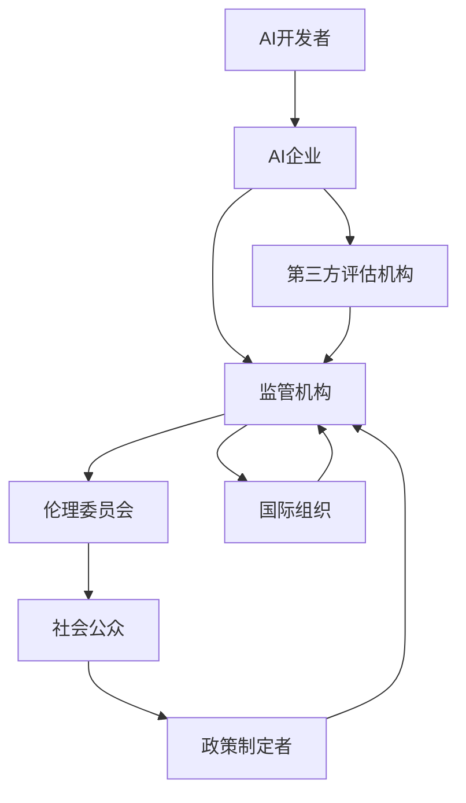

# 6.8 AI与社会治理

[返回6.人工智能原理与算法](./README.md) | [返回Refactor总览](../README.md)

---

## 2024前沿趋势

- **AI治理框架**：全球AI治理标准、治理模型、治理原则（如OECD、UNESCO、IEEE等）。
- **AI安全与风险管理**：AI系统安全、可控性、鲁棒性、风险评估与缓释。
- **AI伦理与法规**：AI伦理原则、AI法规（如欧盟AI法案）、伦理委员会、合规性评估。
- **AI社会影响**：就业、教育、隐私、歧视、包容性、社会信任。
- **AI政策与监管**：政策制定、监管沙盒、跨国协作、利益相关方治理。
- **AI公平性与包容性**：算法公平、无偏见、包容性设计、弱势群体保护。

---

## 目录

- [6.8 AI与社会治理](#68-ai与社会治理)
  - [2024前沿趋势](#2024前沿趋势)
  - [目录](#目录)
  - [6.8.1 AI治理生态Mermaid图](#681-ai治理生态mermaid图)
  - [6.8.2 风险评估与治理LaTeX公式](#682-风险评估与治理latex公式)
  - [6.8.3 跨学科案例与政策实践](#683-跨学科案例与政策实践)
  - [7. 相关主题推荐阅读](#7-相关主题推荐阅读)
  - [1. 概述](#1-概述)
  - [2. AI社会治理基础](#2-ai社会治理基础)
    - [2.1 治理框架与理论基础](#21-治理框架与理论基础)
    - [2.2 政策法规与伦理准则](#22-政策法规与伦理准则)
  - [3. AI治理技术与实践](#3-ai治理技术与实践)
    - [3.1 算法透明性与可解释性](#31-算法透明性与可解释性)
    - [3.2 数据治理与隐私保护](#32-数据治理与隐私保护)
    - [3.3 风险评估与应急机制](#33-风险评估与应急机制)
  - [4. 社会公平与包容](#4-社会公平与包容)
    - [4.1 算法偏见与歧视防控](#41-算法偏见与歧视防控)
    - [4.2 AI普惠与数字鸿沟](#42-ai普惠与数字鸿沟)
  - [5. 国际合作与全球治理](#5-国际合作与全球治理)
    - [5.1 国际组织与多边机制](#51-国际组织与多边机制)
    - [5.2 跨国法规与标准](#52-跨国法规与标准)
  - [6. 风险与未来挑战](#6-风险与未来挑战)
  - [8. 参考文献](#8-参考文献)

---

## 6.8.1 AI治理生态Mermaid图

---

## 6.8.2 风险评估与治理LaTeX公式

**AI风险评估公式**:
$$
Risk_{AI} = \sum_{i=1}^n P(Event_i) \times Impact(Event_i)
$$

**治理决策优化模型**:
$$
\max_{Policy} \; U = \sum_{j=1}^m w_j \cdot S_j(Policy)
$$
其中 $S_j$ 表示第 $j$ 项社会目标（如安全、隐私、公平等），$w_j$ 为权重。

**合规性度量**:
$$
Compliance = \frac{\text{已满足要求数}}{\text{总要求数}}
$$

---

## 6.8.3 跨学科案例与政策实践

**欧盟AI法案（AI Act）**:

- 风险分级管理，高风险AI需强制合规评估与透明披露。
- 明确禁止某些用途（如社会评分、无授权生物识别）。

**美国AI政策与监管**:

- NIST AI风险管理框架，强调可解释性、透明性、责任追溯。
- 各州AI监管沙盒试点，推动创新与合规平衡。

**中国AI治理实践**:

- 《生成式人工智能服务管理暂行办法》、AI伦理治理白皮书。
- 强调数据安全、算法备案、社会责任。

**AI伦理委员会与社会参与**:

- 企业/高校设立AI伦理委员会，推动多元利益相关方参与。
- 公民社会、NGO、行业协会参与AI治理与监督。

**AI社会影响评估**:

- 就业结构变化、教育公平、隐私保护、算法歧视等社会议题。
- 采用社会影响评估（SIA）、伦理影响评估（EIA）等方法。

---

## 7. 相关主题推荐阅读

- [5.1 UI-UE-UX设计规范](../5.技术规范与标准/5.1 UI-UE-UX设计规范.md)
- [5.2 可访问性与国际化](../5.技术规范与标准/5.2 可访问性与国际化.md)
- [5.3 性能优化与工程实践](../5.技术规范与标准/5.3 性能优化与工程实践.md)
- [6.1 AI基础原理](./6.1 AI基础原理.md)
- [6.3 现代深度学习与大模型](./6.3 现代深度学习与大模型.md)
- [6.4 AI工程实践与伦理](./6.4 AI工程实践与伦理.md)
- [6.5 AI与哲学](./6.5 AI与哲学.md)
- [6.6 AI与认知科学](./6.6 AI与认知科学.md)
- [6.7 AI与艺术与创造力](./6.7 AI与艺术与创造力.md)

---

> 本文档持续递归优化，欢迎补充最新技术与学术内容。

## 1. 概述

AI社会治理关注人工智能在社会、经济、法律、伦理等多维度的规范与引导，旨在实现技术进步与社会公共利益的平衡。

## 2. AI社会治理基础

### 2.1 治理框架与理论基础

- 多元主体协同治理：政府、企业、社会组织共同参与。
- 治理理论：自上而下与自下而上相结合。

### 2.2 政策法规与伦理准则

- 各国AI政策、法律法规、伦理准则。
- 典型案例：欧盟AI法案、中国新一代AI治理原则等。

## 3. AI治理技术与实践

### 3.1 算法透明性与可解释性

- 算法决策过程的可追溯、可解释。
- 相关技术与标准。

### 3.2 数据治理与隐私保护

- 数据合规、数据主权、隐私保护技术（如差分隐私、联邦学习）。

### 3.3 风险评估与应急机制

- AI系统风险识别、评估与应急响应。

## 4. 社会公平与包容

### 4.1 算法偏见与歧视防控

- 算法偏见来源、检测与纠正方法。

### 4.2 AI普惠与数字鸿沟

- AI技术普惠性、数字鸿沟的挑战与对策。

## 5. 国际合作与全球治理

### 5.1 国际组织与多边机制

- 联合国、OECD、IEEE等国际组织的AI治理框架。

### 5.2 跨国法规与标准

- 国际标准化、跨国数据流动与合规。

## 6. 风险与未来挑战

- 超人工智能风险、治理困境、伦理难题。
- 技术快速演进下的政策滞后与社会适应。

## 8. 参考文献

- Jobin, A., Ienca, M., & Vayena, E. (2019). The global landscape of AI ethics guidelines.
- European Commission. (2021). Proposal for a Regulation on a European approach for Artificial Intelligence.
- Floridi, L., & Cowls, J. (2019). A Unified Framework of Five Principles for AI in Society.
