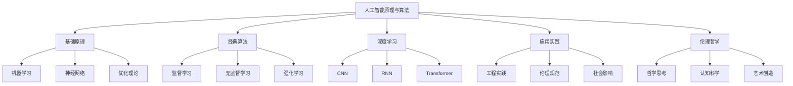
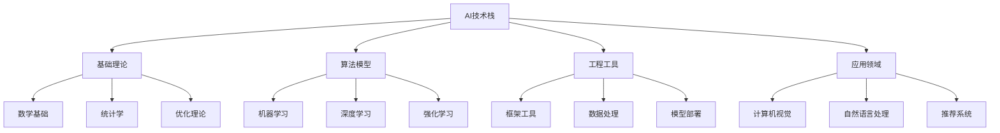
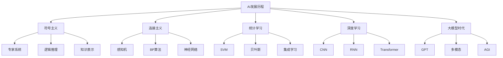
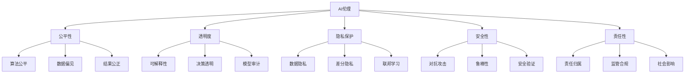

# 6.人工智能原理与算法

[返回Refactor总览](../README.md)

> 本文档为"6.人工智能原理与算法"主题索引，所有内容均严格编号、树形结构、支持本地跳转。请遵循本地引用规范：
>
> - 主题编号与文件名一致，便于递归扩展
> - 所有子主题均以"6.x"编号，支持锚点跳转
> - 返回上级目录请使用相对路径

## 2024 AI趋势

- **大语言模型**：GPT-4、Claude、LLaMA、多模态融合、推理能力
- **生成式AI**：文本生成、图像生成、代码生成、音频生成、视频生成
- **AI Agent**：智能代理、自主决策、工具使用、多智能体系统
- **边缘AI**：设备端推理、模型压缩、量化技术、隐私保护
- **AI工程化**：MLOps、模型部署、监控管理、自动化训练
- **AI安全**：对抗攻击、隐私保护、公平性、可解释性
- **AI应用**：智能助手、推荐系统、计算机视觉、自然语言处理

## 知识图谱

## 目录结构

6.1 [AI基础原理](./6.1 AI基础原理.md)

- 机器学习基础
- 神经网络原理
- 优化算法
- 理论基础

6.2 [经典AI算法与模型](./6.2 经典AI算法与模型.md)

- 监督学习算法
- 无监督学习算法
- 强化学习算法
- 传统机器学习

6.3 [现代深度学习与大模型](./6.3 现代深度学习与大模型.md)

- 深度学习架构
- 大语言模型
- 多模态模型
- 生成式AI

6.4 [AI工程实践与伦理](./6.4 AI工程实践与伦理.md)

- MLOps实践
- 模型部署
- AI伦理
- 安全规范

6.5 [AI与哲学](./6.5 AI与哲学.md)

- 意识问题
- 智能本质
- 哲学思辨
- 形而上学

6.6 [AI与认知科学](./6.6 AI与认知科学.md)

- 认知模型
- 学习机制
- 注意力机制
- 记忆系统

6.7 [AI与艺术与创造力](./6.7 AI与艺术与创造力.md)

- 生成艺术
- 创意AI
- 艺术创作
- 美学理论

6.8 [AI与社会治理](./6.8 AI与社会治理.md)

- 社会影响
- 政策法规
- 治理框架
- 未来展望

## AI技术栈

## 学习路径建议

### 基础入门路径

1. [AI基础原理](./6.1 AI基础原理.md)
2. [经典AI算法与模型](./6.2 经典AI算法与模型.md)
3. [现代深度学习与大模型](./6.3 现代深度学习与大模型.md)

### 工程实践路径

1. [AI工程实践与伦理](./6.4 AI工程实践与伦理.md)
2. [现代前端工程化](../2.技术栈与框架/2.7 现代前端工程化.md)
3. [性能优化与工程实践](../5.技术规范与标准/5.3 性能优化与工程实践.md)

### 跨学科路径

1. [AI与认知科学](./6.6 AI与认知科学.md)
2. [AI与哲学](./6.5 AI与哲学.md)
3. [哲学与认知批判性分析](../4.设计模式与架构/4.4 哲学与认知批判性分析.md)

### 应用创新路径

1. [AI与艺术与创造力](./6.7 AI与艺术与创造力.md)
2. [AI与社会治理](./6.8 AI与社会治理.md)
3. [UI-UE-UX设计规范](../5.技术规范与标准/5.1 UI-UE-UX设计规范.md)

## 主题关联

### AI基础相关

- [AI基础原理](./6.1 AI基础原理.md)
- [经典AI算法与模型](./6.2 经典AI算法与模型.md)
- [现代深度学习与大模型](./6.3 现代深度学习与大模型.md)
- [代码示例与形式化证明](../5.技术规范与标准/5.4 代码示例与形式化证明.md)

### AI工程相关

- [AI工程实践与伦理](./6.4 AI工程实践与伦理.md)
- [现代前端工程化](../2.技术栈与框架/2.7 现代前端工程化.md)
- [性能优化与工程实践](../5.技术规范与标准/5.3 性能优化与工程实践.md)
- [Web核心技术](../2.技术栈与框架/2.6 Web核心技术.md)

### AI哲学相关

- [AI与哲学](./6.5 AI与哲学.md)
- [AI与认知科学](./6.6 AI与认知科学.md)
- [哲学与认知批判性分析](../4.设计模式与架构/4.4 哲学与认知批判性分析.md)
- [AI与社会治理](./6.8 AI与社会治理.md)

### AI应用相关

- [AI与艺术与创造力](./6.7 AI与艺术与创造力.md)
- [AI与社会治理](./6.8 AI与社会治理.md)
- [UI-UE-UX设计规范](../5.技术规范与标准/5.1 UI-UE-UX设计规范.md)
- [前端主流框架](../2.技术栈与框架/2.1 前端主流框架.md)

## AI技术分类

### 按学习方式分类

- **监督学习**：分类、回归、序列标注
- **无监督学习**：聚类、降维、异常检测
- **半监督学习**：标签传播、一致性正则化
- **强化学习**：Q-learning、策略梯度、Actor-Critic

### 按模型类型分类

- **传统机器学习**：SVM、决策树、随机森林
- **神经网络**：MLP、CNN、RNN、Transformer
- **概率模型**：贝叶斯网络、隐马尔可夫模型
- **集成方法**：Bagging、Boosting、Stacking

### 按应用领域分类

- **计算机视觉**：图像分类、目标检测、图像分割
- **自然语言处理**：文本分类、机器翻译、问答系统
- **语音处理**：语音识别、语音合成、说话人识别
- **推荐系统**：协同过滤、内容推荐、深度学习推荐

### 按部署方式分类

- **云端AI**：API服务、模型服务、推理服务
- **边缘AI**：设备端推理、模型压缩、量化部署
- **混合AI**：云端+边缘、联邦学习、分布式推理
- **移动AI**：移动端优化、模型剪枝、知识蒸馏

## AI发展历程

## AI伦理框架

---

> 本文档持续递归优化，欢迎补充最新AI技术与理论。人工智能是推动技术革新的核心力量，需要在技术发展的同时关注伦理和社会影响。
