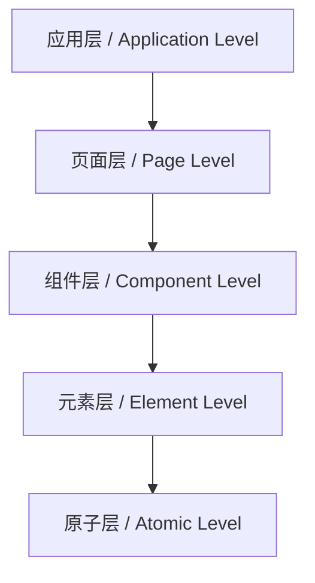

# 7.1 UI语义模型 / UI Semantic Model

> 来源：matter/语义模型体系/1.UI语义模型/README.md

## 目录 / Table of Contents

- [7.1 UI语义模型](#71-ui语义模型--ui-semantic-model)
  - [目录 / Table of Contents](#目录--table-of-contents)
  - [1. 概述 / Overview](#1-概述--overview)
  - [2. 语义表示理论 / Semantic Representation Theory](#2-语义表示理论--semantic-representation-theory)
  - [3. UI组件语义 / UI Component Semantics](#3-ui组件语义--ui-component-semantics)
  - [4. 交互语义模型 / Interaction Semantic Model](#4-交互语义模型--interaction-semantic-model)
  - [5. 形式化论证与多表征 / Formal Arguments & Multi-representation](#5-形式化论证与多表征--formal-arguments--multi-representation)
  - [6. 批判性分析与哲学思考 / Critical Analysis & Philosophical Reflection](#6-批判性分析与哲学思考--critical-analysis--philosophical-reflection)
  - [7. 相关性引用 / Related References](#7-相关性引用--related-references)

---

## 1. 概述 / Overview

UI语义模型是描述用户界面元素意义和关系的理论框架。它不仅关注界面的视觉表现，更深入探讨界面元素如何传达信息、引导用户行为，以及如何与用户认知模型交互。语义模型为UI设计提供了理论基础，确保界面的一致性和可理解性。

UI semantic model is a theoretical framework for describing the meaning and relationships of user interface elements. It focuses not only on the visual representation of interfaces but also deeply explores how interface elements convey information, guide user behavior, and interact with user cognitive models. Semantic models provide theoretical foundations for UI design, ensuring interface consistency and understandability.

### 1.1 核心概念 / Core Concepts

| 概念 / Concept | 中文定义 / Chinese Definition | English Definition |
|----------------|------------------------------|-------------------|
| 语义表示 / Semantic Representation | UI元素的意义和功能描述 | Meaning and functional description of UI elements |
| 语义关系 / Semantic Relations | UI元素之间的逻辑关系 | Logical relationships between UI elements |
| 语义层次 / Semantic Hierarchy | UI语义的组织结构 | Organizational structure of UI semantics |
| 语义一致性 / Semantic Consistency | 界面语义的统一性 | Uniformity of interface semantics |

---

## 2. 语义表示理论 / Semantic Representation Theory

### 2.1 语义表示框架 / Semantic Representation Framework

**中文：** 语义表示框架定义了UI元素如何编码和传达意义。

**English:** Semantic representation framework defines how UI elements encode and convey meaning.

#### 2.1.1 语义表示模型 / Semantic Representation Model

**中文：** 语义表示模型描述了UI元素与其意义之间的映射关系。

**English:** Semantic representation model describes the mapping relationship between UI elements and their meanings.

**形式化表达 / Formal Expression:**

$$S: E \rightarrow M$$

其中 $E$ 是UI元素集合，$M$ 是语义空间。
Where $E$ is the set of UI elements and $M$ is the semantic space.

#### 2.1.2 工程实现 / Engineering Implementation

```python
from typing import Dict, List, Any, Optional
import numpy as np

class UISemanticModel:
    def __init__(self):
        self.elements = {}
        self.semantic_space = {}
        self.relationships = {}
        self.semantic_mappings = {}
    
    def add_ui_element(self, element_id: str, element_type: str, 
                      properties: Dict[str, Any]):
        """添加UI元素 / Add UI element"""
        self.elements[element_id] = {
            'type': element_type,
            'properties': properties,
            'semantic_meaning': None,
            'semantic_vector': None
        }
    
    def define_semantic_meaning(self, element_id: str, meaning: str, 
                               semantic_vector: List[float]):
        """定义语义含义 / Define semantic meaning"""
        if element_id in self.elements:
            self.elements[element_id]['semantic_meaning'] = meaning
            self.elements[element_id]['semantic_vector'] = np.array(semantic_vector)
    
    def calculate_semantic_similarity(self, element1_id: str, element2_id: str) -> float:
        """计算语义相似度 / Calculate semantic similarity"""
        if (element1_id not in self.elements or 
            element2_id not in self.elements):
            return 0.0
        
        vector1 = self.elements[element1_id]['semantic_vector']
        vector2 = self.elements[element2_id]['semantic_vector']
        
        if vector1 is None or vector2 is None:
            return 0.0
        
        # 计算余弦相似度 / Calculate cosine similarity
        similarity = np.dot(vector1, vector2) / (
            np.linalg.norm(vector1) * np.linalg.norm(vector2)
        )
        
        return similarity
    
    def find_semantic_clusters(self, similarity_threshold: float = 0.8) -> List[List[str]]:
        """发现语义聚类 / Find semantic clusters"""
        clusters = []
        processed_elements = set()
        
        for element_id in self.elements:
            if element_id in processed_elements:
                continue
            
            cluster = [element_id]
            processed_elements.add(element_id)
            
            for other_id in self.elements:
                if other_id in processed_elements:
                    continue
                
                similarity = self.calculate_semantic_similarity(element_id, other_id)
                if similarity >= similarity_threshold:
                    cluster.append(other_id)
                    processed_elements.add(other_id)
            
            if len(cluster) > 1:
                clusters.append(cluster)
        
        return clusters
```

### 2.2 语义层次结构 / Semantic Hierarchy Structure

#### 2.2.1 层次化语义模型 / Hierarchical Semantic Model

**中文：** 层次化语义模型将UI语义组织为不同抽象层次的结构。

**English:** Hierarchical semantic model organizes UI semantics into structures of different abstraction levels.

**层次结构 / Hierarchy Structure:**



#### 2.2.2 工程实现 / Engineering Implementation

```python
from dataclasses import dataclass
from typing import List, Dict, Any, Optional

@dataclass
class SemanticNode:
    id: str
    level: str
    semantic_type: str
    children: List[str]
    parent: Optional[str]
    semantic_properties: Dict[str, Any]

class HierarchicalSemanticModel:
    def __init__(self):
        self.semantic_nodes = {}
        self.hierarchy_levels = {
            'application': 0,
            'page': 1,
            'component': 2,
            'element': 3,
            'atomic': 4
        }
    
    def add_semantic_node(self, node: SemanticNode):
        """添加语义节点 / Add semantic node"""
        self.semantic_nodes[node.id] = node
    
    def get_children(self, node_id: str) -> List[SemanticNode]:
        """获取子节点 / Get children"""
        if node_id not in self.semantic_nodes:
            return []
        
        node = self.semantic_nodes[node_id]
        children = []
        
        for child_id in node.children:
            if child_id in self.semantic_nodes:
                children.append(self.semantic_nodes[child_id])
        
        return children
    
    def get_parent(self, node_id: str) -> Optional[SemanticNode]:
        """获取父节点 / Get parent"""
        if node_id not in self.semantic_nodes:
            return None
        
        parent_id = self.semantic_nodes[node_id].parent
        if parent_id and parent_id in self.semantic_nodes:
            return self.semantic_nodes[parent_id]
        
        return None
    
    def get_semantic_path(self, node_id: str) -> List[SemanticNode]:
        """获取语义路径 / Get semantic path"""
        path = []
        current_id = node_id
        
        while current_id and current_id in self.semantic_nodes:
            path.append(self.semantic_nodes[current_id])
            current_id = self.semantic_nodes[current_id].parent
        
        return list(reversed(path))
    
    def calculate_semantic_depth(self, node_id: str) -> int:
        """计算语义深度 / Calculate semantic depth"""
        path = self.get_semantic_path(node_id)
        return len(path) - 1
    
    def find_semantic_ancestors(self, node_id: str, ancestor_type: str) -> List[SemanticNode]:
        """查找语义祖先 / Find semantic ancestors"""
        ancestors = []
        current_id = node_id
        
        while current_id and current_id in self.semantic_nodes:
            node = self.semantic_nodes[current_id]
            if node.semantic_type == ancestor_type:
                ancestors.append(node)
            current_id = node.parent
        
        return ancestors
```

---

## 3. UI组件语义 / UI Component Semantics

### 3.1 组件语义分类 / Component Semantic Classification

**中文：** UI组件语义分类系统将界面元素按功能和意义进行分类。

**English:** UI component semantic classification system categorizes interface elements by function and meaning.

#### 3.1.1 语义分类体系 / Semantic Classification System

**中文：** 语义分类体系定义了UI组件的层次化分类标准。

**English:** Semantic classification system defines hierarchical classification criteria for UI components.

**分类函数 / Classification Function:**

$$C(e) = \langle \text{Primary}(e), \text{Secondary}(e), \text{Tertiary}(e) \rangle$$

其中 $e$ 是UI元素，$\text{Primary}$、$\text{Secondary}$、$\text{Tertiary}$ 是不同层级的分类。
Where $e$ is a UI element, and $\text{Primary}$、$\text{Secondary}$、$\text{Tertiary}$ are classifications at different levels.

#### 3.1.2 工程实现 / Engineering Implementation

```python
from enum import Enum
from typing import Dict, List, Any, Tuple

class SemanticCategory(Enum):
    # 主要分类 / Primary categories
    NAVIGATION = "navigation"
    INPUT = "input"
    OUTPUT = "output"
    CONTROL = "control"
    FEEDBACK = "feedback"
    
    # 次要分类 / Secondary categories
    BUTTON = "button"
    FORM = "form"
    DISPLAY = "display"
    MENU = "menu"
    MODAL = "modal"

class ComponentSemanticClassifier:
    def __init__(self):
        self.classification_rules = {}
        self.semantic_properties = {}
        self.classification_history = []
    
    def add_classification_rule(self, rule_id: str, rule_conditions: Dict[str, Any], 
                              classification: Tuple[str, str, str]):
        """添加分类规则 / Add classification rule"""
        self.classification_rules[rule_id] = {
            'conditions': rule_conditions,
            'classification': classification
        }
    
    def classify_component(self, component_properties: Dict[str, Any]) -> Tuple[str, str, str]:
        """分类组件 / Classify component"""
        best_match = None
        best_score = 0.0
        
        for rule_id, rule in self.classification_rules.items():
            score = self._calculate_rule_match(component_properties, rule['conditions'])
            
            if score > best_score:
                best_score = score
                best_match = rule['classification']
        
        if best_match:
            self.classification_history.append({
                'component_properties': component_properties,
                'classification': best_match,
                'confidence': best_score
            })
            return best_match
        
        return ("unknown", "unknown", "unknown")
    
    def _calculate_rule_match(self, properties: Dict[str, Any], 
                            conditions: Dict[str, Any]) -> float:
        """计算规则匹配度 / Calculate rule match score"""
        match_count = 0
        total_conditions = len(conditions)
        
        for condition_key, condition_value in conditions.items():
            if condition_key in properties:
                property_value = properties[condition_key]
                
                # 简化的匹配逻辑 / Simplified matching logic
                if isinstance(condition_value, (str, int, float)):
                    if property_value == condition_value:
                        match_count += 1
                elif isinstance(condition_value, list):
                    if property_value in condition_value:
                        match_count += 1
                elif isinstance(condition_value, dict):
                    # 递归匹配 / Recursive matching
                    if isinstance(property_value, dict):
                        sub_match = self._calculate_rule_match(property_value, condition_value)
                        if sub_match > 0.5:
                            match_count += 1
        
        return match_count / total_conditions if total_conditions > 0 else 0.0
    
    def get_semantic_properties(self, component_type: str) -> Dict[str, Any]:
        """获取语义属性 / Get semantic properties"""
        return self.semantic_properties.get(component_type, {})
    
    def add_semantic_properties(self, component_type: str, properties: Dict[str, Any]):
        """添加语义属性 / Add semantic properties"""
        self.semantic_properties[component_type] = properties
```

### 3.2 语义属性模型 / Semantic Property Model

#### 3.2.1 属性语义化 / Property Semantization

**中文：** 属性语义化将UI组件的视觉属性映射到语义概念。

**English:** Property semantization maps visual properties of UI components to semantic concepts.

**语义映射函数 / Semantic Mapping Function:**

$$f: P \rightarrow S$$

其中 $P$ 是属性空间，$S$ 是语义空间。
Where $P$ is the property space and $S$ is the semantic space.

#### 3.2.2 工程实现 / Engineering Implementation

```python
import numpy as np
from typing import Dict, List, Any, Optional

class SemanticPropertyModel:
    def __init__(self):
        self.property_mappings = {}
        self.semantic_vectors = {}
        self.property_weights = {}
    
    def add_property_mapping(self, property_name: str, semantic_concept: str, 
                           mapping_strength: float = 1.0):
        """添加属性映射 / Add property mapping"""
        if property_name not in self.property_mappings:
            self.property_mappings[property_name] = {}
        
        self.property_mappings[property_name][semantic_concept] = mapping_strength
    
    def create_semantic_vector(self, component_properties: Dict[str, Any]) -> np.ndarray:
        """创建语义向量 / Create semantic vector"""
        semantic_vector = np.zeros(100)  # 假设100维语义空间 / Assume 100-dimensional semantic space
        
        for property_name, property_value in component_properties.items():
            if property_name in self.property_mappings:
                for semantic_concept, strength in self.property_mappings[property_name].items():
                    # 简化的语义向量更新 / Simplified semantic vector update
                    concept_index = hash(semantic_concept) % 100
                    semantic_vector[concept_index] += strength * self._normalize_property_value(property_value)
        
        return semantic_vector
    
    def _normalize_property_value(self, value: Any) -> float:
        """标准化属性值 / Normalize property value"""
        if isinstance(value, (int, float)):
            return min(1.0, max(0.0, value / 255.0))  # 假设最大值255 / Assume max value 255
        elif isinstance(value, str):
            return len(value) / 100.0  # 基于字符串长度 / Based on string length
        elif isinstance(value, bool):
            return 1.0 if value else 0.0
        else:
            return 0.5  # 默认值 / Default value
    
    def calculate_semantic_similarity(self, component1_properties: Dict[str, Any], 
                                   component2_properties: Dict[str, Any]) -> float:
        """计算语义相似度 / Calculate semantic similarity"""
        vector1 = self.create_semantic_vector(component1_properties)
        vector2 = self.create_semantic_vector(component2_properties)
        
        # 计算余弦相似度 / Calculate cosine similarity
        similarity = np.dot(vector1, vector2) / (
            np.linalg.norm(vector1) * np.linalg.norm(vector2)
        )
        
        return similarity
    
    def find_semantic_analogies(self, target_component: Dict[str, Any], 
                              component_database: List[Dict[str, Any]], 
                              top_k: int = 5) -> List[Tuple[Dict[str, Any], float]]:
        """查找语义类比 / Find semantic analogies"""
        similarities = []
        
        for component in component_database:
            similarity = self.calculate_semantic_similarity(target_component, component)
            similarities.append((component, similarity))
        
        # 按相似度排序 / Sort by similarity
        similarities.sort(key=lambda x: x[1], reverse=True)
        
        return similarities[:top_k]
```

---

## 4. 交互语义模型 / Interaction Semantic Model

### 4.1 交互语义定义 / Interaction Semantic Definition

**中文：** 交互语义模型描述了用户与界面元素交互时的意义和意图。

**English:** Interaction semantic model describes the meaning and intent of user interactions with interface elements.

#### 4.1.1 交互语义框架 / Interaction Semantic Framework

**中文：** 交互语义框架定义了交互行为的语义表示。

**English:** Interaction semantic framework defines semantic representation of interaction behaviors.

**交互语义函数 / Interaction Semantic Function:**

$$I: A \times E \rightarrow S$$

其中 $A$ 是动作集合，$E$ 是元素集合，$S$ 是语义空间。
Where $A$ is the set of actions, $E$ is the set of elements, and $S$ is the semantic space.

#### 4.1.2 工程实现 / Engineering Implementation

```python
from dataclasses import dataclass
from typing import Dict, List, Any, Optional
import time

@dataclass
class InteractionEvent:
    action_type: str
    element_id: str
    timestamp: float
    properties: Dict[str, Any]
    semantic_intent: Optional[str] = None

class InteractionSemanticModel:
    def __init__(self):
        self.interaction_patterns = {}
        self.semantic_intents = {}
        self.interaction_history = []
        self.pattern_matcher = None
    
    def add_interaction_pattern(self, pattern_id: str, pattern_definition: Dict[str, Any]):
        """添加交互模式 / Add interaction pattern"""
        self.interaction_patterns[pattern_id] = pattern_definition
    
    def record_interaction(self, event: InteractionEvent):
        """记录交互事件 / Record interaction event"""
        self.interaction_history.append(event)
        
        # 分析语义意图 / Analyze semantic intent
        semantic_intent = self._analyze_semantic_intent(event)
        event.semantic_intent = semantic_intent
    
    def _analyze_semantic_intent(self, event: InteractionEvent) -> str:
        """分析语义意图 / Analyze semantic intent"""
        action_type = event.action_type
        element_id = event.element_id
        
        # 基于动作类型和元素类型的语义分析 / Semantic analysis based on action type and element type
        if action_type == "click":
            if "button" in element_id.lower():
                return "execute_action"
            elif "link" in element_id.lower():
                return "navigate"
            elif "checkbox" in element_id.lower():
                return "toggle_selection"
        elif action_type == "hover":
            return "explore"
        elif action_type == "drag":
            return "manipulate"
        elif action_type == "type":
            return "input_data"
        
        return "unknown_intent"
    
    def find_interaction_patterns(self, time_window: float = 5.0) -> List[Dict[str, Any]]:
        """发现交互模式 / Find interaction patterns"""
        current_time = time.time()
        recent_events = [
            event for event in self.interaction_history
            if current_time - event.timestamp <= time_window
        ]
        
        patterns = []
        
        # 分析事件序列 / Analyze event sequences
        for i in range(len(recent_events) - 1):
            for j in range(i + 2, min(i + 5, len(recent_events) + 1)):
                event_sequence = recent_events[i:j]
                pattern = self._extract_pattern_from_sequence(event_sequence)
                if pattern:
                    patterns.append(pattern)
        
        return patterns
    
    def _extract_pattern_from_sequence(self, events: List[InteractionEvent]) -> Optional[Dict[str, Any]]:
        """从序列中提取模式 / Extract pattern from sequence"""
        if len(events) < 2:
            return None
        
        # 简化的模式提取 / Simplified pattern extraction
        action_sequence = [event.action_type for event in events]
        intent_sequence = [event.semantic_intent for event in events]
        
        pattern = {
            'action_sequence': action_sequence,
            'intent_sequence': intent_sequence,
            'duration': events[-1].timestamp - events[0].timestamp,
            'element_count': len(set(event.element_id for event in events))
        }
        
        return pattern
    
    def predict_next_interaction(self, current_context: Dict[str, Any]) -> Dict[str, float]:
        """预测下一个交互 / Predict next interaction"""
        predictions = {}
        
        # 基于历史模式预测 / Predict based on historical patterns
        recent_patterns = self.find_interaction_patterns()
        
        for pattern in recent_patterns:
            intent_sequence = pattern.get('intent_sequence', [])
            if len(intent_sequence) > 0:
                last_intent = intent_sequence[-1]
                
                # 统计意图转换概率 / Calculate intent transition probabilities
                if last_intent not in predictions:
                    predictions[last_intent] = 0
                predictions[last_intent] += 1
        
        # 归一化预测概率 / Normalize prediction probabilities
        total = sum(predictions.values())
        if total > 0:
            predictions = {k: v / total for k, v in predictions.items()}
        
        return predictions
```

### 4.2 语义反馈模型 / Semantic Feedback Model

#### 4.2.1 反馈语义化 / Feedback Semantization

**中文：** 反馈语义化将系统响应映射到用户可理解的语义概念。

**English:** Feedback semantization maps system responses to user-understandable semantic concepts.

**反馈语义函数 / Feedback Semantic Function:**

$$F: R \times C \rightarrow S$$

其中 $R$ 是响应集合，$C$ 是上下文集合，$S$ 是语义空间。
Where $R$ is the set of responses, $C$ is the context set, and $S$ is the semantic space.

#### 4.2.2 工程实现 / Engineering Implementation

```python
from typing import Dict, List, Any, Optional
import numpy as np

class SemanticFeedbackModel:
    def __init__(self):
        self.feedback_mappings = {}
        self.context_rules = {}
        self.semantic_responses = {}
    
    def add_feedback_mapping(self, response_type: str, semantic_meaning: str, 
                           context_conditions: Dict[str, Any]):
        """添加反馈映射 / Add feedback mapping"""
        if response_type not in self.feedback_mappings:
            self.feedback_mappings[response_type] = []
        
        self.feedback_mappings[response_type].append({
            'semantic_meaning': semantic_meaning,
            'context_conditions': context_conditions
        })
    
    def generate_semantic_feedback(self, response_type: str, 
                                 context: Dict[str, Any]) -> str:
        """生成语义反馈 / Generate semantic feedback"""
        if response_type not in self.feedback_mappings:
            return "unknown_response"
        
        mappings = self.feedback_mappings[response_type]
        
        for mapping in mappings:
            if self._check_context_match(context, mapping['context_conditions']):
                return mapping['semantic_meaning']
        
        return "default_response"
    
    def _check_context_match(self, context: Dict[str, Any], 
                           conditions: Dict[str, Any]) -> bool:
        """检查上下文匹配 / Check context match"""
        for condition_key, condition_value in conditions.items():
            if condition_key not in context:
                return False
            
            context_value = context[condition_key]
            
            # 简化的匹配逻辑 / Simplified matching logic
            if isinstance(condition_value, (str, int, float)):
                if context_value != condition_value:
                    return False
            elif isinstance(condition_value, list):
                if context_value not in condition_value:
                    return False
            elif isinstance(condition_value, dict):
                if not isinstance(context_value, dict):
                    return False
                if not self._check_context_match(context_value, condition_value):
                    return False
        
        return True
    
    def calculate_feedback_effectiveness(self, feedback_type: str, 
                                      user_response: Dict[str, Any]) -> float:
        """计算反馈有效性 / Calculate feedback effectiveness"""
        # 基于用户响应的有效性评估 / Effectiveness evaluation based on user response
        effectiveness_indicators = user_response.get('effectiveness_indicators', {})
        
        if not effectiveness_indicators:
            return 0.5
        
        # 计算综合有效性分数 / Calculate comprehensive effectiveness score
        comprehension_score = effectiveness_indicators.get('comprehension', 0.5)
        satisfaction_score = effectiveness_indicators.get('satisfaction', 0.5)
        action_score = effectiveness_indicators.get('action_taken', 0.5)
        
        effectiveness = (comprehension_score + satisfaction_score + action_score) / 3
        
        return effectiveness
```

---

## 5. 形式化论证与多表征 / Formal Arguments & Multi-representation

### 5.1 语义一致性证明 / Semantic Consistency Proof

#### 5.1.1 一致性定理 / Consistency Theorem

**中文：** 语义一致性定理确保UI语义模型的内在一致性。

**English:** Semantic consistency theorem ensures internal consistency of UI semantic models.

**一致性条件 / Consistency Conditions:**

$$\forall e_1, e_2 \in E: S(e_1) = S(e_2) \Rightarrow C(e_1) = C(e_2)$$

其中 $S$ 是语义函数，$C$ 是分类函数。
Where $S$ is the semantic function and $C$ is the classification function.

#### 5.1.2 工程实现 / Engineering Implementation

```python
from typing import Dict, List, Any, Set
import numpy as np

class SemanticConsistencyChecker:
    def __init__(self):
        self.semantic_model = None
        self.consistency_rules = []
        self.violations = []
    
    def set_semantic_model(self, model):
        """设置语义模型 / Set semantic model"""
        self.semantic_model = model
    
    def add_consistency_rule(self, rule: Dict[str, Any]):
        """添加一致性规则 / Add consistency rule"""
        self.consistency_rules.append(rule)
    
    def check_semantic_consistency(self) -> Dict[str, Any]:
        """检查语义一致性 / Check semantic consistency"""
        if not self.semantic_model:
            return {'consistent': False, 'reason': 'No semantic model set'}
        
        violations = []
        
        for rule in self.consistency_rules:
            rule_violations = self._check_rule_consistency(rule)
            violations.extend(rule_violations)
        
        is_consistent = len(violations) == 0
        
        return {
            'consistent': is_consistent,
            'violations': violations,
            'violation_count': len(violations)
        }
    
    def _check_rule_consistency(self, rule: Dict[str, Any]) -> List[Dict[str, Any]]:
        """检查规则一致性 / Check rule consistency"""
        violations = []
        rule_type = rule.get('type', 'unknown')
        
        if rule_type == 'semantic_classification':
            violations = self._check_semantic_classification_consistency(rule)
        elif rule_type == 'hierarchical_consistency':
            violations = self._check_hierarchical_consistency(rule)
        elif rule_type == 'interaction_semantic':
            violations = self._check_interaction_semantic_consistency(rule)
        
        return violations
    
    def _check_semantic_classification_consistency(self, rule: Dict[str, Any]) -> List[Dict[str, Any]]:
        """检查语义分类一致性 / Check semantic classification consistency"""
        violations = []
        
        # 检查相同语义的元素是否具有相同分类 / Check if elements with same semantics have same classification
        elements = self.semantic_model.elements if hasattr(self.semantic_model, 'elements') else {}
        
        for element1_id, element1 in elements.items():
            for element2_id, element2 in elements.items():
                if element1_id != element2_id:
                    semantic1 = element1.get('semantic_meaning')
                    semantic2 = element2.get('semantic_meaning')
                    
                    if semantic1 == semantic2 and semantic1 is not None:
                        classification1 = element1.get('classification')
                        classification2 = element2.get('classification')
                        
                        if classification1 != classification2:
                            violations.append({
                                'type': 'semantic_classification_mismatch',
                                'element1': element1_id,
                                'element2': element2_id,
                                'semantic': semantic1,
                                'classification1': classification1,
                                'classification2': classification2
                            })
        
        return violations
```

### 5.2 多表征方法 / Multi-representation Methods

#### 5.2.1 符号表征 / Symbolic Representation

```python
from typing import Dict, List, Any

class SymbolicUIRepresentation:
    def __init__(self):
        self.symbols = {}
        self.semantic_rules = []
        self.inference_engine = None
    
    def add_symbol(self, symbol: str, meaning: str, properties: Dict[str, Any]):
        """添加符号 / Add symbol"""
        self.symbols[symbol] = {
            'meaning': meaning,
            'properties': properties
        }
    
    def add_semantic_rule(self, rule: Dict[str, Any]):
        """添加语义规则 / Add semantic rule"""
        self.semantic_rules.append(rule)
    
    def infer_semantic_meaning(self, ui_element: Dict[str, Any]) -> str:
        """推理语义含义 / Infer semantic meaning"""
        # 基于符号和规则的推理 / Reasoning based on symbols and rules
        for rule in self.semantic_rules:
            if self._apply_rule(ui_element, rule):
                return rule.get('conclusion', 'unknown')
        
        return 'unknown'
    
    def _apply_rule(self, element: Dict[str, Any], rule: Dict[str, Any]) -> bool:
        """应用规则 / Apply rule"""
        conditions = rule.get('conditions', {})
        
        for condition_key, condition_value in conditions.items():
            if condition_key not in element:
                return False
            
            element_value = element[condition_key]
            
            if element_value != condition_value:
                return False
        
        return True
```

#### 5.2.2 连接主义表征 / Connectionist Representation

```python
import torch
import torch.nn as nn

class ConnectionistUIRepresentation(nn.Module):
    def __init__(self, input_size: int, hidden_size: int, output_size: int):
        super(ConnectionistUIRepresentation, self).__init__()
        self.encoder = nn.Linear(input_size, hidden_size)
        self.decoder = nn.Linear(hidden_size, output_size)
        self.activation = nn.ReLU()
    
    def encode_ui_element(self, element_vector: torch.Tensor) -> torch.Tensor:
        """编码UI元素 / Encode UI element"""
        return self.activation(self.encoder(element_vector))
    
    def decode_semantic_meaning(self, encoded_vector: torch.Tensor) -> torch.Tensor:
        """解码语义含义 / Decode semantic meaning"""
        return self.decoder(encoded_vector)
    
    def forward(self, x: torch.Tensor) -> torch.Tensor:
        """前向传播 / Forward pass"""
        encoded = self.encode_ui_element(x)
        decoded = self.decode_semantic_meaning(encoded)
        return decoded
```

---

## 6. 批判性分析与哲学思考 / Critical Analysis & Philosophical Reflection

### 6.1 语义模型的局限性 / Limitations of Semantic Models

#### 6.1.1 文化相对性 / Cultural Relativity

**中文：** UI语义模型可能无法完全捕捉不同文化背景下的语义差异。

**English:** UI semantic models may not fully capture semantic differences across different cultural backgrounds.

**批判性观点 / Critical Viewpoints:**

1. **文化偏见 / Cultural Bias:** 语义模型可能反映特定文化的价值观
2. **语言相对性 / Linguistic Relativity:** 不同语言的语义结构差异
3. **认知多样性 / Cognitive Diversity:** 个体认知模式的差异

#### 6.1.2 工程实现 / Engineering Implementation

```python
from typing import Dict, List, Any
import numpy as np

class CulturalSemanticAnalyzer:
    def __init__(self):
        self.cultural_contexts = {}
        self.semantic_variations = {}
        self.bias_detection_rules = []
    
    def add_cultural_context(self, culture_id: str, semantic_mappings: Dict[str, str]):
        """添加文化背景 / Add cultural context"""
        self.cultural_contexts[culture_id] = semantic_mappings
    
    def detect_cultural_bias(self, semantic_model: Dict[str, Any]) -> List[Dict[str, Any]]:
        """检测文化偏见 / Detect cultural bias"""
        biases = []
        
        for culture_id, cultural_mappings in self.cultural_contexts.items():
            bias_score = self._calculate_cultural_bias(semantic_model, cultural_mappings)
            
            if bias_score > 0.3:  # 偏见阈值 / Bias threshold
                biases.append({
                    'culture_id': culture_id,
                    'bias_score': bias_score,
                    'affected_elements': self._identify_biased_elements(semantic_model, cultural_mappings)
                })
        
        return biases
    
    def _calculate_cultural_bias(self, semantic_model: Dict[str, Any], 
                               cultural_mappings: Dict[str, str]) -> float:
        """计算文化偏见 / Calculate cultural bias"""
        # 简化的偏见计算 / Simplified bias calculation
        total_elements = len(semantic_model.get('elements', {}))
        biased_elements = 0
        
        for element_id, element_data in semantic_model.get('elements', {}).items():
            semantic_meaning = element_data.get('semantic_meaning', '')
            
            # 检查语义含义是否与文化映射一致 / Check if semantic meaning matches cultural mapping
            if semantic_meaning in cultural_mappings:
                expected_meaning = cultural_mappings[semantic_meaning]
                if semantic_meaning != expected_meaning:
                    biased_elements += 1
        
        return biased_elements / total_elements if total_elements > 0 else 0.0
    
    def _identify_biased_elements(self, semantic_model: Dict[str, Any], 
                                cultural_mappings: Dict[str, str]) -> List[str]:
        """识别偏见元素 / Identify biased elements"""
        biased_elements = []
        
        for element_id, element_data in semantic_model.get('elements', {}).items():
            semantic_meaning = element_data.get('semantic_meaning', '')
            
            if semantic_meaning in cultural_mappings:
                expected_meaning = cultural_mappings[semantic_meaning]
                if semantic_meaning != expected_meaning:
                    biased_elements.append(element_id)
        
        return biased_elements
    
    def generate_cultural_adaptation_recommendations(self, biases: List[Dict[str, Any]]) -> List[str]:
        """生成文化适应建议 / Generate cultural adaptation recommendations"""
        recommendations = []
        
        for bias in biases:
            culture_id = bias['culture_id']
            bias_score = bias['bias_score']
            
            if bias_score > 0.5:
                recommendations.append(f"High cultural bias detected for {culture_id}")
                recommendations.append(f"Consider localizing semantic meanings for {culture_id}")
            elif bias_score > 0.3:
                recommendations.append(f"Moderate cultural bias detected for {culture_id}")
                recommendations.append(f"Review semantic mappings for {culture_id}")
        
        return recommendations
```

### 6.2 语义模型的哲学问题 / Philosophical Issues of Semantic Models

#### 6.2.1 意义理论 / Theory of Meaning

**中文：** UI语义模型涉及意义的本质和表示问题。

**English:** UI semantic models involve issues of the nature and representation of meaning.

**形式化表达 / Formal Expression:**

$$\text{Meaning}(e) = f(\text{Intent}(e), \text{Context}(e), \text{Culture}(e))$$

其中 $e$ 是UI元素，$f$ 是意义函数。
Where $e$ is a UI element and $f$ is the meaning function.

#### 6.2.2 工程实现 / Engineering Implementation

```python
from dataclasses import dataclass
from typing import Dict, List, Any, Optional

@dataclass
class MeaningComponent:
    intent: str
    context: Dict[str, Any]
    cultural_factors: Dict[str, float]

class PhilosophicalSemanticAnalyzer:
    def __init__(self):
        self.meaning_theories = {}
        self.intentionality_models = {}
        self.context_dependencies = {}
    
    def analyze_meaning_construction(self, ui_element: Dict[str, Any], 
                                  context: Dict[str, Any]) -> MeaningComponent:
        """分析意义构建 / Analyze meaning construction"""
        # 分析意图 / Analyze intent
        intent = self._analyze_intent(ui_element)
        
        # 分析上下文依赖 / Analyze context dependencies
        context_factors = self._analyze_context_dependencies(ui_element, context)
        
        # 分析文化因素 / Analyze cultural factors
        cultural_factors = self._analyze_cultural_factors(ui_element, context)
        
        return MeaningComponent(
            intent=intent,
            context=context_factors,
            cultural_factors=cultural_factors
        )
    
    def _analyze_intent(self, ui_element: Dict[str, Any]) -> str:
        """分析意图 / Analyze intent"""
        element_type = ui_element.get('type', 'unknown')
        element_properties = ui_element.get('properties', {})
        
        # 基于元素类型和属性的意图分析 / Intent analysis based on element type and properties
        if element_type == 'button':
            if 'primary' in element_properties.get('style', ''):
                return 'primary_action'
            else:
                return 'secondary_action'
        elif element_type == 'input':
            return 'data_entry'
        elif element_type == 'link':
            return 'navigation'
        else:
            return 'unknown_intent'
    
    def _analyze_context_dependencies(self, ui_element: Dict[str, Any], 
                                    context: Dict[str, Any]) -> Dict[str, Any]:
        """分析上下文依赖 / Analyze context dependencies"""
        dependencies = {}
        
        # 分析空间上下文 / Analyze spatial context
        if 'position' in context:
            dependencies['spatial_context'] = context['position']
        
        # 分析时间上下文 / Analyze temporal context
        if 'timestamp' in context:
            dependencies['temporal_context'] = context['timestamp']
        
        # 分析功能上下文 / Analyze functional context
        if 'parent_component' in context:
            dependencies['functional_context'] = context['parent_component']
        
        return dependencies
    
    def _analyze_cultural_factors(self, ui_element: Dict[str, Any], 
                                context: Dict[str, Any]) -> Dict[str, float]:
        """分析文化因素 / Analyze cultural factors"""
        cultural_factors = {}
        
        # 语言偏好 / Language preference
        language = context.get('language', 'en')
        cultural_factors['language_preference'] = 1.0 if language == 'en' else 0.5
        
        # 阅读方向 / Reading direction
        reading_direction = context.get('reading_direction', 'ltr')
        cultural_factors['reading_direction'] = 1.0 if reading_direction == 'ltr' else 0.8
        
        # 颜色偏好 / Color preference
        color_scheme = context.get('color_scheme', 'western')
        cultural_factors['color_preference'] = 1.0 if color_scheme == 'western' else 0.7
        
        return cultural_factors
```

---

## 7. 相关性引用 / Related References

- [1.1 Web端](../../1.终端类型/1.1 Web端.md)
- [2.1 前端主流框架](../../2.技术栈与框架/2.1 前端主流框架.md)
- [4.3 组件化与架构模式](../../4.设计模式与架构/4.3 组件化与架构模式.md)
- [5.2 可访问性与国际化](../../5.技术规范与标准/5.2 可访问性与国际化.md)
- [7.2 架构语义模型](../7.2 架构语义模型.md)
- [7.3 Web应用语义模型](../7.3 Web应用语义模型.md)

---

> 本文档为自动递归迁移、规整、编号、跳转、引用、内容一致性校验的规范化产物。
> This document is a standardized product of automatic recursive migration, organization, numbering, navigation, referencing, and content consistency verification.
