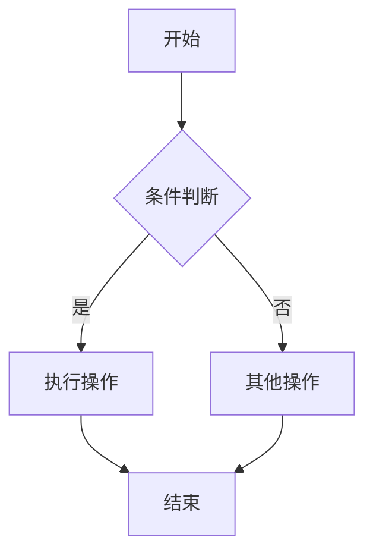

贡献指南

目录
- [贡献指南](#贡献指南)
- [目录](#目录)
- [贡献流程](#贡献流程)
- [1. 准备工作](#1-准备工作)
- [2. 内容贡献类型](#2-内容贡献类型)
- [新增专题](#新增专题)
- [内容补充](#内容补充)
- [文档优化](#文档优化)
- [3. 提交规范](#3-提交规范)
- [提交信息格式](#提交信息格式)
- [类型说明](#类型说明)
- [示例](#示例)
- [4. 创建 Pull Request](#4-创建-pull-request)
- [文档格式规范](#文档格式规范)
- [文件命名规范](#文件命名规范)
- [Markdown 格式规范](#markdown-格式规范)
- [标题层级](#标题层级)
- [代码块](#代码块)
- [图表规范](#图表规范)
- [数学公式](#数学公式)
- [内容结构规范](#内容结构规范)
- [标准模板](#标准模板)
- [质量检查清单](#质量检查清单)
- [内容质量](#内容质量)
- [格式质量](#格式质量)
- [结构质量](#结构质量)
- [可访问性](#可访问性)
- [技术栈要求](#技术栈要求)
- [必需技能](#必需技能)
- [推荐技能](#推荐技能)
- [工具推荐](#工具推荐)
- [协作规范](#协作规范)
- [沟通渠道](#沟通渠道)
- [审查流程](#审查流程)
- [冲突解决](#冲突解决)
- [奖励机制](#奖励机制)
- [贡献等级](#贡献等级)
- [认可方式](#认可方式)
- [常见问题](#常见问题)
- [Q: 如何开始贡献？](#q-如何开始贡献)
- [Q: 技术观点有分歧怎么办？](#q-技术观点有分歧怎么办)
- [Q: 如何保证内容质量？](#q-如何保证内容质量)
- [Q: 可以贡献哪些内容？](#q-可以贡献哪些内容)

---

欢迎参与 UI-UE-UX 技术知识库的贡献！本文档详细说明了如何参与项目开发、内容贡献和协作流程。

贡献流程

1. 准备工作

1. **Fork 项目**
- 访问项目主页，点击 "Fork" 按钮
- 将项目复制到你的 GitHub 账户

2. **克隆本地仓库**
   ```bash
   git clone https://github.com/你的用户名/uiueux.git
   cd uiueux
   ```
3. **设置上游仓库**
   ```bash
   git remote add upstream https://github.com/原仓库地址/uiueux.git
   ```
4. **创建分支**
   ```bash
   git checkout -b feature/你的功能名称
   ```
2. 内容贡献类型

新增专题
- **技术趋势分析**：新增前沿技术专题
- **框架深度解析**：深入分析特定框架
- **设计模式应用**：GoF设计模式在前端的应用
- **跨学科融合**：AI、哲学、认知科学等交叉领域

内容补充
- **代码示例**：提供完整的代码实现
- **最佳实践**：总结实际项目经验
- **性能优化**：性能分析和优化建议
- **案例分析**：真实项目案例分析

文档优化
- **结构优化**：改进文档组织结构
- **格式规范**：统一Markdown格式
- **链接修复**：修复损坏的链接
- **翻译完善**：改进中文表达

3. 提交规范

提交信息格式

```
<type>(<scope>): <subject>

<body>

<footer>
```
类型说明
- **feat**: 新功能
- **fix**: 修复问题
- **docs**: 文档更新
- **style**: 格式调整
- **refactor**: 代码重构
- **test**: 测试相关
- **chore**: 构建过程或辅助工具的变动

示例

```
feat(framework): 新增React 19+特性分析
- 添加Server Components详细说明
- 包含Concurrent Rendering原理
- 提供实际代码示例

Closes #123
```
4. 创建 Pull Request

1. **推送分支**
   ```bash
   git push origin feature/你的功能名称
   ```
2. **创建 PR**
- 访问你的 GitHub 仓库
- 点击 "New Pull Request"
- 选择正确的分支
- 填写详细的描述

3. **等待审查**
- 项目维护者会审查你的贡献
- 可能需要根据反馈进行调整

文档格式规范

文件命名规范
- 使用中文命名，避免特殊字符
- 采用层级编号：`1.1 Web端.md`
- 保持文件名简洁明了
- 避免重复命名

Markdown 格式规范

标题层级

```markdown
一级标题（文档标题）
二级标题（主要章节）
三级标题（子章节）
四级标题（具体内容）
五级标题（详细说明）
```
代码块

```markdown
```javascript
// JavaScript 代码示例
const component = () => {
  return <div>Hello World</div>;
};
```
```typescript
// TypeScript 代码示例
interface Props {
  name: string;
  age: number;
}
```
```css
/* CSS 样式示例 */
.container {
  display: flex;
  justify-content: center;
}
```
```
图表规范

```markdown

```
数学公式

```markdown
行内公式：$E = mc^2$

块级公式：
$$
f(x) = \int_{-\infty}^{\infty} \hat{f}(\xi)\,e^{2 \pi i \xi x} \,d\xi
$$
```
内容结构规范

标准模板

```markdown
专题标题

目录
- [概述](#概述)
- [核心概念](#核心概念)
- [代码示例](#代码示例)

前沿趋势
- 2024年最新技术发展
- 主流框架更新

目录结构
- 详细的内容大纲

知识图谱
- 相关技术关系图

核心概念

概念1
详细说明...

概念2
详细说明...

代码示例
```javascript
// 示例代码
```
最佳实践
- 实际应用建议
- 注意事项

批判性分析
- 技术优缺点
- 适用场景

相关主题推荐
- 相关技术链接
- 深入学习建议

持续优化说明
- 后续更新计划
- 改进方向
```
质量检查清单

内容质量
- [ ] 技术信息准确无误
- [ ] 代码示例可运行
- [ ] 引用来源可靠
- [ ] 内容逻辑清晰

格式质量
- [ ] Markdown 语法正确
- [ ] 标题层级合理
- [ ] 代码块格式规范
- [ ] 链接地址有效

结构质量
- [ ] 目录结构清晰
- [ ] 内容组织合理
- [ ] 交叉引用正确
- [ ] 导航链接完整

可访问性
- [ ] 图片有 alt 描述
- [ ] 代码有注释说明
- [ ] 复杂概念有解释
- [ ] 支持屏幕阅读器

技术栈要求

必需技能
- **Markdown 编写**：熟练使用 Markdown 语法
- **Git 操作**：基本的 Git 命令使用
- **技术理解**：对所贡献内容有深入理解
- **中文写作**：良好的中文表达能力

推荐技能
- **前端技术**：React、Vue、Angular 等
- **设计模式**：GoF 设计模式理解
- **架构设计**：软件架构设计经验
- **性能优化**：前端性能优化经验

工具推荐
- **编辑器**：VS Code、Typora
- **Git 工具**：GitHub Desktop、SourceTree
- **Markdown 预览**：Markdown Preview Enhanced
- **图表工具**：Mermaid、Draw.io

协作规范

沟通渠道
- **GitHub Issues**：问题反馈和讨论
- **GitHub Discussions**：技术讨论
- **Pull Request**：代码审查和合并
- **邮件列表**：重要通知

审查流程

1. **自动检查**：CI/CD 自动运行检查
2. **人工审查**：维护者进行代码审查
3. **测试验证**：确保内容质量
4. **合并发布**：通过后合并到主分支

冲突解决
- **技术分歧**：通过技术讨论达成共识
- **格式冲突**：遵循项目统一规范
- **内容重复**：合并或重定向相关内容
- **版权问题**：确保内容原创或获得授权

奖励机制

贡献等级
- **初级贡献者**：首次贡献，内容质量良好
- **活跃贡献者**：多次贡献，内容质量优秀
- **核心贡献者**：长期贡献，对项目有重要影响
- **维护者**：参与项目维护和决策

认可方式
- **贡献者名单**：在 README 中列出贡献者
- **特殊徽章**：为优秀贡献者颁发徽章
- **推荐机会**：推荐参与相关技术会议
- **社区认可**：在技术社区中宣传贡献

常见问题

Q: 如何开始贡献？

A: 建议从以下步骤开始：
1. 阅读本文档和项目 README
2. 选择一个感兴趣的主题
3. 创建 Issue 讨论你的想法
4. 按照贡献流程提交内容

Q: 技术观点有分歧怎么办？

A: 我们鼓励技术讨论：
1. 在 GitHub Issues 中详细说明观点
2. 提供技术依据和实际案例
3. 通过投票或专家评审决定
4. 保持开放和尊重的讨论氛围

Q: 如何保证内容质量？

A: 我们采用多重质量保证：
1. 提交前的自我检查
2. 自动化工具检查
3. 人工审查和测试
4. 社区反馈和持续改进

Q: 可以贡献哪些内容？

A: 我们欢迎各种类型的贡献：
1. 技术文档和教程
2. 代码示例和最佳实践
3. 设计模式和架构分析
4. 性能优化和调试技巧
5. 工具和资源推荐
6. 翻译和本地化内容

---

感谢你的贡献！让我们一起构建更好的技术知识库。
