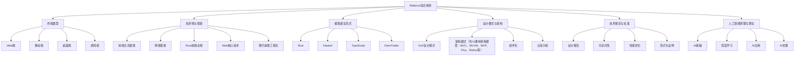
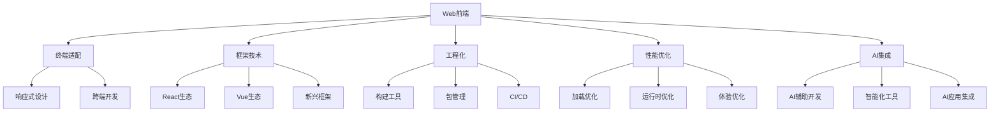
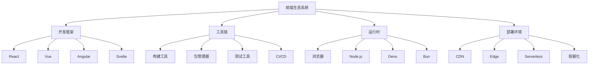

Refactor 目录总览

目录

- [Refactor 目录总览](#refactor-目录总览)
  - [目录](#目录)
  - [知识图谱](#知识图谱)
  - [2024前沿趋势](#2024前沿趋势)
  - [目录结构](#目录结构)
  - [主题关系图](#主题关系图)
  - [学习路径建议](#学习路径建议)
    - [入门路径](#入门路径)
    - [进阶路径](#进阶路径)
    - [专家路径](#专家路径)
  - [主题交叉引用](#主题交叉引用)
    - [前端工程化相关](#前端工程化相关)
    - [AI应用相关](#ai应用相关)
    - [跨端开发相关](#跨端开发相关)
    - [函数式编程相关](#函数式编程相关)
  - [技术生态系统](#技术生态系统)
  - [相关主题推荐阅读](#相关主题推荐阅读)

> 本文档为 UI/UE/UX 相关内容的递归归纳与规范化索引，所有内容均严格编号、树形结构、支持本地跳转，并持续补充2024年最新前端、AI、工程、设计等主流与前沿技术。

知识图谱

2024前沿趋势

- **前端框架革新**：React Server Components、Solid.js、Qwik、Islands Architecture
- **全栈开发趋势**：Rust全栈、Edge Computing、Serverless、WebAssembly
- **AI驱动开发**：AI代码生成、智能测试、自动化部署、性能优化
- **工程化升级**：Vite、Turbopack、pnpm、Monorepo、微前端
- **设计系统进化**：Atomic Design、Design Tokens、主题引擎、动态样式
- **性能与体验**：Core Web Vitals、PWA、Web Components、WebGPU
- **跨端与融合**：Flutter、React Native、Tauri、Electron、小程序
- **安全与隐私**：CSP、SameSite Cookie、HTTPS、Web3安全
- **UI通用架构模型持续演进**：MVC、MVVM、MVP、Flux、Redux、Clean Architecture、VIPER等成为前端与AI工程的核心基础，推动分层、组件化、单向数据流与工程自动化，为AI驱动开发、AIGC UI、可解释性UI、智能状态管理等提供结构化支撑（详见[4.3 组件化与架构模式](4.设计模式与架构/4.3 组件化与架构模式.md)）

目录结构

1. [终端类型](1.终端类型/README.md)
    - [1.1 Web端.md](1.终端类型/1.1 Web端.md)
    - [1.2 移动端.md](1.终端类型/1.2 移动端.md)
    - [1.3 桌面端.md](1.终端类型/1.3 桌面端.md)
    - [1.4 游戏端.md](1.终端类型/1.4 游戏端.md)

2. [技术栈与框架](2.技术栈与框架/README.md)
    - [2.1 前端主流框架.md](2.技术栈与框架/2.1 前端主流框架.md)
    - [2.2 跨端框架.md](2.技术栈与框架/2.2 跨端框架.md)
    - [2.3 Rust前端全栈.md](2.技术栈与框架/2.3 Rust前端全栈.md)
    - [2.4 Haskell-Scala前端.md](2.技术栈与框架/2.4 Haskell-Scala前端.md)
    - [2.5 WebAssembly.md](2.技术栈与框架/2.5 WebAssembly.md)
    - [2.6 Web核心技术.md](2.技术栈与框架/2.6 Web核心技术.md)
    - [2.7 现代前端工程化.md](2.技术栈与框架/2.7 现代前端工程化.md)

3. [编程语言范式](3.编程语言范式/README.md)
    - [3.1 Rust.md](3.编程语言范式/3.1 Rust.md)
    - [3.2 Haskell.md](3.编程语言范式/3.2 Haskell.md)
    - [3.3 Scala.md](3.编程语言范式/3.3 Scala.md)
    - [3.4 TypeScript-JavaScript.md](3.编程语言范式/3.4 TypeScript-JavaScript.md)
    - [3.5 Dart-Flutter.md](3.编程语言范式/3.5 Dart-Flutter.md)

4. [设计模式与架构](4.设计模式与架构/README.md)
    - [4.1 GoF设计模式.md](4.设计模式与架构/4.1 GoF设计模式.md)
    - [4.2 结构型-行为型-创建型模式.md](4.设计模式与架构/4.2 结构型-行为型-创建型模式.md)
    - [4.3 组件化与架构模式（含UI通用架构模型：MVC、MVVM、MVP、Flux、Redux等）](4.设计模式与架构/4.3 组件化与架构模式.md)
    - [4.4 哲学与认知批判性分析.md](4.设计模式与架构/4.4 哲学与认知批判性分析.md)

5. [技术规范与标准](5.技术规范与标准/README.md)
    - [5.1 UI-UE-UX设计规范.md](5.技术规范与标准/5.1 UI-UE-UX设计规范.md)
    - [5.2 可访问性与国际化.md](5.技术规范与标准/5.2 可访问性与国际化.md)
    - [5.3 性能优化与工程实践.md](5.技术规范与标准/5.3 性能优化与工程实践.md)
    - [5.4 代码示例与形式化证明.md](5.技术规范与标准/5.4 代码示例与形式化证明.md)

6. [人工智能原理与算法](6.人工智能原理与算法/README.md)
    - [6.1 AI基础原理.md](6.人工智能原理与算法/6.1 AI基础原理.md)
    - [6.2 经典AI算法与模型.md](6.人工智能原理与算法/6.2 经典AI算法与模型.md)
    - [6.3 现代深度学习与大模型.md](6.人工智能原理与算法/6.3 现代深度学习与大模型.md)
    - [6.4 AI工程实践与伦理.md](6.人工智能原理与算法/6.4 AI工程实践与伦理.md)
    - [6.5 AI与哲学.md](6.人工智能原理与算法/6.5 AI与哲学.md)
    - [6.6 AI与认知科学.md](6.人工智能原理与算法/6.6 AI与认知科学.md)
    - [6.7 AI与艺术与创造力.md](6.人工智能原理与算法/6.7 AI与艺术与创造力.md)
    - [6.8 AI与社会治理.md](6.人工智能原理与算法/6.8 AI与社会治理.md)

主题关系图

学习路径建议

入门路径

1. [Web核心技术](2.技术栈与框架/2.6 Web核心技术.md)
2. [TypeScript-JavaScript](3.编程语言范式/3.4 TypeScript-JavaScript.md)
3. [前端主流框架](2.技术栈与框架/2.1 前端主流框架.md)
4. [现代前端工程化](2.技术栈与框架/2.7 现代前端工程化.md)

进阶路径

1. [性能优化与工程实践](5.技术规范与标准/5.3 性能优化与工程实践.md)
2. [组件化与架构模式](4.设计模式与架构/4.3 组件化与架构模式.md)
3. [GoF设计模式](4.设计模式与架构/4.1 GoF设计模式.md)
4. [可访问性与国际化](5.技术规范与标准/5.2 可访问性与国际化.md)

专家路径

1. [Rust前端全栈](2.技术栈与框架/2.3 Rust前端全栈.md)
2. [WebAssembly](2.技术栈与框架/2.5 WebAssembly.md)
3. [AI工程实践与伦理](6.人工智能原理与算法/6.4 AI工程实践与伦理.md)
4. [哲学与认知批判性分析](4.设计模式与架构/4.4 哲学与认知批判性分析.md)

主题交叉引用

前端工程化相关

- [现代前端工程化](2.技术栈与框架/2.7 现代前端工程化.md)
- [性能优化与工程实践](5.技术规范与标准/5.3 性能优化与工程实践.md)
- [TypeScript-JavaScript](3.编程语言范式/3.4 TypeScript-JavaScript.md)
- [组件化与架构模式](4.设计模式与架构/4.3 组件化与架构模式.md)

AI应用相关

- [AI工程实践与伦理](6.人工智能原理与算法/6.4 AI工程实践与伦理.md)
- [现代深度学习与大模型](6.人工智能原理与算法/6.3 现代深度学习与大模型.md)
- [AI与艺术与创造力](6.人工智能原理与算法/6.7 AI与艺术与创造力.md)
- [AI与认知科学](6.人工智能原理与算法/6.6 AI与认知科学.md)

跨端开发相关

- [跨端框架](2.技术栈与框架/2.2 跨端框架.md)
- [Dart-Flutter](3.编程语言范式/3.5 Dart-Flutter.md)
- [Web端](1.终端类型/1.1 Web端.md)
- [移动端](1.终端类型/1.2 移动端.md)

函数式编程相关

- [Haskell](3.编程语言范式/3.2 Haskell.md)
- [Scala](3.编程语言范式/3.3 Scala.md)
- [Rust](3.编程语言范式/3.1 Rust.md)
- [TypeScript-JavaScript](3.编程语言范式/3.4 TypeScript-JavaScript.md)

技术生态系统

---

相关主题推荐阅读

- [2.1 前端主流框架](2.技术栈与框架/2.1 前端主流框架.md)
- [2.2 跨端框架](2.技术栈与框架/2.2 跨端框架.md)
- [2.6 Web核心技术](2.技术栈与框架/2.6 Web核心技术.md)
- [5.1 UI-UE-UX设计规范](5.技术规范与标准/5.1 UI-UE-UX设计规范.md)
- [6.3 现代深度学习与大模型](6.人工智能原理与算法/6.3 现代深度学习与大模型.md)

> 本文档持续递归优化，欢迎补充最新技术与学术内容。通过系统化的知识体系和交叉引用，帮助开发者更好地理解和应用前端技术栈。
