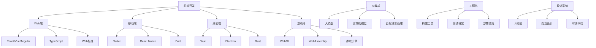

# Refactor 知识体系导航索引

[返回项目根目录](年度技术回顾/README.md)

> 本文档为 Refactor 知识体系的全局导航索引，提供快速定位、学习路径规划和知识关联查询功能。

## 快速导航

### 🎯 按学习目标导航

#### 前端开发入门

- **起点**: [Web端](1.终端类型/1.1 Web端.md)
- **基础**: [Web核心技术](2.技术栈与框架/2.6 Web核心技术.md)
- **语言**: [TypeScript-JavaScript](3.编程语言范式/3.4 TypeScript-JavaScript.md)
- **框架**: [前端主流框架](2.技术栈与框架/2.1 前端主流框架.md)
- **工程化**: [现代前端工程化](2.技术栈与框架/2.7 现代前端工程化.md)

#### 移动端开发

- **起点**: [移动端](1.终端类型/1.2 移动端.md)
- **框架**: [跨端框架](2.技术栈与框架/2.2 跨端框架.md)
- **语言**: [Dart-Flutter](3.编程语言范式/3.5 Dart-Flutter.md)
- **设计**: [UI-UE-UX设计规范](5.技术规范与标准/5.1 UI-UE-UX设计规范.md)

#### 全栈开发

- **起点**: [Rust前端全栈](2.技术栈与框架/2.3 Rust前端全栈.md)
- **语言**: [Rust](3.编程语言范式/3.1 Rust.md)
- **技术**: [WebAssembly](2.技术栈与框架/2.5 WebAssembly.md)
- **工程化**: [现代前端工程化](2.技术栈与框架/2.7 现代前端工程化.md)

#### 函数式编程

- **起点**: [Haskell](3.编程语言范式/3.2 Haskell.md)
- **扩展**: [Scala](3.编程语言范式/3.3 Scala.md)
- **应用**: [Haskell-Scala前端](2.技术栈与框架/2.4 Haskell-Scala前端.md)
- **理论**: [哲学与认知批判性分析](4.设计模式与架构/4.4 哲学与认知批判性分析.md)

#### AI应用开发

- **起点**: [AI基础原理](6.人工智能原理与算法/6.1 AI基础原理.md)
- **实践**: [AI工程实践与伦理](6.人工智能原理与算法/6.4 AI工程实践与伦理.md)
- **集成**: [现代深度学习与大模型](6.人工智能原理与算法/6.3 现代深度学习与大模型.md)
- **前端**: [前端主流框架](2.技术栈与框架/2.1 前端主流框架.md)

### 🏗️ 按技术领域导航

#### 前端技术栈

- **框架生态**: [前端主流框架](2.技术栈与框架/2.1 前端主流框架.md)
- **跨端开发**: [跨端框架](2.技术栈与框架/2.2 跨端框架.md)
- **底层技术**: [Web核心技术](2.技术栈与框架/2.6 Web核心技术.md)
- **工程实践**: [现代前端工程化](2.技术栈与框架/2.7 现代前端工程化.md)

#### 编程语言

- **Web开发**: [TypeScript-JavaScript](3.编程语言范式/3.4 TypeScript-JavaScript.md)
- **系统编程**: [Rust](3.编程语言范式/3.1 Rust.md)
- **函数式**: [Haskell](3.编程语言范式/3.2 Haskell.md) | [Scala](3.编程语言范式/3.3 Scala.md)
- **跨端**: [Dart-Flutter](3.编程语言范式/3.5 Dart-Flutter.md)

#### 架构设计

- **设计模式**: [GoF设计模式](4.设计模式与架构/4.1 GoF设计模式.md)
- **架构模式**: [组件化与架构模式](4.设计模式与架构/4.3 组件化与架构模式.md)
- **模式分类**: [结构型-行为型-创建型模式](4.设计模式与架构/4.2 结构型-行为型-创建型模式.md)
- **认知分析**: [哲学与认知批判性分析](4.设计模式与架构/4.4 哲学与认知批判性分析.md)

#### 规范标准

- **设计规范**: [UI-UE-UX设计规范](5.技术规范与标准/5.1 UI-UE-UX设计规范.md)
- **可访问性**: [可访问性与国际化](5.技术规范与标准/5.2 可访问性与国际化.md)
- **性能优化**: [性能优化与工程实践](5.技术规范与标准/5.3 性能优化与工程实践.md)
- **代码规范**: [代码示例与形式化证明](5.技术规范与标准/5.4 代码示例与形式化证明.md)

#### 人工智能

- **基础理论**: [AI基础原理](6.人工智能原理与算法/6.1 AI基础原理.md)
- **经典算法**: [经典AI算法与模型](6.人工智能原理与算法/6.2 经典AI算法与模型.md)
- **深度学习**: [现代深度学习与大模型](6.人工智能原理与算法/6.3 现代深度学习与大模型.md)
- **工程实践**: [AI工程实践与伦理](6.人工智能原理与算法/6.4 AI工程实践与伦理.md)
- **跨学科**: [AI与哲学](6.人工智能原理与算法/6.5 AI与哲学.md) | [AI与认知科学](6.人工智能原理与算法/6.6 AI与认知科学.md)
- **应用创新**: [AI与艺术与创造力](6.人工智能原理与算法/6.7 AI与艺术与创造力.md) | [AI与社会治理](6.人工智能原理与算法/6.8 AI与社会治理.md)

### 🎨 按应用场景导航

#### Web应用开发

- **技术栈**: [前端主流框架](2.技术栈与框架/2.1 前端主流框架.md) + [TypeScript-JavaScript](3.编程语言范式/3.4 TypeScript-JavaScript.md)
- **工程化**: [现代前端工程化](2.技术栈与框架/2.7 现代前端工程化.md)
- **性能**: [性能优化与工程实践](5.技术规范与标准/5.3 性能优化与工程实践.md)
- **设计**: [UI-UE-UX设计规范](5.技术规范与标准/5.1 UI-UE-UX设计规范.md)

#### 移动应用开发

- **技术栈**: [跨端框架](2.技术栈与框架/2.2 跨端框架.md) + [Dart-Flutter](3.编程语言范式/3.5 Dart-Flutter.md)
- **平台**: [移动端](1.终端类型/1.2 移动端.md)
- **设计**: [UI-UE-UX设计规范](5.技术规范与标准/5.1 UI-UE-UX设计规范.md)
- **可访问性**: [可访问性与国际化](5.技术规范与标准/5.2 可访问性与国际化.md)

#### 桌面应用开发

- **技术栈**: [Rust前端全栈](2.技术栈与框架/2.3 Rust前端全栈.md) + [Rust](3.编程语言范式/3.1 Rust.md)
- **平台**: [桌面端](1.终端类型/1.3 桌面端.md)
- **性能**: [WebAssembly](2.技术栈与框架/2.5 WebAssembly.md)
- **架构**: [组件化与架构模式](4.设计模式与架构/4.3 组件化与架构模式.md)

#### 游戏开发

- **技术栈**: [Web核心技术](2.技术栈与框架/2.6 Web核心技术.md) + [WebAssembly](2.技术栈与框架/2.5 WebAssembly.md)
- **平台**: [游戏端](1.终端类型/1.4 游戏端.md)
- **性能**: [性能优化与工程实践](5.技术规范与标准/5.3 性能优化与工程实践.md)
- **架构**: [GoF设计模式](4.设计模式与架构/4.1 GoF设计模式.md)

#### AI应用集成

- **基础**: [AI基础原理](6.人工智能原理与算法/6.1 AI基础原理.md)
- **模型**: [现代深度学习与大模型](6.人工智能原理与算法/6.3 现代深度学习与大模型.md)
- **工程**: [AI工程实践与伦理](6.人工智能原理与算法/6.4 AI工程实践与伦理.md)
- **前端**: [前端主流框架](2.技术栈与框架/2.1 前端主流框架.md)

## 知识关联图谱

## 学习路径规划

### 🚀 快速入门路径（2-3个月）

1. **第1周**: [Web端](1.终端类型/1.1 Web端.md) + [Web核心技术](2.技术栈与框架/2.6 Web核心技术.md)
2. **第2-4周**: [TypeScript-JavaScript](3.编程语言范式/3.4 TypeScript-JavaScript.md)
3. **第5-8周**: [前端主流框架](2.技术栈与框架/2.1 前端主流框架.md)
4. **第9-12周**: [现代前端工程化](2.技术栈与框架/2.7 现代前端工程化.md)

### 🎯 专业发展路径（6-12个月）

1. **基础阶段**: 快速入门路径
2. **进阶阶段**: [性能优化与工程实践](5.技术规范与标准/5.3 性能优化与工程实践.md) + [组件化与架构模式](4.设计模式与架构/4.3 组件化与架构模式.md)
3. **专业阶段**: [GoF设计模式](4.设计模式与架构/4.1 GoF设计模式.md) + [可访问性与国际化](5.技术规范与标准/5.2 可访问性与国际化.md)
4. **专家阶段**: [Rust前端全栈](2.技术栈与框架/2.3 Rust前端全栈.md) + [WebAssembly](2.技术栈与框架/2.5 WebAssembly.md)

### 🌟 创新探索路径（持续学习）

1. **AI方向**: [AI基础原理](6.人工智能原理与算法/6.1 AI基础原理.md) → [现代深度学习与大模型](6.人工智能原理与算法/6.3 现代深度学习与大模型.md)
2. **函数式方向**: [Haskell](3.编程语言范式/3.2 Haskell.md) → [Haskell-Scala前端](2.技术栈与框架/2.4 Haskell-Scala前端.md)
3. **跨端方向**: [跨端框架](2.技术栈与框架/2.2 跨端框架.md) → [Dart-Flutter](3.编程语言范式/3.5 Dart-Flutter.md)
4. **哲学方向**: [哲学与认知批判性分析](4.设计模式与架构/4.4 哲学与认知批判性分析.md) → [AI与哲学](6.人工智能原理与算法/6.5 AI与哲学.md)

## 技术选型指南

### 企业级应用

- **推荐技术栈**: React + TypeScript + Next.js
- **相关文档**: [前端主流框架](2.技术栈与框架/2.1 前端主流框架.md) + [TypeScript-JavaScript](3.编程语言范式/3.4 TypeScript-JavaScript.md)
- **工程化**: [现代前端工程化](2.技术栈与框架/2.7 现代前端工程化.md)
- **规范**: [UI-UE-UX设计规范](5.技术规范与标准/5.1 UI-UE-UX设计规范.md)

### 移动应用

- **推荐技术栈**: Flutter + Dart
- **相关文档**: [跨端框架](2.技术栈与框架/2.2 跨端框架.md) + [Dart-Flutter](3.编程语言范式/3.5 Dart-Flutter.md)
- **平台**: [移动端](1.终端类型/1.2 移动端.md)
- **设计**: [UI-UE-UX设计规范](5.技术规范与标准/5.1 UI-UE-UX设计规范.md)

### 高性能应用

- **推荐技术栈**: Rust + WebAssembly + Tauri
- **相关文档**: [Rust前端全栈](2.技术栈与框架/2.3 Rust前端全栈.md) + [WebAssembly](2.技术栈与框架/2.5 WebAssembly.md)
- **语言**: [Rust](3.编程语言范式/3.1 Rust.md)
- **性能**: [性能优化与工程实践](5.技术规范与标准/5.3 性能优化与工程实践.md)

### AI驱动应用

- **推荐技术栈**: React + TypeScript + AI API
- **相关文档**: [AI工程实践与伦理](6.人工智能原理与算法/6.4 AI工程实践与伦理.md) + [现代深度学习与大模型](6.人工智能原理与算法/6.3 现代深度学习与大模型.md)
- **前端**: [前端主流框架](2.技术栈与框架/2.1 前端主流框架.md)
- **集成**: [AI基础原理](6.人工智能原理与算法/6.1 AI基础原理.md)

## 常见问题快速定位

### 技术问题

- **性能优化**: [性能优化与工程实践](5.技术规范与标准/5.3 性能优化与工程实践.md)
- **代码规范**: [代码示例与形式化证明](5.技术规范与标准/5.4 代码示例与形式化证明.md)
- **架构设计**: [组件化与架构模式](4.设计模式与架构/4.3 组件化与架构模式.md)
- **设计模式**: [GoF设计模式](4.设计模式与架构/4.1 GoF设计模式.md)

### 设计问题

- **UI设计**: [UI-UE-UX设计规范](5.技术规范与标准/5.1 UI-UE-UX设计规范.md)
- **可访问性**: [可访问性与国际化](5.技术规范与标准/5.2 可访问性与国际化.md)
- **交互设计**: [哲学与认知批判性分析](4.设计模式与架构/4.4 哲学与认知批判性分析.md)

### 工程问题

- **构建部署**: [现代前端工程化](2.技术栈与框架/2.7 现代前端工程化.md)
- **测试策略**: [代码示例与形式化证明](5.技术规范与标准/5.4 代码示例与形式化证明.md)
- **质量保证**: [性能优化与工程实践](5.技术规范与标准/5.3 性能优化与工程实践.md)

### AI相关问题

- **AI集成**: [AI工程实践与伦理](6.人工智能原理与算法/6.4 AI工程实践与伦理.md)
- **模型选择**: [现代深度学习与大模型](6.人工智能原理与算法/6.3 现代深度学习与大模型.md)
- **伦理问题**: [AI与哲学](6.人工智能原理与算法/6.5 AI与哲学.md)

---

> 本导航索引持续更新，欢迎根据学习需求和技术发展补充新的路径和关联。
