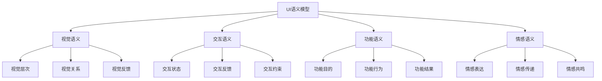

# UI语义模型

## 目录

- [UI语义模型](#ui语义模型)
- [理论基础](#理论基础)
- [核心概念](#核心概念)
- [语义域定义](#语义域定义)
- [语义映射关系](#语义映射关系)
- [形式化表示](#形式化表示)
- [应用实例](#应用实例)
- [发展趋势](#发展趋势)

## 理论基础

### UI语义模型的认知基础

UI语义模型建立在人类认知心理学和视觉感知理论的基础上：

1. **格式塔心理学原理**
   - 相似性（Similarity）：相似元素被感知为组
   - 接近性（Proximity）：接近元素被感知为相关
   - 连续性（Continuity）：连续元素被感知为整体
   - 闭合性（Closure）：不完整图形被感知为完整

2. **视觉层次理论**
   - 视觉权重（Visual Weight）
   - 视觉流向（Visual Flow）
   - 视觉焦点（Visual Focus）
   - 视觉平衡（Visual Balance）

3. **交互设计理论**
   - 可用性（Usability）
   - 可访问性（Accessibility）
   - 用户体验（User Experience）
   - 情感设计（Emotional Design）

### UI语义模型的核心特征



## 核心概念

### 1. UI元素语义（UI Element Semantics）

UI元素语义定义了界面元素的基本语义属性和行为。

**形式化定义：**

```
UIElement = {
  id: String,
  type: ElementType,
  visual: VisualSemantics,
  interaction: InteractionSemantics,
  functional: FunctionalSemantics,
  emotional: EmotionalSemantics
}
```

### 2. 视觉语义（Visual Semantics）

视觉语义描述了UI元素的视觉特性和视觉关系。

**形式化定义：**

```
VisualSemantics = {
  appearance: Appearance,
  layout: Layout,
  hierarchy: Hierarchy,
  relationship: VisualRelationship
}
```

### 3. 交互语义（Interaction Semantics）

交互语义定义了UI元素的交互行为和反馈机制。

**形式化定义：**

```
InteractionSemantics = {
  states: Set<State>,
  events: Set<Event>,
  feedback: Set<Feedback>,
  constraints: Set<Constraint>
}
```

### 4. 功能语义（Functional Semantics）

功能语义描述了UI元素的功能目的和行为结果。

**形式化定义：**

```
FunctionalSemantics = {
  purpose: Purpose,
  behavior: Behavior,
  outcome: Outcome,
  context: Context
}
```

### 5. 情感语义（Emotional Semantics）

情感语义定义了UI元素的情感表达和情感传递。

**形式化定义：**

```
EmotionalSemantics = {
  expression: Expression,
  mood: Mood,
  personality: Personality,
  resonance: Resonance
}
```

## 语义域定义

### 1. 基础UI语义域

#### 按钮语义域（Button Semantic Domain）

```
ButtonSemantics = {
  concepts: {Clickable, Interactive, Trigger},
  relations: {Triggers, RespondsTo, ProvidesFeedback},
  constraints: {MustBeVisible, MustBeAccessible, MustProvideFeedback},
  operations: {Click, Hover, Focus, Disable}
}
```

#### 输入框语义域（Input Semantic Domain）

```
InputSemantics = {
  concepts: {Editable, Validatable, Submittable},
  relations: {AcceptsInput, ValidatesInput, SubmitsData},
  constraints: {MustValidate, MustProvideFeedback, MustBeSecure},
  operations: {Type, Validate, Submit, Clear}
}
```

#### 导航语义域（Navigation Semantic Domain）

```
NavigationSemantics = {
  concepts: {Navigable, Hierarchical, Contextual},
  relations: {LeadsTo, BelongsTo, ProvidesContext},
  constraints: {MustBeConsistent, MustBeAccessible, MustProvideBreadcrumb},
  operations: {Navigate, GoBack, GoForward, JumpTo}
}
```

### 2. 复合UI语义域

#### 表单语义域（Form Semantic Domain）

```
FormSemantics = {
  concepts: {Collective, Validatable, Submittable},
  relations: {Contains, Validates, Submits},
  constraints: {MustValidateAll, MustProvideProgress, MustHandleErrors},
  operations: {Validate, Submit, Reset, Save}
}
```

#### 列表语义域（List Semantic Domain）

```
ListSemantics = {
  concepts: {Collection, Sortable, Filterable},
  relations: {Contains, Orders, Filters},
  constraints: {MustBeScrollable, MustBeSearchable, MustBeAccessible},
  operations: {Sort, Filter, Search, Select}
}
```

#### 模态框语义域（Modal Semantic Domain）

```
ModalSemantics = {
  concepts: {Overlay, Focused, Dismissible},
  relations: {Overlays, Focuses, Dismisses},
  constraints: {MustBeDismissible, MustBeAccessible, MustPreserveContext},
  operations: {Show, Hide, Confirm, Cancel}
}
```

## 语义映射关系

### 1. 视觉到功能映射

```
VisualToFunctional: VisualSemantics → FunctionalSemantics
```

**映射规则：**

- 视觉层次 → 功能重要性
- 视觉关系 → 功能关系
- 视觉反馈 → 功能反馈

### 2. 交互到情感映射

```
InteractionToEmotional: InteractionSemantics → EmotionalSemantics
```

**映射规则：**

- 交互流畅性 → 情感愉悦度
- 交互反馈 → 情感满足度
- 交互约束 → 情感安全感

### 3. 功能到业务映射

```
FunctionalToBusiness: FunctionalSemantics → BusinessSemantics
```

**映射规则：**

- 功能目的 → 业务目标
- 功能行为 → 业务流程
- 功能结果 → 业务价值

## 形式化表示

### 1. 类型系统

```
UIElementType ::= 
  | Button
  | Input
  | Navigation
  | Form
  | List
  | Modal
  | Custom ElementType

SemanticType ::=
  | VisualSemanticType
  | InteractionSemanticType
  | FunctionalSemanticType
  | EmotionalSemanticType
```

### 2. 语义推理规则

#### 视觉语义推理

```
VisualHierarchy(e1, e2) ∧ VisualWeight(e1) > VisualWeight(e2) 
  → FunctionalImportance(e1) > FunctionalImportance(e2)
```

#### 交互语义推理

```
InteractiveState(e, "hover") ∧ ProvidesFeedback(e, "visual") 
  → EmotionalResponse(e, "engagement")
```

#### 功能语义推理

```
FunctionalPurpose(e, "submit") ∧ ValidatesInput(e, true) 
  → BusinessProcess(e, "data_validation")
```

### 3. 语义组合算子

#### 视觉组合

```
VisualCompose: VisualSemantics × VisualSemantics → VisualSemantics
```

#### 交互组合

```
InteractionCompose: InteractionSemantics × InteractionSemantics → InteractionSemantics
```

#### 功能组合

```
FunctionalCompose: FunctionalSemantics × FunctionalSemantics → FunctionalSemantics
```

## 应用实例

### 1. 按钮组件语义化

```typescript
interface ButtonSemantics {
  // 视觉语义
  visual: {
    appearance: {
      primary: boolean;
      size: 'small' | 'medium' | 'large';
      variant: 'solid' | 'outline' | 'ghost';
    };
    layout: {
      position: 'inline' | 'block' | 'floating';
      alignment: 'left' | 'center' | 'right';
    };
    hierarchy: {
      importance: 'primary' | 'secondary' | 'tertiary';
      emphasis: number; // 0-1
    };
  };
  
  // 交互语义
  interaction: {
    states: ['default', 'hover', 'active', 'disabled'];
    events: ['click', 'focus', 'blur'];
    feedback: ['visual', 'haptic', 'audio'];
    constraints: ['mustBeAccessible', 'mustProvideFeedback'];
  };
  
  // 功能语义
  functional: {
    purpose: 'submit' | 'cancel' | 'navigate' | 'trigger';
    behavior: 'immediate' | 'delayed' | 'conditional';
    outcome: 'success' | 'error' | 'pending';
    context: 'form' | 'navigation' | 'action';
  };
  
  // 情感语义
  emotional: {
    expression: 'confident' | 'friendly' | 'professional';
    mood: 'positive' | 'neutral' | 'negative';
    personality: 'bold' | 'subtle' | 'playful';
  };
}
```

### 2. 表单语义化

```typescript
interface FormSemantics {
  // 视觉语义
  visual: {
    layout: 'vertical' | 'horizontal' | 'grid';
    grouping: 'logical' | 'visual' | 'functional';
    progress: 'linear' | 'step' | 'none';
  };
  
  // 交互语义
  interaction: {
    validation: 'real-time' | 'on-blur' | 'on-submit';
    feedback: 'inline' | 'summary' | 'modal';
    submission: 'single' | 'multi-step' | 'auto-save';
  };
  
  // 功能语义
  functional: {
    purpose: 'data-collection' | 'configuration' | 'search';
    validation: 'client-side' | 'server-side' | 'hybrid';
    submission: 'synchronous' | 'asynchronous' | 'batch';
  };
}
```

### 3. 导航语义化

```typescript
interface NavigationSemantics {
  // 视觉语义
  visual: {
    type: 'horizontal' | 'vertical' | 'breadcrumb' | 'tabs';
    hierarchy: 'flat' | 'nested' | 'tree';
    indicators: 'active' | 'visited' | 'current';
  };
  
  // 交互语义
  interaction: {
    behavior: 'push' | 'replace' | 'modal' | 'external';
    feedback: 'immediate' | 'loading' | 'transition';
    accessibility: 'keyboard' | 'screen-reader' | 'voice';
  };
  
  // 功能语义
  functional: {
    purpose: 'primary' | 'secondary' | 'contextual' | 'utility';
    scope: 'global' | 'local' | 'contextual';
    persistence: 'session' | 'local' | 'none';
  };
}
```

## 发展趋势

### 1. 自适应语义

- 根据用户行为和偏好自动调整语义
- 基于上下文动态改变语义表达
- 支持个性化语义定制

### 2. 多模态语义

- 支持语音、手势、眼动等多种交互模态
- 跨模态语义映射和转换
- 多模态语义融合和协调

### 3. 智能语义推理

- 基于AI的语义理解和生成
- 智能语义优化和推荐
- 自动语义验证和纠错

### 4. 语义标准化

- 建立统一的UI语义标准
- 定义语义模型的交换格式
- 制定语义验证和测试规范

---

## 子目录结构

- [1.1 基础UI语义](./1.1 基础UI语义.md)
- [1.2 复合UI语义](./1.2 复合UI语义.md)
- [1.3 自适应UI语义](./1.3 自适应UI语义.md)
- [1.4 多模态UI语义](./1.4 多模态UI语义.md)
- [1.5 UI语义工具](./1.5 UI语义工具.md)

> UI语义模型作为语义模型体系的基础层，为上层架构语义模型和应用语义模型提供了坚实的理论基础和实践指导。
