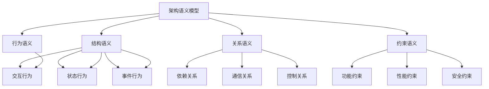

# 架构语义模型

## 目录
- [架构语义模型](#架构语义模型)
- [理论基础](#理论基础)
- [核心概念](#核心概念)
- [语义域定义](#语义域定义)
- [语义映射关系](#语义映射关系)
- [形式化表示](#形式化表示)
- [应用实例](#应用实例)
- [发展趋势](#发展趋势)

## 理论基础

### 架构语义模型的系统理论基础
架构语义模型建立在系统论、信息论和控制论的基础上：

1. **系统论原理**
   - 整体性（Holism）：系统整体大于部分之和
   - 层次性（Hierarchy）：系统具有多层次结构
   - 涌现性（Emergence）：高层次特性从低层次涌现
   - 自组织性（Self-organization）：系统具有自组织能力

2. **信息论原理**
   - 信息熵（Information Entropy）
   - 信息流（Information Flow）
   - 信息编码（Information Encoding）
   - 信息解码（Information Decoding）

3. **控制论原理**
   - 反馈机制（Feedback Mechanism）
   - 负反馈（Negative Feedback）
   - 正反馈（Positive Feedback）
   - 自适应控制（Adaptive Control）

### 架构语义模型的核心特征



## 核心概念

### 1. 架构组件语义（Architecture Component Semantics）
架构组件语义定义了系统组件的基本语义属性和行为。

**形式化定义：**
```
ArchitectureComponent = {
  id: String,
  type: ComponentType,
  structure: StructuralSemantics,
  behavior: BehavioralSemantics,
  interface: InterfaceSemantics,
  constraints: ConstraintSemantics
}
```

### 2. 结构语义（Structural Semantics）
结构语义描述了系统架构的结构特性和组织关系。

**形式化定义：**
```
StructuralSemantics = {
  composition: Composition,
  hierarchy: Hierarchy,
  topology: Topology,
  coupling: Coupling
}
```

### 3. 行为语义（Behavioral Semantics）
行为语义定义了系统架构的行为模式和交互机制。

**形式化定义：**
```
BehavioralSemantics = {
  states: Set<State>,
  transitions: Set<Transition>,
  events: Set<Event>,
  actions: Set<Action>
}
```

### 4. 关系语义（Relational Semantics）
关系语义描述了系统组件之间的关系和交互模式。

**形式化定义：**
```
RelationalSemantics = {
  dependencies: Set<Dependency>,
  communications: Set<Communication>,
  controls: Set<Control>,
  associations: Set<Association>
}
```

### 5. 约束语义（Constraint Semantics）
约束语义定义了系统架构的约束条件和限制规则。

**形式化定义：**
```
ConstraintSemantics = {
  functional: Set<FunctionalConstraint>,
  performance: Set<PerformanceConstraint>,
  security: Set<SecurityConstraint>,
  quality: Set<QualityConstraint>
}
```

## 语义域定义

### 1. 基础架构语义域

#### MVC语义域（MVC Semantic Domain）
```
MVCSemantics = {
  concepts: {Model, View, Controller, Separation},
  relations: {Updates, Observes, Controls, Separates},
  constraints: {MustSeparateConcerns, MustMaintainConsistency, MustSupportReuse},
  operations: {Update, Notify, Handle, Render}
}
```

#### MVVM语义域（MVVM Semantic Domain）
```
MVVMSemantics = {
  concepts: {Model, View, ViewModel, Binding},
  relations: {Binds, Updates, Synchronizes, Transforms},
  constraints: {MustBindData, MustSynchronizeState, MustSupportTesting},
  operations: {Bind, Update, Transform, Validate}
}
```

#### Flux语义域（Flux Semantic Domain）
```
FluxSemantics = {
  concepts: {Action, Dispatcher, Store, View},
  relations: {Dispatches, Updates, Renders, Observes},
  constraints: {MustUnidirectionalFlow, MustCentralizedState, MustPredictableState},
  operations: {Dispatch, Update, Render, Subscribe}
}
```

### 2. 复合架构语义域

#### 微服务语义域（Microservice Semantic Domain）
```
MicroserviceSemantics = {
  concepts: {Service, API, Gateway, Registry},
  relations: {Communicates, Routes, Discovers, Loads},
  constraints: {MustBeIndependent, MustBeResilient, MustBeScalable},
  operations: {Deploy, Scale, Monitor, Update}
}
```

#### 事件驱动语义域（Event-Driven Semantic Domain）
```
EventDrivenSemantics = {
  concepts: {Event, Producer, Consumer, Broker},
  relations: {Publishes, Subscribes, Routes, Processes},
  constraints: {MustBeAsynchronous, MustBeReliable, MustBeScalable},
  operations: {Publish, Subscribe, Process, Acknowledge}
}
```

#### 分层架构语义域（Layered Semantic Domain）
```
LayeredSemantics = {
  concepts: {Layer, Interface, Abstraction, Encapsulation},
  relations: {DependsOn, Provides, Uses, Hides},
  constraints: {MustBeLayered, MustBeEncapsulated, MustBeModular},
  operations: {Call, Return, Pass, Transform}
}
```

## 语义映射关系

### 1. 结构到行为映射
```
StructuralToBehavioral: StructuralSemantics → BehavioralSemantics
```

**映射规则：**
- 组件结构 → 交互行为
- 层次结构 → 状态行为
- 拓扑结构 → 事件行为

### 2. 行为到关系映射
```
BehavioralToRelational: BehavioralSemantics → RelationalSemantics
```

**映射规则：**
- 状态转换 → 依赖关系
- 事件处理 → 通信关系
- 动作执行 → 控制关系

### 3. 关系到约束映射
```
RelationalToConstraint: RelationalSemantics → ConstraintSemantics
```

**映射规则：**
- 依赖关系 → 功能约束
- 通信关系 → 性能约束
- 控制关系 → 安全约束

## 形式化表示

### 1. 类型系统
```
ArchitectureType ::= 
  | MVC
  | MVVM
  | Flux
  | Microservice
  | EventDriven
  | Layered
  | Custom ArchitectureType

ComponentType ::=
  | Model
  | View
  | Controller
  | Service
  | Gateway
  | Custom ComponentType

SemanticType ::=
  | StructuralSemanticType
  | BehavioralSemanticType
  | RelationalSemanticType
  | ConstraintSemanticType
```

### 2. 语义推理规则

#### 结构语义推理
```
ComponentStructure(c1, c2) ∧ HierarchicalLevel(c1) > HierarchicalLevel(c2) 
  → DependencyDirection(c1, c2, "upward")
```

#### 行为语义推理
```
StateTransition(s1, s2) ∧ EventTrigger(e, s1) 
  → ActionExecution(a, s2)
```

#### 关系语义推理
```
CommunicationRelation(c1, c2) ∧ InterfaceCompatible(i1, i2) 
  → MessageExchange(m, c1, c2)
```

### 3. 语义组合算子

#### 结构组合
```
StructuralCompose: StructuralSemantics × StructuralSemantics → StructuralSemantics
```

#### 行为组合
```
BehavioralCompose: BehavioralSemantics × BehavioralSemantics → BehavioralSemantics
```

#### 关系组合
```
RelationalCompose: RelationalSemantics × RelationalSemantics → RelationalSemantics
```

## 应用实例

### 1. React组件架构语义化

```typescript
interface ReactComponentSemantics {
  // 结构语义
  structure: {
    composition: {
      type: 'functional' | 'class' | 'hook';
      props: Set<string>;
      state: Set<string>;
      context: Set<string>;
    };
    hierarchy: {
      parent: string | null;
      children: Set<string>;
      depth: number;
    };
    coupling: {
      dependencies: Set<string>;
      imports: Set<string>;
      exports: Set<string>;
    };
  };
  
  // 行为语义
  behavior: {
    states: ['mounting', 'mounted', 'updating', 'unmounting'];
    transitions: [
      { from: 'mounting', to: 'mounted', trigger: 'componentDidMount' },
      { from: 'mounted', to: 'updating', trigger: 'setState' },
      { from: 'updating', to: 'mounted', trigger: 'componentDidUpdate' }
    ];
    events: ['onClick', 'onChange', 'onSubmit', 'onError'];
    actions: ['render', 'update', 're-render', 'cleanup'];
  };
  
  // 关系语义
  relations: {
    dependencies: {
      props: Set<string>;
      state: Set<string>;
      context: Set<string>;
    };
    communications: {
      parentToChild: 'props';
      childToParent: 'callbacks';
      siblingToSibling: 'context';
    };
    controls: {
      lifecycle: 'React';
      state: 'component';
      rendering: 'React';
    };
  };
  
  // 约束语义
  constraints: {
    functional: [
      'propsMustBeReadOnly',
      'stateMustBeMutable',
      'renderMustBePure'
    ];
    performance: [
      'shouldComponentUpdate',
      'React.memo',
      'useMemo'
    ];
    security: [
      'sanitizeProps',
      'validateInput',
      'preventXSS'
    ];
  };
}
```

### 2. Redux状态管理语义化

```typescript
interface ReduxSemantics {
  // 结构语义
  structure: {
    composition: {
      store: 'centralized';
      reducers: 'pure functions';
      actions: 'plain objects';
      middleware: 'enhancers';
    };
    hierarchy: {
      store: 'root';
      reducers: 'branches';
      selectors: 'leaves';
    };
    coupling: {
      loose: 'actions';
      tight: 'reducers';
      flexible: 'middleware';
    };
  };
  
  // 行为语义
  behavior: {
    states: ['initial', 'loading', 'success', 'error'];
    transitions: [
      { from: 'initial', to: 'loading', action: 'REQUEST_DATA' },
      { from: 'loading', to: 'success', action: 'RECEIVE_DATA' },
      { from: 'loading', to: 'error', action: 'RECEIVE_ERROR' }
    ];
    events: ['dispatch', 'subscribe', 'getState', 'replaceReducer'];
    actions: ['dispatch', 'subscribe', 'unsubscribe', 'replaceReducer'];
  };
  
  // 关系语义
  relations: {
    dependencies: {
      store: 'reducers';
      components: 'store';
      middleware: 'actions';
    };
    communications: {
      unidirectional: 'data flow';
      synchronous: 'state updates';
      predictable: 'state changes';
    };
    controls: {
      immutable: 'state';
      pure: 'reducers';
      serializable: 'actions';
    };
  };
  
  // 约束语义
  constraints: {
    functional: [
      'stateMustBeImmutable',
      'reducersMustBePure',
      'actionsMustBeSerializable'
    ];
    performance: [
      'selectiveUpdates',
      'memoizedSelectors',
      'normalizedState'
    ];
    security: [
      'actionValidation',
      'stateSanitization',
      'middlewareSecurity'
    ];
  };
}
```

### 3. 微服务架构语义化

```typescript
interface MicroserviceSemantics {
  // 结构语义
  structure: {
    composition: {
      services: 'independent';
      apis: 'contracts';
      gateways: 'routing';
      registries: 'discovery';
    };
    hierarchy: {
      gateway: 'entry point';
      services: 'business logic';
      databases: 'data storage';
    };
    coupling: {
      loose: 'service coupling';
      tight: 'internal coupling';
      flexible: 'api contracts';
    };
  };
  
  // 行为语义
  behavior: {
    states: ['healthy', 'degraded', 'unhealthy', 'starting'];
    transitions: [
      { from: 'starting', to: 'healthy', condition: 'service ready' },
      { from: 'healthy', to: 'degraded', condition: 'partial failure' },
      { from: 'degraded', to: 'unhealthy', condition: 'complete failure' }
    ];
    events: ['service discovery', 'health check', 'load balancing', 'circuit breaker'];
    actions: ['deploy', 'scale', 'monitor', 'update'];
  };
  
  // 关系语义
  relations: {
    dependencies: {
      serviceToService: 'api calls';
      serviceToDatabase: 'data access';
      serviceToGateway: 'routing';
    };
    communications: {
      synchronous: 'http requests';
      asynchronous: 'message queues';
      eventDriven: 'event streams';
    };
    controls: {
      distributed: 'service governance';
      centralized: 'api gateway';
      decentralized: 'service mesh';
    };
  };
  
  // 约束语义
  constraints: {
    functional: [
      'serviceIndependence',
      'apiContracts',
      'dataConsistency'
    ];
    performance: [
      'latencyRequirements',
      'throughputRequirements',
      'scalabilityRequirements'
    ];
    security: [
      'authentication',
      'authorization',
      'encryption'
    ];
  };
}
```

## 发展趋势

### 1. 自适应架构
- 根据负载和性能自动调整架构
- 基于业务需求动态重构架构
- 支持智能架构优化

### 2. 事件驱动架构
- 支持异步事件处理
- 实现松耦合系统设计
- 提供可扩展的事件流

### 3. 云原生架构
- 支持容器化部署
- 实现微服务架构
- 提供弹性伸缩能力

### 4. 智能架构
- 基于AI的架构优化
- 智能故障检测和恢复
- 自动化架构决策

---

## 子目录结构

- [2.1 设计模式语义](./2.1 设计模式语义.md)
- [2.2 架构模式语义](./2.2 架构模式语义.md)
- [2.3 组件语义](./2.3 组件语义.md)
- [2.4 集成语义](./2.4 集成语义.md)
- [2.5 架构语义工具](./2.5 架构语义工具.md)

> 架构语义模型作为语义模型体系的核心层，为上层应用语义模型提供了结构化的理论基础和实践指导。 