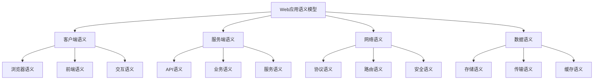

# Web应用语义模型

## 目录

- [Web应用语义模型](#web应用语义模型)
- [理论基础](#理论基础)
- [核心概念](#核心概念)
- [语义域定义](#语义域定义)
- [语义映射关系](#语义映射关系)
- [形式化表示](#形式化表示)
- [应用实例](#应用实例)
- [发展趋势](#发展趋势)

## 理论基础

### Web应用语义模型的网络理论基础

Web应用语义模型建立在网络理论、分布式系统和Web技术的基础上：

1. **网络理论原理**
   - 网络拓扑（Network Topology）
   - 网络协议（Network Protocol）
   - 网络路由（Network Routing）
   - 网络负载均衡（Network Load Balancing）

2. **分布式系统原理**
   - 分布式一致性（Distributed Consistency）
   - 分布式事务（Distributed Transaction）
   - 分布式缓存（Distributed Caching）
   - 分布式消息（Distributed Messaging）

3. **Web技术原理**
   - HTTP协议（HTTP Protocol）
   - REST架构（REST Architecture）
   - WebSocket通信（WebSocket Communication）
   - 浏览器渲染（Browser Rendering）

### Web应用语义模型的核心特征



## 核心概念

### 1. Web应用语义（Web Application Semantics）

Web应用语义定义了Web应用的基本语义属性和行为。

**形式化定义：**

```
WebApplication = {
  id: String,
  type: ApplicationType,
  client: ClientSemantics,
  server: ServerSemantics,
  network: NetworkSemantics,
  data: DataSemantics
}
```

### 2. 客户端语义（Client Semantics）

客户端语义描述了Web应用客户端的特性和行为。

**形式化定义：**

```
ClientSemantics = {
  browser: BrowserSemantics,
  frontend: FrontendSemantics,
  interaction: InteractionSemantics,
  state: StateSemantics
}
```

### 3. 服务端语义（Server Semantics）

服务端语义定义了Web应用服务端的特性和行为。

**形式化定义：**

```
ServerSemantics = {
  api: APISemantics,
  business: BusinessSemantics,
  service: ServiceSemantics,
  security: SecuritySemantics
}
```

### 4. 网络语义（Network Semantics）

网络语义描述了Web应用网络通信的特性和行为。

**形式化定义：**

```
NetworkSemantics = {
  protocol: ProtocolSemantics,
  routing: RoutingSemantics,
  security: SecuritySemantics,
  performance: PerformanceSemantics
}
```

### 5. 数据语义（Data Semantics）

数据语义定义了Web应用数据的特性和行为。

**形式化定义：**

```
DataSemantics = {
  storage: StorageSemantics,
  transmission: TransmissionSemantics,
  caching: CachingSemantics,
  validation: ValidationSemantics
}
```

## 语义域定义

### 1. 基础Web应用语义域

#### SPA语义域（Single Page Application Semantic Domain）

```
SPASemantics = {
  concepts: {Client, Router, State, Component},
  relations: {Routes, Manages, Renders, Updates},
  constraints: {MustBeResponsive, MustBeAccessible, MustBeSEO},
  operations: {Navigate, Update, Render, Cache}
}
```

#### SSR语义域（Server Side Rendering Semantic Domain）

```
SSRSemantics = {
  concepts: {Server, Template, Hydration, SEO},
  relations: {Renders, Serves, Hydrates, Optimizes},
  constraints: {MustBeFast, MustBeSEO, MustBeAccessible},
  operations: {Render, Serve, Hydrate, Optimize}
}
```

#### API语义域（API Semantic Domain）

```
APISemantics = {
  concepts: {Endpoint, Method, Response, Authentication},
  relations: {Accepts, Returns, Validates, Authorizes},
  constraints: {MustBeRESTful, MustBeSecure, MustBeDocumented},
  operations: {GET, POST, PUT, DELETE}
}
```

### 2. 复合Web应用语义域

#### 微前端语义域（Micro Frontend Semantic Domain）

```
MicroFrontendSemantics = {
  concepts: {Module, Federation, Integration, Isolation},
  relations: {Composes, Integrates, Isolates, Communicates},
  constraints: {MustBeIndependent, MustBeComposable, MustBeIsolated},
  operations: {Compose, Integrate, Isolate, Communicate}
}
```

#### PWA语义域（Progressive Web App Semantic Domain）

```
PWASemantics = {
  concepts: {ServiceWorker, Manifest, Offline, Installable},
  relations: {Caches, Serves, Updates, Installs},
  constraints: {MustBeOffline, MustBeInstallable, MustBeResponsive},
  operations: {Cache, Serve, Update, Install}
}
```

#### JAMstack语义域（JAMstack Semantic Domain）

```
JAMstackSemantics = {
  concepts: {JavaScript, API, Markup, Prebuild},
  relations: {Generates, Serves, Updates, Optimizes},
  constraints: {MustBePrebuilt, MustBeCDN, MustBeSecure},
  operations: {Build, Deploy, Serve, Update}
}
```

## 语义映射关系

### 1. 客户端到服务端映射

```
ClientToServer: ClientSemantics → ServerSemantics
```

**映射规则：**

- 前端状态 → 后端状态
- 用户交互 → API调用
- 客户端路由 → 服务端路由

### 2. 服务端到网络映射

```
ServerToNetwork: ServerSemantics → NetworkSemantics
```

**映射规则：**

- API端点 → 网络路由
- 业务逻辑 → 网络协议
- 安全策略 → 网络安全

### 3. 网络到数据映射

```
NetworkToData: NetworkSemantics → DataSemantics
```

**映射规则：**

- 网络传输 → 数据传输
- 网络缓存 → 数据缓存
- 网络安全 → 数据安全

## 形式化表示

### 1. 类型系统

```
WebApplicationType ::= 
  | SPA
  | SSR
  | PWA
  | MicroFrontend
  | JAMstack
  | Custom ApplicationType

ClientType ::=
  | Browser
  | Mobile
  | Desktop
  | Custom ClientType

ServerType ::=
  | API
  | SSR
  | Microservice
  | Custom ServerType

SemanticType ::=
  | ClientSemanticType
  | ServerSemanticType
  | NetworkSemanticType
  | DataSemanticType
```

### 2. 语义推理规则

#### 客户端语义推理

```
ClientState(s1) ∧ UserInteraction(i) ∧ APIEndpoint(e) 
  → ServerRequest(r, e, s1)
```

#### 服务端语义推理

```
ServerRequest(r) ∧ BusinessLogic(l) ∧ DatabaseQuery(q) 
  → ServerResponse(res, r, l, q)
```

#### 网络语义推理

```
NetworkRequest(req) ∧ Protocol(p) ∧ SecurityPolicy(sp) 
  → NetworkResponse(res, req, p, sp)
```

### 3. 语义组合算子

#### 客户端组合

```
ClientCompose: ClientSemantics × ClientSemantics → ClientSemantics
```

#### 服务端组合

```
ServerCompose: ServerSemantics × ServerSemantics → ServerSemantics
```

#### 网络组合

```
NetworkCompose: NetworkSemantics × NetworkSemantics → NetworkSemantics
```

## 应用实例

### 1. React SPA语义化

```typescript
interface ReactSPASemantics {
  // 客户端语义
  client: {
    browser: {
      rendering: 'virtual DOM';
      hydration: 'client-side';
      routing: 'client-side';
    };
    frontend: {
      framework: 'React';
      state: 'Redux/Zustand';
      routing: 'React Router';
    };
    interaction: {
      events: ['click', 'change', 'submit'];
      feedback: ['loading', 'success', 'error'];
      accessibility: ['keyboard', 'screen-reader'];
    };
    state: {
      local: 'component state';
      global: 'application state';
      persistent: 'localStorage';
    };
  };
  
  // 服务端语义
  server: {
    api: {
      protocol: 'REST/GraphQL';
      authentication: 'JWT/OAuth';
      authorization: 'RBAC';
    };
    business: {
      logic: 'server-side';
      validation: 'server-side';
      processing: 'server-side';
    };
    service: {
      architecture: 'microservices';
      communication: 'HTTP/gRPC';
      discovery: 'service registry';
    };
    security: {
      authentication: 'multi-factor';
      authorization: 'role-based';
      encryption: 'TLS/HTTPS';
    };
  };
  
  // 网络语义
  network: {
    protocol: {
      http: 'HTTP/2';
      websocket: 'WebSocket';
      sse: 'Server-Sent Events';
    };
    routing: {
      client: 'React Router';
      server: 'API Gateway';
      cdn: 'CDN';
    };
    security: {
      cors: 'Cross-Origin';
      csp: 'Content Security Policy';
      hsts: 'HTTP Strict Transport Security';
    };
    performance: {
      caching: 'browser cache';
      compression: 'gzip/brotli';
      optimization: 'code splitting';
    };
  };
  
  // 数据语义
  data: {
    storage: {
      client: 'localStorage/sessionStorage';
      server: 'database/cache';
      cdn: 'static assets';
    };
    transmission: {
      format: 'JSON/GraphQL';
      compression: 'gzip/brotli';
      encryption: 'TLS/HTTPS';
    };
    caching: {
      browser: 'HTTP cache';
      application: 'memory cache';
      cdn: 'edge cache';
    };
    validation: {
      client: 'form validation';
      server: 'API validation';
      schema: 'JSON Schema';
    };
  };
}
```

### 2. Next.js SSR语义化

```typescript
interface NextJSSSRSemantics {
  // 客户端语义
  client: {
    browser: {
      rendering: 'server-side + hydration';
      routing: 'file-based';
      optimization: 'automatic';
    };
    frontend: {
      framework: 'Next.js';
      styling: 'CSS-in-JS';
      bundling: 'webpack';
    };
    interaction: {
      events: ['click', 'change', 'submit'];
      feedback: ['loading', 'success', 'error'];
      accessibility: ['keyboard', 'screen-reader'];
    };
    state: {
      local: 'component state';
      global: 'context/redux';
      persistent: 'cookies/localStorage';
    };
  };
  
  // 服务端语义
  server: {
    api: {
      protocol: 'REST/GraphQL';
      authentication: 'JWT/session';
      authorization: 'middleware';
    };
    business: {
      logic: 'server-side';
      validation: 'server-side';
      processing: 'server-side';
    };
    service: {
      architecture: 'monolithic';
      communication: 'HTTP';
      deployment: 'Vercel/Netlify';
    };
    security: {
      authentication: 'NextAuth.js';
      authorization: 'middleware';
      encryption: 'TLS/HTTPS';
    };
  };
  
  // 网络语义
  network: {
    protocol: {
      http: 'HTTP/2';
      websocket: 'Socket.io';
      sse: 'Server-Sent Events';
    };
    routing: {
      client: 'file-based routing';
      server: 'API routes';
      cdn: 'Vercel Edge';
    };
    security: {
      cors: 'Next.js CORS';
      csp: 'Content Security Policy';
      hsts: 'HTTP Strict Transport Security';
    };
    performance: {
      caching: 'Next.js cache';
      compression: 'automatic';
      optimization: 'automatic';
    };
  };
  
  // 数据语义
  data: {
    storage: {
      client: 'cookies/localStorage';
      server: 'database/cache';
      cdn: 'static assets';
    };
    transmission: {
      format: 'JSON/GraphQL';
      compression: 'automatic';
      encryption: 'TLS/HTTPS';
    };
    caching: {
      browser: 'HTTP cache';
      application: 'Next.js cache';
      cdn: 'Vercel Edge';
    };
    validation: {
      client: 'form validation';
      server: 'API validation';
      schema: 'Zod/Yup';
    };
  };
}
```

### 3. 微前端语义化

```typescript
interface MicroFrontendSemantics {
  // 客户端语义
  client: {
    browser: {
      rendering: 'federated modules';
      routing: 'shell application';
      integration: 'module federation';
    };
    frontend: {
      framework: 'React/Vue/Angular';
      federation: 'Webpack Module Federation';
      shell: 'shell application';
    };
    interaction: {
      events: ['cross-module events'];
      feedback: ['unified feedback'];
      accessibility: ['unified accessibility'];
    };
    state: {
      local: 'module state';
      global: 'shared state';
      persistent: 'shared storage';
    };
  };
  
  // 服务端语义
  server: {
    api: {
      protocol: 'REST/GraphQL';
      authentication: 'shared auth';
      authorization: 'shared auth';
    };
    business: {
      logic: 'distributed';
      validation: 'shared validation';
      processing: 'distributed processing';
    };
    service: {
      architecture: 'microservices';
      communication: 'HTTP/gRPC';
      discovery: 'service mesh';
    };
    security: {
      authentication: 'SSO';
      authorization: 'shared auth';
      encryption: 'TLS/HTTPS';
    };
  };
  
  // 网络语义
  network: {
    protocol: {
      http: 'HTTP/2';
      websocket: 'shared WebSocket';
      sse: 'shared SSE';
    };
    routing: {
      client: 'shell routing';
      server: 'API Gateway';
      cdn: 'shared CDN';
    };
    security: {
      cors: 'shared CORS';
      csp: 'shared CSP';
      hsts: 'shared HSTS';
    };
    performance: {
      caching: 'shared cache';
      compression: 'shared compression';
      optimization: 'module optimization';
    };
  };
  
  // 数据语义
  data: {
    storage: {
      client: 'shared storage';
      server: 'distributed storage';
      cdn: 'shared CDN';
    };
    transmission: {
      format: 'shared format';
      compression: 'shared compression';
      encryption: 'shared encryption';
    };
    caching: {
      browser: 'shared cache';
      application: 'distributed cache';
      cdn: 'shared CDN';
    };
    validation: {
      client: 'shared validation';
      server: 'distributed validation';
      schema: 'shared schema';
    };
  };
}
```

## 发展趋势

### 1. 边缘计算

- 将计算能力推向网络边缘
- 减少延迟，提高性能
- 支持离线功能

### 2. 无服务器架构

- 基于函数计算
- 自动扩缩容
- 按需付费

### 3. WebAssembly

- 高性能Web应用
- 跨语言开发
- 接近原生性能

### 4. AI驱动的Web应用

- 智能内容生成
- 个性化用户体验
- 自动化测试和部署

---

## 子目录结构

- [3.1 前端语义](./3.1 前端语义.md)
- [3.2 后端语义](./3.2 后端语义.md)
- [3.3 API语义](./3.3 API语义.md)
- [3.4 数据语义](./3.4 数据语义.md)
- [3.5 Web应用语义工具](./3.5 Web应用语义工具.md)

> Web应用语义模型作为语义模型体系的应用层，为实际Web应用开发提供了语义化的理论基础和实践指导。
