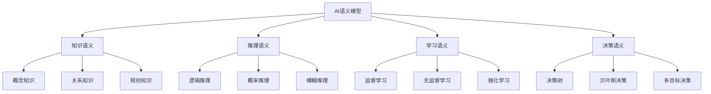

# AI语义模型

## 目录
- [AI语义模型](#ai语义模型)
- [理论基础](#理论基础)
- [核心概念](#核心概念)
- [语义域定义](#语义域定义)
- [语义映射关系](#语义映射关系)
- [形式化表示](#形式化表示)
- [应用实例](#应用实例)
- [发展趋势](#发展趋势)

## 理论基础

### AI语义模型的认知科学理论基础
AI语义模型建立在认知科学、机器学习和人工智能理论的基础上：

1. **认知科学原理**
   - 认知架构（Cognitive Architecture）
   - 心智模型（Mental Model）
   - 认知负荷（Cognitive Load）
   - 认知偏差（Cognitive Bias）

2. **机器学习原理**
   - 监督学习（Supervised Learning）
   - 无监督学习（Unsupervised Learning）
   - 强化学习（Reinforcement Learning）
   - 深度学习（Deep Learning）

3. **人工智能原理**
   - 知识表示（Knowledge Representation）
   - 推理机制（Reasoning Mechanism）
   - 决策理论（Decision Theory）
   - 智能代理（Intelligent Agent）

### AI语义模型的核心特征



## 核心概念

### 1. AI系统语义（AI System Semantics）
AI系统语义定义了人工智能系统的基本语义属性和行为。

**形式化定义：**
```
AISystem = {
  id: String,
  type: AISystemType,
  knowledge: KnowledgeSemantics,
  reasoning: ReasoningSemantics,
  learning: LearningSemantics,
  decision: DecisionSemantics
}
```

### 2. 知识语义（Knowledge Semantics）
知识语义描述了AI系统的知识表示和知识结构。

**形式化定义：**
```
KnowledgeSemantics = {
  concepts: Set<Concept>,
  relations: Set<Relation>,
  rules: Set<Rule>,
  constraints: Set<Constraint>
}
```

### 3. 推理语义（Reasoning Semantics）
推理语义定义了AI系统的推理机制和推理过程。

**形式化定义：**
```
ReasoningSemantics = {
  logic: LogicSemantics,
  probability: ProbabilitySemantics,
  fuzzy: FuzzySemantics,
  temporal: TemporalSemantics
}
```

### 4. 学习语义（Learning Semantics）
学习语义描述了AI系统的学习机制和学习过程。

**形式化定义：**
```
LearningSemantics = {
  supervised: SupervisedLearningSemantics,
  unsupervised: UnsupervisedLearningSemantics,
  reinforcement: ReinforcementLearningSemantics,
  deep: DeepLearningSemantics
}
```

### 5. 决策语义（Decision Semantics）
决策语义定义了AI系统的决策机制和决策过程。

**形式化定义：**
```
DecisionSemantics = {
  strategy: StrategySemantics,
  optimization: OptimizationSemantics,
  risk: RiskSemantics,
  multiObjective: MultiObjectiveSemantics
}
```

## 语义域定义

### 1. 基础AI语义域

#### 知识图谱语义域（Knowledge Graph Semantic Domain）
```
KnowledgeGraphSemantics = {
  concepts: {Entity, Concept, Attribute, Value},
  relations: {IsA, HasA, PartOf, RelatedTo},
  constraints: {MustBeConsistent, MustBeComplete, MustBeAccurate},
  operations: {Query, Infer, Update, Validate}
}
```

#### 推理引擎语义域（Reasoning Engine Semantic Domain）
```
ReasoningEngineSemantics = {
  concepts: {Premise, Conclusion, Rule, Inference},
  relations: {Implies, Follows, Contradicts, Supports},
  constraints: {MustBeSound, MustBeComplete, MustBeEfficient},
  operations: {Deduce, Induce, Abduce, Validate}
}
```

#### 机器学习语义域（Machine Learning Semantic Domain）
```
MachineLearningSemantics = {
  concepts: {Model, Feature, Label, Prediction},
  relations: {Trains, Predicts, Evaluates, Optimizes},
  constraints: {MustBeAccurate, MustBeGeneralizable, MustBeInterpretable},
  operations: {Train, Predict, Evaluate, Optimize}
}
```

### 2. 复合AI语义域

#### 深度学习语义域（Deep Learning Semantic Domain）
```
DeepLearningSemantics = {
  concepts: {NeuralNetwork, Layer, Neuron, Weight},
  relations: {Connects, Activates, Propagates, Updates},
  constraints: {MustBeDeep, MustBeNonlinear, MustBeOptimizable},
  operations: {Forward, Backward, Update, Regularize}
}
```

#### 自然语言处理语义域（NLP Semantic Domain）
```
NLPSemantics = {
  concepts: {Token, Sentence, Document, Language},
  relations: {Parses, Analyzes, Generates, Translates},
  constraints: {MustBeAccurate, MustBeContextual, MustBeMultilingual},
  operations: {Tokenize, Parse, Analyze, Generate}
}
```

#### 计算机视觉语义域（Computer Vision Semantic Domain）
```
ComputerVisionSemantics = {
  concepts: {Image, Feature, Object, Scene},
  relations: {Detects, Recognizes, Segments, Tracks},
  constraints: {MustBeRobust, MustBeRealTime, MustBeAccurate},
  operations: {Detect, Recognize, Segment, Track}
}
```

## 语义映射关系

### 1. 知识到推理映射
```
KnowledgeToReasoning: KnowledgeSemantics → ReasoningSemantics
```

**映射规则：**
- 概念知识 → 逻辑推理
- 关系知识 → 关系推理
- 规则知识 → 规则推理

### 2. 推理到学习映射
```
ReasoningToLearning: ReasoningSemantics → LearningSemantics
```

**映射规则：**
- 推理过程 → 学习过程
- 推理结果 → 学习目标
- 推理错误 → 学习反馈

### 3. 学习到决策映射
```
LearningToDecision: LearningSemantics → DecisionSemantics
```

**映射规则：**
- 学习模型 → 决策模型
- 学习预测 → 决策选择
- 学习优化 → 决策优化

## 形式化表示

### 1. 类型系统
```
AISystemType ::= 
  | KnowledgeGraph
  | ReasoningEngine
  | MachineLearning
  | DeepLearning
  | NLP
  | ComputerVision
  | Custom AISystemType

KnowledgeType ::=
  | Concept
  | Relation
  | Rule
  | Constraint
  | Custom KnowledgeType

ReasoningType ::=
  | Logic
  | Probability
  | Fuzzy
  | Temporal
  | Custom ReasoningType

SemanticType ::=
  | KnowledgeSemanticType
  | ReasoningSemanticType
  | LearningSemanticType
  | DecisionSemanticType
```

### 2. 语义推理规则

#### 知识语义推理
```
Concept(c1) ∧ Concept(c2) ∧ Relation(r, c1, c2) 
  → KnowledgeInference(i, c1, c2, r)
```

#### 推理语义推理
```
Premise(p) ∧ Rule(r) ∧ Applies(r, p) 
  → Conclusion(c, p, r)
```

#### 学习语义推理
```
Feature(f) ∧ Label(l) ∧ Model(m) ∧ Trains(m, f, l) 
  → Prediction(p, m, f)
```

### 3. 语义组合算子

#### 知识组合
```
KnowledgeCompose: KnowledgeSemantics × KnowledgeSemantics → KnowledgeSemantics
```

#### 推理组合
```
ReasoningCompose: ReasoningSemantics × ReasoningSemantics → ReasoningSemantics
```

#### 学习组合
```
LearningCompose: LearningSemantics × LearningSemantics → LearningSemantics
```

## 应用实例

### 1. 知识图谱语义化

```typescript
interface KnowledgeGraphSemantics {
  // 知识语义
  knowledge: {
    concepts: {
      entities: Set<string>;
      attributes: Set<string>;
      values: Set<string>;
      types: Set<string>;
    };
    relations: {
      hierarchical: ['IsA', 'PartOf', 'InstanceOf'];
      associative: ['RelatedTo', 'SimilarTo', 'OppositeTo'];
      temporal: ['Before', 'After', 'During'];
      spatial: ['Near', 'Inside', 'Above'];
    };
    rules: {
      logical: ['If-Then', 'And', 'Or', 'Not'];
      probabilistic: ['Bayesian', 'Markov', 'Hidden'];
      fuzzy: ['Membership', 'Similarity', 'Preference'];
    };
    constraints: {
      consistency: 'logical consistency';
      completeness: 'knowledge coverage';
      accuracy: 'factual correctness';
    };
  };
  
  // 推理语义
  reasoning: {
    logic: {
      deductive: 'syllogistic reasoning';
      inductive: 'pattern generalization';
      abductive: 'best explanation';
    };
    probability: {
      bayesian: 'Bayesian inference';
      frequentist: 'frequentist inference';
      subjective: 'subjective probability';
    };
    fuzzy: {
      membership: 'fuzzy membership';
      similarity: 'fuzzy similarity';
      aggregation: 'fuzzy aggregation';
    };
    temporal: {
      temporal: 'temporal reasoning';
      causal: 'causal reasoning';
      predictive: 'predictive reasoning';
    };
  };
  
  // 学习语义
  learning: {
    supervised: {
      classification: 'entity classification';
      regression: 'value prediction';
      ranking: 'entity ranking';
    };
    unsupervised: {
      clustering: 'concept clustering';
      dimensionality: 'feature reduction';
      association: 'rule mining';
    };
    reinforcement: {
      exploration: 'knowledge exploration';
      exploitation: 'knowledge exploitation';
      optimization: 'knowledge optimization';
    };
    deep: {
      embedding: 'entity embedding';
      representation: 'knowledge representation';
      generation: 'knowledge generation';
    };
  };
  
  // 决策语义
  decision: {
    strategy: {
      greedy: 'greedy selection';
      optimal: 'optimal selection';
      heuristic: 'heuristic selection';
    };
    optimization: {
      single: 'single objective';
      multi: 'multi objective';
      constrained: 'constrained optimization';
    };
    risk: {
      assessment: 'risk assessment';
      mitigation: 'risk mitigation';
      tolerance: 'risk tolerance';
    };
    multiObjective: {
      pareto: 'Pareto optimality';
      weighted: 'weighted sum';
      lexicographic: 'lexicographic order';
    };
  };
}
```

### 2. 深度学习语义化

```typescript
interface DeepLearningSemantics {
  // 知识语义
  knowledge: {
    concepts: {
      neurons: 'artificial neurons';
      layers: 'neural layers';
      weights: 'connection weights';
      biases: 'neuron biases';
    };
    relations: {
      connections: 'neuron connections';
      activations: 'neuron activations';
      gradients: 'weight gradients';
      updates: 'weight updates';
    };
    rules: {
      forward: 'forward propagation';
      backward: 'backward propagation';
      optimization: 'gradient descent';
      regularization: 'weight decay';
    };
    constraints: {
      architecture: 'network architecture';
      capacity: 'model capacity';
      complexity: 'computational complexity';
    };
  };
  
  // 推理语义
  reasoning: {
    logic: {
      feedforward: 'feedforward computation';
      recurrent: 'recurrent computation';
      attention: 'attention mechanism';
    };
    probability: {
      dropout: 'dropout regularization';
      bayesian: 'Bayesian neural networks';
      variational: 'variational inference';
    };
    fuzzy: {
      fuzzy: 'fuzzy neural networks';
      neurofuzzy: 'neuro-fuzzy systems';
      adaptive: 'adaptive neuro-fuzzy';
    };
    temporal: {
      sequence: 'sequence modeling';
      temporal: 'temporal dependencies';
      memory: 'memory mechanisms';
    };
  };
  
  // 学习语义
  learning: {
    supervised: {
      classification: 'multi-class classification';
      regression: 'continuous prediction';
      segmentation: 'pixel-level segmentation';
    };
    unsupervised: {
      autoencoder: 'autoencoder learning';
      gan: 'generative adversarial networks';
      clustering: 'neural clustering';
    };
    reinforcement: {
      policy: 'policy gradient';
      value: 'value function';
      actor: 'actor-critic methods';
    };
    deep: {
      representation: 'deep representation';
      transfer: 'transfer learning';
      fewShot: 'few-shot learning';
    };
  };
  
  // 决策语义
  decision: {
    strategy: {
      exploration: 'exploration strategy';
      exploitation: 'exploitation strategy';
      balance: 'exploration-exploitation';
    };
    optimization: {
      adam: 'Adam optimizer';
      sgd: 'stochastic gradient descent';
      rmsprop: 'RMSprop optimizer';
    };
    risk: {
      overfitting: 'overfitting risk';
      underfitting: 'underfitting risk';
      generalization: 'generalization risk';
    };
    multiObjective: {
      accuracy: 'accuracy objective';
      efficiency: 'efficiency objective';
      interpretability: 'interpretability objective';
    };
  };
}
```

### 3. 自然语言处理语义化

```typescript
interface NLPSemantics {
  // 知识语义
  knowledge: {
    concepts: {
      tokens: 'text tokens';
      sentences: 'text sentences';
      documents: 'text documents';
      languages: 'natural languages';
    };
    relations: {
      syntactic: 'syntactic relations';
      semantic: 'semantic relations';
      discourse: 'discourse relations';
      pragmatic: 'pragmatic relations';
    };
    rules: {
      grammar: 'grammatical rules';
      semantics: 'semantic rules';
      pragmatics: 'pragmatic rules';
    };
    constraints: {
      grammatical: 'grammatical constraints';
      semantic: 'semantic constraints';
      contextual: 'contextual constraints';
    };
  };
  
  // 推理语义
  reasoning: {
    logic: {
      parsing: 'syntactic parsing';
      semantic: 'semantic parsing';
      discourse: 'discourse parsing';
    };
    probability: {
      language: 'language modeling';
      translation: 'machine translation';
      generation: 'text generation';
    };
    fuzzy: {
      similarity: 'text similarity';
      matching: 'pattern matching';
      clustering: 'text clustering';
    };
    temporal: {
      sequence: 'sequence modeling';
      temporal: 'temporal reasoning';
      causality: 'causal reasoning';
    };
  };
  
  // 学习语义
  learning: {
    supervised: {
      classification: 'text classification';
      tagging: 'sequence tagging';
      parsing: 'dependency parsing';
    };
    unsupervised: {
      clustering: 'document clustering';
      topic: 'topic modeling';
      embedding: 'word embedding';
    };
    reinforcement: {
      dialogue: 'dialogue systems';
      summarization: 'text summarization';
      question: 'question answering';
    };
    deep: {
      transformer: 'transformer models';
      bert: 'BERT models';
      gpt: 'GPT models';
    };
  };
  
  // 决策语义
  decision: {
    strategy: {
      greedy: 'greedy decoding';
      beam: 'beam search';
      sampling: 'nucleus sampling';
    };
    optimization: {
      perplexity: 'perplexity optimization';
      bleu: 'BLEU score optimization';
      rouge: 'ROUGE score optimization';
    };
    risk: {
      bias: 'bias risk';
      fairness: 'fairness risk';
      privacy: 'privacy risk';
    };
    multiObjective: {
      accuracy: 'accuracy objective';
      fluency: 'fluency objective';
      diversity: 'diversity objective';
    };
  };
}
```

## 发展趋势

### 1. 可解释AI
- 提高AI系统的可解释性
- 支持决策过程的透明化
- 增强用户对AI的信任

### 2. 联邦学习
- 保护数据隐私
- 支持分布式学习
- 实现协作式AI

### 3. 元学习
- 学习如何学习
- 快速适应新任务
- 提高学习效率

### 4. 神经符号AI
- 结合神经网络和符号推理
- 提高推理能力
- 增强可解释性

---

## 子目录结构

- [4.1 知识表示语义](./4.1 知识表示语义.md)
- [4.2 推理机制语义](./4.2 推理机制语义.md)
- [4.3 学习算法语义](./4.3 学习算法语义.md)
- [4.4 决策系统语义](./4.4 决策系统语义.md)
- [4.5 AI语义工具](./4.5 AI语义工具.md)

> AI语义模型作为语义模型体系的智能层，为AI系统的设计和实现提供了语义化的理论基础和实践指导。 