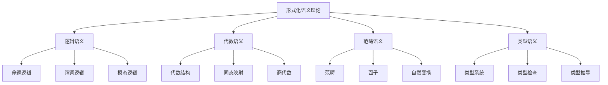

# 形式化语义理论

## 目录
- [形式化语义理论](#形式化语义理论)
- [理论基础](#理论基础)
- [核心概念](#核心概念)
- [数学基础](#数学基础)
- [形式化系统](#形式化系统)
- [语义推理](#语义推理)
- [应用实例](#应用实例)
- [发展趋势](#发展趋势)

## 理论基础

### 形式化语义理论的数学理论基础
形式化语义理论建立在数学逻辑、范畴论和代数语义学的基础上：

1. **数学逻辑原理**
   - 一阶逻辑（First-Order Logic）
   - 模态逻辑（Modal Logic）
   - 时态逻辑（Temporal Logic）
   - 直觉逻辑（Intuitionistic Logic）

2. **范畴论原理**
   - 范畴（Category）
   - 函子（Functor）
   - 自然变换（Natural Transformation）
   - 极限（Limit）和余极限（Colimit）

3. **代数语义学原理**
   - 代数结构（Algebraic Structure）
   - 同态（Homomorphism）
   - 同构（Isomorphism）
   - 商代数（Quotient Algebra）

### 形式化语义理论的核心特征



## 核心概念

### 1. 语义域（Semantic Domain）
语义域是形式化语义理论的基本单位，定义了语义解释的数学结构。

**形式化定义：**
```
SemanticDomain = {
  universe: Set<Value>,
  operations: Set<Operation>,
  relations: Set<Relation>,
  constraints: Set<Constraint>
}
```

### 2. 语义函数（Semantic Function）
语义函数将语法结构映射到语义域中的值。

**形式化定义：**
```
SemanticFunction: Syntax → SemanticDomain
e: Expression → Value
```

### 3. 语义关系（Semantic Relation）
语义关系定义了语义域中元素之间的关系。

**形式化定义：**
```
SemanticRelation ⊆ SemanticDomain × SemanticDomain
R: Value × Value → Boolean
```

### 4. 语义等价（Semantic Equivalence）
语义等价定义了语义上等价的表达式。

**形式化定义：**
```
SemanticEquivalence: Expression × Expression → Boolean
e1 ≡ e2 ⇔ e1 = e2
```

### 5. 语义蕴含（Semantic Entailment）
语义蕴含定义了语义上的逻辑蕴含关系。

**形式化定义：**
```
SemanticEntailment: Expression × Expression → Boolean
e1 ⊨ e2 ⇔ ∀σ. σ ⊨ e1 ⇒ σ ⊨ e2
```

## 数学基础

### 1. 集合论基础

#### 集合运算
```
Union: A ∪ B = {x | x ∈ A ∨ x ∈ B}
Intersection: A ∩ B = {x | x ∈ A ∧ x ∈ B}
Difference: A - B = {x | x ∈ A ∧ x ∉ B}
Cartesian Product: A × B = {(a, b) | a ∈ A ∧ b ∈ B}
```

#### 关系运算
```
Composition: R ∘ S = {(a, c) | ∃b. (a, b) ∈ R ∧ (b, c) ∈ S}
Inverse: R⁻¹ = {(b, a) | (a, b) ∈ R}
Transitive Closure: R* = ⋃ᵢ Rⁱ
```

### 2. 函数论基础

#### 函数类型
```
Total Function: f: A → B
Partial Function: f: A ⇀ B
Injective Function: ∀x,y. f(x) = f(y) ⇒ x = y
Surjective Function: ∀y ∈ B. ∃x ∈ A. f(x) = y
Bijective Function: Injective ∧ Surjective
```

#### 函数运算
```
Composition: (f ∘ g)(x) = f(g(x))
Inverse: f⁻¹: B → A
Currying: curry(f): A → (B → C)
```

### 3. 代数结构基础

#### 群论
```
Group = (G, ·, e, ⁻¹)
Associativity: (a · b) · c = a · (b · c)
Identity: e · a = a · e = a
Inverse: a · a⁻¹ = a⁻¹ · a = e
```

#### 环论
```
Ring = (R, +, ·, 0, 1)
Additive Group: (R, +, 0)
Multiplicative Monoid: (R, ·, 1)
Distributivity: a · (b + c) = a · b + a · c
```

## 形式化系统

### 1. 类型系统

#### 简单类型系统
```
Type ::= BaseType | FunctionType | ProductType | SumType
BaseType ::= Bool | Int | String | Unit
FunctionType ::= Type → Type
ProductType ::= Type × Type
SumType ::= Type + Type
```

#### 多态类型系统
```
Type ::= BaseType | TypeVariable | UniversalType | ExistentialType
TypeVariable ::= α | β | γ
UniversalType ::= ∀α. Type
ExistentialType ::= ∃α. Type
```

#### 依赖类型系统
```
Type ::= BaseType | ΠType | ΣType | IdType
ΠType ::= Πx:A. B
ΣType ::= Σx:A. B
IdType ::= Id(A, a, b)
```

### 2. 逻辑系统

#### 命题逻辑
```
Formula ::= Atom | ¬Formula | Formula ∧ Formula | Formula ∨ Formula | Formula → Formula
Atom ::= P | Q | R
```

#### 谓词逻辑
```
Formula ::= Atom | ¬Formula | Formula ∧ Formula | Formula ∨ Formula | Formula → Formula | ∀x.Formula | ∃x.Formula
Atom ::= P(t₁, ..., tₙ)
Term ::= Variable | Function(Term, ..., Term)
```

#### 模态逻辑
```
Formula ::= Atom | ¬Formula | Formula ∧ Formula | Formula ∨ Formula | Formula → Formula | □Formula | ◇Formula
```

### 3. 范畴论系统

#### 范畴定义
```
Category = (Ob, Hom, id, ∘)
Objects: Ob
Morphisms: Hom(A, B)
Identity: id_A: A → A
Composition: ∘: Hom(B, C) × Hom(A, B) → Hom(A, C)
```

#### 函子定义
```
Functor: C → D
Object Map: F: Ob(C) → Ob(D)
Morphism Map: F: Hom_C(A, B) → Hom_D(F(A), F(B))
Functoriality: F(id_A) = id_F(A), F(f ∘ g) = F(f) ∘ F(g)
```

## 语义推理

### 1. 类型推理

#### 类型推导规则
```
Var: Γ ⊢ x: A (if x: A ∈ Γ)
Abs: Γ, x: A ⊢ e: B / Γ ⊢ λx.e: A → B
App: Γ ⊢ e₁: A → B, Γ ⊢ e₂: A / Γ ⊢ e₁ e₂: B
```

#### 类型检查算法
```
TypeCheck(Γ, e) = {
  case e of
    Var(x) → lookup(Γ, x)
    Abs(x, e) → {
      let A = fresh()
      let B = TypeCheck(Γ ∪ {x: A}, e)
      A → B
    }
    App(e₁, e₂) → {
      let A → B = TypeCheck(Γ, e₁)
      let A' = TypeCheck(Γ, e₂)
      if unify(A, A') then B else error
    }
}
```

### 2. 逻辑推理

#### 自然演绎规则
```
Introduction Rules:
  ∧I: A, B / A ∧ B
  ∨I₁: A / A ∨ B
  ∨I₂: B / A ∨ B
  →I: A ⊢ B / A → B
  ∀I: A / ∀x.A (x not free in assumptions)
  ∃I: A[t/x] / ∃x.A

Elimination Rules:
  ∧E₁: A ∧ B / A
  ∧E₂: A ∧ B / B
  ∨E: A ∨ B, A ⊢ C, B ⊢ C / C
  →E: A → B, A / B
  ∀E: ∀x.A / A[t/x]
  ∃E: ∃x.A, A ⊢ C / C (x not free in C)
```

#### 归结推理
```
Resolution: A ∨ B, ¬A ∨ C / B ∨ C
Factorization: A ∨ A ∨ B / A ∨ B
```

### 3. 语义等价推理

#### β等价
```
(λx.e₁) e₂ ≡ e₁[e₂/x]
```

#### η等价
```
λx.(e x) ≡ e (if x not free in e)
```

#### 代数等价
```
Associativity: (a + b) + c ≡ a + (b + c)
Commutativity: a + b ≡ b + a
Identity: a + 0 ≡ a
```

## 应用实例

### 1. λ演算语义

```typescript
interface LambdaCalculusSemantics {
  // 语法
  syntax: {
    variables: Set<string>;
    abstractions: Set<string>;
    applications: Set<string>;
  };
  
  // 语义域
  domain: {
    values: Set<Value>;
    environments: Map<string, Value>;
    continuations: Set<Continuation>;
  };
  
  // 语义函数
  semantics: {
    // 变量求值
    evalVar: (x: string, env: Environment) => Value;
    
    // 抽象求值
    evalAbs: (x: string, body: Expression, env: Environment) => Closure;
    
    // 应用求值
    evalApp: (func: Expression, arg: Expression, env: Environment) => Value;
  };
  
  // 归约规则
  reduction: {
    beta: '(λx.e₁) e₂ → e₁[e₂/x]';
    eta: 'λx.(e x) → e (if x not free in e)';
    alpha: 'λx.e → λy.e[y/x] (if y not free in e)';
  };
  
  // 类型系统
  types: {
    base: ['Bool', 'Int', 'String'];
    function: 'A → B';
    product: 'A × B';
    sum: 'A + B';
  };
}
```

### 2. 命题逻辑语义

```typescript
interface PropositionalLogicSemantics {
  // 语法
  syntax: {
    atoms: Set<string>;
    connectives: ['¬', '∧', '∨', '→', '↔'];
    formulas: Set<Formula>;
  };
  
  // 语义域
  domain: {
    truthValues: [true, false];
    valuations: Map<string, boolean>;
    interpretations: Set<Interpretation>;
  };
  
  // 语义函数
  semantics: {
    // 原子公式求值
    evalAtom: (p: string, v: Valuation) => boolean;
    
    // 复合公式求值
    evalFormula: (φ: Formula, v: Valuation) => boolean;
    
    // 否定
    evalNeg: (φ: Formula, v: Valuation) => !evalFormula(φ, v);
    
    // 合取
    evalConj: (φ: Formula, ψ: Formula, v: Valuation) => 
      evalFormula(φ, v) && evalFormula(ψ, v);
    
    // 析取
    evalDisj: (φ: Formula, ψ: Formula, v: Valuation) => 
      evalFormula(φ, v) || evalFormula(ψ, v);
    
    // 蕴含
    evalImpl: (φ: Formula, ψ: Formula, v: Valuation) => 
      !evalFormula(φ, v) || evalFormula(ψ, v);
  };
  
  // 推理规则
  inference: {
    modusPonens: 'φ → ψ, φ / ψ';
    modusTollens: 'φ → ψ, ¬ψ / ¬φ';
    hypotheticalSyllogism: 'φ → ψ, ψ → χ / φ → χ';
    disjunctiveSyllogism: 'φ ∨ ψ, ¬φ / ψ';
  };
  
  // 等价变换
  equivalences: {
    doubleNegation: '¬¬φ ≡ φ';
    deMorgan: '¬(φ ∧ ψ) ≡ ¬φ ∨ ¬ψ';
    deMorgan: '¬(φ ∨ ψ) ≡ ¬φ ∧ ¬ψ';
    distribution: 'φ ∧ (ψ ∨ χ) ≡ (φ ∧ ψ) ∨ (φ ∧ χ)';
    distribution: 'φ ∨ (ψ ∧ χ) ≡ (φ ∨ ψ) ∧ (φ ∨ χ)';
  };
}
```

### 3. 范畴语义

```typescript
interface CategorySemantics {
  // 范畴定义
  category: {
    objects: Set<Object>;
    morphisms: Map<Object, Map<Object, Set<Morphism>>>;
    identity: Map<Object, Morphism>;
    composition: (f: Morphism, g: Morphism) => Morphism;
  };
  
  // 函子
  functor: {
    objectMap: (A: Object) => Object;
    morphismMap: (f: Morphism) => Morphism;
    preservesIdentity: (A: Object) => 
      morphismMap(identity(A)) === identity(objectMap(A));
    preservesComposition: (f: Morphism, g: Morphism) => 
      morphismMap(f ∘ g) === morphismMap(f) ∘ morphismMap(g);
  };
  
  // 自然变换
  naturalTransformation: {
    components: Map<Object, Morphism>;
    naturality: (f: Morphism) => 
      components(cod(f)) ∘ functor(f) === functor(f) ∘ components(dom(f));
  };
  
  // 极限
  limit: {
    cone: {
      apex: Object;
      legs: Map<Object, Morphism>;
      commutativity: (f: Morphism) => 
        legs(cod(f)) === legs(dom(f)) ∘ functor(f);
    };
    universal: (cone: Cone) => 
      ∃!u: cone.apex → limit.apex. ∀i. limit.legs(i) ∘ u === cone.legs(i);
  };
  
  // 余极限
  colimit: {
    cocone: {
      apex: Object;
      legs: Map<Object, Morphism>;
      commutativity: (f: Morphism) => 
        legs(dom(f)) === functor(f) ∘ legs(cod(f));
    };
    universal: (cocone: Cocone) => 
      ∃!u: colimit.apex → cocone.apex. ∀i. u ∘ colimit.legs(i) === cocone.legs(i);
  };
}
```

## 发展趋势

### 1. 高阶类型系统
- 支持高阶类型构造
- 提供更丰富的类型抽象
- 增强类型安全性

### 2. 依赖类型系统
- 支持类型级别的计算
- 提供更强的类型保证
- 实现类型安全的元编程

### 3. 同伦类型论
- 统一类型和空间
- 提供几何直觉
- 支持高阶结构

### 4. 量子语义学
- 量子计算语义
- 量子逻辑
- 量子信息论

---

## 子目录结构

- [5.1 逻辑语义](./5.1 逻辑语义.md)
- [5.2 代数语义](./5.2 代数语义.md)
- [5.3 范畴语义](./5.3 范畴语义.md)
- [5.4 类型语义](./5.4 类型语义.md)
- [5.5 形式化语义工具](./5.5 形式化语义工具.md)

> 形式化语义理论作为语义模型体系的理论基础层，为整个语义模型体系提供了严格的数学基础和形式化工具。 