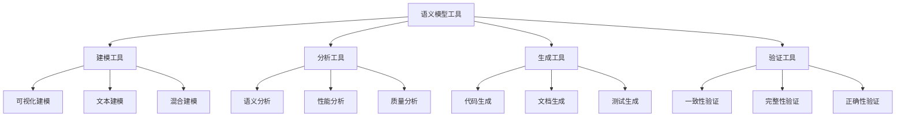

# 语义模型工具

## 目录
- [语义模型工具](#语义模型工具)
- [理论基础](#理论基础)
- [核心概念](#核心概念)
- [工具分类](#工具分类)
- [开发工具](#开发工具)
- [应用工具](#应用工具)
- [验证工具](#验证工具)
- [发展趋势](#发展趋势)

## 理论基础

### 语义模型工具的工程理论基础
语义模型工具建立在软件工程、模型驱动开发和工具链理论的基础上：

1. **软件工程原理**
   - 模型驱动架构（Model-Driven Architecture）
   - 领域特定语言（Domain-Specific Language）
   - 代码生成（Code Generation）
   - 模型转换（Model Transformation）

2. **工具链理论**
   - 工具集成（Tool Integration）
   - 工作流管理（Workflow Management）
   - 版本控制（Version Control）
   - 配置管理（Configuration Management）

3. **语义工程原理**
   - 语义建模（Semantic Modeling）
   - 语义验证（Semantic Validation）
   - 语义推理（Semantic Reasoning）
   - 语义优化（Semantic Optimization）

### 语义模型工具的核心特征



## 核心概念

### 1. 语义建模工具（Semantic Modeling Tool）
语义建模工具用于创建和编辑语义模型。

**形式化定义：**
```
SemanticModelingTool = {
  id: String,
  type: ModelingToolType,
  interface: UserInterface,
  engine: ModelingEngine,
  storage: ModelStorage,
  export: ExportFormat
}
```

### 2. 语义分析工具（Semantic Analysis Tool）
语义分析工具用于分析语义模型的结构和属性。

**形式化定义：**
```
SemanticAnalysisTool = {
  id: String,
  type: AnalysisToolType,
  analyzer: Analyzer,
  metrics: Set<Metric>,
  reports: ReportGenerator,
  visualization: Visualizer
}
```

### 3. 语义生成工具（Semantic Generation Tool）
语义生成工具用于从语义模型生成代码、文档等。

**形式化定义：**
```
SemanticGenerationTool = {
  id: String,
  type: GenerationToolType,
  generator: Generator,
  templates: Set<Template>,
  targets: Set<Target>,
  configuration: Configuration
}
```

### 4. 语义验证工具（Semantic Validation Tool）
语义验证工具用于验证语义模型的正确性和一致性。

**形式化定义：**
```
SemanticValidationTool = {
  id: String,
  type: ValidationToolType,
  validator: Validator,
  rules: Set<Rule>,
  constraints: Set<Constraint>,
  feedback: FeedbackSystem
}
```

### 5. 语义推理工具（Semantic Reasoning Tool）
语义推理工具用于基于语义模型进行逻辑推理。

**形式化定义：**
```
SemanticReasoningTool = {
  id: String,
  type: ReasoningToolType,
  reasoner: Reasoner,
  logic: LogicSystem,
  inference: InferenceEngine,
  proof: ProofSystem
}
```

## 工具分类

### 1. 按功能分类

#### 建模工具
- **可视化建模工具**：提供图形化界面进行语义建模
- **文本建模工具**：支持文本形式的语义模型定义
- **混合建模工具**：结合可视化和文本的建模方式

#### 分析工具
- **结构分析工具**：分析语义模型的结构特征
- **性能分析工具**：分析语义模型的性能特征
- **质量分析工具**：分析语义模型的质量指标

#### 生成工具
- **代码生成工具**：从语义模型生成代码
- **文档生成工具**：从语义模型生成文档
- **测试生成工具**：从语义模型生成测试用例

#### 验证工具
- **语法验证工具**：验证语义模型的语法正确性
- **语义验证工具**：验证语义模型的语义正确性
- **一致性验证工具**：验证语义模型的一致性

### 2. 按应用领域分类

#### UI语义工具
- **UI建模工具**：用于UI语义模型的创建和编辑
- **UI分析工具**：分析UI语义模型的结构和属性
- **UI生成工具**：从UI语义模型生成UI代码

#### 架构语义工具
- **架构建模工具**：用于架构语义模型的创建和编辑
- **架构分析工具**：分析架构语义模型的结构和属性
- **架构生成工具**：从架构语义模型生成架构代码

#### Web应用语义工具
- **Web建模工具**：用于Web应用语义模型的创建和编辑
- **Web分析工具**：分析Web应用语义模型的结构和属性
- **Web生成工具**：从Web应用语义模型生成Web代码

#### AI语义工具
- **AI建模工具**：用于AI语义模型的创建和编辑
- **AI分析工具**：分析AI语义模型的结构和属性
- **AI生成工具**：从AI语义模型生成AI代码

## 开发工具

### 1. 语义建模工具

#### 可视化建模工具
```typescript
interface VisualModelingTool {
  // 图形界面
  interface: {
    canvas: Canvas;
    palette: ToolPalette;
    properties: PropertyPanel;
    outline: OutlineView;
  };
  
  // 建模引擎
  engine: {
    createElement: (type: ElementType, position: Point) => Element;
    connectElements: (source: Element, target: Element, type: ConnectionType) => Connection;
    updateElement: (element: Element, properties: Properties) => void;
    deleteElement: (element: Element) => void;
  };
  
  // 模型存储
  storage: {
    save: (model: SemanticModel, format: Format) => void;
    load: (format: Format) => SemanticModel;
    export: (model: SemanticModel, format: ExportFormat) => void;
    import: (format: ImportFormat) => SemanticModel;
  };
  
  // 导出格式
  export: {
    formats: ['JSON', 'XML', 'YAML', 'GraphML'];
    customFormats: Map<string, Exporter>;
  };
}
```

#### 文本建模工具
```typescript
interface TextModelingTool {
  // 编辑器
  editor: {
    syntax: SyntaxHighlighter;
    autocomplete: AutoComplete;
    validation: RealTimeValidation;
    formatting: CodeFormatter;
  };
  
  // 解析器
  parser: {
    parse: (text: string) => AST;
    validate: (ast: AST) => ValidationResult;
    transform: (ast: AST, transformation: Transformation) => AST;
  };
  
  // 生成器
  generator: {
    generate: (ast: AST, target: Target) => string;
    templates: Map<Target, Template>;
    customGenerators: Map<string, Generator>;
  };
  
  // 语言服务
  languageService: {
    hover: (position: Position) => HoverInfo;
    definition: (position: Position) => Definition;
    references: (position: Position) => Reference[];
    rename: (position: Position, newName: string) => WorkspaceEdit;
  };
}
```

### 2. 语义分析工具

#### 结构分析工具
```typescript
interface StructuralAnalysisTool {
  // 分析器
  analyzer: {
    analyzeStructure: (model: SemanticModel) => StructuralAnalysis;
    analyzeComplexity: (model: SemanticModel) => ComplexityMetrics;
    analyzeCoupling: (model: SemanticModel) => CouplingMetrics;
    analyzeCohesion: (model: SemanticModel) => CohesionMetrics;
  };
  
  // 指标
  metrics: {
    cyclomaticComplexity: number;
    depthOfInheritance: number;
    numberOfChildren: number;
    couplingBetweenObjects: number;
    lackOfCohesionOfMethods: number;
  };
  
  // 报告生成器
  reports: {
    generateReport: (analysis: Analysis) => Report;
    exportReport: (report: Report, format: Format) => void;
    scheduleReport: (schedule: Schedule) => void;
  };
  
  // 可视化
  visualization: {
    dependencyGraph: (model: SemanticModel) => Graph;
    complexityHeatmap: (model: SemanticModel) => Heatmap;
    couplingMatrix: (model: SemanticModel) => Matrix;
  };
}
```

#### 性能分析工具
```typescript
interface PerformanceAnalysisTool {
  // 性能分析器
  analyzer: {
    analyzePerformance: (model: SemanticModel) => PerformanceAnalysis;
    analyzeScalability: (model: SemanticModel) => ScalabilityAnalysis;
    analyzeEfficiency: (model: SemanticModel) => EfficiencyAnalysis;
  };
  
  // 性能指标
  metrics: {
    responseTime: number;
    throughput: number;
    resourceUsage: number;
    scalability: number;
    efficiency: number;
  };
  
  // 性能报告
  reports: {
    generatePerformanceReport: (analysis: PerformanceAnalysis) => PerformanceReport;
    comparePerformance: (baseline: PerformanceAnalysis, current: PerformanceAnalysis) => ComparisonReport;
    predictPerformance: (model: SemanticModel, load: Load) => Prediction;
  };
  
  // 性能可视化
  visualization: {
    performanceChart: (analysis: PerformanceAnalysis) => Chart;
    scalabilityGraph: (analysis: ScalabilityAnalysis) => Graph;
    efficiencyHeatmap: (analysis: EfficiencyAnalysis) => Heatmap;
  };
}
```

## 应用工具

### 1. 代码生成工具

#### UI代码生成器
```typescript
interface UICodeGenerator {
  // 生成器
  generator: {
    generateReact: (model: UISemanticModel) => ReactCode;
    generateVue: (model: UISemanticModel) => VueCode;
    generateAngular: (model: UISemanticModel) => AngularCode;
    generateSvelte: (model: UISemanticModel) => SvelteCode;
  };
  
  // 模板
  templates: {
    react: {
      functional: Template;
      class: Template;
      hooks: Template;
    };
    vue: {
      options: Template;
      composition: Template;
      scriptSetup: Template;
    };
    angular: {
      component: Template;
      service: Template;
      module: Template;
    };
  };
  
  // 目标
  targets: {
    web: Target;
    mobile: Target;
    desktop: Target;
    crossPlatform: Target;
  };
  
  // 配置
  configuration: {
    styleFramework: 'CSS' | 'StyledComponents' | 'Emotion' | 'Tailwind';
    stateManagement: 'Redux' | 'Zustand' | 'Context' | 'MobX';
    routing: 'ReactRouter' | 'VueRouter' | 'AngularRouter';
    testing: 'Jest' | 'Vitest' | 'TestingLibrary';
  };
}
```

#### 架构代码生成器
```typescript
interface ArchitectureCodeGenerator {
  // 生成器
  generator: {
    generateMVC: (model: ArchitectureSemanticModel) => MVCCode;
    generateMVVM: (model: ArchitectureSemanticModel) => MVVMCode;
    generateFlux: (model: ArchitectureSemanticModel) => FluxCode;
    generateMicroservices: (model: ArchitectureSemanticModel) => MicroservicesCode;
  };
  
  // 模板
  templates: {
    mvc: {
      model: Template;
      view: Template;
      controller: Template;
    };
    mvvm: {
      model: Template;
      view: Template;
      viewModel: Template;
    };
    flux: {
      action: Template;
      dispatcher: Template;
      store: Template;
      view: Template;
    };
  };
  
  // 目标
  targets: {
    frontend: Target;
    backend: Target;
    fullstack: Target;
    microservices: Target;
  };
  
  // 配置
  configuration: {
    language: 'TypeScript' | 'JavaScript' | 'Python' | 'Java';
    framework: 'Express' | 'FastAPI' | 'Spring' | 'Django';
    database: 'PostgreSQL' | 'MongoDB' | 'Redis' | 'MySQL';
    deployment: 'Docker' | 'Kubernetes' | 'Serverless' | 'Vercel';
  };
}
```

### 2. 文档生成工具

#### 语义文档生成器
```typescript
interface SemanticDocumentGenerator {
  // 生成器
  generator: {
    generateAPI: (model: SemanticModel) => APIDocumentation;
    generateArchitecture: (model: SemanticModel) => ArchitectureDocumentation;
    generateUserGuide: (model: SemanticModel) => UserGuide;
    generateDeveloperGuide: (model: SemanticModel) => DeveloperGuide;
  };
  
  // 模板
  templates: {
    api: {
      openapi: Template;
      postman: Template;
      swagger: Template;
    };
    architecture: {
      c4: Template;
      uml: Template;
      erd: Template;
    };
    userGuide: {
      markdown: Template;
      html: Template;
      pdf: Template;
    };
  };
  
  // 格式
  formats: {
    markdown: Format;
    html: Format;
    pdf: Format;
    docx: Format;
  };
  
  // 配置
  configuration: {
    theme: 'Default' | 'Dark' | 'Light' | 'Custom';
    language: 'Chinese' | 'English' | 'Japanese' | 'Korean';
    includeExamples: boolean;
    includeDiagrams: boolean;
    includeCode: boolean;
  };
}
```

## 验证工具

### 1. 语义验证工具

#### 一致性验证器
```typescript
interface ConsistencyValidator {
  // 验证器
  validator: {
    validateConsistency: (model: SemanticModel) => ConsistencyResult;
    validateCompleteness: (model: SemanticModel) => CompletenessResult;
    validateCorrectness: (model: SemanticModel) => CorrectnessResult;
  };
  
  // 规则
  rules: {
    naming: Rule[];
    structure: Rule[];
    relationship: Rule[];
    constraint: Rule[];
  };
  
  // 约束
  constraints: {
    functional: Constraint[];
    performance: Constraint[];
    security: Constraint[];
    quality: Constraint[];
  };
  
  // 反馈
  feedback: {
    generateFeedback: (result: ValidationResult) => Feedback[];
    suggestFixes: (issue: Issue) => Suggestion[];
    autoFix: (issue: Issue) => Fix;
  };
}
```

#### 完整性验证器
```typescript
interface CompletenessValidator {
  // 验证器
  validator: {
    validateCoverage: (model: SemanticModel, requirements: Requirements) => CoverageResult;
    validateCompleteness: (model: SemanticModel) => CompletenessResult;
    validateConsistency: (model: SemanticModel) => ConsistencyResult;
  };
  
  // 覆盖率
  coverage: {
    functionalCoverage: number;
    structuralCoverage: number;
    behavioralCoverage: number;
    constraintCoverage: number;
  };
  
  // 完整性指标
  completeness: {
    conceptCompleteness: number;
    relationshipCompleteness: number;
    constraintCompleteness: number;
    operationCompleteness: number;
  };
  
  // 报告
  reports: {
    generateCoverageReport: (result: CoverageResult) => CoverageReport;
    generateCompletenessReport: (result: CompletenessResult) => CompletenessReport;
    generateGapAnalysis: (model: SemanticModel, requirements: Requirements) => GapAnalysis;
  };
}
```

### 2. 质量验证工具

#### 质量评估器
```typescript
interface QualityAssessor {
  // 评估器
  assessor: {
    assessQuality: (model: SemanticModel) => QualityAssessment;
    assessMaintainability: (model: SemanticModel) => MaintainabilityAssessment;
    assessTestability: (model: SemanticModel) => TestabilityAssessment;
    assessReusability: (model: SemanticModel) => ReusabilityAssessment;
  };
  
  // 质量指标
  metrics: {
    maintainability: number;
    testability: number;
    reusability: number;
    understandability: number;
    modifiability: number;
  };
  
  // 质量报告
  reports: {
    generateQualityReport: (assessment: QualityAssessment) => QualityReport;
    generateRecommendations: (assessment: QualityAssessment) => Recommendation[];
    generateImprovementPlan: (assessment: QualityAssessment) => ImprovementPlan;
  };
  
  // 质量可视化
  visualization: {
    qualityRadar: (assessment: QualityAssessment) => RadarChart;
    qualityTrend: (assessments: QualityAssessment[]) => TrendChart;
    qualityComparison: (baseline: QualityAssessment, current: QualityAssessment) => ComparisonChart;
  };
}
```

## 发展趋势

### 1. 智能化工具
- 基于AI的语义理解
- 智能代码生成
- 自动质量评估

### 2. 云原生工具
- 云端协作建模
- 分布式验证
- 实时同步

### 3. 低代码工具
- 可视化建模
- 拖拽式开发
- 模板化生成

### 4. 开源生态
- 开源工具链
- 社区贡献
- 标准化接口

---

## 子目录结构

- [6.1 建模工具](./6.1 建模工具.md)
- [6.2 分析工具](./6.2 分析工具.md)
- [6.3 生成工具](./6.3 生成工具.md)
- [6.4 验证工具](./6.4 验证工具.md)
- [6.5 推理工具](./6.5 推理工具.md)

> 语义模型工具作为语义模型体系的工具层，为语义模型的开发、应用和验证提供了完整的工具链支持。 