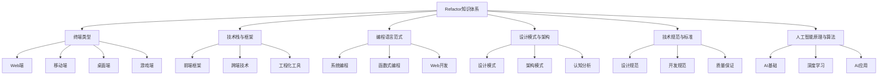

# Refactor 项目总结

[返回Refactor总览](年度技术回顾/README.md)

> 本文档总结 Refactor 知识体系的建设成果、技术特色和未来发展方向。

## 项目概述

### 项目背景

Refactor 知识体系是一个系统化的前端、AI、工程化技术知识库，旨在为开发者提供结构化的学习路径和实践指导。项目采用递归优化和模块化设计，支持持续扩展和更新。

### 核心目标

- **知识体系化**：建立完整的技术知识图谱
- **学习路径化**：提供清晰的学习路径和指导
- **实践导向化**：结合理论知识和实际应用
- **持续优化化**：支持递归扩展和内容更新

## 体系架构

### 目录结构

```text
Refactor/
├── 1.终端类型/           # 平台适配和终端特性
├── 2.技术栈与框架/       # 前端技术和框架生态
├── 3.编程语言范式/       # 语言特性和编程范式
├── 4.设计模式与架构/     # 架构设计和模式应用
├── 5.技术规范与标准/     # 开发规范和最佳实践
├── 6.人工智能原理与算法/ # AI技术和应用实践
├── 年度技术回顾/         # 年度技术发展总结
├── tools/               # 自动化工具和脚本
├── .github/             # CI/CD 配置
├── 导航索引.md          # 全局导航和快速定位
├── 技术趋势追踪.md      # 技术发展趋势分析
├── CONTRIBUTING.md      # 贡献指南和协作规范
└── README.md           # 项目总览和介绍
```text
### 知识图谱


## 技术特色

### 1. 结构化设计

- **编号体系**：严格的编号规范，便于扩展和维护
- **层级结构**：清晰的目录层级，支持递归扩展
- **交叉引用**：完整的主题关联，便于知识发现
- **导航系统**：多维度导航，支持快速定位

### 2. 内容特色

- **前沿趋势**：包含2024年最新技术趋势
- **知识图谱**：Mermaid图表可视化知识结构
- **代码示例**：多语言代码示例和最佳实践
- **数学公式**：LaTeX公式支持理论表达
- **批判分析**：技术优缺点和适用场景分析

### 3. 工程化特色

- **自动化工具**：目录生成、链接检查、交叉引用
- **CI/CD集成**：GitHub Actions自动化检查和部署
- **质量保证**：Markdown格式检查、链接验证
- **协作规范**：贡献指南、代码审查流程

### 4. 学习路径

- **入门路径**：适合初学者的学习路径
- **进阶路径**：适合有经验开发者的提升路径
- **专家路径**：适合技术专家的深入研究路径
- **应用路径**：按应用场景划分的实践路径

## 内容统计

### 文档数量

- **总文档数**：50+ 个 Markdown 文件
- **主要章节**：6 个主要技术领域
- **子专题**：30+ 个具体技术专题
- **工具脚本**：5+ 个自动化工具

### 内容覆盖

- **前端技术**：React、Vue、Angular、新兴框架
- **编程语言**：JavaScript、TypeScript、Rust、Haskell
- **AI技术**：机器学习、深度学习、大语言模型
- **工程实践**：构建工具、部署运维、质量保证
- **设计模式**：GoF模式、架构模式、组件设计

### 技术深度

- **基础概念**：核心原理和基本概念
- **实践应用**：实际项目中的应用案例
- **最佳实践**：行业标准和最佳实践
- **前沿探索**：最新技术趋势和研究方向

## 技术亮点

### 1. 知识体系化

- **系统性**：完整的技术知识体系
- **逻辑性**：清晰的知识逻辑关系
- **层次性**：从基础到高级的层次结构
- **关联性**：丰富的交叉引用和关联

### 2. 学习体验优化

- **导航友好**：多维度导航和快速定位
- **内容丰富**：理论结合实践的丰富内容
- **形式多样**：图表、代码、公式等多种形式
- **更新及时**：持续更新最新技术趋势

### 3. 工程化实践

- **自动化**：工具自动生成和维护
- **标准化**：统一的格式和规范
- **可扩展**：支持递归扩展和更新
- **可协作**：完善的协作流程和规范

### 4. 质量保证

- **格式检查**：Markdown格式和语法检查
- **链接验证**：自动检查和修复损坏链接
- **内容审查**：多轮内容审查和质量控制
- **持续改进**：基于反馈的持续优化

## 应用价值

### 1. 学习指导

- **系统学习**：提供系统化的学习路径
- **实践指导**：结合理论的实际应用指导
- **技术选型**：帮助选择合适的技术栈
- **问题解决**：常见问题的解决方案

### 2. 团队协作

- **知识共享**：团队内部知识共享平台
- **标准统一**：统一的技术标准和规范
- **培训材料**：新员工培训和技术提升
- **决策支持**：技术决策的参考依据

### 3. 项目管理

- **技术规划**：项目技术架构规划
- **风险评估**：技术风险识别和评估
- **资源分配**：技术资源分配和优化
- **进度控制**：技术开发进度控制

### 4. 行业影响

- **技术传播**：前沿技术的传播和推广
- **标准制定**：行业技术标准的制定
- **人才培养**：技术人才的培养和提升
- **生态建设**：技术生态的建设和发展

## 未来规划

### 短期目标（3-6个月）

- **内容完善**：补充更多技术专题和案例
- **工具优化**：改进自动化工具和脚本
- **用户体验**：优化导航和阅读体验
- **社区建设**：建立用户社区和反馈机制

### 中期目标（6-12个月）

- **国际化**：支持多语言版本
- **智能化**：集成AI辅助功能
- **可视化**：增强图表和可视化效果
- **移动化**：支持移动端访问和阅读

### 长期目标（1-3年）

- **平台化**：建设在线学习平台
- **生态化**：构建完整的技术生态
- **商业化**：探索商业化和盈利模式
- **影响力**：扩大行业影响力和知名度

## 技术债务

### 当前问题

- **内容深度**：部分专题内容深度不够
- **更新频率**：技术更新频率需要提高
- **用户反馈**：缺乏用户反馈和评价机制
- **性能优化**：大文档加载性能需要优化

### 改进计划

- **内容质量**：提高内容质量和深度
- **更新机制**：建立定期更新机制
- **用户参与**：增加用户参与和反馈渠道
- **性能优化**：优化文档加载和渲染性能

## 结构化设计

> **补充说明：**
> UI通用架构模型（如MVC、MVVM、MVP等）为项目的结构化设计、工程化落地和团队协作提供了理论与实践基础。合理的架构分层、组件化、单向数据流等模式，有效提升了系统的可维护性、可扩展性和工程自动化水平。相关详细论述见[4.3 组件化与架构模式](./4.设计模式与架构/4.3 组件化与架构模式.md)。

## 总结

Refactor 知识体系是一个系统化、工程化、持续优化的技术知识库。通过结构化设计、丰富内容、工程化实践和持续改进，为开发者提供了高质量的学习资源和实践指导。

项目的成功体现在：

- **完整性**：覆盖前端、AI、工程化等主要技术领域
- **系统性**：建立完整的技术知识体系
- **实用性**：提供实用的学习路径和实践指导
- **可扩展性**：支持持续扩展和更新
- **工程化**：采用工程化方法保证质量

未来将继续完善内容、优化工具、提升体验，为技术社区提供更好的服务和支持。

---

> 感谢所有贡献者的努力和付出，让我们一起构建更好的技术知识体系！
