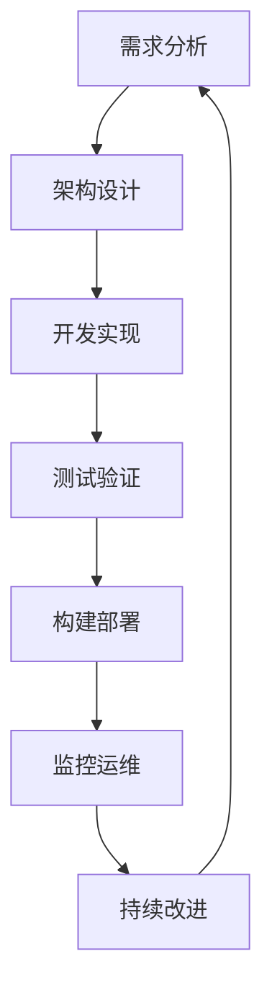

# 2.10 系统化前端工程化与DevOps实践 / Systematic Frontend Engineering and DevOps Practice

[返回2.技术栈与框架](./2.技术栈与框架/README.md) |  [返回Refactor总览](./2.技术栈与框架/../README.md)

---

## 目录 / Table of Contents

- [2.10 系统化前端工程化与DevOps实践](#210-系统化前端工程化与devops实践--systematic-frontend-engineering-and-devops-practice)
- [目录 / Table of Contents](#目录--table-of-contents)
- [1. 概述 / Overview](#1-概述--overview)
- [2. 前端工程化理论 / Frontend Engineering Theory](#2-前端工程化理论--frontend-engineering-theory)
- [3. DevOps实践体系 / DevOps Practice System](#3-devops实践体系--devops-practice-system)
- [4. 形式化工程化分析 / Formal Engineering Analysis](#4-形式化工程化分析--formal-engineering-analysis)
- [5. 相关性引用 / Related References](#5-相关性引用--related-references)
- [6. 参考文献 / Bibliography](#6-参考文献--bibliography)

---

## 1. 概述 / Overview

系统化前端工程化与DevOps实践是前端技术栈中确保开发效率、部署可靠性和运维稳定性的核心方法论。通过科学化的工程化理论、工程化的DevOps实践和系统化的运维管理，建立全面的前端工程保证机制。

**Systematic Frontend Engineering and DevOps Practice is the core methodology for ensuring development efficiency, deployment reliability, and operational stability in frontend technology stack. Through scientific engineering theory, engineering DevOps practices, and systematic operational management, it establishes a comprehensive frontend engineering assurance mechanism.**

## 1.1 核心目标 / Core Objectives

- **工程化理论 / Engineering Theory**: 建立科学的前端工程化理论基础
- **DevOps实践 / DevOps Practice**: 构建系统化的DevOps工程实践体系
- **运维管理 / Operational Management**: 建立全面的运维管理体系
- **持续改进 / Continuous Improvement**: 实现工程化的持续改进和优化

## 1.2 前端工程化流程 / Frontend Engineering Process



---

## 2. 前端工程化理论 / Frontend Engineering Theory

## 2.1 多维度工程化模型 / Multi-dimensional Engineering Model

### 2.1.1 构建工程 / Build Engineering

```typescript
interface BuildEngineering {
  tools: BuildTool[];
  optimization: BuildOptimization;
  pipeline: BuildPipeline;
  artifacts: BuildArtifact[];
}

interface BuildTool {
  name: string;
  type: 'bundler' | 'compiler' | 'transpiler' | 'minifier';
  configuration: BuildConfiguration;
  performance: BuildPerformance;
}

class BuildEngineer {
  designBuildSystem(requirements: Requirements): BuildEngineering {
    const tools = this.selectBuildTools(requirements);
    const optimization = this.defineOptimization(requirements);
    const pipeline = this.buildPipeline(tools, optimization);
    const artifacts = this.defineArtifacts(requirements);
    
    return {
      tools,
      optimization,
      pipeline,
      artifacts
    };
  }
  
  private selectBuildTools(requirements: Requirements): BuildTool[] {
    return [
      this.selectBundler(requirements),
      this.selectCompiler(requirements),
      this.selectTranspiler(requirements),
      this.selectMinifier(requirements)
    ];
  }
}
```

### 2.1.2 测试工程 / Testing Engineering

```typescript
interface TestingEngineering {
  strategy: TestingStrategy;
  frameworks: TestingFramework[];
  automation: TestAutomation;
  coverage: TestCoverage;
}

interface TestingStrategy {
  levels: TestLevel[];
  types: TestType[];
  priorities: TestPriority[];
  execution: TestExecution;
}

class TestingEngineer {
  designTestingSystem(requirements: Requirements): TestingEngineering {
    const strategy = this.defineTestingStrategy(requirements);
    const frameworks = this.selectFrameworks(requirements);
    const automation = this.buildAutomation(frameworks);
    const coverage = this.defineCoverage(requirements);
    
    return {
      strategy,
      frameworks,
      automation,
      coverage
    };
  }
  
  private defineTestingStrategy(requirements: Requirements): TestingStrategy {
    return {
      levels: this.defineTestLevels(requirements),
      types: this.defineTestTypes(requirements),
      priorities: this.defineTestPriorities(requirements),
      execution: this.defineTestExecution(requirements)
    };
  }
}
```

### 2.1.3 部署工程 / Deployment Engineering

```typescript
interface DeploymentEngineering {
  environments: Environment[];
  strategies: DeploymentStrategy[];
  automation: DeploymentAutomation;
  monitoring: DeploymentMonitoring;
}

interface Environment {
  name: string;
  type: 'development' | 'staging' | 'production';
  configuration: EnvironmentConfig;
  resources: Resource[];
}

class DeploymentEngineer {
  designDeploymentSystem(requirements: Requirements): DeploymentEngineering {
    const environments = this.defineEnvironments(requirements);
    const strategies = this.defineStrategies(requirements);
    const automation = this.buildAutomation(strategies);
    const monitoring = this.setupMonitoring(environments);
    
    return {
      environments,
      strategies,
      automation,
      monitoring
    };
  }
}
```

## 2.2 工程化设计原则 / Engineering Design Principles

### 2.2.1 自动化原则 / Automation Principles

```typescript
interface AutomationPrinciples {
  principles: AutomationPrinciple[];
  benefits: AutomationBenefit[];
  implementation: AutomationImplementation;
  evaluation: AutomationEvaluation;
}

interface AutomationPrinciple {
  name: string;
  description: string;
  importance: number;
  implementation: ImplementationStrategy;
}

class AutomationDesigner {
  defineAutomationPrinciples(requirements: Requirements): AutomationPrinciples {
    const principles = this.definePrinciples(requirements);
    const benefits = this.analyzeBenefits(principles);
    const implementation = this.implementAutomation(principles);
    const evaluation = this.evaluateAutomation(implementation);
    
    return {
      principles,
      benefits,
      implementation,
      evaluation
    };
  }
  
  private definePrinciples(requirements: Requirements): AutomationPrinciple[] {
    return [
      this.defineCIPrinciple(requirements),
      this.defineCDPrinciple(requirements),
      this.defineTestingPrinciple(requirements),
      this.defineMonitoringPrinciple(requirements)
    ];
  }
}
```

### 2.2.2 标准化原则 / Standardization Principles

```typescript
interface StandardizationPrinciples {
  standards: Standard[];
  compliance: ComplianceCheck[];
  enforcement: EnforcementMechanism[];
  improvement: ImprovementProcess[];
}

class StandardizationDesigner {
  defineStandardizationPrinciples(requirements: Requirements): StandardizationPrinciples {
    const standards = this.defineStandards(requirements);
    const compliance = this.setupCompliance(standards);
    const enforcement = this.setupEnforcement(standards);
    const improvement = this.setupImprovement(standards);
    
    return {
      standards,
      compliance,
      enforcement,
      improvement
    };
  }
}
```

---

## 3. DevOps实践体系 / DevOps Practice System

## 3.1 CI/CD工程 / CI/CD Engineering

### 3.1.1 持续集成 / Continuous Integration

```typescript
interface ContinuousIntegration {
  pipeline: CIPipeline;
  triggers: Trigger[];
  stages: CIStage[];
  feedback: FeedbackLoop;
}

interface CIPipeline {
  steps: CIStep[];
  parallelization: ParallelizationConfig;
  caching: CachingStrategy;
  optimization: OptimizationConfig;
}

class CIEngineer {
  buildCIPipeline(requirements: Requirements): ContinuousIntegration {
    const pipeline = this.buildPipeline(requirements);
    const triggers = this.defineTriggers(requirements);
    const stages = this.defineStages(requirements);
    const feedback = this.setupFeedback(requirements);
    
    return {
      pipeline,
      triggers,
      stages,
      feedback
    };
  }
  
  private buildPipeline(requirements: Requirements): CIPipeline {
    return {
      steps: this.defineSteps(requirements),
      parallelization: this.defineParallelization(requirements),
      caching: this.defineCaching(requirements),
      optimization: this.defineOptimization(requirements)
    };
  }
}
```

### 3.1.2 持续部署 / Continuous Deployment

```typescript
interface ContinuousDeployment {
  pipeline: CDPipeline;
  strategies: DeploymentStrategy[];
  rollback: RollbackMechanism;
  monitoring: DeploymentMonitoring;
}

interface CDPipeline {
  stages: CDStage[];
  approvals: ApprovalProcess[];
  automation: AutomationLevel;
  safety: SafetyMeasures[];
}

class CDEngineer {
  buildCDPipeline(requirements: Requirements): ContinuousDeployment {
    const pipeline = this.buildPipeline(requirements);
    const strategies = this.defineStrategies(requirements);
    const rollback = this.setupRollback(requirements);
    const monitoring = this.setupMonitoring(requirements);
    
    return {
      pipeline,
      strategies,
      rollback,
      monitoring
    };
  }
}
```

## 3.2 基础设施工程 / Infrastructure Engineering

### 3.2.1 容器化工程 / Containerization Engineering

```typescript
interface ContainerizationEngineering {
  containers: Container[];
  orchestration: OrchestrationPlatform;
  networking: NetworkConfig;
  storage: StorageConfig;
}

interface Container {
  image: Image;
  configuration: ContainerConfig;
  resources: ResourceLimits;
  security: SecurityConfig;
}

class ContainerizationEngineer {
  designContainerization(requirements: Requirements): ContainerizationEngineering {
    const containers = this.defineContainers(requirements);
    const orchestration = this.selectOrchestration(requirements);
    const networking = this.configureNetworking(requirements);
    const storage = this.configureStorage(requirements);
    
    return {
      containers,
      orchestration,
      networking,
      storage
    };
  }
}
```

### 3.2.2 云原生工程 / Cloud-Native Engineering

```typescript
interface CloudNativeEngineering {
  services: Microservice[];
  serverless: ServerlessConfig;
  edge: EdgeComputing;
  monitoring: CloudMonitoring;
}

interface Microservice {
  name: string;
  api: ServiceAPI;
  data: ServiceData;
  communication: ServiceCommunication;
}

class CloudNativeEngineer {
  designCloudNative(requirements: Requirements): CloudNativeEngineering {
    const services = this.defineServices(requirements);
    const serverless = this.configureServerless(requirements);
    const edge = this.configureEdge(requirements);
    const monitoring = this.setupMonitoring(requirements);
    
    return {
      services,
      serverless,
      edge,
      monitoring
    };
  }
}
```

---

## 4. 形式化工程化分析 / Formal Engineering Analysis

## 4.1 工程化理论分析 / Engineering Theory Analysis

### 4.1.1 工程化效率分析 / Engineering Efficiency Analysis

```typescript
interface EngineeringEfficiencyAnalysis {
  metrics: EfficiencyMetric[];
  bottlenecks: BottleneckAnalysis[];
  optimization: OptimizationRecommendation[];
  improvement: ImprovementPlan[];
}

interface EfficiencyMetric {
  name: string;
  value: number;
  target: number;
  trend: TrendAnalysis;
}

class EngineeringEfficiencyAnalyzer {
  analyzeEfficiency(engineering: Engineering): EngineeringEfficiencyAnalysis {
    const metrics = this.measureMetrics(engineering);
    const bottlenecks = this.identifyBottlenecks(metrics);
    const optimization = this.recommendOptimizations(bottlenecks);
    const improvement = this.planImprovements(optimization);
    
    return {
      metrics,
      bottlenecks,
      optimization,
      improvement
    };
  }
  
  private measureMetrics(engineering: Engineering): EfficiencyMetric[] {
    return [
      this.measureBuildTime(engineering),
      this.measureDeployTime(engineering),
      this.measureTestTime(engineering),
      this.measureRecoveryTime(engineering)
    ];
  }
}
```

### 4.1.2 工程化质量分析 / Engineering Quality Analysis

```typescript
interface EngineeringQualityAnalysis {
  quality: QualityMetrics[];
  reliability: ReliabilityMetrics[];
  maintainability: MaintainabilityMetrics[];
  security: SecurityMetrics[];
}

class EngineeringQualityAnalyzer {
  analyzeQuality(engineering: Engineering): EngineeringQualityAnalysis {
    const quality = this.measureQuality(engineering);
    const reliability = this.measureReliability(engineering);
    const maintainability = this.measureMaintainability(engineering);
    const security = this.measureSecurity(engineering);
    
    return {
      quality,
      reliability,
      maintainability,
      security
    };
  }
}
```

## 4.2 工程化验证 / Engineering Verification

### 4.2.1 自动化验证 / Automation Verification

```typescript
interface AutomationVerification {
  coverage: AutomationCoverage;
  reliability: AutomationReliability;
  performance: AutomationPerformance;
  security: AutomationSecurity;
}

class AutomationVerifier {
  verifyAutomation(automation: Automation): AutomationVerification {
    const coverage = this.verifyCoverage(automation);
    const reliability = this.verifyReliability(automation);
    const performance = this.verifyPerformance(automation);
    const security = this.verifySecurity(automation);
    
    return {
      coverage,
      reliability,
      performance,
      security
    };
  }
}
```

### 4.2.2 标准化验证 / Standardization Verification

```typescript
interface StandardizationVerification {
  compliance: ComplianceCheck[];
  enforcement: EnforcementVerification[];
  improvement: ImprovementVerification[];
  certification: CertificationProcess[];
}

class StandardizationVerifier {
  verifyStandardization(standardization: Standardization): StandardizationVerification {
    const compliance = this.verifyCompliance(standardization);
    const enforcement = this.verifyEnforcement(standardization);
    const improvement = this.verifyImprovement(standardization);
    const certification = this.verifyCertification(standardization);
    
    return {
      compliance,
      enforcement,
      improvement,
      certification
    };
  }
}
```

---

## 5. 相关性引用 / Related References

- [2.7 现代前端工程化](./2.技术栈与框架/2.7 现代前端工程化.md)
- [2.8 系统化工程论证与批判性分析](./2.技术栈与框架/2.8 系统化工程论证与批判性分析.md)
- [2.9 系统化性能优化与工程实践](./2.技术栈与框架/2.9 系统化性能优化与工程实践.md)
- [4.5 系统化架构设计与工程实践](./4.设计模式与架构/4.5 系统化架构设计与工程实践.md)
- [5.3 性能优化与工程实践](./5.技术规范与标准/5.3 性能优化与工程实践.md)
- [5.5 系统化质量评估与验证](./5.技术规范与标准/5.5 系统化质量评估与验证.md)
- [6.9 系统化AI应用与工程实践](./6.人工智能原理与算法/6.9 系统化AI应用与工程实践.md)

---

## 6. 参考文献 / Bibliography

1. **Kim, G., Humble, J., Debois, P., & Willis, J. (2016).** *The DevOps Handbook: How to Create World-Class Agility, Reliability, and Security in Technology Organizations*. IT Revolution Press.
2. **Forsgren, N., Humble, J., & Kim, G. (2018).** *Accelerate: The Science of Lean Software and DevOps: Building and Scaling High Performing Technology Organizations*. IT Revolution Press.
3. **Allspaw, J., & Robbins, J. (2010).** *Web Operations: Keeping the Data On Time*. O'Reilly Media.
4. **Beyer, B., Jones, C., Petoff, J., & Murphy, N. R. (2016).** *Site Reliability Engineering: How Google Runs Production Systems*. O'Reilly Media.
5. **Burns, B., & Beda, J. (2019).** *Kubernetes: Up and Running: Dive into the Future of Infrastructure*. O'Reilly Media.
6. **Newman, S. (2021).** *Building Microservices: Designing Fine-Grained Systems*. O'Reilly Media.
7. **Vernon, V. (2013).** *Implementing Domain-Driven Design*. Addison-Wesley.
8. **Evans, E. (2003).** *Domain-Driven Design: Tackling Complexity in the Heart of Software*. Addison-Wesley.

---

> **补充说明 / Additional Notes:**
>
> 系统化前端工程化与DevOps实践是确保前端开发效率、部署可靠性和运维稳定性的关键环节。通过科学化的工程化理论、工程化的DevOps实践和系统化的运维管理，建立全面的前端工程保证机制，为前端发展提供可靠的工程基础。
>
> **Systematic Frontend Engineering and DevOps Practice is a key component for ensuring frontend development efficiency, deployment reliability, and operational stability. Through scientific engineering theory, engineering DevOps practices, and systematic operational management, it establishes a comprehensive frontend engineering assurance mechanism, providing a reliable engineering foundation for frontend development.**
